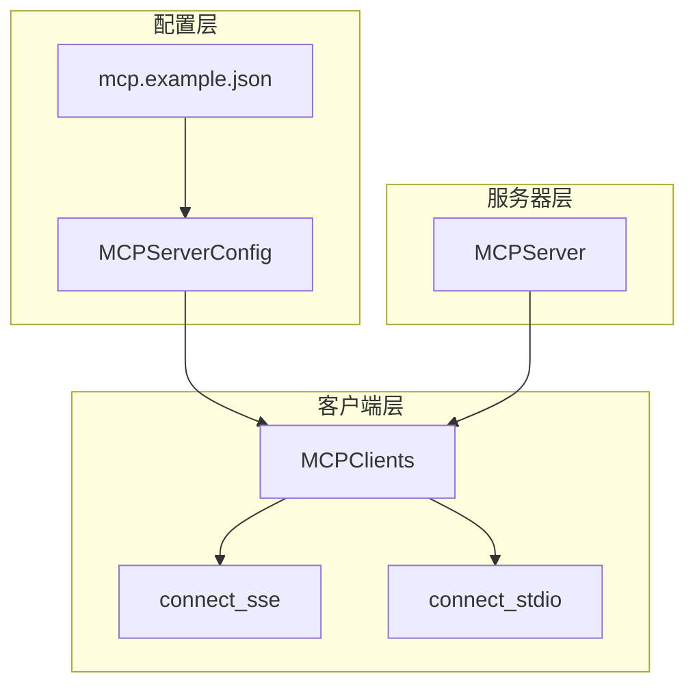
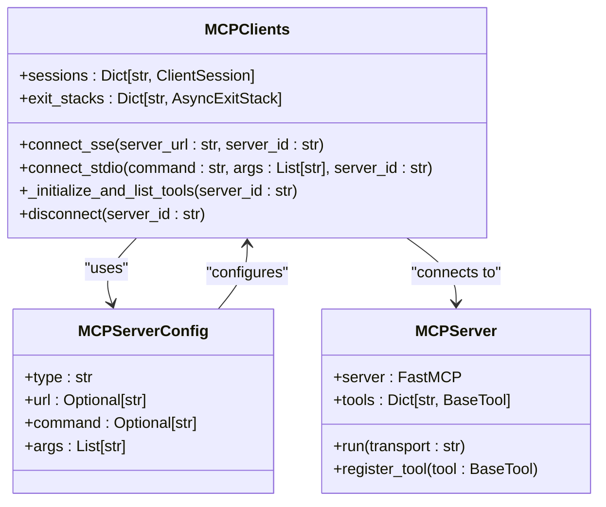
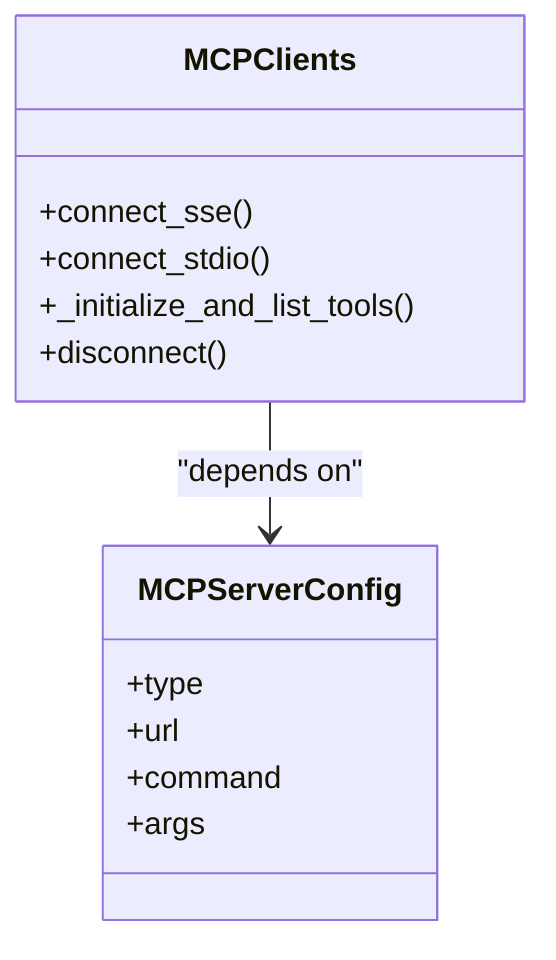
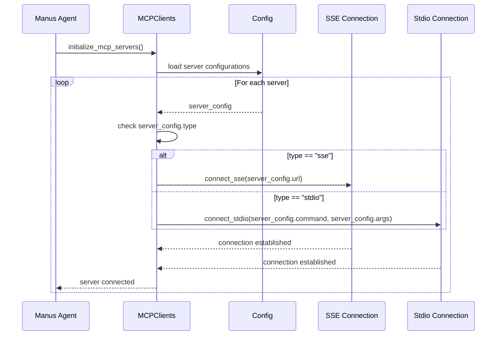
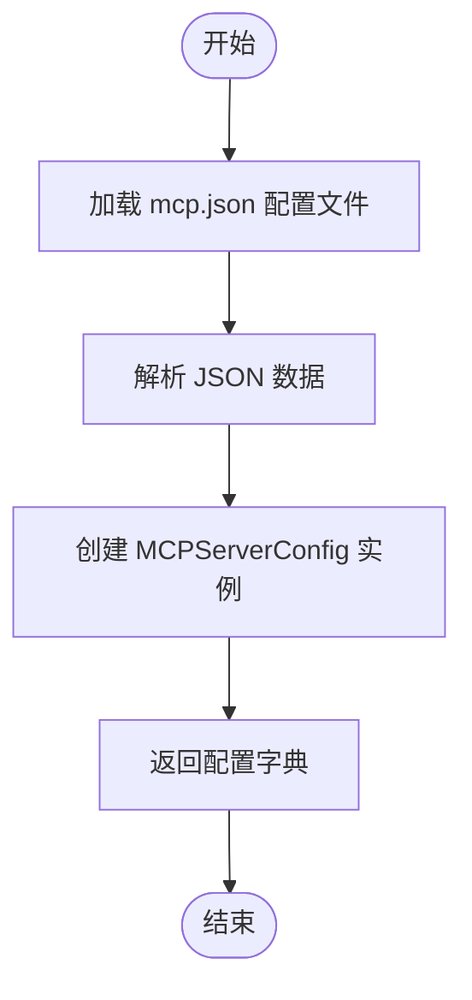
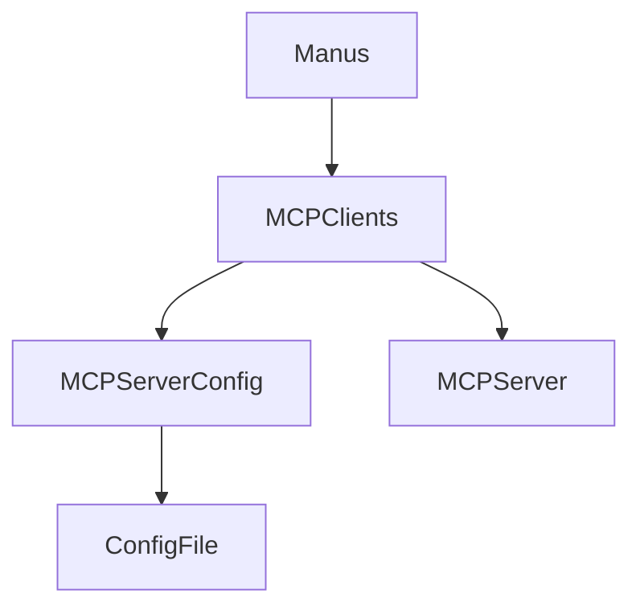

# 策略模式

<cite>
**Referenced Files in This Document**   
- [MCPServerConfig](file://app/config.py#L126-L134)
- [MCPServer](file://app/mcp/server.py#L23-L159)
- [mcp.example.json](file://config/mcp.example.json#L0-L7)
- [MCPClients](file://app/tool/mcp.py#L36-L193)
- [Manus](file://app/agent/manus.py#L30-L30)
</cite>

## 目录
1. [引言](#引言)
2. [项目结构](#项目结构)
3. [核心组件](#核心组件)
4. [架构概述](#架构概述)
5. [详细组件分析](#详细组件分析)
6. [依赖分析](#依赖分析)
7. [性能考虑](#性能考虑)
8. [故障排除指南](#故障排除指南)
9. [结论](#结论)

## 引言
本文档深入解析策略模式在MCP协议连接类型中的实现机制。系统通过`MCPServerConfig`配置中的`type`字段（sse/stdio）动态选择不同的连接策略，结合配置文件加载机制，展示不同策略的参数（如url或command）如何被解析和应用。文档将详细说明策略的注册与执行流程，并通过UML图描述Context、Strategy接口及具体策略类（SSEConnection、StdioConnection）的关系，为开发者提供添加新连接策略以扩展系统功能的指导。

## 项目结构
项目结构清晰地划分了不同功能模块，其中与MCP协议连接策略相关的组件主要分布在`app/mcp`、`app/tool`和`config`目录中。`app/mcp/server.py`文件实现了MCP服务器的核心功能，`app/tool/mcp.py`文件定义了连接客户端和策略执行逻辑，而`config`目录则包含了连接配置的示例文件。

**Diagram sources**
- [mcp.example.json](file://config/mcp.example.json#L0-L7)
- [MCPServerConfig](file://app/config.py#L126-L134)
- [MCPClients](file://app/tool/mcp.py#L36-L193)
- [MCPServer](file://app/mcp/server.py#L23-L159)

**Section sources**
- [mcp.example.json](file://config/mcp.example.json#L0-L7)
- [app/config.py](file://app/config.py#L126-L134)
- [app/tool/mcp.py](file://app/tool/mcp.py#L36-L193)
- [app/mcp/server.py](file://app/mcp/server.py#L23-L159)

## 核心组件
系统的核心组件包括`MCPServerConfig`配置模型、`MCPServer`服务器实现和`MCPClients`连接管理器。`MCPServerConfig`定义了连接类型（type）、URL（用于SSE连接）和命令（用于stdio连接）等关键字段。`MCPServer`负责服务器的初始化和工具注册，而`MCPClients`则作为策略模式的上下文（Context），根据配置动态选择并执行相应的连接策略。

**Section sources**
- [MCPServerConfig](file://app/config.py#L126-L134)
- [MCPServer](file://app/mcp/server.py#L23-L159)
- [MCPClients](file://app/tool/mcp.py#L36-L193)

## 架构概述
系统采用策略模式实现MCP协议的多种连接方式。`MCPClients`作为上下文类，持有对具体策略对象的引用，并根据`MCPServerConfig`中的`type`字段决定使用`connect_sse`还是`connect_stdio`策略。这种设计使得系统能够灵活地支持不同的通信协议，同时保持客户端代码的简洁性和可扩展性。

**Diagram sources**
- [MCPClients](file://app/tool/mcp.py#L36-L193)
- [MCPServerConfig](file://app/config.py#L126-L134)
- [MCPServer](file://app/mcp/server.py#L23-L159)

## 详细组件分析
### MCPClients 分析
`MCPClients`类是策略模式的核心实现，它根据配置动态选择连接策略。当`type`为"sse"时，调用`connect_sse`方法建立基于URL的连接；当`type`为"stdio"时，调用`connect_stdio`方法执行指定命令。这种设计完全符合策略模式的意图，即定义一系列算法并使它们可互换。

#### 对于面向对象组件：

**Diagram sources**
- [MCPClients](file://app/tool/mcp.py#L36-L193)
- [MCPServerConfig](file://app/config.py#L126-L134)

#### 对于API/服务组件：

**Diagram sources**
- [Manus](file://app/agent/manus.py#L30-L30)
- [MCPClients](file://app/tool/mcp.py#L36-L193)
- [MCPServerConfig](file://app/config.py#L126-L134)

### 配置加载机制
系统通过`MCPSettings.load_server_config()`方法从`mcp.json`文件加载服务器配置。该方法解析JSON数据并创建`MCPServerConfig`实例，为`MCPClients`提供策略选择所需的参数。配置文件的结构简洁明了，支持多个服务器的定义。

**Diagram sources**
- [MCPServerConfig](file://app/config.py#L126-L134)

**Section sources**
- [mcp.example.json](file://config/mcp.example.json#L0-L7)
- [app/config.py](file://app/config.py#L126-L134)

## 依赖分析
系统各组件之间的依赖关系清晰，`MCPClients`依赖于`MCPServerConfig`进行策略选择，而`MCPServer`则独立运行并提供服务。`Manus`代理作为高层组件，依赖于`MCPClients`来管理与MCP服务器的连接。这种分层设计降低了组件间的耦合度，提高了系统的可维护性。

**Diagram sources**
- [Manus](file://app/agent/manus.py#L30-L30)
- [MCPClients](file://app/tool/mcp.py#L36-L193)
- [MCPServerConfig](file://app/config.py#L126-L134)
- [MCPServer](file://app/mcp/server.py#L23-L159)

**Section sources**
- [app/agent/manus.py](file://app/agent/manus.py#L30-L30)
- [app/tool/mcp.py](file://app/tool/mcp.py#L36-L193)
- [app/config.py](file://app/config.py#L126-L134)
- [app/mcp/server.py](file://app/mcp/server.py#L23-L159)

## 性能考虑
策略模式的使用对系统性能影响较小，因为策略选择发生在连接初始化阶段，而非每次通信时。`connect_sse`和`connect_stdio`方法的执行时间主要取决于网络延迟或命令执行时间，而非策略模式本身。系统通过异步编程模型有效处理I/O操作，确保了高并发场景下的性能表现。

## 故障排除指南
当遇到连接问题时，首先检查`mcp.json`配置文件的格式是否正确，特别是`type`、`url`和`command`字段的值。确保指定的URL可访问或命令可在系统中执行。查看日志输出以确定是配置错误还是网络/执行问题。`MCPClients`的`disconnect`方法可用于清理无效连接，避免资源泄漏。

**Section sources**
- [MCPClients](file://app/tool/mcp.py#L36-L193)
- [mcp.example.json](file://config/mcp.example.json#L0-L7)

## 结论
本文档详细解析了策略模式在MCP协议连接类型中的实现。通过`MCPServerConfig`的`type`字段，系统能够动态选择SSE或stdio连接策略，展示了策略模式在提高代码灵活性和可扩展性方面的优势。开发者可以轻松添加新的连接策略，只需实现相应的连接方法并更新配置即可，无需修改现有代码，充分体现了开闭原则。