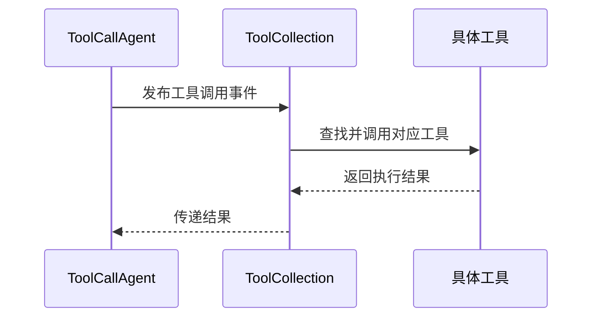
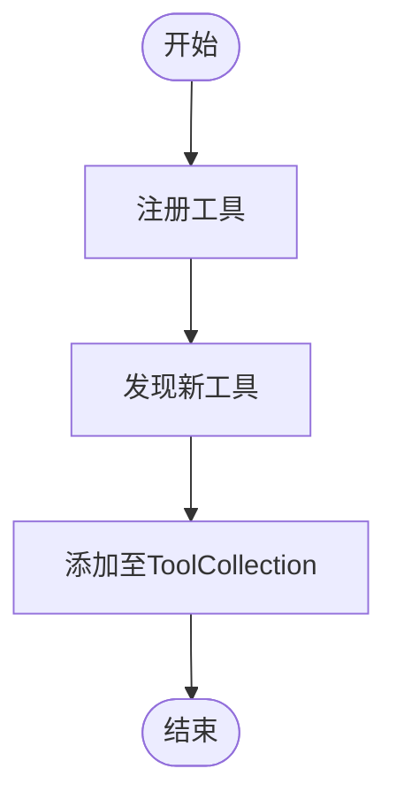
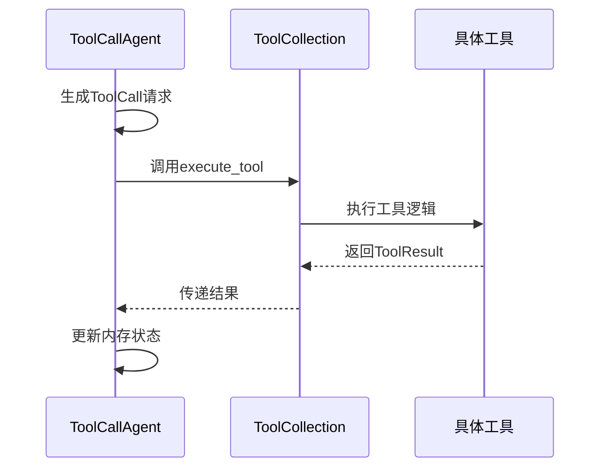

# 观察者模式

<cite>
**本文档中引用的文件**   
- [toolcall.py](file://app/agent/toolcall.py)
- [tool_collection.py](file://app/tool/tool_collection.py)
- [python_execute.py](file://app/tool/python_execute.py)
- [bash.py](file://app/tool/bash.py)
- [base.py](file://app/tool/base.py)
</cite>

## 目录
1. [引言](#引言)
2. [核心组件分析](#核心组件分析)
3. [事件驱动架构](#事件驱动架构)
4. [工具注册与发现机制](#工具注册与发现机制)
5. [事件通知与结果回调流程](#事件通知与结果回调流程)
6. [自定义观察者实现指南](#自定义观察者实现指南)
7. [性能与可靠性考量](#性能与可靠性考量)
8. [结论](#结论)

## 引言
观察者模式在工具调用事件处理中扮演着关键角色，实现了被观察者（ToolCallAgent）与观察者（具体工具）之间的松耦合通信。该模式通过事件驱动架构，使得工具调用过程更加灵活和可扩展。系统中的ToolCallAgent作为被观察者，负责发布工具调用事件；而ToolCollection中的具体工具（如PythonExecute、BashTool）则作为观察者，响应这些事件并执行相应操作。这种设计不仅提高了系统的模块化程度，还增强了动态发现和管理工具的能力。

## 核心组件分析
在本系统中，`ToolCallAgent` 类是实现观察者模式的核心组件之一。它继承自 `ReActAgent`，并定义了处理工具调用的基本行为。`ToolCallAgent` 拥有一个 `available_tools` 属性，该属性是一个 `ToolCollection` 实例，用于存储所有可用的工具实例。当代理需要执行某个工具时，它会调用 `available_tools.execute()` 方法来触发相应的工具执行逻辑。

`ToolCollection` 类则是管理多个工具的容器，它提供了添加、删除和执行工具的方法。每个工具都必须实现 `BaseTool` 接口，并提供一个唯一的名称以及描述其功能的参数列表。通过这种方式，`ToolCollection` 可以统一管理和调度所有注册的工具。

此外，具体的工具类如 `PythonExecute` 和 `BashTool` 都实现了 `BaseTool` 接口，并重写了 `execute` 方法以完成特定的任务。例如，`PythonExecute` 工具允许用户执行 Python 代码片段，而 `BashTool` 则支持在终端环境中运行 Bash 命令。

**Section sources**
- [toolcall.py](file://app/agent/toolcall.py#L17-L249)
- [tool_collection.py](file://app/tool/tool_collection.py#L8-L70)
- [python_execute.py](file://app/tool/python_execute.py#L8-L74)
- [bash.py](file://app/tool/bash.py#L115-L151)

## 事件驱动架构
事件驱动架构是观察者模式得以实现的基础。在这个架构下，`ToolCallAgent` 作为事件的发布者，在决定使用某个工具时会生成一个工具调用事件。这个事件包含了要执行的工具名称及其输入参数。随后，`ToolCallAgent` 会将此事件传递给 `ToolCollection`，由后者负责查找匹配的工具实例并调用其 `execute` 方法。

整个过程是非阻塞的，即 `ToolCallAgent` 发布事件后不会等待工具执行完毕，而是继续处理其他任务或等待下一个事件的到来。这种异步处理方式极大地提升了系统的响应速度和吞吐量。同时，由于事件的生产和消费是解耦的，因此可以轻松地增加新的工具类型而无需修改现有的代码结构。

为了确保事件能够正确地被处理，系统还引入了错误处理机制。如果某个工具在执行过程中发生异常，`ToolCollection` 会捕获该异常并向 `ToolCallAgent` 返回一个包含错误信息的结果对象。这样，`ToolCallAgent` 就可以根据返回结果采取适当的措施，比如重试操作或者终止当前任务。

**Diagram sources**
- [toolcall.py](file://app/agent/toolcall.py#L17-L249)
- [tool_collection.py](file://app/tool/tool_collection.py#L8-L70)

## 工具注册与发现机制
工具注册与发现机制是观察者模式的重要组成部分。每当创建一个新的工具实例时，都需要将其注册到 `ToolCollection` 中。这通常是在初始化阶段完成的，例如在 `Manus` 或 `SandboxManus` 等派生类的构造函数中调用 `add_tools` 方法来批量添加预定义的工具集合。

一旦工具被成功注册，它们就会成为 `ToolCollection` 的一部分，并可以通过名称进行访问。当 `ToolCallAgent` 需要执行某个工具时，它只需向 `ToolCollection` 提供工具名称和输入参数即可。`ToolCollection` 内部会利用字典数据结构快速定位到对应的工具实例，并调用其 `execute` 方法。

值得注意的是，除了静态注册外，系统还支持动态发现新工具。例如，在连接到远程 MCP 服务器时，`MCPClients` 会自动从服务器获取可用工具列表，并将它们封装成 `MCPClientTool` 实例后添加到本地的 `ToolCollection` 中。这样一来，即使是在运行时也可以扩展系统的功能范围。

**Diagram sources**
- [tool_collection.py](file://app/tool/tool_collection.py#L63-L70)
- [mcp.py](file://app/tool/mcp.py#L36-L193)

## 事件通知与结果回调流程
事件通知与结果回调流程描述了从工具调用请求发出到最终结果返回的完整生命周期。首先，`ToolCallAgent` 根据当前状态和上下文信息生成一个工具调用请求，并将其封装成一个 `ToolCall` 对象。接着，`ToolCallAgent` 调用 `act` 方法来启动实际的执行过程。

在 `act` 方法内部，`ToolCallAgent` 会遍历所有的 `tool_calls` 并依次调用 `execute_tool` 方法。后者负责解析输入参数、查找目标工具并执行相应的逻辑。执行完成后，无论成功与否，都会生成一个 `ToolResult` 对象作为结果反馈给 `ToolCallAgent`。

对于成功的执行，`ToolResult` 包含了输出内容；而对于失败的情况，则记录了详细的错误信息。`ToolCallAgent` 收到结果后，会将其保存到内存中以便后续参考，并根据具体情况决定是否继续执行其他任务或结束当前会话。

**Diagram sources**
- [toolcall.py](file://app/agent/toolcall.py#L130-L163)
- [tool_collection.py](file://app/tool/tool_collection.py#L24-L34)

## 自定义观察者实现指南
开发者若想实现自定义的观察者（即新工具），需遵循以下步骤：

1. **定义工具类**：创建一个新的 Python 类，继承自 `BaseTool` 接口。
2. **实现execute方法**：重写 `execute` 方法以定义具体的业务逻辑。
3. **设置元数据**：为工具类指定唯一的 `name` 属性和简短的 `description` 描述。
4. **声明参数**：通过 `parameters` 字段定义工具所需的输入参数及其类型。
5. **注册工具**：在适当的位置调用 `ToolCollection.add_tool()` 或 `add_tools()` 方法将新工具加入集合。

注意事项包括：
- 确保工具名称唯一，避免与其他已存在的工具冲突。
- 输入参数应尽可能详细地描述，便于使用者理解如何正确调用。
- 在执行过程中妥善处理可能出现的各种异常情况，保证程序稳定性。
- 如果工具涉及外部资源访问（如网络请求），建议加入超时控制和重试策略。

**Section sources**
- [base.py](file://app/tool/base.py#L77-L172)
- [tool_collection.py](file://app/tool/tool_collection.py#L50-L61)

## 性能与可靠性考量
为了确保事件处理的高效性和可靠性，系统采取了一系列优化措施。首先是异步执行模型，所有工具调用均采用协程方式运行，避免了因长时间阻塞而导致的整体性能下降。其次是资源管理机制，每个工具实例都实现了 `cleanup` 方法，在不再需要时释放占用的资源，防止内存泄漏等问题的发生。

另外，针对可能出现的网络延迟或服务不可用等情况，系统内置了重试逻辑和降级方案。例如，在尝试连接 MCP 服务器失败后，会自动切换到备用地址或暂时禁用相关功能直至恢复正常。同时，日志记录功能也被广泛应用于各个关键环节，帮助开发人员及时发现问题根源并进行修复。

最后，考虑到安全性因素，所有执行环境都被严格隔离，特别是对于那些可能影响系统稳定性的高风险操作（如文件读写、命令执行等）。通过限制权限和沙箱技术，最大限度地减少了潜在威胁带来的负面影响。

**Section sources**
- [toolcall.py](file://app/agent/toolcall.py#L228-L242)
- [bash.py](file://app/tool/bash.py#L115-L151)

## 结论
综上所述，观察者模式在工具调用事件处理中的应用显著提升了系统的灵活性和可维护性。通过将 `ToolCallAgent` 设计为被观察者，而将各种具体工具作为观察者，实现了高度解耦的架构设计。事件驱动的方式不仅简化了组件间的交互流程，还促进了功能的动态扩展。未来工作中，可进一步探索更多高级特性，如事件过滤、优先级调度等，以满足更复杂的应用场景需求。