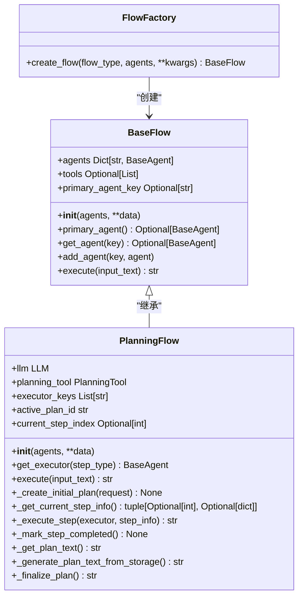
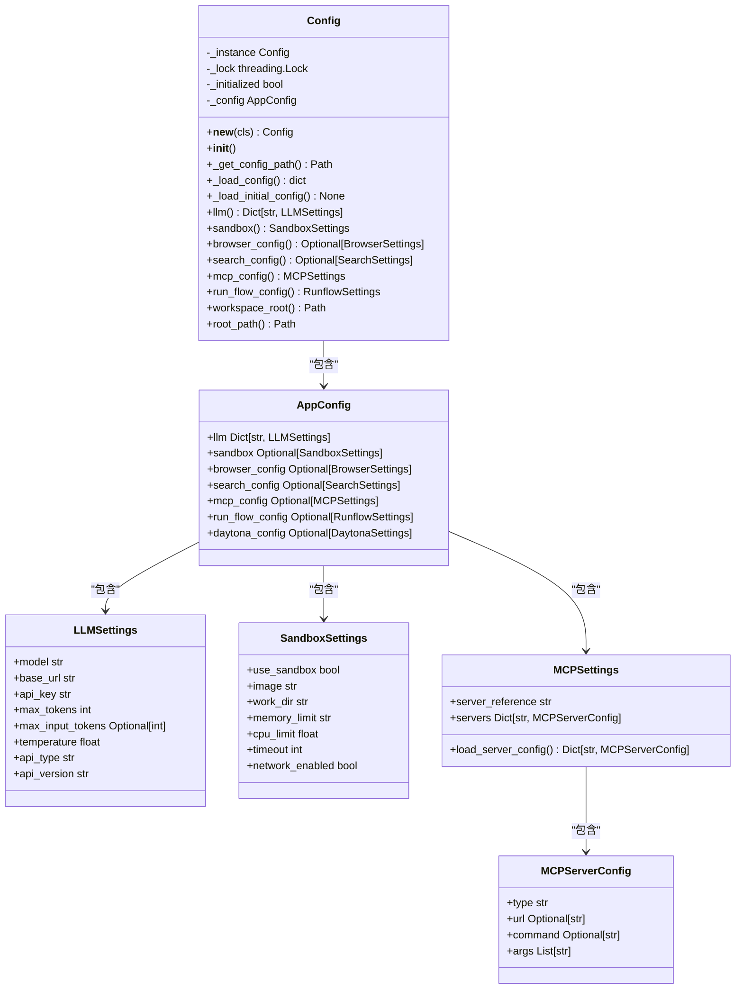

# 设计模式应用

<cite>
**本文档引用的文件**  
- [flow_factory.py](file://app/flow/flow_factory.py)
- [config.py](file://app/config.py)
- [server.py](file://app/mcp/server.py)
- [tool_collection.py](file://app/tool/tool_collection.py)
- [planning.py](file://app/flow/planning.py)
- [base.py](file://app/flow/base.py)
</cite>

## 目录
1. [引言](#引言)
2. [工厂模式应用](#工厂模式应用)
3. [策略模式应用](#策略模式应用)
4. [单例模式应用](#单例模式应用)
5. [观察者模式应用](#观察者模式应用)
6. [最佳实践指导](#最佳实践指导)
7. [结论](#结论)

## 引言
OpenManus项目在架构设计中系统性地应用了多种经典设计模式，以提升代码的可维护性、可扩展性和灵活性。本文档详细分析项目中使用的四种核心设计模式：工厂模式在流程创建中的应用、策略模式在MCP连接类型中的体现、单例模式在配置管理中的实现，以及观察者模式在工具调用事件处理中的运用。通过具体的代码示例和UML类图，为开发者提供深入的理解和应用指导。

## 工厂模式应用
工厂模式在OpenManus中主要用于创建不同类型的流程（Flow）和代理（Agent），通过`FlowFactory`类实现。该模式将对象的创建过程与使用过程分离，客户端无需关心具体的实现类，只需指定类型即可获得相应的实例。

`FlowFactory`类提供了一个静态方法`create_flow`，根据传入的`flow_type`参数决定创建哪种类型的流程。目前支持`PLANNING`（规划）类型的流程，未来可以轻松扩展以支持更多类型，而无需修改客户端代码。这种设计遵循了开闭原则，使得系统对扩展开放，对修改关闭。



**图源**
- [flow_factory.py](file://app/flow/flow_factory.py#L12-L29)
- [base.py](file://app/flow/base.py#L8-L56)
- [planning.py](file://app/flow/planning.py#L44-L441)

**节源**
- [flow_factory.py](file://app/flow/flow_factory.py#L12-L29)
- [base.py](file://app/flow/base.py#L8-L56)
- [planning.py](file://app/flow/planning.py#L44-L441)

## 策略模式应用
策略模式在OpenManus中体现在MCP（Model Context Protocol）服务器的连接方式上。`MCPServer`类根据不同的传输类型（transport）选择相应的连接策略，客户端可以动态地在SSE（Server-Sent Events）和stdio（标准输入输出）之间切换，而无需修改核心逻辑。

`MCPServer`类的`run`方法接受一个`transport`参数，该参数决定了服务器的运行模式。当`transport`为`"stdio"`时，服务器通过标准输入输出与客户端通信；未来可以扩展支持`"sse"`模式，通过HTTP长连接进行通信。这种设计将算法（连接方式）与使用算法的上下文（服务器运行）分离，使得添加新的连接方式变得非常简单。

```mermaid
classDiagram
class MCPServer {
-server FastMCP
-tools Dict[str, BaseTool]
+__init__(name)
+register_tool(tool, method_name)
+_build_docstring(tool_function) str
+_build_signature(tool_function) Signature
+cleanup() None
+register_all_tools() None
+run(transport) None
}
class FastMCP {
+tool() decorator
+run(transport) None
}
class BaseTool {
+name str
+description str
+parameters Optional[dict]
+__call__(**kwargs) Any
+execute(**kwargs) Any
+to_param() Dict
}
MCPServer --> FastMCP : "使用"
MCPServer --> BaseTool : "管理"
MCPServer ..> "stdio" : "策略"
MCPServer ..> "sse" : "策略"
```

**图源**
- [server.py](file://app/mcp/server.py#L23-L159)
- [tool_collection.py](file://app/tool/tool_collection.py#L8-L70)

**节源**
- [server.py](file://app/mcp/server.py#L23-L159)

## 单例模式应用
单例模式在OpenManus中用于全局配置管理，确保整个应用程序中只有一个配置实例。`Config`类通过双重检查锁定（Double-Checked Locking）机制实现了线程安全的单例模式，保证了在多线程环境下配置的唯一性和一致性。

`Config`类的`__new__`方法检查`_instance`是否已经创建，如果没有，则在锁的保护下创建实例。`_initialized`标志确保配置只被加载一次。`config`模块级别的实例使得任何需要配置的地方都可以通过`from app.config import config`来访问，避免了配置的重复加载和内存浪费。



**图源**
- [config.py](file://app/config.py#L0-L372)

**节源**
- [config.py](file://app/config.py#L0-L372)

## 观察者模式应用
观察者模式在OpenManus中用于处理工具调用事件。当一个工具被调用时，相关的事件处理器（观察者）会被通知并执行相应的逻辑。这种设计实现了工具调用与后续处理的解耦，使得系统可以灵活地添加新的事件处理逻辑。

`ToolCallAgent`类作为观察者，监听工具调用事件。当`think`方法被调用时，它会向LLM请求工具调用，然后在`act`方法中执行这些调用。`execute_tool`方法是核心的事件处理逻辑，它根据工具名称查找并执行相应的工具。`_handle_special_tool`方法则处理特殊的工具调用，如`Terminate`工具，它会改变代理的状态，从而影响后续的执行流程。

```mermaid
classDiagram
class ToolCallAgent {
+name str
+description str
+system_prompt str
+next_step_prompt str
+available_tools ToolCollection
+tool_choices TOOL_CHOICE_TYPE
+special_tool_names List[str]
+tool_calls List[ToolCall]
+_current_base64_image Optional[str]
+max_steps int
+max_observe Optional[Union[int, bool]]
+think() bool
+act() str
+execute_tool(command) str
+_handle_special_tool(name, result, **kwargs) None
+_should_finish_execution(**kwargs) bool
+_is_special_tool(name) bool
+cleanup() None
+run(request) str
}
class ToolCollection {
+tools Tuple[BaseTool, ...]
+tool_map Dict[str, BaseTool]
+__init__(*tools)
+__iter__() Iterator[BaseTool]
+to_params() List[Dict[str, Any]]
+execute(name, tool_input) ToolResult
+execute_all() List[ToolResult]
+get_tool(name) BaseTool
+add_tool(tool) ToolCollection
+add_tools(*tools) ToolCollection
}
class BaseTool {
+name str
+description str
+parameters Optional[dict]
+__call__(**kwargs) Any
+execute(**kwargs) Any
+to_param() Dict
}
ToolCallAgent --> ToolCollection : "使用"
ToolCollection --> BaseTool : "包含"
ToolCallAgent ..> "工具调用事件" : "观察"
```

**图源**
- [tool_collection.py](file://app/tool/tool_collection.py#L8-L70)
- [toolcall.py](file://app/agent/toolcall.py#L17-L249)

**节源**
- [tool_collection.py](file://app/tool/tool_collection.py#L8-L70)
- [toolcall.py](file://app/agent/toolcall.py#L17-L249)

## 最佳实践指导
在OpenManus项目中应用设计模式时，应遵循以下最佳实践：

1.  **工厂模式**：当需要创建一系列相关或依赖的对象时，使用工厂模式。确保工厂类的接口清晰，易于扩展。避免工厂类变得过于复杂，如果逻辑复杂，可以考虑使用抽象工厂模式。

2.  **策略模式**：当一个类的行为或算法需要在运行时动态改变时，使用策略模式。将不同的策略实现为独立的类或函数，并通过上下文类来管理它们。确保策略接口的一致性，以便于切换。

3.  **单例模式**：当需要确保一个类只有一个实例，并提供一个全局访问点时，使用单例模式。注意线程安全问题，尤其是在多线程环境中。避免滥用单例模式，因为它可能引入全局状态，增加测试难度。

4.  **观察者模式**：当一个对象的状态改变需要通知其他多个对象时，使用观察者模式。保持观察者接口的简洁，避免观察者之间产生复杂的依赖关系。注意内存泄漏问题，确保在适当的时候移除观察者。

## 结论
OpenManus项目通过巧妙地应用工厂模式、策略模式、单例模式和观察者模式，构建了一个高度模块化、可扩展和易于维护的智能代理系统。这些设计模式不仅解决了特定的设计问题，还为系统的未来发展奠定了坚实的基础。开发者在使用和扩展本系统时，应深入理解这些模式的应用场景和最佳实践，以确保代码质量和系统稳定性。