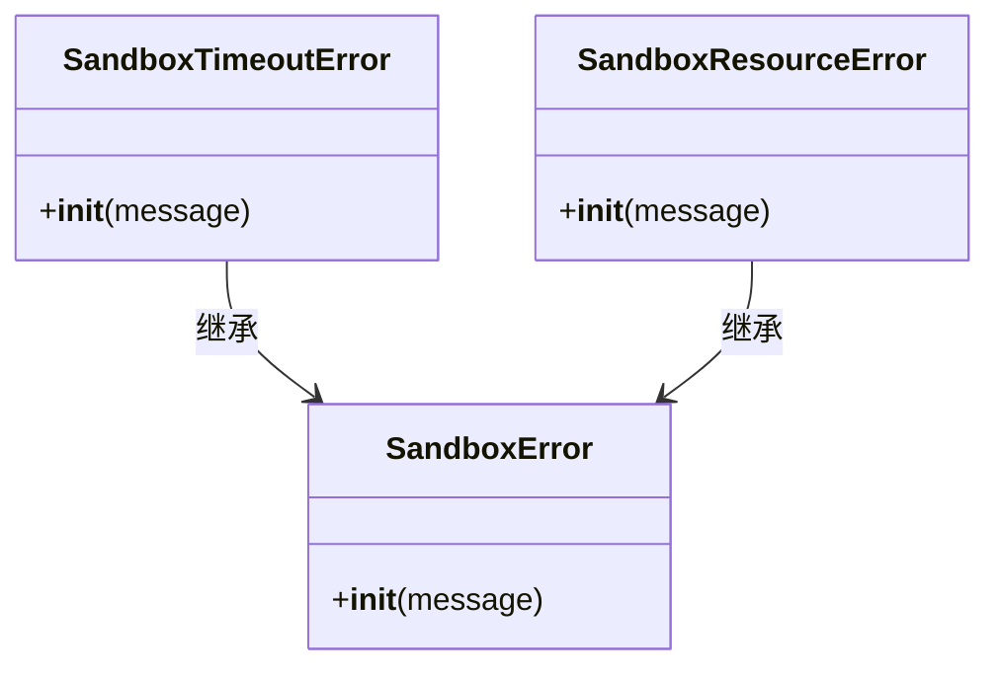
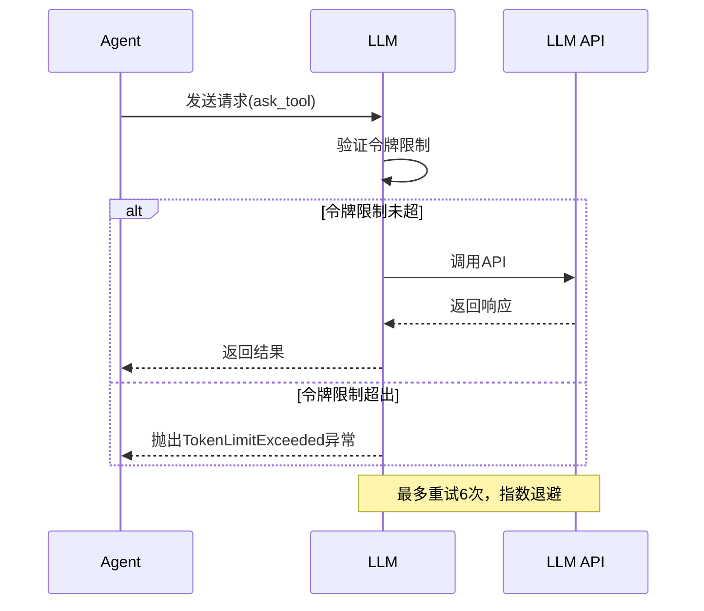
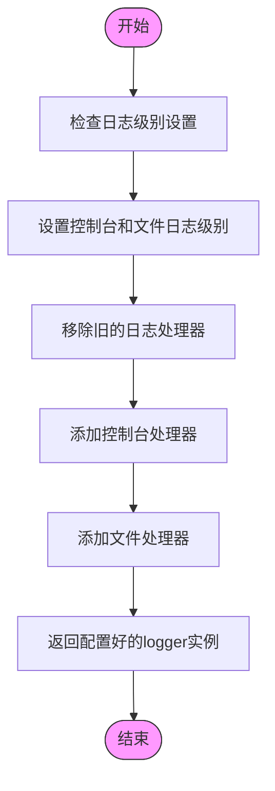
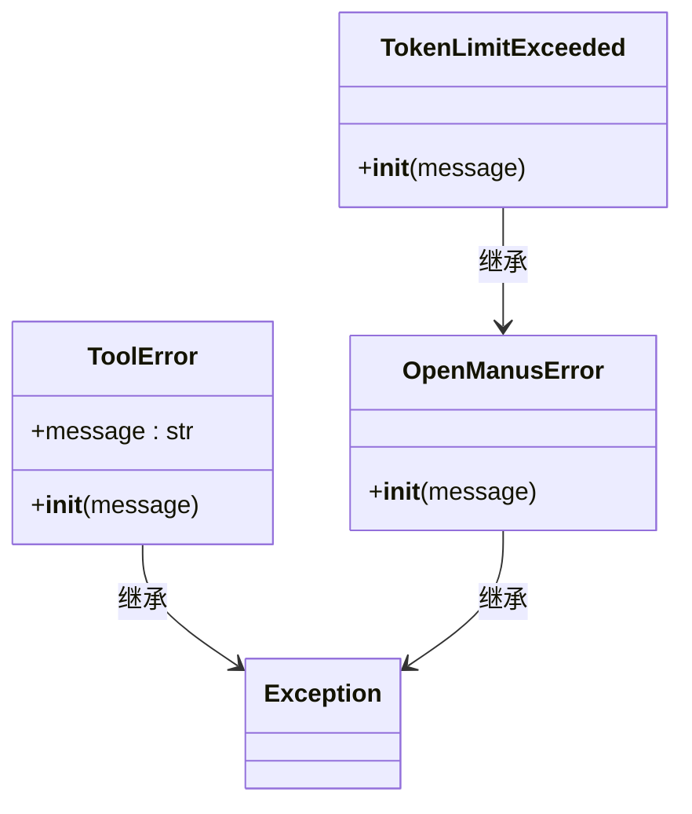

# 常见问题

<cite>
**本文档中引用的文件**   
- [exceptions.py](file://app/exceptions.py)
- [logger.py](file://app/logger.py)
- [llm.py](file://app/llm.py)
- [manager.py](file://app/sandbox/core/manager.py)
- [exceptions.py](file://app/sandbox/core/exceptions.py)
</cite>

## 目录
1. [连接失败](#连接失败)
2. [工具调用超时](#工具调用超时)
3. [LLM响应异常](#llm响应异常)
4. [沙箱启动失败](#沙箱启动失败)
5. [日志排查方法](#日志排查方法)
6. [异常处理代码示例](#异常处理代码示例)
7. [修复建议与预防措施](#修复建议与预防措施)

## 连接失败

连接失败通常与MCP（Manus Control Protocol）代理的初始化过程有关。当使用`run_mcp.py`脚本启动MCP代理时，如果连接类型配置错误或服务器地址不可达，将导致连接失败。

可能原因包括：
- 连接类型参数错误（应为"stdio"或"sse"）
- SSE连接的服务器URL不可达
- API密钥认证失败
- 网络防火墙或代理阻止连接

在代码中，`MCPRunner`类负责初始化MCP代理连接，当连接失败时会抛出异常并记录错误日志。

**Section sources**
- [run_mcp.py](file://run_mcp.py#L0-L115)
- [agent/mcp.py](file://app/agent/mcp.py#L166-L184)

## 工具调用超时

工具调用超时问题主要与沙箱环境中的操作执行有关。系统定义了`SandboxTimeoutError`异常，当沙箱操作超过预设时间限制时触发。

可能原因包括：
- 沙箱内执行的命令过于复杂或资源消耗过大
- 网络延迟导致远程调用超时
- 系统资源不足导致执行缓慢
- 代码逻辑存在死循环或无限等待

沙箱管理器（SandboxManager）通过`_cleanup_idle_sandboxes`方法定期清理空闲沙箱，超时设置由`idle_timeout`参数控制，默认值为3600秒。

**Diagram sources **
- [exceptions.py](file://app/sandbox/core/exceptions.py#L7-L17)

**Section sources**
- [exceptions.py](file://app/sandbox/core/exceptions.py#L7-L17)
- [manager.py](file://app/sandbox/core/manager.py#L210-L244)

## LLM响应异常

LLM响应异常涉及多种情况，包括令牌限制超出、API调用失败和空响应等。系统通过`TokenLimitExceeded`异常处理令牌限制问题。

可能原因包括：
- 输入消息超出模型的最大令牌限制
- API密钥无效或权限不足
- 服务端速率限制（Rate Limit）
- 网络连接不稳定导致请求失败
- 模型服务暂时不可用

在`llm.py`文件中，`LLM`类的`ask`和`ask_tool`方法实现了重试机制，使用`tenacity`库的`@retry`装饰器，在遇到`OpenAIError`等异常时自动重试最多6次。

**Diagram sources **
- [llm.py](file://app/llm.py#L333-L766)

**Section sources**
- [exceptions.py](file://app/exceptions.py#L0-L13)
- [llm.py](file://app/llm.py#L333-L766)

## 沙箱启动失败

沙箱启动失败通常与Docker环境配置或资源限制有关。`SandboxManager`类负责管理沙箱生命周期，当创建沙箱失败时会抛出`RuntimeError`。

可能原因包括：
- Docker服务未运行或无法连接
- 指定的Docker镜像不存在且无法拉取
- 系统资源不足（内存、磁盘空间等）
- 达到最大沙箱数量限制
- 权限不足无法创建容器

沙箱管理器通过`ensure_image`方法确保所需Docker镜像可用，如果镜像不存在则尝试从远程仓库拉取。

**Section sources**
- [manager.py](file://app/sandbox/core/manager.py#L96-L134)
- [manager.py](file://app/sandbox/core/manager.py#L246-L284)

## 日志排查方法

日志系统由`logger.py`文件实现，使用`loguru`库提供灵活的日志记录功能。通过日志可以定位问题源头，指导故障排查。

日志级别设置：
- 控制台输出：默认为"INFO"级别
- 日志文件：默认为"DEBUG"级别
- 支持自定义日志级别和文件名前缀

关键日志记录点：
- 沙箱创建和删除操作
- LLM API调用和响应
- 工具执行过程
- 异常发生时的错误信息

使用`define_log_level`函数可以调整日志级别，便于在不同环境下进行调试。日志文件保存在项目根目录的`logs`文件夹中，按时间戳命名。

**Diagram sources **
- [logger.py](file://app/logger.py#L11-L25)

**Section sources**
- [logger.py](file://app/logger.py#L0-L42)

## 异常处理代码示例

以下是捕获和处理常见异常的代码示例：

**Diagram sources **
- [exceptions.py](file://app/exceptions.py#L0-L13)

**Section sources**
- [exceptions.py](file://app/exceptions.py#L0-L13)
- [llm.py](file://app/llm.py#L735-L765)
- [agent/toolcall.py](file://app/agent/toolcall.py#L44-L77)

## 修复建议与预防措施

### 连接失败修复建议
1. 检查`config.toml`文件中的MCP配置
2. 验证API密钥的有效性
3. 确认网络连接正常，无防火墙阻止
4. 使用正确的连接类型参数启动

### 工具调用超时预防
1. 优化工具执行逻辑，避免复杂计算
2. 增加超时时间配置
3. 监控系统资源使用情况
4. 实现任务分片处理大任务

### LLM响应异常预防
1. 实现令牌使用监控，提前预警
2. 配置多个备用LLM提供商
3. 优化提示词，减少上下文长度
4. 实现优雅降级机制

### 沙箱启动失败预防
1. 确保Docker服务正常运行
2. 预先拉取所需镜像
3. 监控系统资源，及时扩容
4. 合理设置最大沙箱数量限制

**Section sources**
- [config.py](file://app/config.py)
- [manager.py](file://app/sandbox/core/manager.py#L0-L313)