# 性能问题

<cite>
**本文档中引用的文件**  
- [app/logger.py](file://app/logger.py)
- [app/daytona/sandbox.py](file://app/daytona/sandbox.py)
- [app/agent/toolcall.py](file://app/agent/toolcall.py)
- [app/sandbox/core/sandbox.py](file://app/sandbox/core/sandbox.py)
- [app/tool/tool_collection.py](file://app/tool/tool_collection.py)
- [app/sandbox/client.py](file://app/sandbox/client.py)
- [app/config.py](file://app/config.py)
- [app/tool/base.py](file://app/tool/base.py)
- [app/tool/python_execute.py](file://app/tool/python_execute.py)
- [app/tool/bash.py](file://app/tool/bash.py)
- [app/tool/file_operators.py](file://app/tool/file_operators.py)
- [app/tool/chart_visualization/data_visualization.py](file://app/tool/chart_visualization/data_visualization.py)
</cite>

## 目录
1. [简介](#简介)
2. [项目结构分析](#项目结构分析)
3. [核心组件分析](#核心组件分析)
4. [性能瓶颈识别](#性能瓶颈识别)
5. [日志机制与调试](#日志机制与调试)
6. [沙箱执行机制分析](#沙箱执行机制分析)
7. [工具调用流程分析](#工具调用流程分析)
8. [优化建议](#优化建议)
9. [性能监控与基准测试](#性能监控与基准测试)
10. [结论](#结论)

## 简介
本文档深入分析OpenManus在高负载或复杂任务场景下的性能瓶颈，包括代理响应延迟、工具执行缓慢、内存占用过高、日志I/O阻塞等问题。通过分析`app/logger.py`提供的日志记录机制，指导用户如何启用调试日志并分析关键路径的耗时分布。结合沙箱执行机制（sandbox.py）和工具调用流程（toolcall.py），识别资源密集型操作，提出优化建议如异步执行、结果缓存、并发控制和日志级别调整。提供性能监控指标建议和基准测试方法，帮助用户评估系统优化效果。

## 项目结构分析
OpenManus项目采用模块化设计，主要分为agent、sandbox、tool、utils等核心模块。agent模块包含各种代理实现，sandbox模块负责沙箱环境管理，tool模块提供各种工具实现，utils模块包含通用工具和配置。

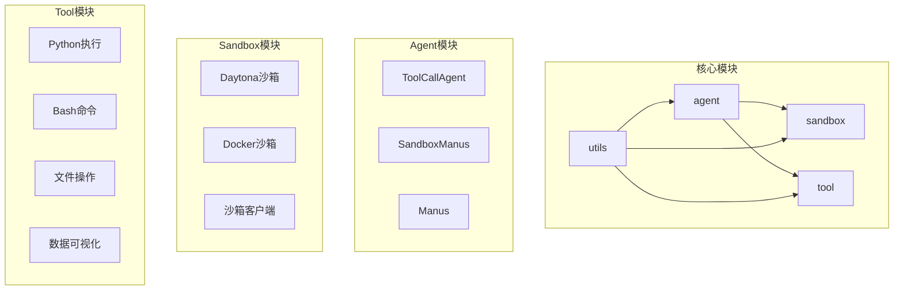
```mermaid
graph TD
subgraph "核心模块"
Agent[agent]
Sandbox[sandbox]
Tool[tool]
Utils[utils]
end
subgraph "Agent模块"
ToolCallAgent[ToolCallAgent]
SandboxManus[SandboxManus]
Manus[Manus]
end
subgraph "Sandbox模块"
DaytonaSandbox[Daytona沙箱]
DockerSandbox[Docker沙箱]
SandboxClient[沙箱客户端]
end
subgraph "Tool模块"
PythonExecute[Python执行]
Bash[Bash命令]
FileOperators[文件操作]
DataVisualization[数据可视化]
end
Agent --> Sandbox
Agent --> Tool
Utils --> Agent
Utils --> Sandbox
Utils --> Tool
```

**图源**  
- [app/agent/toolcall.py](file://app/agent/toolcall.py)
- [app/daytona/sandbox.py](file://app/daytona/sandbox.py)
- [app/tool/tool_collection.py](file://app/tool/tool_collection.py)

## 核心组件分析
### 工具调用代理分析
`ToolCallAgent`是OpenManus的核心代理类，负责处理工具调用和执行。该代理继承自`ReActAgent`，实现了思考（think）和执行（act）的循环。

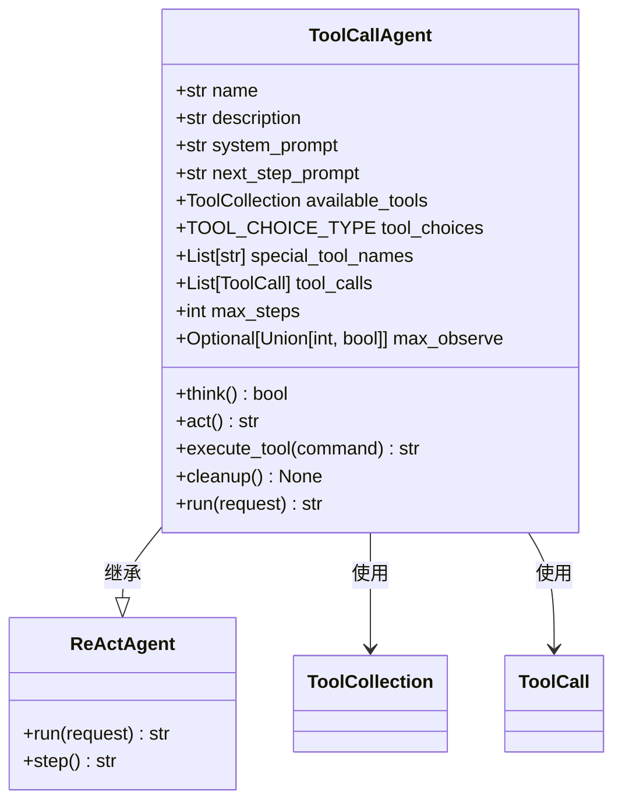
```mermaid
classDiagram
class ToolCallAgent {
+str name
+str description
+str system_prompt
+str next_step_prompt
+ToolCollection available_tools
+TOOL_CHOICE_TYPE tool_choices
+List[str] special_tool_names
+List[ToolCall] tool_calls
+int max_steps
+Optional[Union[int, bool]] max_observe
+think() bool
+act() str
+execute_tool(command) str
+cleanup() None
+run(request) str
}
class ReActAgent {
+run(request) str
+step() str
}
ToolCallAgent --|> ReActAgent : 继承
ToolCallAgent --> ToolCollection : 使用
ToolCallAgent --> ToolCall : 使用
```

**图源**  
- [app/agent/toolcall.py](file://app/agent/toolcall.py#L17-L249)

### 沙箱管理分析
沙箱管理组件负责创建、管理和销毁沙箱环境，确保工具执行的安全性和隔离性。

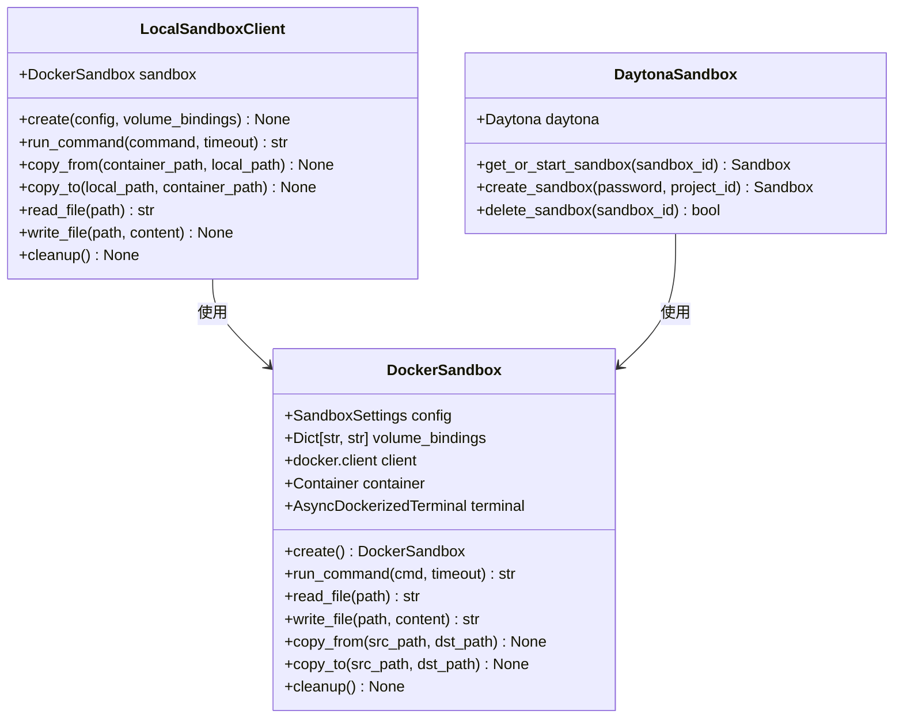
```mermaid
classDiagram
class DockerSandbox {
+SandboxSettings config
+Dict[str, str] volume_bindings
+docker.client client
+Container container
+AsyncDockerizedTerminal terminal
+create() DockerSandbox
+run_command(cmd, timeout) str
+read_file(path) str
+write_file(path, content) str
+copy_from(src_path, dst_path) None
+copy_to(src_path, dst_path) None
+cleanup() None
}
class LocalSandboxClient {
+DockerSandbox sandbox
+create(config, volume_bindings) None
+run_command(command, timeout) str
+copy_from(container_path, local_path) None
+copy_to(local_path, container_path) None
+read_file(path) str
+write_file(path, content) None
+cleanup() None
}
class DaytonaSandbox {
+Daytona daytona
+get_or_start_sandbox(sandbox_id) Sandbox
+create_sandbox(password, project_id) Sandbox
+delete_sandbox(sandbox_id) bool
}
LocalSandboxClient --> DockerSandbox : 使用
DaytonaSandbox --> DockerSandbox : 使用
```

**图源**  
- [app/sandbox/core/sandbox.py](file://app/sandbox/core/sandbox.py#L1-L463)
- [app/sandbox/client.py](file://app/sandbox/client.py#L1-L202)
- [app/daytona/sandbox.py](file://app/daytona/sandbox.py#L1-L166)

## 性能瓶颈识别
### 代理响应延迟
代理响应延迟主要源于LLM调用和工具执行的同步等待。`ToolCallAgent.think()`方法中，LLM调用是异步的，但工具选择和执行流程存在潜在的串行化瓶颈。

**关键路径分析**：
1. `think()`方法中LLM调用等待响应
2. 工具调用决策和参数解析
3. 工具执行的串行化处理

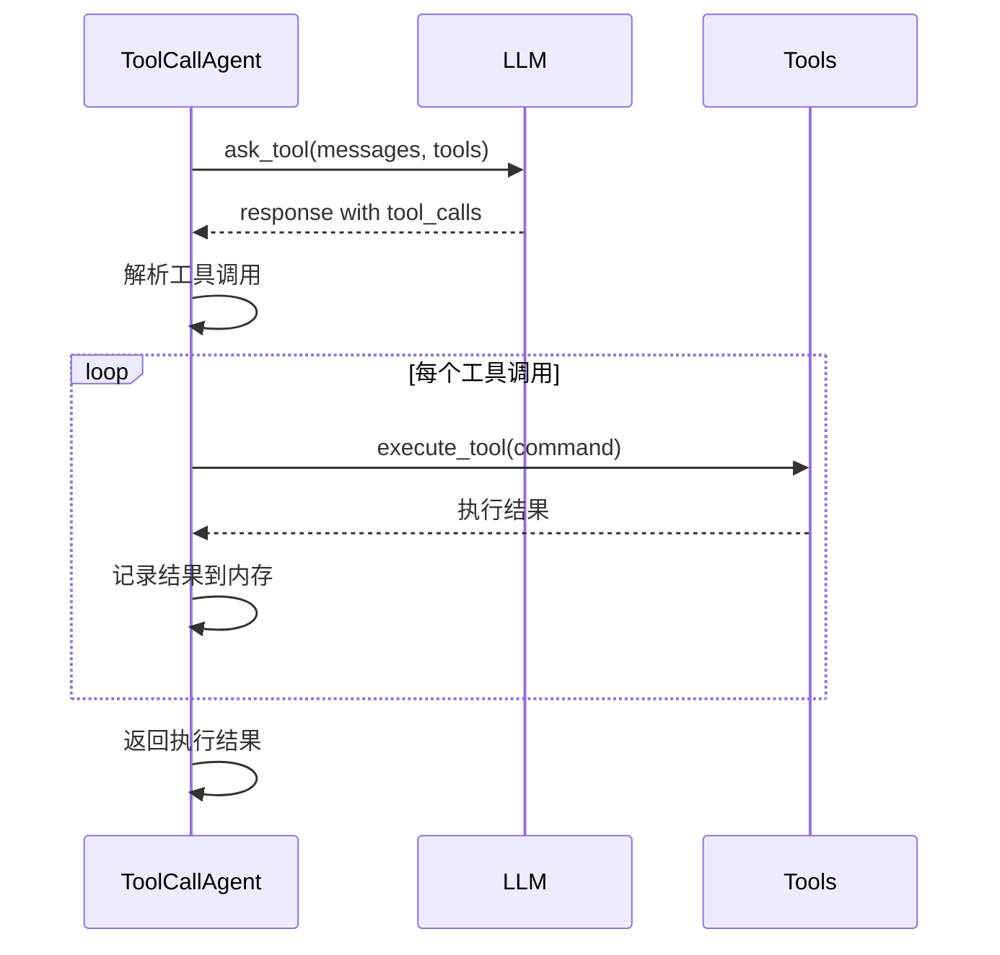
```mermaid
sequenceDiagram
participant Agent as ToolCallAgent
participant LLM as LLM
participant Tools as Tools
Agent->>LLM : ask_tool(messages, tools)
LLM-->>Agent : response with tool_calls
Agent->>Agent : 解析工具调用
loop 每个工具调用
Agent->>Tools : execute_tool(command)
Tools-->>Agent : 执行结果
Agent->>Agent : 记录结果到内存
end
Agent->>Agent : 返回执行结果
```

**图源**  
- [app/agent/toolcall.py](file://app/agent/toolcall.py#L38-L128)

### 工具执行缓慢
工具执行缓慢主要体现在以下几个方面：

1. **Python执行工具**：使用多进程执行Python代码，存在进程创建开销
2. **Bash命令工具**：命令执行超时设置为120秒，长任务可能阻塞
3. **文件操作工具**：文件读写操作未进行批量处理
4. **数据可视化工具**：调用Node.js子进程执行，存在跨语言调用开销

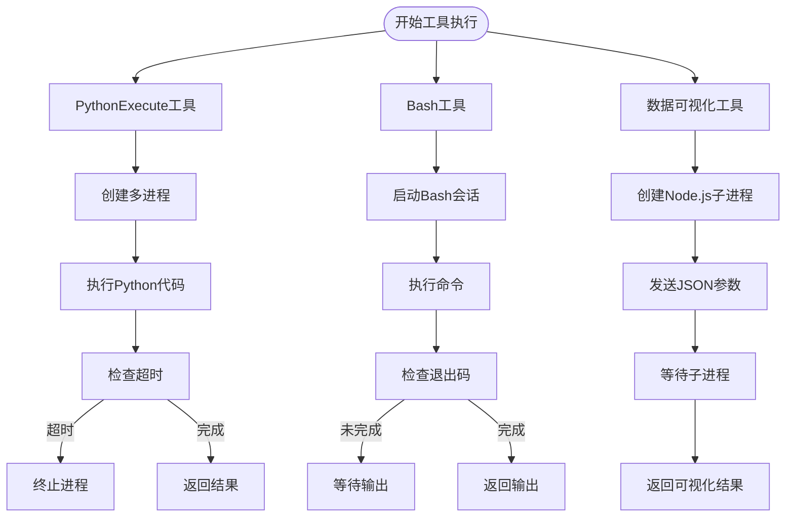
```mermaid
flowchart TD
Start([开始工具执行]) --> PythonExecute["PythonExecute工具"]
PythonExecute --> CreateProcess["创建多进程"]
CreateProcess --> ExecuteCode["执行Python代码"]
ExecuteCode --> CheckTimeout["检查超时"]
CheckTimeout --> |超时| TerminateProcess["终止进程"]
CheckTimeout --> |完成| ReturnResult["返回结果"]
Start --> BashTool["Bash工具"]
BashTool --> StartSession["启动Bash会话"]
StartSession --> RunCommand["执行命令"]
RunCommand --> CheckExitCode["检查退出码"]
CheckExitCode --> |未完成| WaitOutput["等待输出"]
CheckExitCode --> |完成| ReturnOutput["返回输出"]
Start --> DataViz["数据可视化工具"]
DataViz --> CreateSubprocess["创建Node.js子进程"]
CreateSubprocess --> SendJSON["发送JSON参数"]
SendJSON --> WaitSubprocess["等待子进程"]
WaitSubprocess --> ReturnViz["返回可视化结果"]
```

**图源**  
- [app/tool/python_execute.py](file://app/tool/python_execute.py#L1-L76)
- [app/tool/bash.py](file://app/tool/bash.py#L1-L159)
- [app/tool/chart_visualization/data_visualization.py](file://app/tool/chart_visualization/data_visualization.py#L1-L264)

### 内存占用过高
内存占用过高主要源于以下几个方面：

1. **沙箱环境**：每个沙箱实例占用独立的Docker容器资源
2. **工具集合**：`ToolCollection`中工具实例的累积
3. **代理内存**：`Memory`类中消息的累积
4. **大文件操作**：文件读写时的内存缓冲

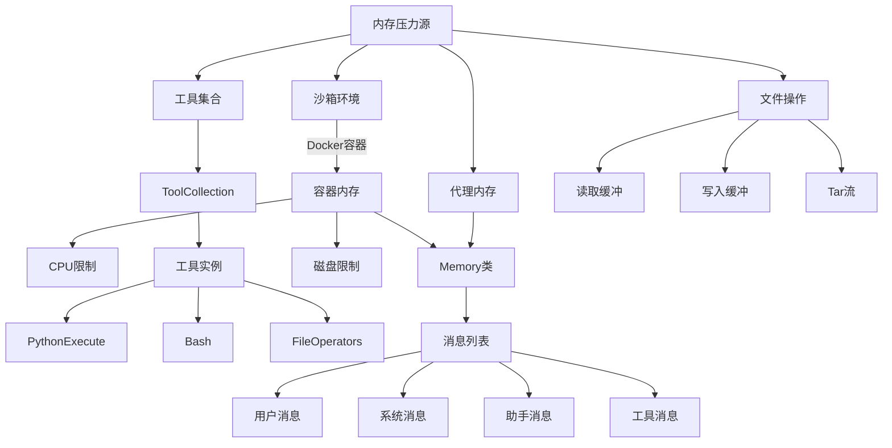
```mermaid
graph TD
MemoryPressure[内存压力源] --> Sandbox["沙箱环境"]
MemoryPressure --> Tools["工具集合"]
MemoryPressure --> AgentMemory["代理内存"]
MemoryPressure --> FileOps["文件操作"]
Sandbox --> |Docker容器| Container["容器内存"]
Container --> CPU["CPU限制"]
Container --> Memory["内存限制"]
Container --> Disk["磁盘限制"]
Tools --> ToolCollection["ToolCollection"]
ToolCollection --> ToolInstances["工具实例"]
ToolInstances --> PythonExec["PythonExecute"]
ToolInstances --> Bash["Bash"]
ToolInstances --> FileOp["FileOperators"]
AgentMemory --> Memory["Memory类"]
Memory --> Messages["消息列表"]
Messages --> UserMsg["用户消息"]
Messages --> SystemMsg["系统消息"]
Messages --> AssistantMsg["助手消息"]
Messages --> ToolMsg["工具消息"]
FileOps --> ReadBuffer["读取缓冲"]
FileOps --> WriteBuffer["写入缓冲"]
FileOps --> TarStream["Tar流"]
```

**图源**  
- [app/sandbox/core/sandbox.py](file://app/sandbox/core/sandbox.py#L1-L463)
- [app/tool/tool_collection.py](file://app/tool/tool_collection.py#L1-L72)
- [app/agent/base.py](file://app/agent/base.py#L1-L197)

### 日志I/O阻塞
日志I/O阻塞主要源于日志记录的同步写入和频繁的日志输出。

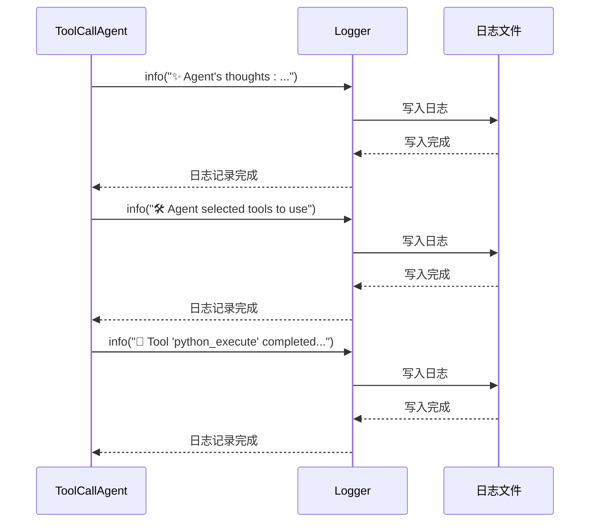
```mermaid
sequenceDiagram
participant Agent as ToolCallAgent
participant Logger as Logger
participant File as 日志文件
Agent->>Logger : info("✨ Agent's thoughts : ...")
Logger->>File : 写入日志
File-->>Logger : 写入完成
Logger-->>Agent : 日志记录完成
Agent->>Logger : info("🛠️ Agent selected tools to use")
Logger->>File : 写入日志
File-->>Logger : 写入完成
Logger-->>Agent : 日志记录完成
Agent->>Logger : info("🎯 Tool 'python_execute' completed...")
Logger->>File : 写入日志
File-->>Logger : 写入完成
Logger-->>Agent : 日志记录完成
```

**图源**  
- [app/logger.py](file://app/logger.py#L1-L43)
- [app/agent/toolcall.py](file://app/agent/toolcall.py#L38-L128)

## 日志机制与调试
### 日志配置分析
`app/logger.py`提供了灵活的日志配置机制，支持控制台输出和文件记录。

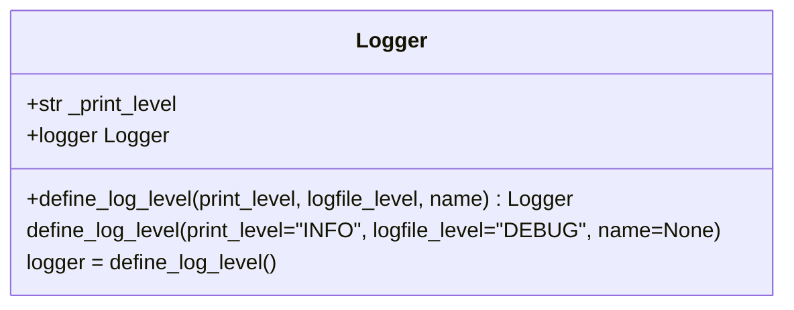
```mermaid
classDiagram
class Logger {
+str _print_level
+define_log_level(print_level, logfile_level, name) Logger
+logger Logger
}
Logger : define_log_level(print_level="INFO", logfile_level="DEBUG", name=None)
Logger : logger = define_log_level()
```

**图源**  
- [app/logger.py](file://app/logger.py#L1-L43)

### 调试日志启用
要启用调试日志，可以通过以下方式：

1. **修改日志级别**：将`print_level`设置为"DEBUG"
2. **添加日志文件**：配置文件记录级别为"DEBUG"
3. **命名日志文件**：为不同会话创建独立的日志文件

```python
# 示例：启用调试日志
from app.logger import define_log_level

# 启用调试日志
logger = define_log_level(print_level="DEBUG", logfile_level="DEBUG", name="debug_session")
```

**图源**  
- [app/logger.py](file://app/logger.py#L1-L43)

### 关键路径耗时分析
通过分析日志中的关键时间点，可以识别性能瓶颈：

1. **代理思考时间**：从`think()`开始到LLM响应返回
2. **工具执行时间**：每个工具调用的执行耗时
3. **沙箱操作时间**：沙箱创建、命令执行等操作耗时

```mermaid
flowchart TD
Start([开始代理执行]) --> ThinkStart["记录think开始时间"]
ThinkStart --> LLMCall["调用LLM"]
LLMCall --> LLMResponse["接收LLM响应"]
LLMResponse --> ThinkEnd["记录think结束时间"]
ThinkEnd --> ActStart["记录act开始时间"]
loop 每个工具调用
ActStart --> ToolStart["记录工具执行开始时间"]
ToolStart --> ExecuteTool["执行工具"]
ExecuteTool --> ToolEnd["记录工具执行结束时间"]
ToolEnd --> CalculateDuration["计算执行耗时"]
end
CalculateDuration --> ActEnd["记录act结束时间"]
ActEnd --> TotalDuration["计算总耗时"]
TotalDuration --> LogPerformance["记录性能指标"]
```

**图源**  
- [app/agent/toolcall.py](file://app/agent/toolcall.py#L38-L128)
- [app/logger.py](file://app/logger.py#L1-L43)

## 沙箱执行机制分析
### Daytona沙箱机制
Daytona沙箱通过API管理远程沙箱实例，提供持久化的执行环境。

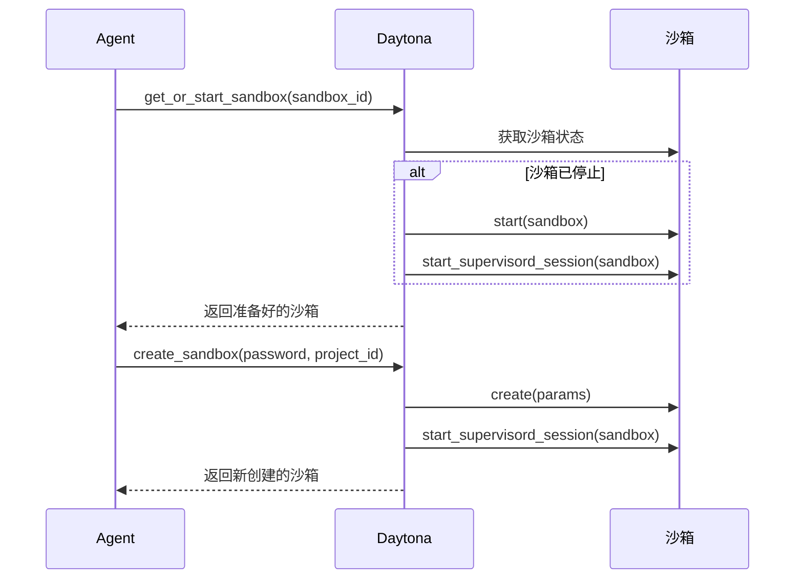
```mermaid
sequenceDiagram
participant Agent as Agent
participant Daytona as Daytona
participant Sandbox as 沙箱
Agent->>Daytona : get_or_start_sandbox(sandbox_id)
Daytona->>Sandbox : 获取沙箱状态
alt 沙箱已停止
Daytona->>Sandbox : start(sandbox)
Daytona->>Sandbox : start_supervisord_session(sandbox)
end
Daytona-->>Agent : 返回准备好的沙箱
Agent->>Daytona : create_sandbox(password, project_id)
Daytona->>Sandbox : create(params)
Daytona->>Sandbox : start_supervisord_session(sandbox)
Daytona-->>Agent : 返回新创建的沙箱
```

**图源**  
- [app/daytona/sandbox.py](file://app/daytona/sandbox.py#L44-L146)

### Docker沙箱机制
Docker沙箱在本地创建隔离的容器环境，提供更细粒度的资源控制。

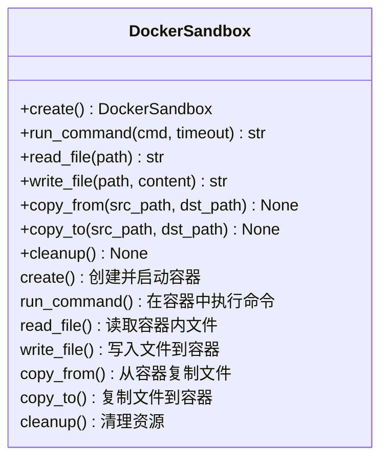
```mermaid
classDiagram
class DockerSandbox {
+create() DockerSandbox
+run_command(cmd, timeout) str
+read_file(path) str
+write_file(path, content) str
+copy_from(src_path, dst_path) None
+copy_to(src_path, dst_path) None
+cleanup() None
}
DockerSandbox : create() 创建并启动容器
DockerSandbox : run_command() 在容器中执行命令
DockerSandbox : read_file() 读取容器内文件
DockerSandbox : write_file() 写入文件到容器
DockerSandbox : copy_from() 从容器复制文件
DockerSandbox : copy_to() 复制文件到容器
DockerSandbox : cleanup() 清理资源
```

**图源**  
- [app/sandbox/core/sandbox.py](file://app/sandbox/core/sandbox.py#L1-L463)

### 沙箱客户端
沙箱客户端提供统一的接口访问不同类型的沙箱。

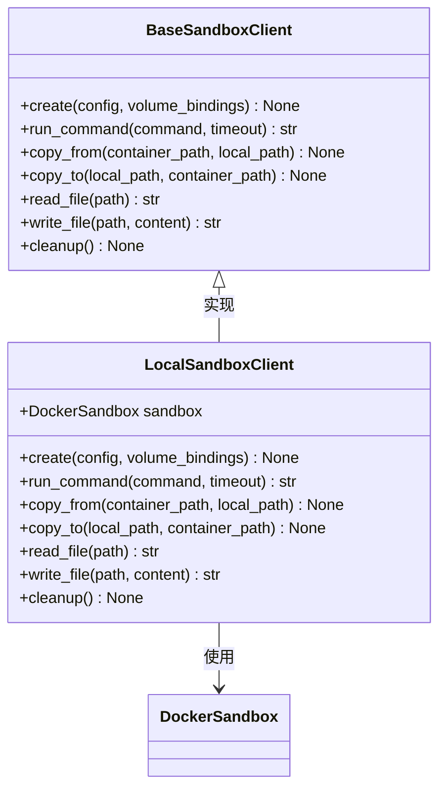
```mermaid
classDiagram
class BaseSandboxClient {
+create(config, volume_bindings) None
+run_command(command, timeout) str
+copy_from(container_path, local_path) None
+copy_to(local_path, container_path) None
+read_file(path) str
+write_file(path, content) str
+cleanup() None
}
class LocalSandboxClient {
+DockerSandbox sandbox
+create(config, volume_bindings) None
+run_command(command, timeout) str
+copy_from(container_path, local_path) None
+copy_to(local_path, container_path) None
+read_file(path) str
+write_file(path, content) str
+cleanup() None
}
BaseSandboxClient <|-- LocalSandboxClient : 实现
LocalSandboxClient --> DockerSandbox : 使用
```

**图源**  
- [app/sandbox/client.py](file://app/sandbox/client.py#L1-L202)

## 工具调用流程分析
### 工具调用流程
工具调用流程从代理思考开始，经过工具选择、执行到结果处理。

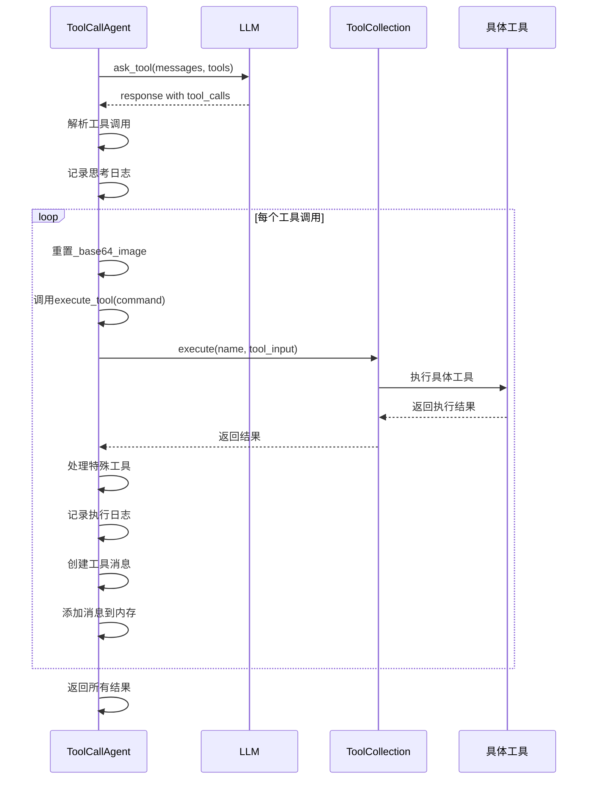
```mermaid
sequenceDiagram
participant Agent as ToolCallAgent
participant LLM as LLM
participant Tools as ToolCollection
participant Tool as 具体工具
Agent->>LLM : ask_tool(messages, tools)
LLM-->>Agent : response with tool_calls
Agent->>Agent : 解析工具调用
Agent->>Agent : 记录思考日志
loop 每个工具调用
Agent->>Agent : 重置_base64_image
Agent->>Agent : 调用execute_tool(command)
Agent->>Tools : execute(name, tool_input)
Tools->>Tool : 执行具体工具
Tool-->>Tools : 返回执行结果
Tools-->>Agent : 返回结果
Agent->>Agent : 处理特殊工具
Agent->>Agent : 记录执行日志
Agent->>Agent : 创建工具消息
Agent->>Agent : 添加消息到内存
end
Agent->>Agent : 返回所有结果
```

**图源**  
- [app/agent/toolcall.py](file://app/agent/toolcall.py#L130-L163)

### 工具集合管理
`ToolCollection`类管理所有可用工具，提供工具注册和执行接口。

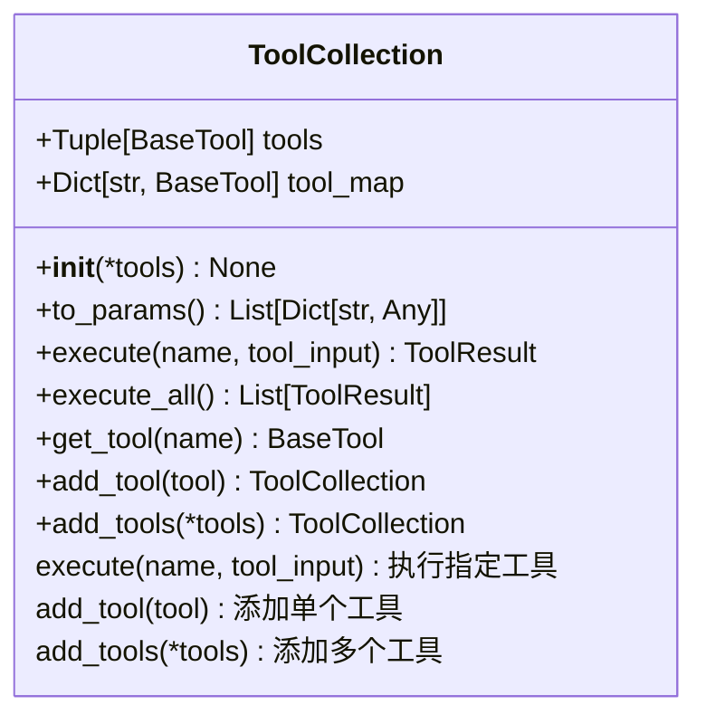
```mermaid
classDiagram
class ToolCollection {
+Tuple[BaseTool] tools
+Dict[str, BaseTool] tool_map
+__init__(*tools) None
+to_params() List[Dict[str, Any]]
+execute(name, tool_input) ToolResult
+execute_all() List[ToolResult]
+get_tool(name) BaseTool
+add_tool(tool) ToolCollection
+add_tools(*tools) ToolCollection
}
ToolCollection : execute(name, tool_input) 执行指定工具
ToolCollection : add_tool(tool) 添加单个工具
ToolCollection : add_tools(*tools) 添加多个工具
```

**图源**  
- [app/tool/tool_collection.py](file://app/tool/tool_collection.py#L1-L72)

### 工具执行机制
工具执行机制包含错误处理、结果格式化和特殊工具处理。

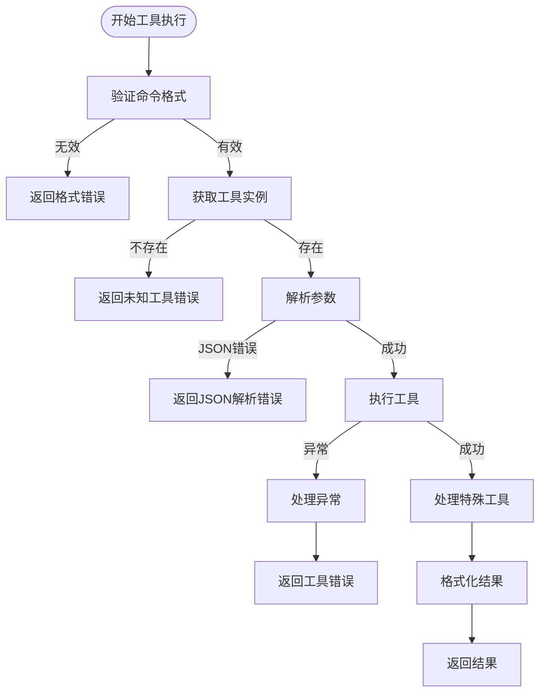
```mermaid
flowchart TD
Start([开始工具执行]) --> ValidateCommand["验证命令格式"]
ValidateCommand --> |无效| ReturnError["返回格式错误"]
ValidateCommand --> |有效| GetTool["获取工具实例"]
GetTool --> |不存在| ReturnUnknown["返回未知工具错误"]
GetTool --> |存在| ParseArgs["解析参数"]
ParseArgs --> |JSON错误| ReturnJSONError["返回JSON解析错误"]
ParseArgs --> |成功| ExecuteTool["执行工具"]
ExecuteTool --> |异常| HandleException["处理异常"]
HandleException --> ReturnToolError["返回工具错误"]
ExecuteTool --> |成功| HandleSpecial["处理特殊工具"]
HandleSpecial --> FormatResult["格式化结果"]
FormatResult --> ReturnResult["返回结果"]
```

**图源**  
- [app/agent/toolcall.py](file://app/agent/toolcall.py#L165-L207)

## 优化建议
### 异步执行优化
通过异步并发执行工具调用，减少总体执行时间。

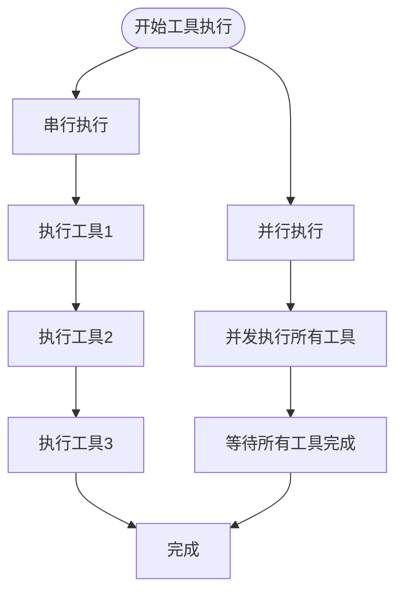
```mermaid
flowchart TD
Start([开始工具执行]) --> Sequential["串行执行"]
Sequential --> Tool1["执行工具1"]
Tool1 --> Tool2["执行工具2"]
Tool2 --> Tool3["执行工具3"]
Tool3 --> End["完成"]
Start --> Parallel["并行执行"]
Parallel --> AllTools["并发执行所有工具"]
AllTools --> WaitAll["等待所有工具完成"]
WaitAll --> End
```

**优化方案**：
1. 修改`act()`方法，使用`asyncio.gather()`并发执行工具
2. 为工具执行添加超时控制
3. 实现工具执行的优先级调度

### 结果缓存机制
为频繁执行的工具调用添加结果缓存，避免重复计算。

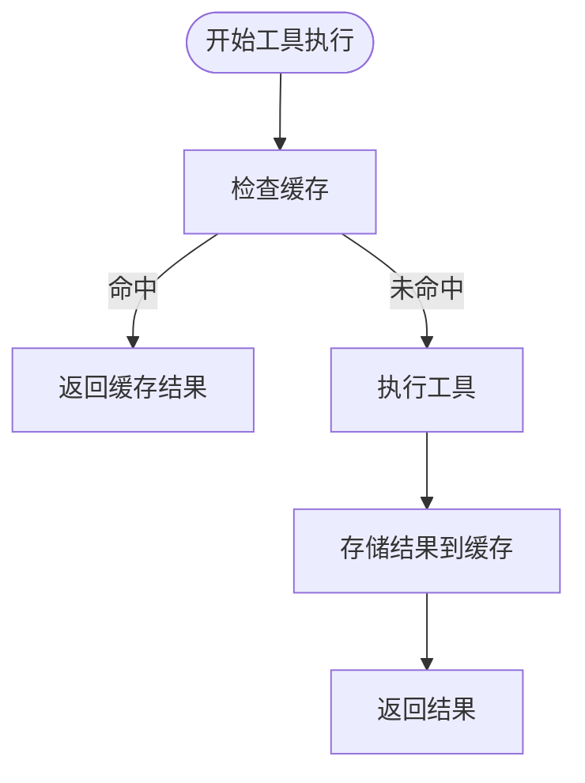
```mermaid
flowchart TD
Start([开始工具执行]) --> CheckCache["检查缓存"]
CheckCache --> |命中| ReturnCache["返回缓存结果"]
CheckCache --> |未命中| ExecuteTool["执行工具"]
ExecuteTool --> StoreCache["存储结果到缓存"]
StoreCache --> ReturnResult["返回结果"]
```

**实现方案**：
1. 添加缓存装饰器到工具执行方法
2. 使用LRU缓存策略管理内存使用
3. 为缓存结果设置合理的过期时间

### 并发控制
通过限制并发数，避免资源过度消耗。

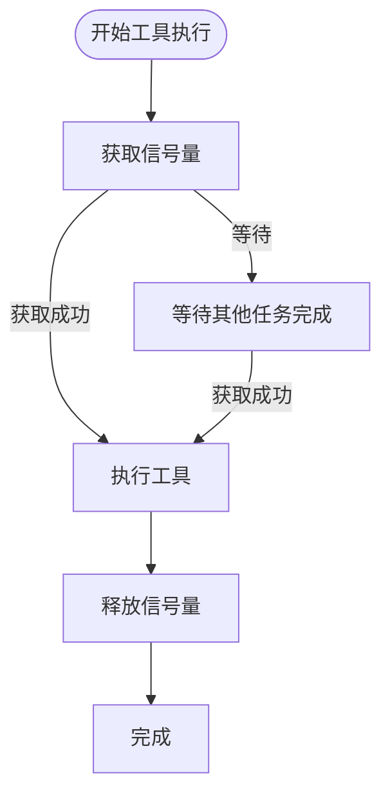
```mermaid
flowchart TD
Start([开始工具执行]) --> Semaphore["获取信号量"]
Semaphore --> |获取成功| ExecuteTool["执行工具"]
Semaphore --> |等待| Wait["等待其他任务完成"]
Wait --> |获取成功| ExecuteTool
ExecuteTool --> Release["释放信号量"]
Release --> End["完成"]
```

**实现方案**：
1. 在`ToolCallAgent`中添加并发控制信号量
2. 为不同类型的工具设置不同的并发限制
3. 实现动态并发调整策略

### 日志级别调整
根据运行环境调整日志级别，减少不必要的I/O操作。

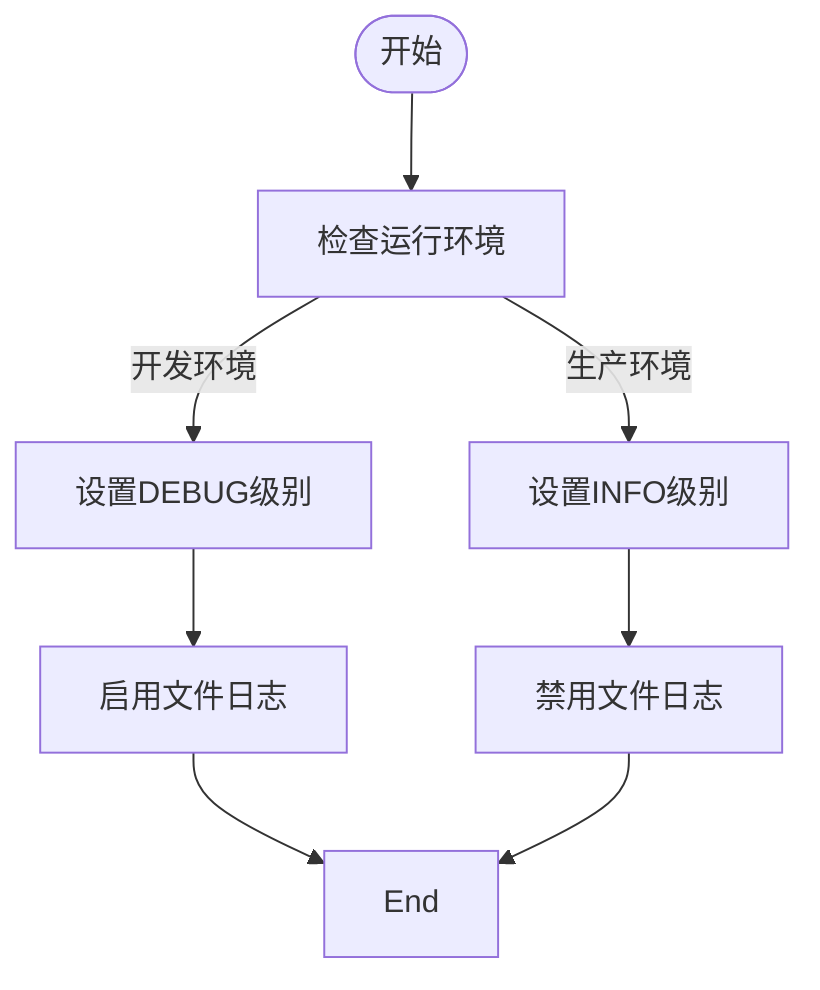
```mermaid
flowchart TD
Start([开始]) --> CheckEnv["检查运行环境"]
CheckEnv --> |开发环境| SetDebug["设置DEBUG级别"]
CheckEnv --> |生产环境| SetInfo["设置INFO级别"]
SetDebug --> EnableFileLog["启用文件日志"]
SetInfo --> DisableFileLog["禁用文件日志"]
EnableFileLog --> End
DisableFileLog --> End
```

**实现方案**：
1. 根据配置文件设置日志级别
2. 为关键路径添加性能日志
3. 实现日志采样机制，减少日志量

## 性能监控与基准测试
### 性能监控指标
建立全面的性能监控体系，跟踪关键性能指标。

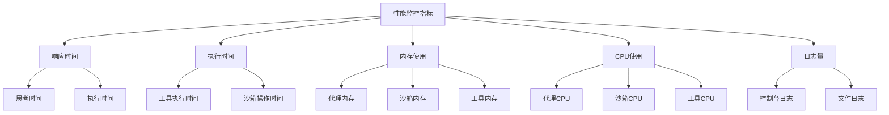
```mermaid
graph TD
PerformanceMetrics[性能监控指标] --> ResponseTime["响应时间"]
PerformanceMetrics --> ExecutionTime["执行时间"]
PerformanceMetrics --> MemoryUsage["内存使用"]
PerformanceMetrics --> CPUUsage["CPU使用"]
PerformanceMetrics --> LogVolume["日志量"]
ResponseTime --> ThinkTime["思考时间"]
ResponseTime --> ActTime["执行时间"]
ExecutionTime --> ToolTime["工具执行时间"]
ExecutionTime --> SandboxTime["沙箱操作时间"]
MemoryUsage --> AgentMemory["代理内存"]
MemoryUsage --> SandboxMemory["沙箱内存"]
MemoryUsage --> ToolMemory["工具内存"]
CPUUsage --> AgentCPU["代理CPU"]
CPUUsage --> SandboxCPU["沙箱CPU"]
CPUUsage --> ToolCPU["工具CPU"]
LogVolume --> ConsoleLog["控制台日志"]
LogVolume --> FileLog["文件日志"]
```

### 基准测试方法
建立标准化的基准测试流程，评估优化效果。

```mermaid
flowchart TD
Start([开始基准测试]) --> Setup["设置测试环境"]
Setup --> PrepareData["准备测试数据"]
PrepareData --> DefineScenarios["定义测试场景"]
DefineScenarios --> Scenario1["简单任务场景"]
DefineScenarios --> Scenario2["复杂任务场景"]
DefineScenarios --> Scenario3["高负载场景"]
Scenario1 --> ExecuteTest["执行测试"]
Scenario2 --> ExecuteTest
Scenario3 --> ExecuteTest
ExecuteTest --> CollectMetrics["收集性能指标"]
CollectMetrics --> AnalyzeResults["分析结果"]
AnalyzeResults --> GenerateReport["生成报告"]
GenerateReport --> End["完成"]
```

**测试场景**：
1. **简单任务**：单个工具调用，快速完成
2. **复杂任务**：多个工具调用，涉及文件操作和计算
3. **高负载**：并发执行多个代理任务

## 结论
通过对OpenManus的深入分析，我们识别了在高负载或复杂任务场景下的主要性能瓶颈，包括代理响应延迟、工具执行缓慢、内存占用过高和日志I/O阻塞等问题。基于`app/logger.py`的日志机制，我们提出了启用调试日志和分析关键路径耗时的方法。结合沙箱执行机制和工具调用流程，我们识别了资源密集型操作，并提出了异步执行、结果缓存、并发控制和日志级别调整等优化建议。最后，我们提供了性能监控指标建议和基准测试方法，帮助用户评估系统优化效果。这些优化措施将显著提升OpenManus在高负载场景下的性能表现。