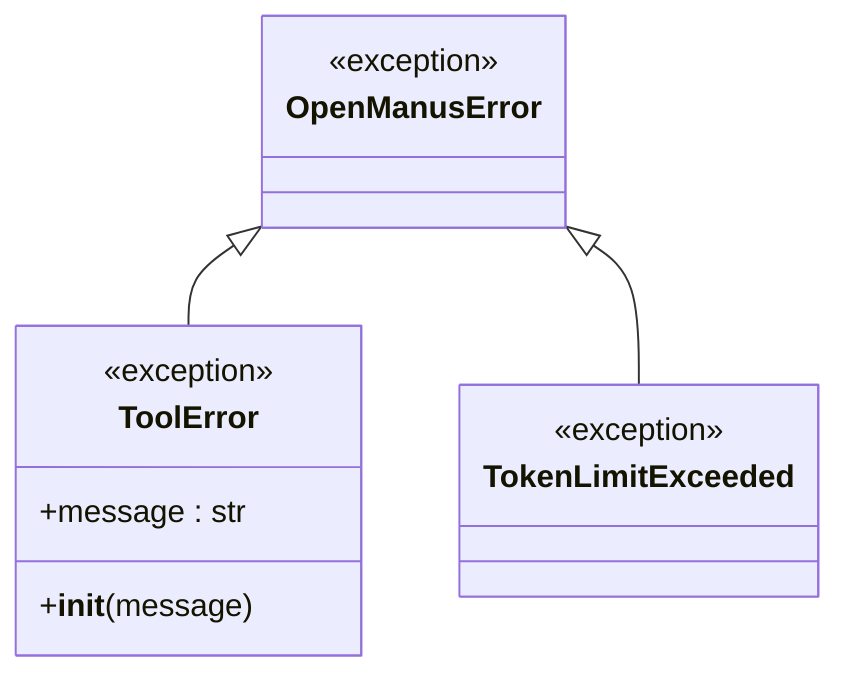
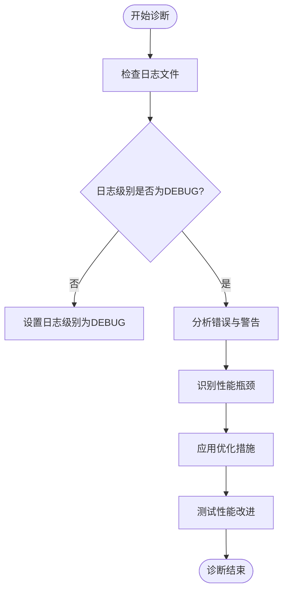

# 故障排除

<cite>
**本文档中引用的文件**  
- [exceptions.py](file://app/exceptions.py)
- [logger.py](file://app/logger.py)
- [toolcall.py](file://app/agent/toolcall.py)
- [bash.py](file://app/tool/bash.py)
- [python_execute.py](file://app/tool/python_execute.py)
- [planning.py](file://app/flow/planning.py)
</cite>

## 目录
1. [简介](#简介)
2. [常见问题与解决方案](#常见问题与解决方案)
3. [错误代码与异常类型解析](#错误代码与异常类型解析)
4. [调试方法](#调试方法)
5. [性能问题诊断与优化建议](#性能问题诊断与优化建议)
6. [结论](#结论)

## 简介
本指南旨在帮助用户解决在使用 OpenManus 过程中可能遇到的各类问题。涵盖连接失败、工具执行错误、性能瓶颈等常见问题，并提供详细的错误代码解释、日志分析技巧和性能优化建议，确保用户能够快速定位并恢复系统正常运行。

## 常见问题与解决方案

### 连接失败
当 OpenManus 无法连接到外部服务（如 LLM 接口、数据库或网络资源）时，通常会抛出连接异常。此类问题可能由网络配置、认证信息错误或服务不可用引起。

**解决方案**：
- 检查网络连接是否正常。
- 确认配置文件中的 API 密钥、端点地址等信息正确无误。
- 查看日志中是否有 `ConnectionError` 或 `TimeoutError` 相关记录。

### 工具执行错误
在调用内置工具（如 `bash`、`python_execute`）时可能出现执行失败的情况，例如命令格式错误、权限不足或脚本超时。

**解决方案**：
- 确保传递给工具的参数符合预期格式（如 JSON 结构正确）。
- 对于 `bash` 工具，避免执行长时间阻塞的命令，建议后台运行并重定向输出。
- 对于 `python_execute`，注意代码中仅 `print` 输出可见，函数返回值不会被捕获。

### 性能瓶颈
系统响应缓慢或任务执行时间过长可能是由于资源限制、高负载或低效算法导致。

**解决方案**：
- 检查 CPU 和内存使用情况，确认是否存在资源耗尽。
- 优化工具调用频率，减少不必要的重复操作。
- 启用更详细的日志级别以追踪耗时操作。

**Section sources**
- [bash.py](file://app/tool/bash.py#L0-L158)
- [python_execute.py](file://app/tool/python_execute.py#L0-L75)

## 错误代码与异常类型解析

OpenManus 定义了多种自定义异常类型，用于精确标识运行时错误。以下为关键异常类及其含义：

### ToolError
表示某个工具在执行过程中发生错误。通常由工具内部逻辑抛出，携带具体的错误消息。

**处理方法**：
- 检查传入参数是否合法。
- 查看日志中 `ToolError` 的上下文信息，定位具体出错的工具名称和输入内容。

### OpenManusError
所有 OpenManus 自定义异常的基类，用于统一异常体系。

### TokenLimitExceeded
当请求的 token 数量超过模型限制时抛出此异常。常见于处理大型输入或生成长文本时。

**处理方法**：
- 缩短输入内容或分批处理数据。
- 在日志中搜索 `Token limit error` 关键词，确认是否因 token 超限导致流程中断。

**Diagram sources**
- [exceptions.py](file://app/exceptions.py#L0-L13)

## 调试方法

### 日志分析技巧
OpenManus 使用 `loguru` 提供强大的日志功能，支持不同级别的输出（INFO、DEBUG、ERROR 等）。通过分析日志可快速定位问题根源。

**关键日志点**：
- `logger.info()`：记录正常流程进展。
- `logger.error()`：记录错误事件，通常伴随异常堆栈。
- `logger.exception()`：在捕获异常时记录完整堆栈信息。

**建议操作**：
- 将日志级别设置为 `DEBUG` 以获取更详细的信息。
- 搜索关键字如 `"Oops!"`, `"encountered a problem"`, `"Error marking step"` 来快速定位异常。

### 状态检查
通过 `PlanningFlow` 组件可以查看当前任务的执行状态，包括各步骤的完成情况、执行代理等。

**检查方式**：
- 调用 `planning_tool.get(plan_id)` 获取计划详情。
- 检查 `step_statuses` 字段判断各步骤是否处于 `in_progress` 或 `blocked` 状态。

### 网络诊断
若涉及外部 API 调用失败，建议进行网络连通性测试：
- 使用 `ping` 或 `curl` 测试目标服务可达性。
- 检查防火墙或代理设置是否阻止了请求。

**Section sources**
- [logger.py](file://app/logger.py#L0-L42)
- [toolcall.py](file://app/agent/toolcall.py#L44-L77)
- [planning.py](file://app/flow/planning.py#L202-L235)

## 性能问题诊断与优化建议

### 诊断步骤
1. **启用详细日志**：将 `print_level` 设为 `DEBUG`，记录所有关键操作。
2. **监控工具执行时间**：关注 `bash` 和 `python_execute` 的执行耗时。
3. **检查 token 使用情况**：频繁触发 `TokenLimitExceeded` 表明需优化输入长度。

### 优化建议
- **异步执行**：对可并行的任务使用异步调用，提升整体效率。
- **缓存中间结果**：避免重复计算或请求。
- **合理设置超时**：防止某个工具长时间占用资源。

**Diagram sources**
- [logger.py](file://app/logger.py#L0-L42)
- [python_execute.py](file://app/tool/python_execute.py#L46-L74)

## 结论
本指南系统地整理了 OpenManus 的常见问题及其解决方案，涵盖了从连接失败到性能瓶颈的各个方面。通过理解异常类型、掌握日志分析技巧，并结合实际调试手段，用户能够高效地排查和修复问题，保障系统的稳定运行。