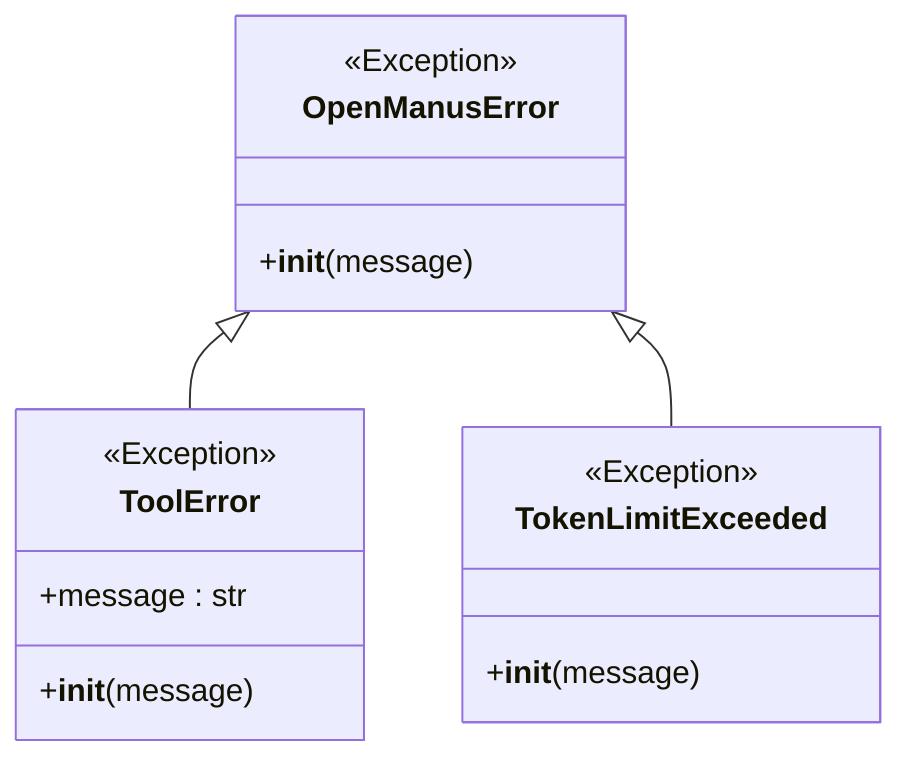
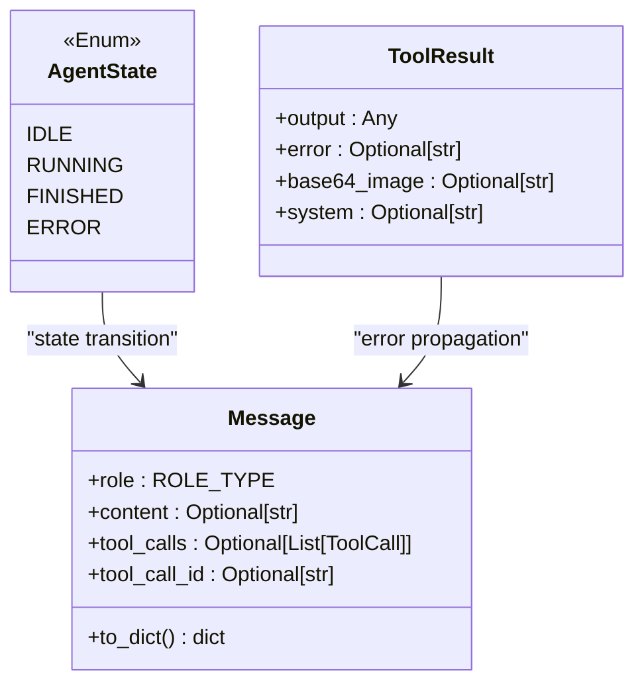
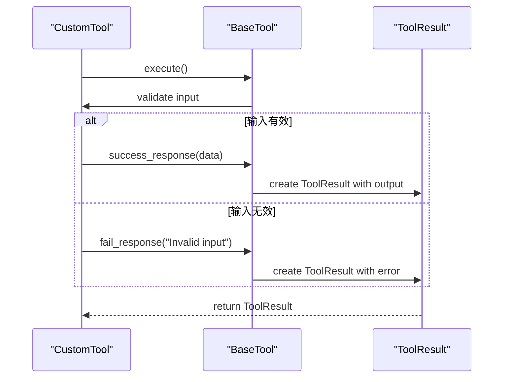

# 错误代码

<cite>
**Referenced Files in This Document**   
- [app/exceptions.py](file://app/exceptions.py)
- [app/schema.py](file://app/schema.py)
- [app/tool/base.py](file://app/tool/base.py)
- [app/llm.py](file://app/llm.py)
- [app/agent/toolcall.py](file://app/agent/toolcall.py)
- [app/agent/base.py](file://app/agent/base.py)
</cite>

## 目录
1. [简介](#简介)
2. [核心异常类型](#核心异常类型)
3. [错误状态传播与数据模型](#错误状态传播与数据模型)
4. [错误代码定义与语义](#错误代码定义与语义)
5. [在自定义工具中抛出和扩展异常](#在自定义工具中抛出和扩展异常)
6. [结论](#结论)

## 简介
本文档系统化地记录了OpenManus项目中定义的错误代码和异常类型。重点分析了`app/exceptions.py`文件中定义的核心异常，如`ToolError`、`OpenManusError`和`TokenLimitExceeded`，详细说明了它们的触发条件和语义含义。同时，结合`app/schema.py`中的`AgentState`、`Message`和`ToolResult`等数据模型，阐述了错误状态在系统中的传播路径和表现形式。为每个错误代码提供了唯一的标识符、错误消息模板、可能的根本原因以及推荐的客户端处理策略。

**Section sources**
- [app/exceptions.py](file://app/exceptions.py#L0-L12)
- [app/schema.py](file://app/schema.py#L31-L37)

## 核心异常类型

OpenManus项目中的异常体系以`OpenManusError`为基类，构建了一个层次化的错误处理结构。`ToolError`用于处理工具执行过程中的特定错误，而`TokenLimitExceeded`则专门用于处理与LLM交互时的令牌限制问题。

**Diagram sources**
- [app/exceptions.py](file://app/exceptions.py#L0-L12)

**Section sources**
- [app/exceptions.py](file://app/exceptions.py#L0-L12)

## 错误状态传播与数据模型

当异常发生时，其状态会通过一系列数据模型在系统中传播。`AgentState`枚举定义了代理的执行状态，其中`ERROR`状态表示代理因错误而终止。`ToolResult`模型用于封装工具执行的结果，其`error`字段直接承载了`ToolError`等异常的错误信息。`Message`模型则负责在对话流中传递这些错误信息。

**Diagram sources**
- [app/schema.py](file://app/schema.py#L31-L37)
- [app/schema.py](file://app/schema.py#L53-L155)
- [app/tool/base.py](file://app/tool/base.py#L37-L74)

**Section sources**
- [app/schema.py](file://app/schema.py#L31-L37)
- [app/schema.py](file://app/schema.py#L53-L155)
- [app/tool/base.py](file://app/tool/base.py#L37-L74)

## 错误代码定义与语义

### ToolError
`ToolError`是当工具在执行过程中遇到错误时抛出的异常。它继承自`OpenManusError`，并包含一个`message`字段来描述具体的错误信息。

- **唯一标识符**: `TOOL_ERROR`
- **HTTP状态码映射**: 400 Bad Request (当错误由客户端输入引起时) 或 500 Internal Server Error (当错误由内部服务引起时)
- **错误消息模板**: "Tool encountered an error: {message}"
- **可能的根本原因**: 
  - 工具所需的外部服务不可用。
  - 提供给工具的参数无效或缺失。
  - 工具内部逻辑出现未预期的错误。
- **推荐的客户端处理策略**: 
  - 检查输入参数并重试。
  - 记录错误日志并通知用户。
  - 如果是临时性错误，可以实现重试机制。

**Section sources**
- [app/exceptions.py](file://app/exceptions.py#L0-L4)
- [app/tool/base.py](file://app/tool/base.py#L162-L172)

### OpenManusError
`OpenManusError`是所有OpenManus相关错误的基类。它本身不包含特定的错误信息，而是作为其他更具体异常的父类。

- **唯一标识符**: `OPENMANUS_ERROR`
- **HTTP状态码映射**: 500 Internal Server Error
- **错误消息模板**: "An OpenManus error occurred: {message}"
- **可能的根本原因**: 
  - 任何继承自`OpenManusError`的具体异常。
- **推荐的客户端处理策略**: 
  - 将此视为一个通用的内部错误。
  - 不应直接抛出此异常，而应抛出其子类。

**Section sources**
- [app/exceptions.py](file://app/exceptions.py#L7-L8)

### TokenLimitExceeded
`TokenLimitExceeded`异常在LLM请求的令牌数量超过预设限制时抛出。它通常在`LLM`类的`ask`或`ask_tool`方法中被触发。

- **唯一标识符**: `TOKEN_LIMIT_EXCEEDED`
- **HTTP状态码映射**: 429 Too Many Requests
- **错误消息模板**: "The request exceeds the maximum token limit. Current: {current}, Needed: {needed}, Max: {max}"
- **可能的根本原因**: 
  - 对话历史过长，导致输入令牌数过多。
  - 请求的上下文或提示词过于冗长。
  - 系统配置的令牌限制过低。
- **推荐的客户端处理策略**: 
  - 清理或缩短对话历史。
  - 优化提示词，使其更简洁。
  - 调整系统配置以增加令牌限制。

**Section sources**
- [app/exceptions.py](file://app/exceptions.py#L11-L12)
- [app/llm.py](file://app/llm.py#L38-L45)
- [app/agent/toolcall.py](file://app/agent/toolcall.py#L55-L63)

## 在自定义工具中抛出和扩展异常

在开发自定义工具时，可以通过继承`BaseTool`类并使用`fail_response`方法来抛出`ToolError`。以下是一个示例，展示了如何在自定义工具中处理错误。

**Diagram sources**
- [app/tool/base.py](file://app/tool/base.py#L146-L172)

**Section sources**
- [app/tool/base.py](file://app/tool/base.py#L146-L172)

## 结论

本文档详细解析了OpenManus项目中的错误处理机制。通过理解`ToolError`、`OpenManusError`和`TokenLimitExceeded`等核心异常的定义、传播路径和处理策略，开发者可以更好地构建健壮的代理和工具。利用`ToolResult`和`Message`等数据模型，错误信息能够清晰地在系统中传递，确保了用户体验的透明度和系统的可维护性。