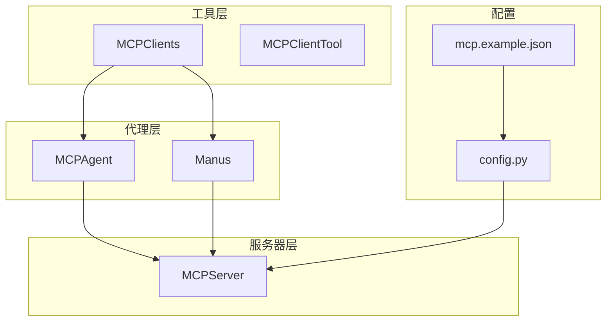
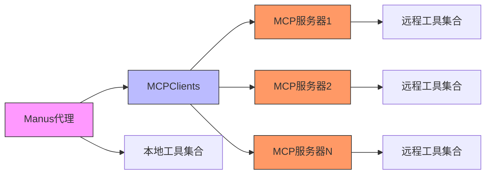
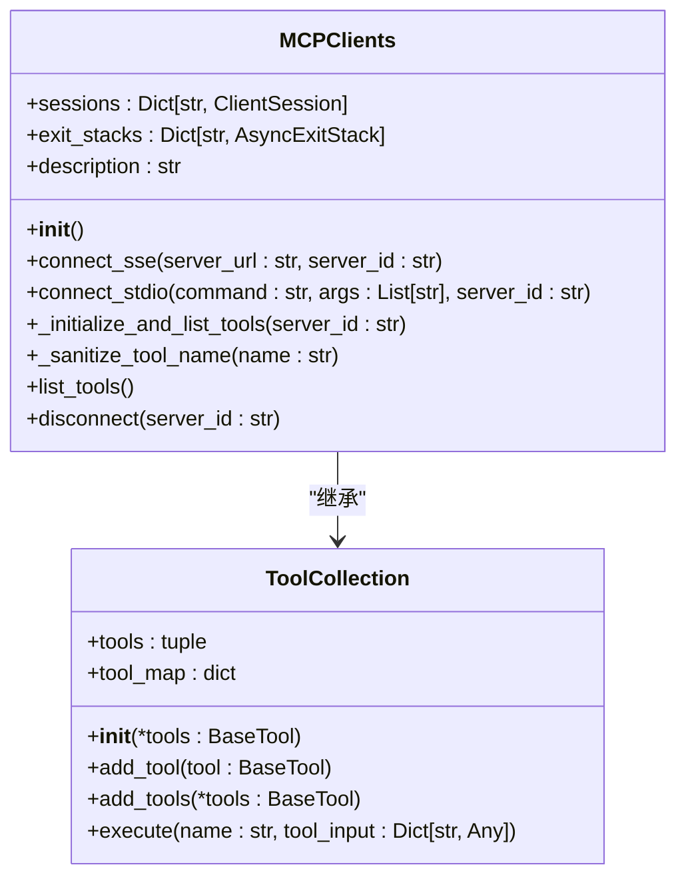
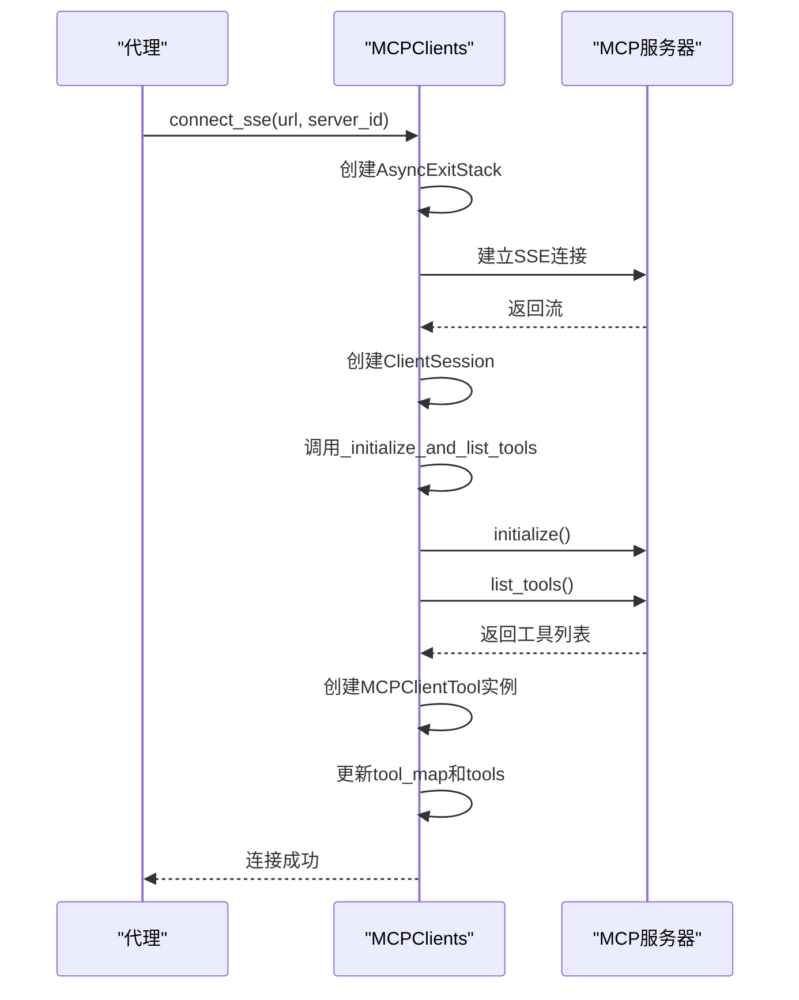
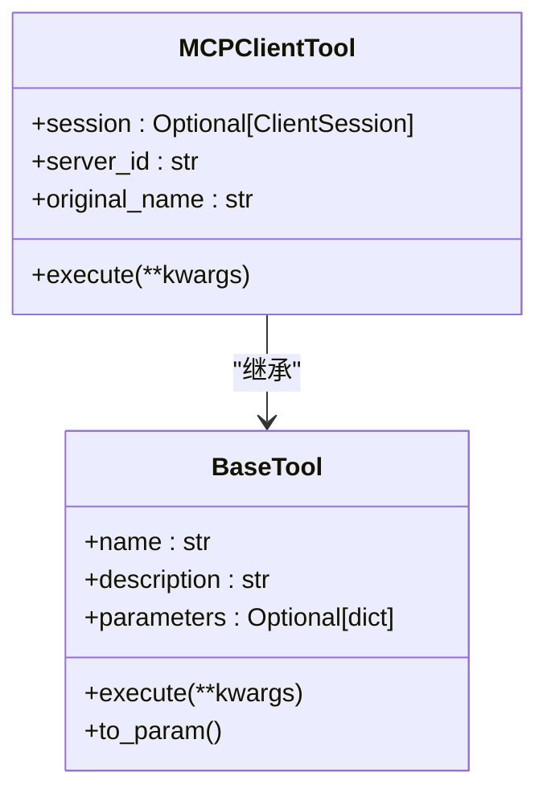
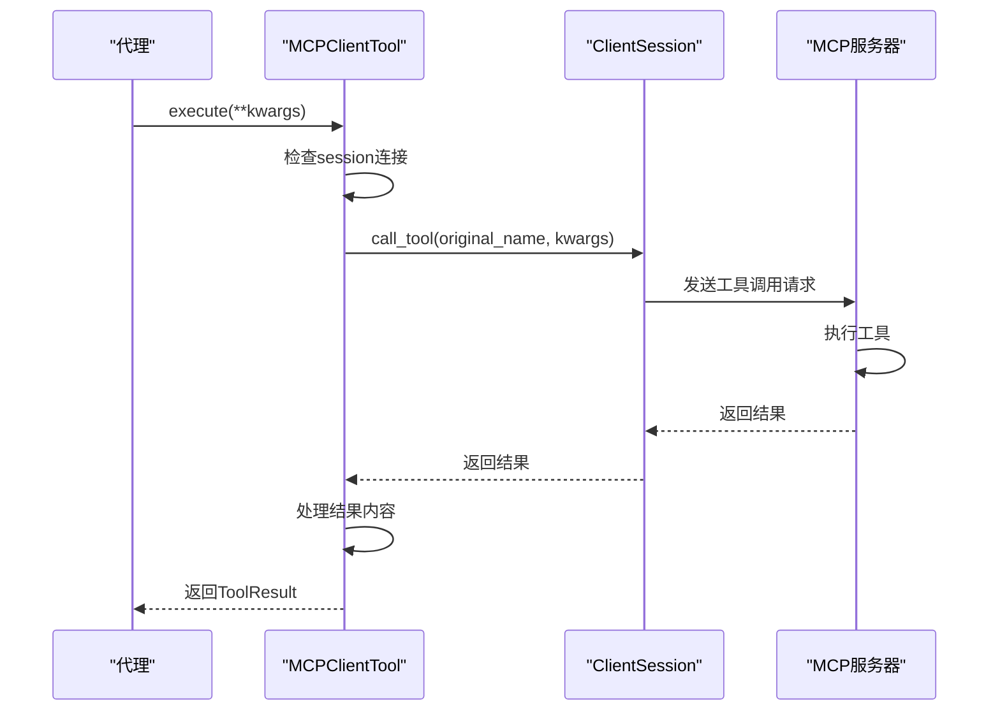
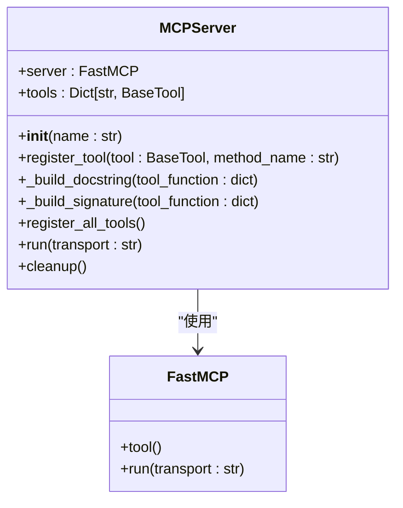
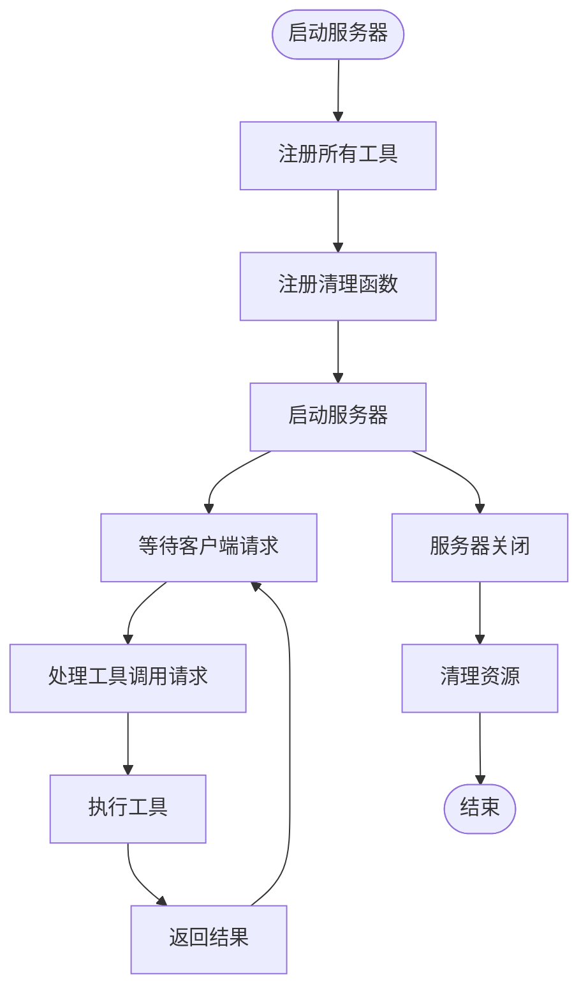
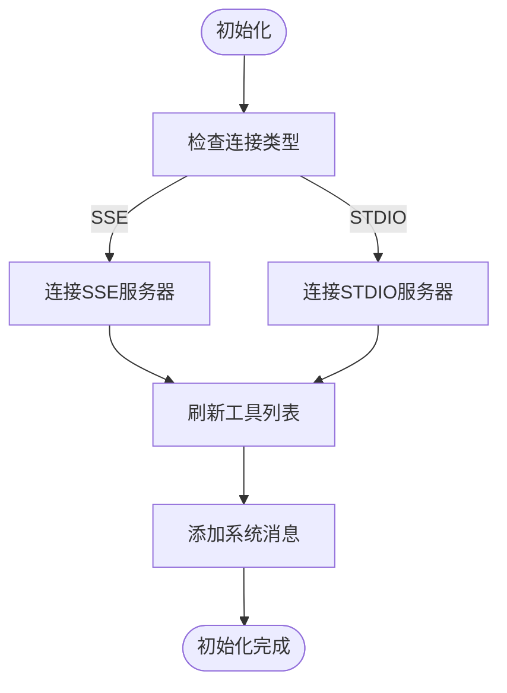
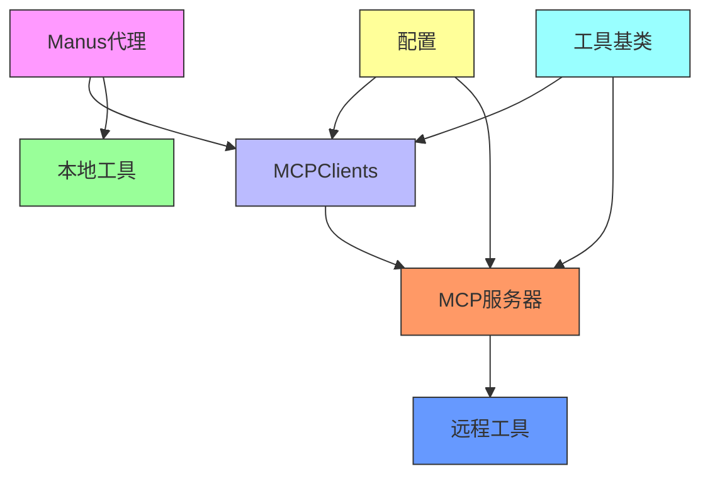

# MCP协议集成

<cite>
**本文档中引用的文件**  
- [MCPClients](file://app/tool/mcp.py)
- [MCPClientTool](file://app/tool/mcp.py)
- [MCPServer](file://app/mcp/server.py)
- [MCPAgent](file://app/agent/mcp.py)
- [Manus](file://app/agent/manus.py)
- [mcp.example.json](file://config/mcp.example.json)
- [config.py](file://app/config.py)
</cite>

## 目录
1. [简介](#简介)
2. [项目结构](#项目结构)
3. [核心组件](#核心组件)
4. [架构概述](#架构概述)
5. [详细组件分析](#详细组件分析)
6. [依赖分析](#依赖分析)
7. [性能考虑](#性能考虑)
8. [故障排除指南](#故障排除指南)
9. [结论](#结论)

## 简介
MCP（Model Context Protocol）协议在OpenManus系统中扮演着关键角色，实现了动态工具发现和远程工具调用功能。该协议支持SSE和STDIO两种连接模式，使Manus代理能够通过MCPClients连接到MCP服务器，获取远程工具列表并将其集成到本地工具集合中。MCP协议不仅增强了系统的扩展能力，还支持多代理协作，为开发者提供了灵活的工具集成方案。

## 项目结构
OpenManus项目的目录结构清晰地组织了MCP相关组件，主要分布在`app/tool`、`app/agent`和`app/mcp`等目录中。`app/tool/mcp.py`文件实现了MCP客户端功能，`app/mcp/server.py`定义了MCP服务器，而`app/agent/mcp.py`和`app/agent/manus.py`则展示了代理如何集成和使用MCP功能。

**图示来源**  
- [MCPClients](file://app/tool/mcp.py)
- [MCPAgent](file://app/agent/mcp.py)
- [Manus](file://app/agent/manus.py)
- [MCPServer](file://app/mcp/server.py)
- [mcp.example.json](file://config/mcp.example.json)
- [config.py](file://app/config.py)

**章节来源**  
- [app/tool/mcp.py](file://app/tool/mcp.py)
- [app/agent/mcp.py](file://app/agent/mcp.py)
- [app/agent/manus.py](file://app/agent/manus.py)
- [app/mcp/server.py](file://app/mcp/server.py)

## 核心组件
MCP协议集成的核心组件包括MCPClients、MCPClientTool、MCPServer和MCPAgent。MCPClients作为工具集合，管理与多个MCP服务器的连接和工具同步；MCPClientTool代表远程工具的代理；MCPServer提供工具注册和管理功能；MCPAgent则作为使用MCP服务的代理实体。

**章节来源**  
- [app/tool/mcp.py](file://app/tool/mcp.py)
- [app/mcp/server.py](file://app/mcp/server.py)
- [app/agent/mcp.py](file://app/agent/mcp.py)

## 架构概述
MCP协议的架构设计实现了客户端-服务器模式的工具集成。Manus代理通过MCPClients连接到一个或多个MCP服务器，获取远程工具列表并将其封装为本地可调用的工具。这种设计实现了工具的动态发现和远程调用，支持系统的灵活扩展。

**图示来源**  
- [MCPClients](file://app/tool/mcp.py)
- [MCPAgent](file://app/agent/mcp.py)
- [Manus](file://app/agent/manus.py)
- [MCPServer](file://app/mcp/server.py)

## 详细组件分析

### MCPClients分析
MCPClients是MCP客户端的核心实现，继承自ToolCollection，负责管理与MCP服务器的连接和工具同步。

#### 类图

**图示来源**  
- [MCPClients](file://app/tool/mcp.py#L36-L193)
- [ToolCollection](file://app/tool/tool_collection.py#L8-L70)

#### 连接管理序列图

**图示来源**  
- [MCPClients.connect_sse](file://app/tool/mcp.py#L49-L68)
- [MCPClients._initialize_and_list_tools](file://app/tool/mcp.py#L96-L125)

**章节来源**  
- [app/tool/mcp.py](file://app/tool/mcp.py#L36-L193)

### MCPClientTool分析
MCPClientTool作为远程工具的代理，封装了远程调用的细节，使远程工具的使用如同本地工具一样简单。

#### 类图

**图示来源**  
- [MCPClientTool](file://app/tool/mcp.py#L13-L33)
- [BaseTool](file://app/tool/base.py#L77-L172)

#### 工具调用序列图

**图示来源**  
- [MCPClientTool.execute](file://app/tool/mcp.py#L20-L33)
- [ClientSession.call_tool](file://app/tool/mcp.py)

**章节来源**  
- [app/tool/mcp.py](file://app/tool/mcp.py#L13-L33)

### MCPServer分析
MCPServer实现了MCP服务器端功能，负责工具注册和管理，通过FastMCP框架提供服务。

#### 类图

**图示来源**  
- [MCPServer](file://app/mcp/server.py#L23-L159)
- [FastMCP](file://app/mcp/server.py)

#### 服务器启动流程图

**图示来源**  
- [MCPServer.run](file://app/mcp/server.py#L149-L159)
- [MCPServer.register_all_tools](file://app/mcp/server.py#L144-L147)
- [MCPServer.cleanup](file://app/mcp/server.py#L137-L142)

**章节来源**  
- [app/mcp/server.py](file://app/mcp/server.py#L23-L159)

### MCPAgent分析
MCPAgent是使用MCP服务的代理实现，能够通过SSE或STDIO连接到MCP服务器并使用其工具。

#### 初始化流程图

**图示来源**  
- [MCPAgent.initialize](file://app/agent/mcp.py#L50-L80)

**章节来源**  
- [app/agent/mcp.py](file://app/agent/mcp.py#L26-L185)

## 依赖分析
MCP协议集成涉及多个组件之间的依赖关系，形成了清晰的层次结构。

**图示来源**  
- [MCPClients](file://app/tool/mcp.py)
- [MCPAgent](file://app/agent/mcp.py)
- [Manus](file://app/agent/manus.py)
- [MCPServer](file://app/mcp/server.py)
- [config.py](file://app/config.py)

**章节来源**  
- [app/tool/mcp.py](file://app/tool/mcp.py)
- [app/agent/mcp.py](file://app/agent/mcp.py)
- [app/agent/manus.py](file://app/agent/manus.py)
- [app/mcp/server.py](file://app/mcp/server.py)
- [app/config.py](file://app/config.py)

## 性能考虑
MCP协议集成在性能方面考虑了连接管理、工具同步和错误处理等关键因素。通过AsyncExitStack管理异步资源，确保连接的正确释放；通过定期刷新工具列表，保持工具集合的最新状态；通过详细的日志记录，便于问题排查和性能分析。

## 故障排除指南
当MCP集成出现问题时，可以从以下几个方面进行排查：
1. 检查MCP服务器是否正常运行
2. 验证连接配置（URL或命令）是否正确
3. 查看日志中的错误信息
4. 确认网络连接是否正常
5. 检查工具名称是否符合命名规范

**章节来源**  
- [MCPClients.disconnect](file://app/tool/mcp.py#L154-L193)
- [MCPServer.cleanup](file://app/mcp/server.py#L137-L142)

## 结论
MCP协议在OpenManus中的集成实现了灵活的工具扩展机制，通过SSE和STDIO两种连接模式支持远程工具调用。MCPClients作为核心组件，有效地管理了与MCP服务器的连接和工具同步，为Manus代理提供了丰富的工具集。这种设计不仅增强了系统的功能，还为多代理协作和系统扩展提供了坚实的基础。