# Manus代理

<cite>
**本文档中引用的文件**  
- [manus.py](file://app/agent/manus.py)
- [toolcall.py](file://app/agent/toolcall.py)
- [browser.py](file://app/agent/browser.py)
- [python_execute.py](file://app/tool/python_execute.py)
- [browser_use_tool.py](file://app/tool/browser_use_tool.py)
- [str_replace_editor.py](file://app/tool/str_replace_editor.py)
- [ask_human.py](file://app/tool/ask_human.py)
- [terminate.py](file://app/tool/terminate.py)
- [mcp.py](file://app/tool/mcp.py)
- [manus.py](file://app/prompt/manus.py)
- [mcp.example.json](file://config/mcp.example.json)
- [main.py](file://main.py)
</cite>

## 目录
1. [简介](#简介)
2. [项目结构](#项目结构)
3. [核心组件](#核心组件)
4. [架构概述](#架构概述)
5. [详细组件分析](#详细组件分析)
6. [依赖分析](#依赖分析)
7. [性能考虑](#性能考虑)
8. [故障排除指南](#故障排除指南)
9. [结论](#结论)

## 简介
Manus代理是一个多功能通用任务解决代理，能够通过多种工具高效完成复杂请求。它继承了ToolCallAgent并扩展了MCP服务器连接功能，支持SSE和STDIO两种连接模式。Manus集成了Python执行、浏览器操作、字符串替换编辑、人工交互和终止工具等内置工具集，能够处理编程、信息检索、文件处理、网页浏览等多种任务。通过create工厂方法可以实例化Manus代理，并配置多MCP服务器协同工作。其特殊工具处理机制（如Terminate）能够控制代理生命周期，资源清理机制确保浏览器和MCP连接的安全释放。

## 项目结构
Manus代理的项目结构清晰，主要组件分布在不同的目录中。核心代理实现在app/agent目录下，工具实现在app/tool目录下，提示词模板在app/prompt目录下，配置文件在config目录下。

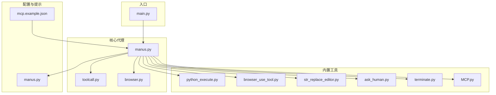

**图源**
- [manus.py](file://app/agent/manus.py)
- [toolcall.py](file://app/agent/toolcall.py)
- [browser.py](file://app/agent/browser.py)

## 核心组件
Manus代理的核心组件包括代理类本身、工具调用基类、浏览器上下文助手和各种内置工具。Manus类继承自ToolCallAgent，扩展了MCP服务器连接功能。内置工具集包括Python执行、浏览器操作、字符串替换编辑、人工交互和终止工具。browser_context_helper动态调整提示词以支持浏览器上下文感知。

**节源**
- [manus.py](file://app/agent/manus.py)
- [toolcall.py](file://app/agent/toolcall.py)
- [browser.py](file://app/agent/browser.py)

## 架构概述
Manus代理采用分层架构设计，顶层是Manus代理类，中间层是工具调用基类和各种工具，底层是具体的工具实现。Manus代理通过MCP客户端连接远程服务器，集成其提供的工具。当需要浏览器操作时，通过BrowserContextHelper获取当前浏览器状态并动态调整提示词。

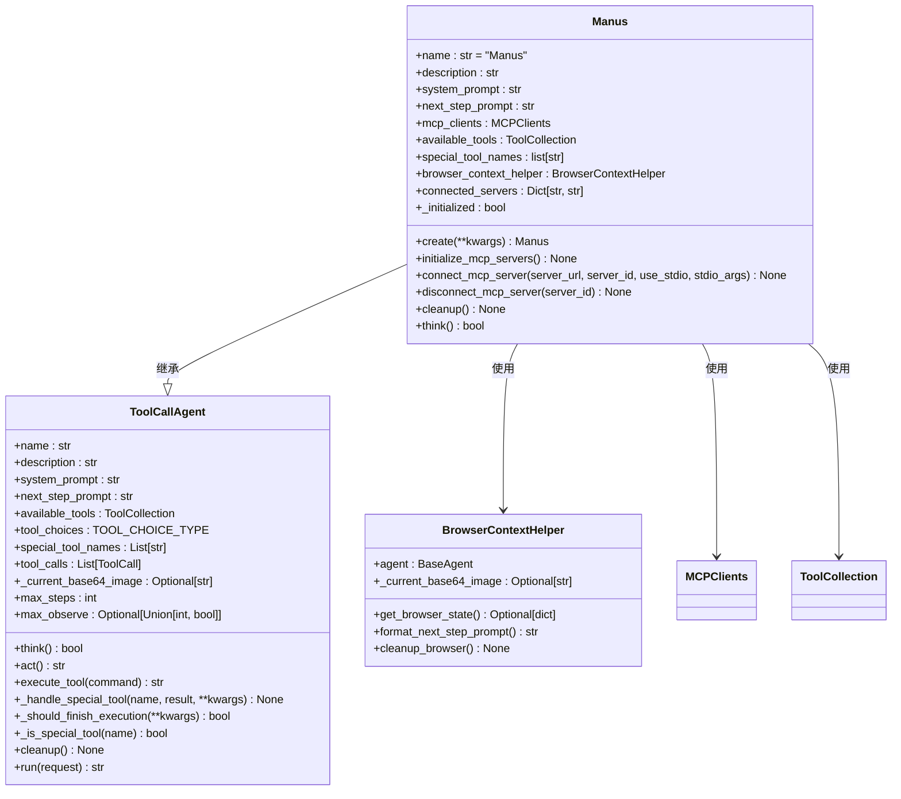

**图源**
- [manus.py](file://app/agent/manus.py)
- [toolcall.py](file://app/agent/toolcall.py)
- [browser.py](file://app/agent/browser.py)

## 详细组件分析
### Manus代理分析
Manus代理作为通用任务解决代理，继承了ToolCallAgent的功能并进行了扩展。它通过MCP客户端连接远程服务器，集成其提供的工具。内置工具集包括Python执行、浏览器操作、字符串替换编辑、人工交互和终止工具。

#### 类图
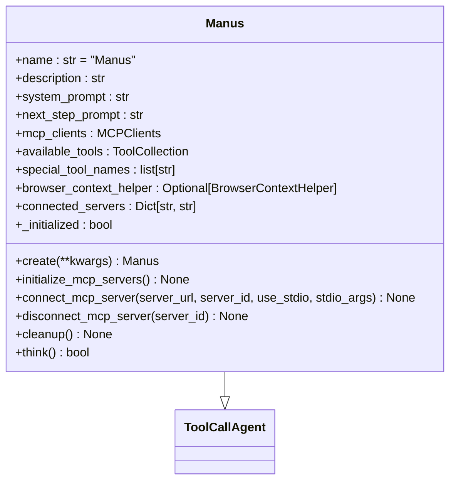

**图源**
- [manus.py](file://app/agent/manus.py)

#### 初始化流程
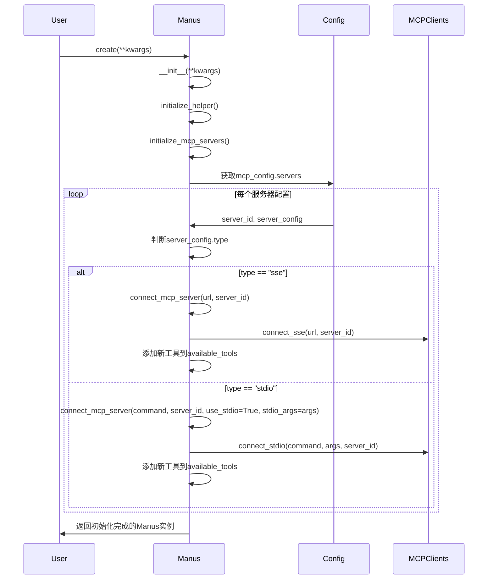

**图源**
- [manus.py](file://app/agent/manus.py)
- [mcp.example.json](file://config/mcp.example.json)

### 内置工具集分析
Manus代理集成了多种内置工具，每种工具都有特定的使用场景和功能。

#### Python执行工具
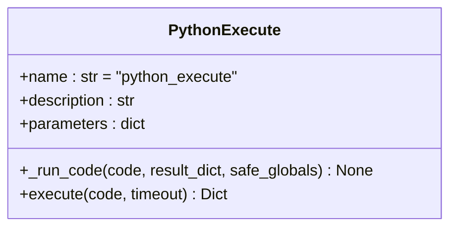

**图源**
- [python_execute.py](file://app/tool/python_execute.py)

#### 浏览器操作工具
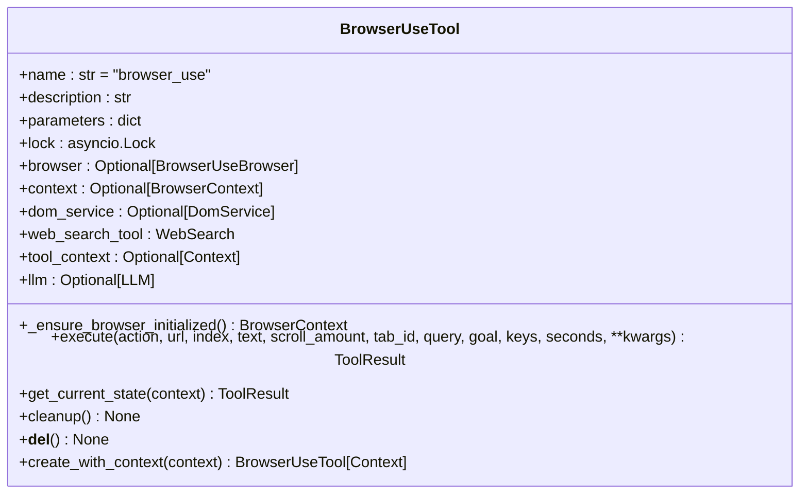

**图源**
- [browser_use_tool.py](file://app/tool/browser_use_tool.py)

#### 字符串替换编辑工具
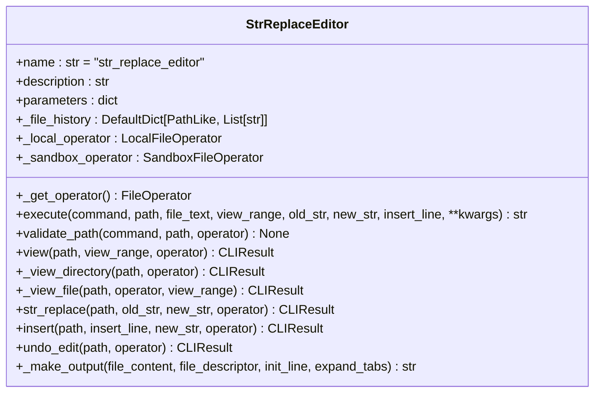

**图源**
- [str_replace_editor.py](file://app/tool/str_replace_editor.py)

#### 人工交互工具
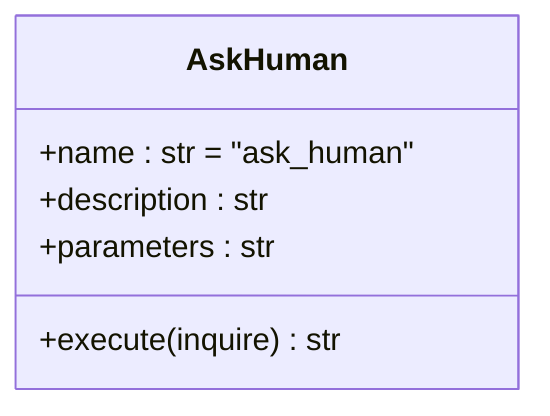

**图源**
- [ask_human.py](file://app/tool/ask_human.py)

#### 终止工具
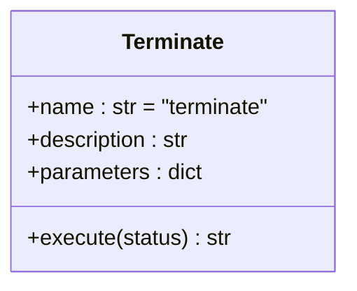

**图源**
- [terminate.py](file://app/tool/terminate.py)

### browser_context_helper分析
browser_context_helper负责动态调整提示词以支持浏览器上下文感知。它通过获取当前浏览器状态，将URL、标题、标签页等信息注入到提示词中。

#### 流程图
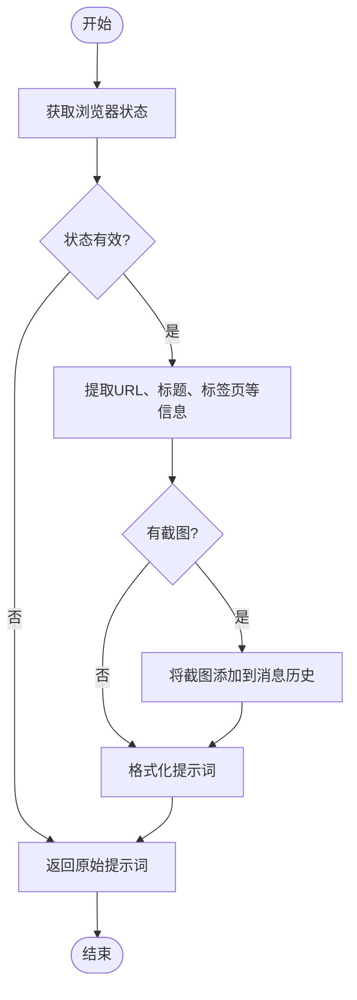

**图源**
- [browser.py](file://app/agent/browser.py)

## 依赖分析
Manus代理的依赖关系清晰，主要依赖于工具调用基类、各种内置工具、MCP客户端和配置模块。

```mermaid
graph TD
Manus[Manus] --> ToolCallAgent[ToolCallAgent]
Manus --> BrowserContextHelper[BrowserContextHelper]
Manus --> MCPClients[MCPClients]
Manus --> ToolCollection[ToolCollection]
Manus --> PythonExecute[PythonExecute]
Manus --> BrowserUseTool[BrowserUseTool]
Manus --> StrReplaceEditor[StrReplaceEditor]
Manus --> AskHuman[AskHuman]
Manus --> Terminate[Terminate]
Manus --> Config[config]
Manus --> Logger[logger]
Manus --> SYSTEM_PROMPT[SYSTEM_PROMPT]
Manus --> NEXT_STEP_PROMPT[NEXT_STEP_PROMPT]
ToolCallAgent --> ReActAgent[ReActAgent]
ToolCallAgent --> Message[Message]
ToolCallAgent --> ToolChoice[ToolChoice]
ToolCallAgent --> ToolCollection[ToolCollection]
BrowserContextHelper --> BrowserUseTool[BrowserUseTool]
BrowserContextHelper --> SandboxBrowserTool[SandboxBrowserTool]
BrowserContextHelper --> Message[Message]
BrowserContextHelper --> logger[logger]
PythonExecute --> BaseTool[BaseTool]
PythonExecute --> StringIO[StringIO]
PythonExecute --> multiprocessing[multiprocessing]
BrowserUseTool --> BrowserUseBrowser[BrowserUseBrowser]
BrowserUseTool --> BrowserConfig[BrowserConfig]
BrowserUseTool --> BrowserContext[BrowserContext]
BrowserUseTool --> BrowserContextConfig[BrowserContextConfig]
BrowserUseTool --> DomService[DomService]
BrowserUseTool --> WebSearch[WebSearch]
BrowserUseTool --> BaseTool[BaseTool]
BrowserUseTool --> ToolResult[ToolResult]
BrowserUseTool --> LLM[LLM]
BrowserUseTool --> config[config]
StrReplaceEditor --> BaseTool[BaseTool]
StrReplaceEditor --> CLIResult[CLIResult]
StrReplaceEditor --> ToolResult[ToolResult]
StrReplaceEditor --> FileOperator[FileOperator]
StrReplaceEditor --> LocalFileOperator[LocalFileOperator]
StrReplaceEditor --> SandboxFileOperator[SandboxFileOperator]
StrReplaceEditor --> config[config]
StrReplaceEditor --> ToolError[ToolError]
AskHuman --> BaseTool[BaseTool]
Terminate --> BaseTool[BaseTool]
```

**图源**
- [manus.py](file://app/agent/manus.py)
- [toolcall.py](file://app/agent/toolcall.py)
- [browser.py](file://app/agent/browser.py)
- [python_execute.py](file://app/tool/python_execute.py)
- [browser_use_tool.py](file://app/tool/browser_use_tool.py)
- [str_replace_editor.py](file://app/tool/str_replace_editor.py)
- [ask_human.py](file://app/tool/ask_human.py)
- [terminate.py](file://app/tool/terminate.py)
- [mcp.py](file://app/tool/mcp.py)

## 性能考虑
Manus代理在性能方面做了多项优化。首先，通过异步编程模型提高并发处理能力。其次，对工具执行结果进行截断处理，避免过长的输出影响性能。再者，使用连接池管理MCP服务器连接，减少连接建立的开销。最后，通过资源清理机制确保浏览器和MCP连接的安全释放，防止资源泄漏。

## 故障排除指南
### MCP服务器连接失败
当MCP服务器连接失败时，检查服务器配置是否正确，确保服务器正在运行且网络可达。查看日志中的错误信息，根据具体错误进行排查。

**节源**
- [manus.py](file://app/agent/manus.py#L78-L88)

### 浏览器操作失败
当浏览器操作失败时，检查浏览器是否正常启动，确保没有弹出窗口或验证码阻挡操作。查看浏览器状态，确认当前页面是否符合预期。

**节源**
- [browser_use_tool.py](file://app/tool/browser_use_tool.py#Lexecute)

### 工具执行超时
当工具执行超时时，检查工具执行的代码或操作是否过于复杂。对于Python执行工具，可以适当增加超时时间。

**节源**
- [python_execute.py](file://app/tool/python_execute.py#Lexecute)

## 结论
Manus代理是一个功能强大且灵活的通用任务解决代理。它通过继承ToolCallAgent并扩展MCP服务器连接功能，实现了对本地和远程工具的统一管理。内置的多种工具集使其能够处理各种复杂任务。通过create工厂方法可以方便地实例化和初始化Manus代理。其特殊工具处理机制和资源清理机制确保了代理的稳定运行。未来可以进一步扩展支持更多的工具和服务器类型，提升代理的通用性和适应性。