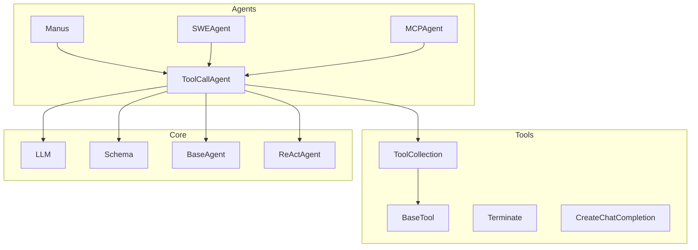
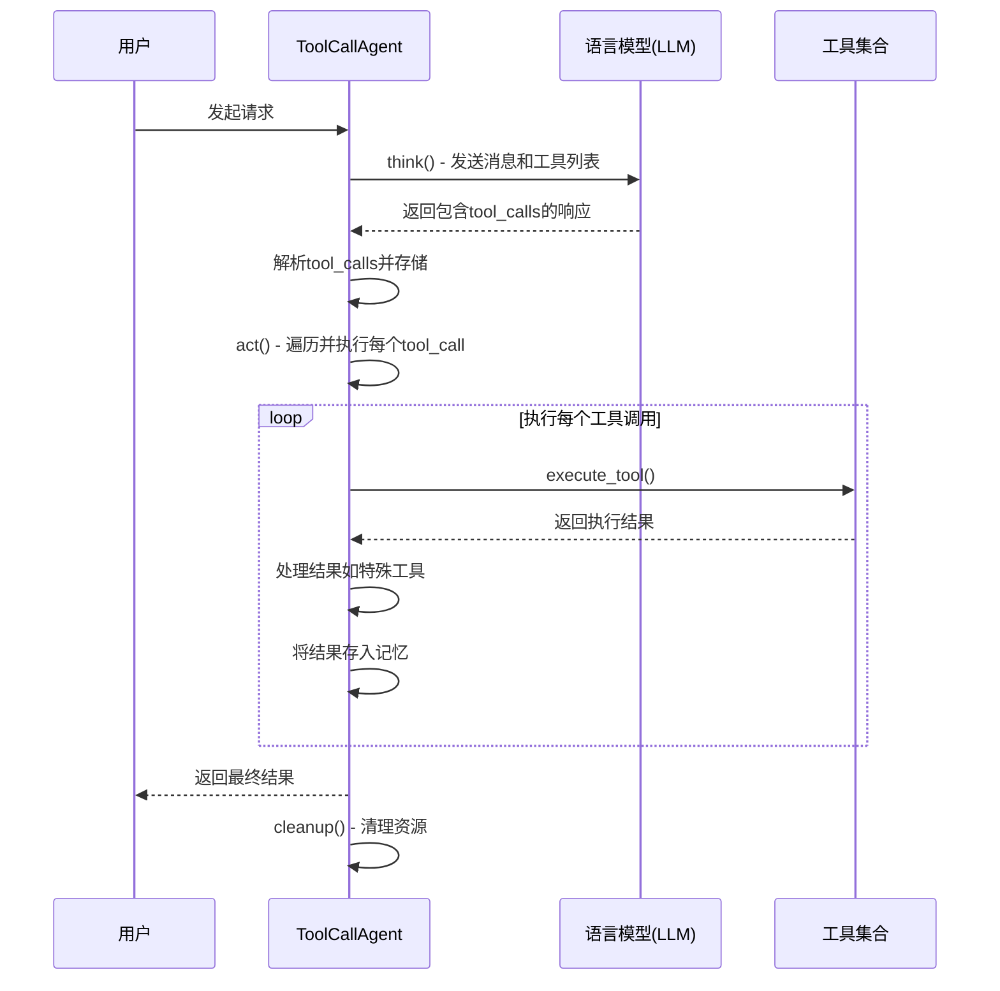
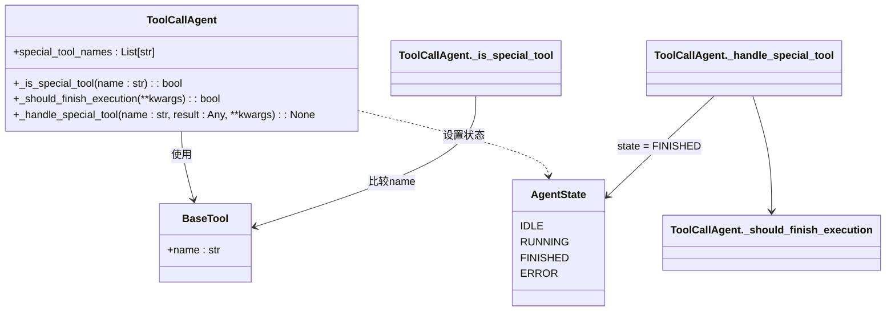
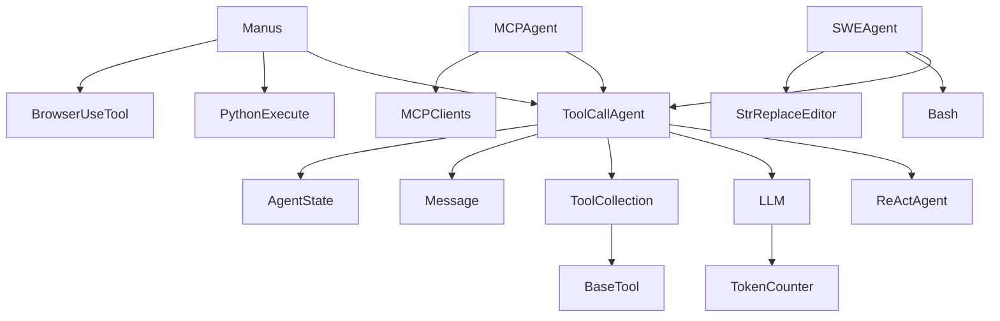

# ToolCallAgent基类

<cite>
**Referenced Files in This Document**   
- [toolcall.py](file://app/agent/toolcall.py)
- [react.py](file://app/agent/react.py)
- [base.py](file://app/agent/base.py)
- [tool_collection.py](file://app/tool/tool_collection.py)
- [schema.py](file://app/schema.py)
- [llm.py](file://app/llm.py)
- [base.py](file://app/tool/base.py)
- [terminate.py](file://app/tool/terminate.py)
- [create_chat_completion.py](file://app/tool/create_chat_completion.py)
- [manus.py](file://app/agent/manus.py)
- [swe.py](file://app/agent/swe.py)
- [mcp.py](file://app/agent/mcp.py)
</cite>

## 目录
1. [简介](#简介)
2. [项目结构](#项目结构)
3. [核心组件](#核心组件)
4. [架构概述](#架构概述)
5. [详细组件分析](#详细组件分析)
6. [依赖分析](#依赖分析)
7. [性能考虑](#性能考虑)
8. [故障排除指南](#故障排除指南)
9. [结论](#结论)

## 简介
ToolCallAgent是OpenManus框架中所有工具调用型代理的共同基类，它继承自ReActAgent，实现了增强的思考-行动循环（think-act loop），专门用于支持结构化的工具调用。该基类为各种具体代理（如Manus、SWEAgent、MCPAgent等）提供了统一的工具调用机制和生命周期管理。

## 项目结构
项目结构清晰地展示了ToolCallAgent在整体架构中的位置。它位于`app/agent/`目录下，与具体的代理实现（如`manus.py`、`swe.py`）并列。其核心功能依赖于`app/tool/`目录下的工具集合（ToolCollection）和基础工具（BaseTool），并通过`app/llm.py`与语言模型进行交互。



**Diagram sources**
- [toolcall.py](file://app/agent/toolcall.py#L17-L249)
- [react.py](file://app/agent/react.py#L10-L37)
- [base.py](file://app/agent/base.py#L12-L195)
- [tool_collection.py](file://app/tool/tool_collection.py#L8-L70)
- [base.py](file://app/tool/base.py#L77-L172)
- [llm.py](file://app/llm.py#L173-L765)

**Section sources**
- [toolcall.py](file://app/agent/toolcall.py#L17-L249)
- [react.py](file://app/agent/react.py#L10-L37)
- [base.py](file://app/agent/base.py#L12-L195)
- [tool_collection.py](file://app/tool/tool_collection.py#L8-L70)
- [base.py](file://app/tool/base.py#L77-L172)
- [llm.py](file://app/llm.py#L173-L765)

## 核心组件
ToolCallAgent的核心组件包括其继承自ReActAgent的思考-行动循环、用于管理可用工具的`available_tools`集合、用于处理特殊工具的`special_tool_names`机制，以及用于资源清理的`cleanup`方法。

**Section sources**
- [toolcall.py](file://app/agent/toolcall.py#L17-L249)

## 架构概述
ToolCallAgent的架构基于ReAct模式，通过`think()`方法生成工具调用请求，通过`act()`方法执行这些调用，并通过`run()`方法协调整个生命周期。其架构的关键在于将工具调用无缝集成到代理的决策流程中。



**Diagram sources**
- [toolcall.py](file://app/agent/toolcall.py#L38-L128)
- [toolcall.py](file://app/agent/toolcall.py#L130-L163)
- [toolcall.py](file://app/agent/toolcall.py#L165-L207)
- [toolcall.py](file://app/agent/toolcall.py#L228-L242)
- [llm.py](file://app/llm.py#L643-L765)

## 详细组件分析

### think()方法分析
`think()`方法负责与语言模型交互，生成工具调用请求。它首先将当前状态（包括系统提示、用户请求和历史消息）发送给LLM，并附上可用工具的列表。

```mermaid
flowchart TD
A[开始think()] --> B{next_step_prompt存在?}
B --> |是| C[添加用户消息]
B --> |否| D[跳过]
C --> E[调用llm.ask_tool()]
D --> E
E --> F{捕获异常?}
F --> |是| G{异常是TokenLimitExceeded?}
G --> |是| H[设置状态为FINISHED]
G --> |否| I[重新抛出异常]
F --> |否| J[处理响应]
J --> K{响应为空?}
K --> |是| L[抛出RuntimeError]
K --> |否| M[提取tool_calls和content]
M --> N{处理不同tool_choices模式}
N --> O[创建并添加助手消息]
O --> P[返回是否需要执行]
```

**Diagram sources**
- [toolcall.py](file://app/agent/toolcall.py#L38-L128)
- [llm.py](file://app/llm.py#L643-L765)
- [exceptions.py](file://app/exceptions.py#L11-L12)

**Section sources**
- [toolcall.py](file://app/agent/toolcall.py#L38-L128)

### act()方法分析
`act()`方法负责执行`think()`方法生成的`tool_calls`。它遍历每个调用，通过`execute_tool()`方法执行，并将结果存入代理的记忆中。

```mermaid
flowchart TD
A[开始act()] --> B{tool_calls为空?}
B --> |是| C{tool_choices为REQUIRED?}
C --> |是| D[抛出ValueError]
C --> |否| E[返回最后一条消息内容]
B --> |否| F[初始化结果列表]
F --> G[遍历每个command]
G --> H[重置_current_base64_image]
H --> I[调用execute_tool(command)]
I --> J{max_observe存在?}
J --> |是| K[截断结果]
J --> |否| L[保持原样]
K --> M[记录日志]
L --> M
M --> N[创建tool_message]
N --> O[添加到memory]
O --> P[添加到results]
P --> Q{遍历完成?}
Q --> |否| G
Q --> |是| R[用换行符连接结果]
R --> S[返回结果]
```

**Diagram sources**
- [toolcall.py](file://app/agent/toolcall.py#L130-L163)
- [toolcall.py](file://app/agent/toolcall.py#L165-L207)
- [schema.py](file://app/schema.py#L118-L128)

**Section sources**
- [toolcall.py](file://app/agent/toolcall.py#L130-L163)

### execute_tool()方法分析
`execute_tool()`方法是执行单个工具调用的核心。它负责解析参数、查找并执行工具、处理特殊工具，并格式化结果。

```mermaid
flowchart TD
A[开始execute_tool()] --> B{command有效?}
B --> |否| C[返回错误]
B --> |是| D[获取工具名name]
D --> E{name在available_tools中?}
E --> |否| F[返回未知工具错误]
E --> |是| G[解析JSON参数]
G --> H[执行工具]
H --> I{是特殊工具?}
I --> |是| J[调用_handle_special_tool()]
I --> |否| K[跳过]
J --> L{结果有base64_image?}
K --> L
L --> |是| M[存储到_current_base64_image]
L --> |否| N[跳过]
M --> O[格式化观察结果]
N --> O
O --> P[返回结果]
P --> Q{JSON解析错误?}
Q --> |是| R[记录错误并返回]
Q --> |否| S{其他异常?}
S --> |是| T[记录异常并返回]
S --> |否| U[正常返回]
```

**Diagram sources**
- [toolcall.py](file://app/agent/toolcall.py#L165-L207)
- [tool_collection.py](file://app/tool/tool_collection.py#L24-L34)
- [base.py](file://app/tool/base.py#L120-L121)

**Section sources**
- [toolcall.py](file://app/agent/toolcall.py#L165-L207)

### _special_tool_names机制分析
`_special_tool_names`机制用于识别需要触发代理状态转换的特殊工具（如`terminate`）。当`_handle_special_tool()`被调用时，它会检查工具名是否在`special_tool_names`列表中。



**Diagram sources**
- [toolcall.py](file://app/agent/toolcall.py#L224-L226)
- [toolcall.py](file://app/agent/toolcall.py#L220-L222)
- [toolcall.py](file://app/agent/toolcall.py#L209-L217)
- [terminate.py](file://app/tool/terminate.py#L8-L8)

**Section sources**
- [toolcall.py](file://app/agent/toolcall.py#L209-L217)

### cleanup()方法分析
`cleanup()`方法负责在代理运行结束后清理其使用的资源。它会遍历`available_tools`中的所有工具实例，并异步调用其`cleanup()`方法。

```mermaid
flowchart TD
A[开始cleanup()] --> B[记录日志]
B --> C[遍历available_tools.tool_map]
C --> D{工具有cleanup方法且为协程?}
D --> |是| E[尝试调用cleanup()]
D --> |否| F[跳过]
E --> G{调用成功?}
G --> |是| H[继续]
G --> |否| I[记录错误]
H --> J{遍历完成?}
I --> J
J --> |否| C
J --> |是| K[记录完成日志]
K --> L[结束]
```

**Diagram sources**
- [toolcall.py](file://app/agent/toolcall.py#L228-L242)
- [tool_collection.py](file://app/tool/tool_collection.py#L16-L16)

**Section sources**
- [toolcall.py](file://app/agent/toolcall.py#L228-L242)

## 依赖分析
ToolCallAgent的依赖关系复杂，它直接依赖于`ReActAgent`、`LLM`、`ToolCollection`和`Message`等核心组件。其子类（如`Manus`）通过扩展`available_tools`来增加功能。



**Diagram sources**
- [toolcall.py](file://app/agent/toolcall.py#L17-L249)
- [manus.py](file://app/agent/manus.py#L17-L164)
- [swe.py](file://app/agent/swe.py#L9-L23)
- [mcp.py](file://app/agent/mcp.py#L12-L184)
- [tool_collection.py](file://app/tool/tool_collection.py#L8-L70)
- [base.py](file://app/tool/base.py#L77-L172)

**Section sources**
- [toolcall.py](file://app/agent/toolcall.py#L17-L249)
- [manus.py](file://app/agent/manus.py#L17-L164)
- [swe.py](file://app/agent/swe.py#L9-L23)
- [mcp.py](file://app/agent/mcp.py#L12-L184)

## 性能考虑
ToolCallAgent的性能主要受LLM调用和工具执行的影响。`max_steps`和`max_observe`字段用于限制代理的执行步数和观察结果的长度，防止无限循环和过长的输出。`TokenLimitExceeded`异常的捕获机制确保了在达到token限制时能优雅地终止。

## 故障排除指南
常见问题包括工具调用失败、token限制错误和特殊工具未触发状态转换。应检查`available_tools`中是否包含所需工具，确认LLM配置中的`max_input_tokens`设置，以及`special_tool_names`列表是否正确配置。

**Section sources**
- [toolcall.py](file://app/agent/toolcall.py#L38-L128)
- [toolcall.py](file://app/agent/toolcall.py#L165-L207)
- [llm.py](file://app/llm.py#L248-L253)
- [toolcall.py](file://app/agent/toolcall.py#L30-L30)

## 结论
ToolCallAgent作为OpenManus框架中所有工具调用型代理的基类，成功地将ReAct模式与结构化工具调用相结合。它通过清晰的`think-act`循环、灵活的工具管理机制和健壮的错误处理，为构建复杂的AI代理提供了坚实的基础。其设计模式体现了高内聚、低耦合的原则，便于子类进行扩展和定制。