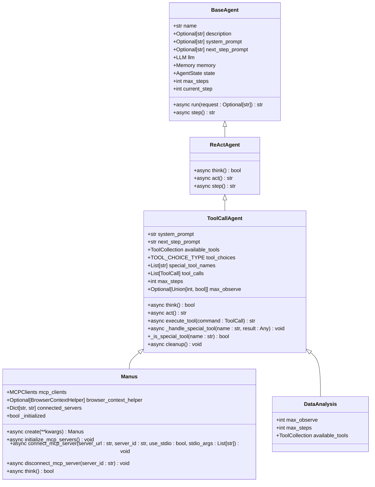
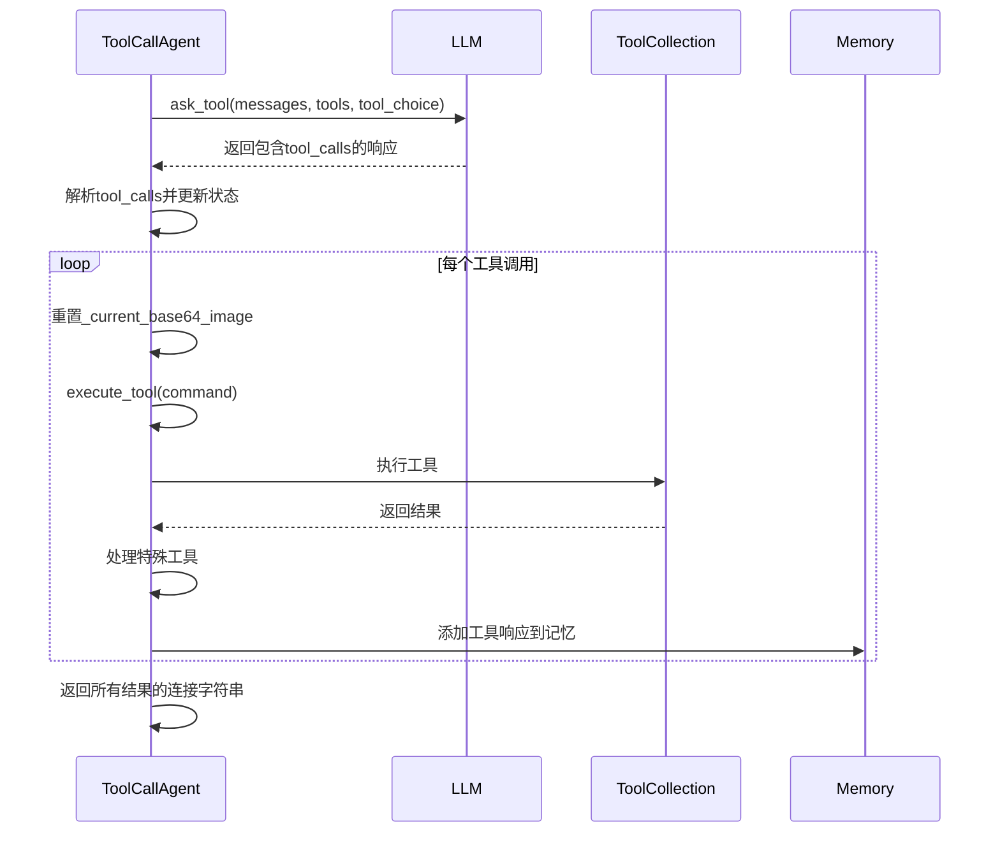
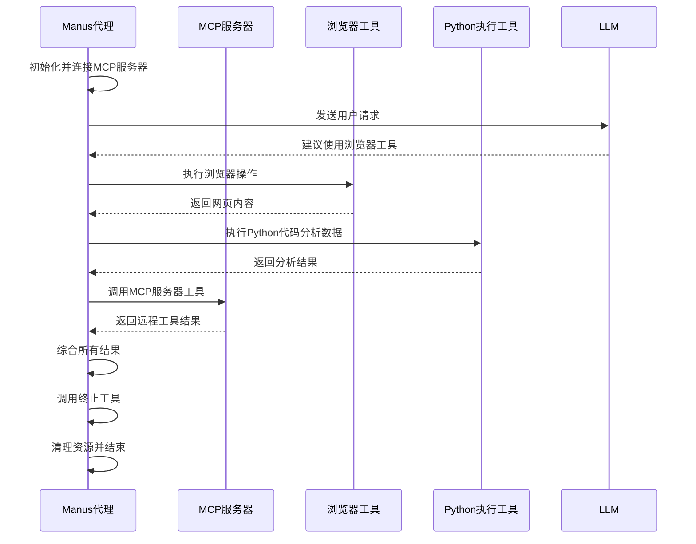
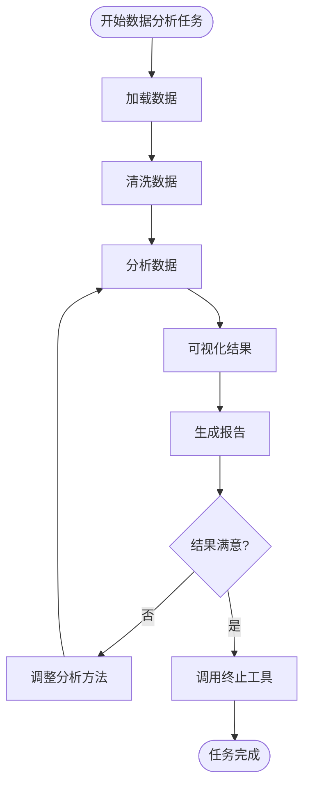
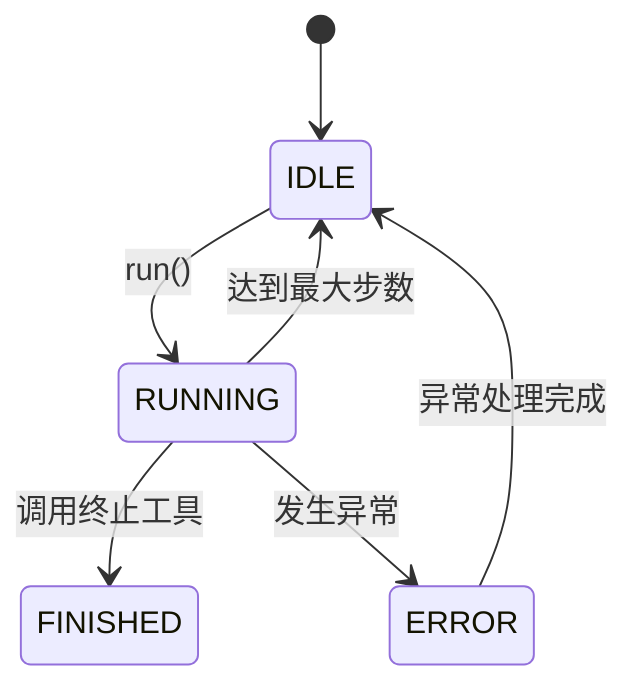
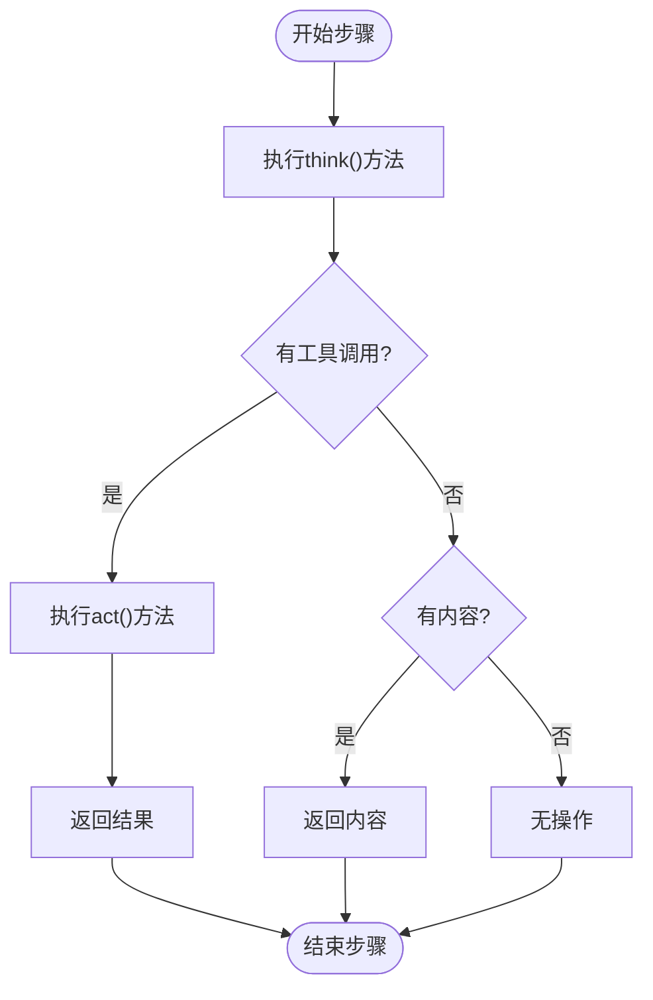
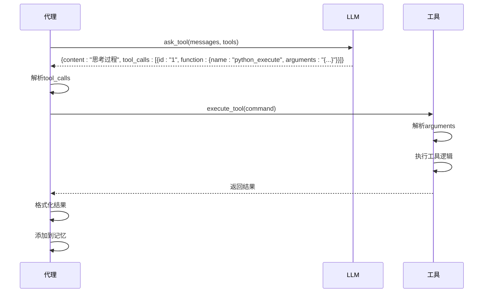

# 代理系统

<cite>
**本文档中引用的文件**  
- [ToolCallAgent](file://app/agent/toolcall.py#L17-L249)
- [Manus](file://app/agent/manus.py#L17-L164)
- [DataAnalysis](file://app/agent/data_analysis.py#L11-L36)
- [ReActAgent](file://app/agent/react.py#L10-L37)
- [BaseAgent](file://app/agent/base.py#L1-L196)
- [ToolCollection](file://app/tool/tool_collection.py#L1-L71)
- [Message](file://app/schema.py#L1-L187)
- [BaseTool](file://app/tool/base.py#L1-L181)
- [SYSTEM_PROMPT](file://app/prompt/toolcall.py#L1)
- [manus.py](file://app/prompt/manus.py#L1)
- [visualization.py](file://app/prompt/visualization.py#L1)
</cite>

## 目录
1. [引言](#引言)
2. [代理架构设计](#代理架构设计)
3. [核心基类：ToolCallAgent](#核心基类toolcallagent)
4. [Manus代理实现](#manus代理实现)
5. [数据分析代理实现](#数据分析代理实现)
6. [代理状态管理与记忆机制](#代理状态管理与记忆机制)
7. [思考-行动循环（Think-Act Loop）](#思考-行动循环think-act-loop)
8. [LLM交互与工具调用解析](#llm交互与工具调用解析)
9. [不同代理类型的配置与适用场景](#不同代理类型的配置与适用场景)
10. [实际使用案例](#实际使用案例)

## 引言
OpenManus中的代理（Agent）系统是一个基于工具调用（Tool Call）的智能体框架，旨在通过与大型语言模型（LLM）的交互来完成复杂任务。该系统采用分层架构，以`ToolCallAgent`作为核心基类，支持多种专用代理类型，如通用任务代理`Manus`和数据分析代理`DataAnalysis`。代理系统通过"思考-行动"循环机制，结合状态管理和记忆功能，实现对工具的智能调度和任务的自主执行。本文档将深入解析该系统的架构设计与实现机制。

## 代理架构设计
OpenManus的代理系统采用分层继承架构，从基础的`BaseAgent`到功能丰富的`ToolCallAgent`，再到具体的代理实现类，形成了清晰的层次结构。`BaseAgent`定义了代理的基本属性和状态管理，`ReActAgent`引入了"思考-行动"循环模式，`ToolCallAgent`在此基础上扩展了工具调用能力，而`Manus`和`DataAnalysis`等具体代理则通过继承`ToolCallAgent`来实现特定领域的功能。



**图源**
- [BaseAgent](file://app/agent/base.py#L1-L196)
- [ReActAgent](file://app/agent/react.py#L10-L37)
- [ToolCallAgent](file://app/agent/toolcall.py#L17-L249)
- [Manus](file://app/agent/manus.py#L17-L164)
- [DataAnalysis](file://app/agent/data_analysis.py#L11-L36)

## 核心基类：ToolCallAgent
`ToolCallAgent`是OpenManus中所有工具调用代理的基类，继承自`ReActAgent`，提供了处理工具/函数调用的核心抽象能力。该类通过`available_tools`字段定义可用工具集合，使用`ToolCollection`类进行管理，并通过`tool_choices`字段控制工具调用策略。

`ToolCallAgent`的核心功能包括：
- **系统提示词管理**：通过`system_prompt`和`next_step_prompt`字段定义代理的行为准则和下一步行动提示。
- **工具调用执行**：`execute_tool`方法负责执行单个工具调用，包含参数解析、错误处理和结果格式化。
- **特殊工具处理**：`_handle_special_tool`方法用于处理特殊工具（如终止工具），可改变代理状态。
- **资源清理**：`cleanup`方法确保代理使用的工具资源在运行结束后被正确释放。



**图源**
- [ToolCallAgent](file://app/agent/toolcall.py#L17-L249)
- [ToolCollection](file://app/tool/tool_collection.py#L1-L71)
- [Message](file://app/schema.py#L1-L187)

**本节来源**
- [ToolCallAgent](file://app/agent/toolcall.py#L17-L249)
- [ToolCollection](file://app/tool/tool_collection.py#L1-L71)

## Manus代理实现
`Manus`代理是`ToolCallAgent`的一个具体实现，代表一个多功能通用代理，能够解决各种任务。它通过继承`ToolCallAgent`并扩展功能来支持本地工具和MCP（Model Control Protocol）工具。

`Manus`代理的关键特性包括：
- **丰富的工具集**：集成了Python执行、浏览器自动化、文件编辑、人工询问和终止等工具。
- **MCP服务器连接**：通过`mcp_clients`字段管理与MCP服务器的连接，支持SSE和STDIO两种连接方式。
- **浏览器上下文管理**：使用`BrowserContextHelper`辅助类管理浏览器会话状态。
- **异步初始化**：通过`create`类方法实现异步初始化，确保MCP服务器连接在代理创建时完成。

`Manus`代理的`think`方法经过重写，能够在检测到浏览器工具使用时动态调整`next_step_prompt`，以提供更合适的上下文提示。



**图源**
- [Manus](file://app/agent/manus.py#L17-L164)
- [ToolCallAgent](file://app/agent/toolcall.py#L17-L249)

**本节来源**
- [Manus](file://app/agent/manus.py#L17-L164)

## 数据分析代理实现
`DataAnalysis`代理是专门为数据分析任务设计的`ToolCallAgent`实现。它继承了`ToolCallAgent`的所有功能，并配置了适合数据分析的工具集和参数。

该代理的主要特点包括：
- **数据分析工具集**：包含`NormalPythonExecute`（用于执行Python代码）、`VisualizationPrepare`（用于准备可视化）、`DataVisualization`（用于数据可视化）和`Terminate`（用于终止任务）。
- **增强的观察限制**：`max_observe`设置为15000，允许处理更长的输出结果。
- **专用系统提示**：使用来自`app/prompt/visualization.py`的系统提示，针对数据分析任务进行了优化。

`DataAnalysis`代理的设计使其能够处理从数据加载、清洗、分析到可视化的完整数据科学工作流程。



**图源**
- [DataAnalysis](file://app/agent/data_analysis.py#L11-L36)

**本节来源**
- [DataAnalysis](file://app/agent/data_analysis.py#L11-L36)

## 代理状态管理与记忆机制
OpenManus代理系统通过`AgentState`枚举和`Memory`类实现状态管理和记忆功能。`AgentState`定义了代理的四种状态：`IDLE`（空闲）、`RUNNING`（运行中）、`FINISHED`（已完成）和`ERROR`（错误）。

状态转换通过`state_context`上下文管理器安全地进行，确保状态转换的原子性和异常处理。当发生异常时，代理状态会自动转换为`ERROR`；当任务完成时，状态转换为`FINISHED`。

记忆机制由`Memory`类实现，它维护一个消息列表，记录代理与LLM之间的完整对话历史。每条消息包含角色、内容、工具调用等信息。`Memory`类还提供了添加消息、获取最近消息和清除记忆等方法。

代理还实现了防卡死机制，通过`is_stuck`方法检测是否陷入重复响应的循环。如果连续`duplicate_threshold`次（默认为2次）收到相同内容的响应，代理会认为自己陷入困境，并通过`handle_stuck_state`方法添加提示以改变策略。



**图源**
- [BaseAgent](file://app/agent/base.py#L1-L196)
- [schema.py](file://app/schema.py#L1-L187)

**本节来源**
- [BaseAgent](file://app/agent/base.py#L1-L196)
- [schema.py](file://app/schema.py#L1-L187)

## 思考-行动循环（Think-Act Loop）
`ToolCallAgent`的"思考-行动"循环是其核心工作机制，由`think`和`act`两个异步方法组成。这个循环在`ReActAgent`的`step`方法中被调用，形成代理的执行主循环。

**思考阶段（think）**：
1. 向LLM发送当前消息历史，请求工具调用建议
2. 解析LLM的响应，提取`tool_calls`
3. 根据`tool_choices`模式处理不同情况：
   - `NONE`：不允许使用工具
   - `AUTO`：自动选择是否使用工具
   - `REQUIRED`：必须使用工具
4. 将LLM的响应和工具调用添加到记忆中

**行动阶段（act）**：
1. 遍历所有`tool_calls`，逐个执行
2. 调用`execute_tool`方法执行每个工具
3. 处理特殊工具（如终止工具）
4. 将工具执行结果添加到记忆中
5. 返回所有结果的连接字符串

这个循环持续执行，直到代理状态变为`FINISHED`或达到`max_steps`限制。



**图源**
- [ToolCallAgent](file://app/agent/toolcall.py#L17-L249)

**本节来源**
- [ToolCallAgent](file://app/agent/toolcall.py#L17-L249)

## LLM交互与工具调用解析
代理与LLM的交互主要通过`llm.ask_tool`方法实现。该方法向LLM发送包含可用工具列表的请求，让LLM决定是否以及如何使用这些工具。

工具调用解析过程如下：
1. LLM返回包含`tool_calls`的响应
2. `think`方法解析`tool_calls`，每个调用包含`id`、`type`和`function`（含`name`和`arguments`）
3. `act`方法遍历`tool_calls`，对每个调用：
   - 验证工具名称是否在`available_tools`中
   - 使用`json.loads`解析`arguments`字符串为字典
   - 调用`available_tools.execute`执行工具
   - 处理执行结果，包括可能的`base64_image`

错误处理是该过程的重要部分。`execute_tool`方法捕获`JSONDecodeError`（参数解析错误）和其他异常，并返回格式化的错误信息，这些信息会被添加到代理的记忆中，供后续步骤参考。



**图源**
- [ToolCallAgent](file://app/agent/toolcall.py#L17-L249)
- [llm.py](file://app/llm.py#L1-L766)

**本节来源**
- [ToolCallAgent](file://app/agent/toolcall.py#L17-L249)
- [llm.py](file://app/llm.py#L1-L766)

## 不同代理类型的配置与适用场景
OpenManus提供了多种代理类型，每种都有其特定的配置和适用场景。

**Manus代理**：
- **系统提示词**：来自`app/prompt/manus.py`，强调其全能性
- **可用工具集**：Python执行、浏览器自动化、文件编辑、人工询问、终止
- **特殊工具**：`terminate`
- **适用场景**：通用任务处理，如网络浏览、文件操作、编程问题解决

**数据分析代理**：
- **系统提示词**：来自`app/prompt/visualization.py`，专注于数据处理
- **可用工具集**：Python执行、可视化准备、数据可视化、终止
- **特殊工具**：`terminate`
- **适用场景**：数据分析、数据可视化、报告生成

**配置方式**：
代理的配置主要通过类属性实现，包括：
- `system_prompt`：定义代理的角色和能力
- `available_tools`：定义可用工具集合
- `tool_choices`：定义工具调用策略
- `max_steps`和`max_observe`：定义执行限制

这些配置在代理类定义时静态设置，确保了配置的一致性和可预测性。

**本节来源**
- [Manus](file://app/agent/manus.py#L17-L164)
- [DataAnalysis](file://app/agent/data_analysis.py#L11-L36)
- [manus.py](file://app/prompt/manus.py#L1)
- [visualization.py](file://app/prompt/visualization.py#L1)

## 实际使用案例
以下是如何实例化和运行`Manus`代理的示例：

```python
# 创建Manus代理实例
manus = await Manus.create()

# 运行代理处理请求
result = await manus.run("请帮我分析这个网站的内容并总结")

# 代理将自动执行以下步骤：
# 1. 调用浏览器工具访问网站
# 2. 提取网页内容
# 3. 使用Python工具分析内容
# 4. 生成总结报告
# 5. 调用终止工具结束任务
```

对于数据分析任务：

```python
# 创建数据分析代理实例
data_analysis = DataAnalysis()

# 运行数据分析任务
result = await data_analysis.run("请分析data.csv文件并生成可视化图表")
```

在A2A协议集成中，`Manus`代理可以通过A2A客户端接收任务，如文档中所示的"什么是快乐星球"示例，展示了代理如何通过思考和行动循环完成任务并返回结果。

**本节来源**
- [Manus](file://app/agent/manus.py#L17-L164)
- [DataAnalysis](file://app/agent/data_analysis.py#L11-L36)
- [protocol/a2a/app/README_zh.md](file://protocol/a2a/app/README_zh.md#L0-L194)