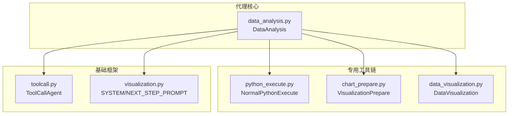
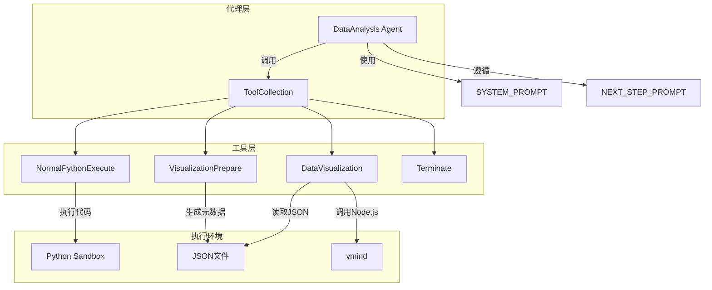
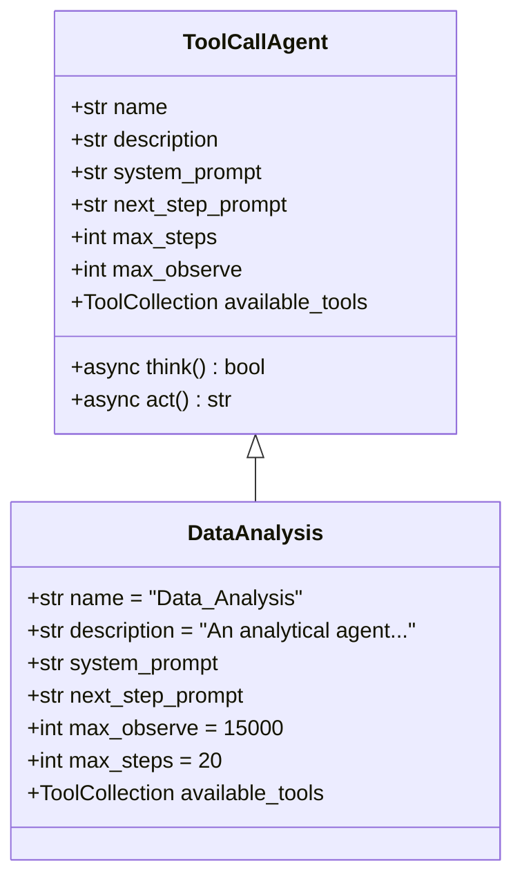
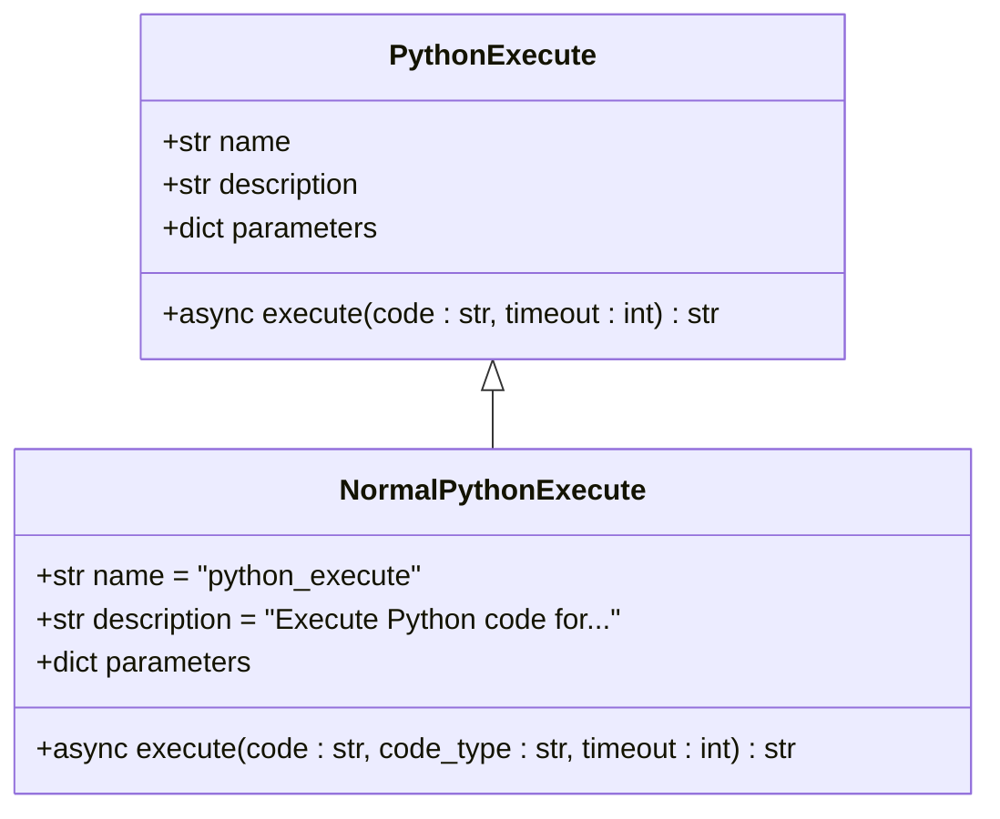
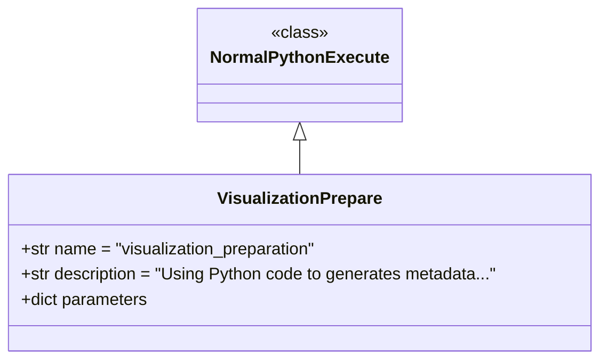
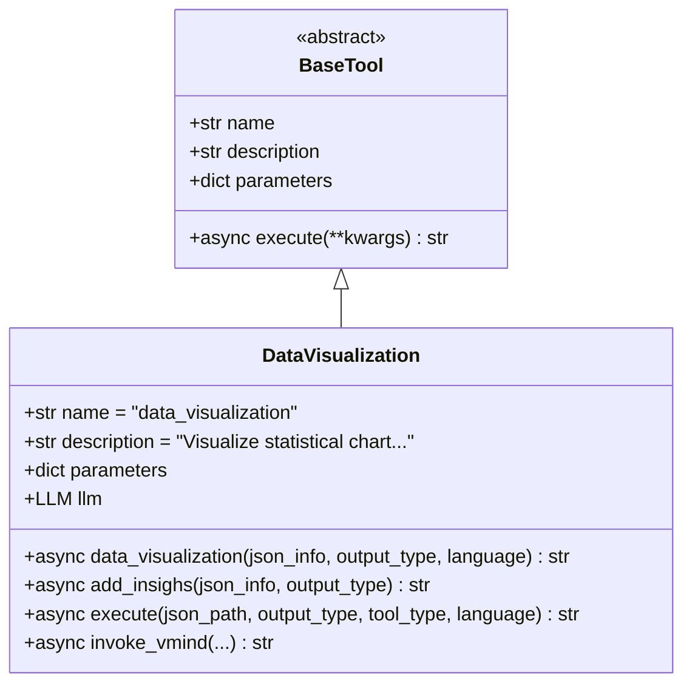
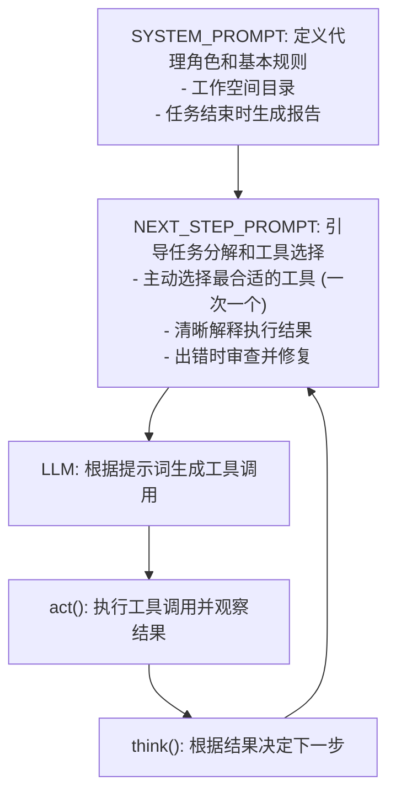

# 数据分析代理

<cite>
**本文档引用文件**  
- [data_analysis.py](file://app/agent/data_analysis.py)
- [python_execute.py](file://app/tool/chart_visualization/python_execute.py)
- [chart_prepare.py](file://app/tool/chart_visualization/chart_prepare.py)
- [data_visualization.py](file://app/tool/chart_visualization/data_visualization.py)
- [visualization.py](file://app/prompt/visualization.py)
- [toolcall.py](file://app/agent/toolcall.py)
</cite>

## 目录
1. [简介](#简介)
2. [项目结构](#项目结构)
3. [核心组件](#核心组件)
4. [架构概述](#架构概述)
5. [详细组件分析](#详细组件分析)
6. [依赖分析](#依赖分析)
7. [性能考量](#性能考量)
8. [故障排除指南](#故障排除指南)
9. [结论](#结论)

## 简介
数据分析代理是一个专为数据科学任务设计的智能代理，基于通用的工具调用机制构建，集成了Python执行、数据可视化准备和图表生成三大核心能力。该代理能够接收原始数据输入，通过编写和执行Python代码进行深度分析，生成交互式图表，并最终输出结构化的分析报告。其设计目标是实现从数据探索到可视化呈现再到报告撰写的完整闭环，特别适用于需要复杂数据处理和多步骤推理的场景。

## 项目结构
数据分析代理的实现分布在多个模块中，形成了清晰的分层架构。核心代理类位于`app/agent/`目录下，而其依赖的专用工具链则封装在`app/tool/chart_visualization/`子包中。提示词模板独立存放在`app/prompt/`目录，确保了行为逻辑与交互策略的解耦。



**图示来源**  
- [data_analysis.py](file://app/agent/data_analysis.py)
- [python_execute.py](file://app/tool/chart_visualization/python_execute.py)
- [chart_prepare.py](file://app/tool/chart_visualization/chart_prepare.py)
- [data_visualization.py](file://app/tool/chart_visualization/data_visualization.py)
- [visualization.py](file://app/prompt/visualization.py)
- [toolcall.py](file://app/agent/toolcall.py)

**本节来源**  
- [data_analysis.py](file://app/agent/data_analysis.py)
- [toolcall.py](file://app/agent/toolcall.py)

## 核心组件
数据分析代理的核心在于其继承自`ToolCallAgent`的`DataAnalysis`类，该类通过组合三个专用工具——`NormalPythonExecute`、`VisualizationPrepare`和`DataVisualization`——构建了一个强大的数据处理流水线。代理通过`SYSTEM_PROMPT`和`NEXT_STEP_PROMPT`引导大语言模型（LLM）进行任务分解和工具选择，利用15000字符的观察窗口和20步执行限制来平衡任务复杂度与系统资源消耗。

**本节来源**  
- [data_analysis.py](file://app/agent/data_analysis.py#L11-L36)
- [visualization.py](file://app/prompt/visualization.py)

## 架构概述
数据分析代理采用分层架构，上层为代理控制器，下层为专用工具集。代理控制器负责整体流程的调度和状态管理，而各个工具则专注于特定的子任务。这种设计实现了关注点分离，使得每个组件的职责清晰，易于维护和扩展。



**图示来源**  
- [data_analysis.py](file://app/agent/data_analysis.py)
- [python_execute.py](file://app/tool/chart_visualization/python_execute.py)
- [chart_prepare.py](file://app/tool/chart_visualization/chart_prepare.py)
- [data_visualization.py](file://app/tool/chart_visualization/data_visualization.py)

## 详细组件分析
### DataAnalysis 代理分析
`DataAnalysis`类是整个系统的入口和控制中心。它通过继承`ToolCallAgent`获得了基本的工具调用和状态管理能力，并通过重写关键属性和字段，将其特化为一个专注于数据分析的专用代理。

#### 类定义与继承关系


**图示来源**  
- [data_analysis.py](file://app/agent/data_analysis.py#L11-L36)
- [toolcall.py](file://app/agent/toolcall.py#L17-L249)

#### 核心配置参数
`DataAnalysis`代理的关键配置参数定义了其行为边界和资源限制。

| 参数 | 值 | 说明 |
| :--- | :--- | :--- |
| `name` | `"Data_Analysis"` | 代理的唯一标识名称 |
| `description` | "An analytical agent..." | 代理的功能描述 |
| `max_observe` | `15000` | 每次工具调用结果的观察窗口大小（字符数），防止过长的输出影响上下文 |
| `max_steps` | `20` | 代理执行的最大步数，防止无限循环，平衡复杂任务与资源消耗 |

**本节来源**  
- [data_analysis.py](file://app/agent/data_analysis.py#L11-L36)

### 专用工具链分析
数据分析代理的强大功能源于其精心设计的工具链。每个工具都承担着特定的角色，共同协作完成复杂的分析任务。

#### NormalPythonExecute 工具
`NormalPythonExecute`工具是进行通用Python代码执行的基础。它允许代理执行数据处理、生成报告等不直接涉及可视化的任务。



**图示来源**  
- [python_execute.py](file://app/tool/chart_visualization/python_execute.py#L4-L35)

#### VisualizationPrepare 工具
`VisualizationPrepare`工具是连接数据分析与可视化的桥梁。它负责生成`DataVisualization`工具所需的元数据。



**图示来源**  
- [chart_prepare.py](file://app/tool/chart_visualization/chart_prepare.py#L3-L37)

#### DataVisualization 工具
`DataVisualization`工具是整个流程的终点，负责将元数据转化为最终的图表。



**图示来源**  
- [data_visualization.py](file://app/tool/chart_visualization/data_visualization.py#L14-L262)

### 提示词系统分析
代理的行为由两个核心提示词引导：`SYSTEM_PROMPT`和`NEXT_STEP_PROMPT`。



**图示来源**  
- [visualization.py](file://app/prompt/visualization.py)

**本节来源**  
- [data_analysis.py](file://app/agent/data_analysis.py)
- [visualization.py](file://app/prompt/visualization.py)

## 依赖分析
数据分析代理的依赖关系清晰地展示了其模块化设计。

```mermaid
graph TD
DA[DataAnalysis] --> TC[ToolCallAgent]
DA --> SP[SYSTEM_PROMPT]
DA --> NSP[NEXT_STEP_PROMPT]
DA --> NPE[NormalPythonExecute]
DA --> VP[VisualizationPrepare]
DA --> DV[DataVisualization]
DA --> TERM[Terminate]
VP --> NPE
DV --> LLM[LLM]
DV --> VM[vmind (Node.js)]
```

**图示来源**  
- [data_analysis.py](file://app/agent/data_analysis.py)
- [python_execute.py](file://app/tool/chart_visualization/python_execute.py)
- [chart_prepare.py](file://app/tool/chart_visualization/chart_prepare.py)
- [data_visualization.py](file://app/tool/chart_visualization/data_visualization.py)

**本节来源**  
- [data_analysis.py](file://app/agent/data_analysis.py)

## 性能考量
`DataAnalysis`代理通过`max_observe`和`max_steps`两个参数对性能和资源消耗进行了精细控制。15000字符的观察窗口限制了每次工具调用返回结果的大小，防止过长的输出（如大型数据集的打印）淹没上下文，确保LLM能够聚焦于关键信息。20步的执行限制则为代理的推理过程设定了上限，有效防止了在复杂或模糊任务中可能出现的无限循环或低效探索，保证了系统的响应性和稳定性。

## 故障排除指南
当数据分析代理执行失败时，应首先检查工具调用的返回结果。`DataVisualization`工具的`execute`方法会捕获异常并返回详细的错误信息。对于`NormalPythonExecute`和`VisualizationPrepare`工具，错误通常源于Python代码的语法或逻辑问题，应检查生成的代码是否符合规范。此外，还需确认工作空间目录的读写权限以及Node.js环境（用于`vmind`）是否正确配置。

**本节来源**  
- [data_visualization.py](file://app/tool/chart_visualization/data_visualization.py#L14-L262)
- [python_execute.py](file://app/tool/chart_visualization/python_execute.py)

## 结论
数据分析代理通过继承`ToolCallAgent`并集成`NormalPythonExecute`、`VisualizationPrepare`和`DataVisualization`三大核心工具，成功构建了一个功能完备的数据分析闭环。其通过`SYSTEM_PROMPT`和`NEXT_STEP_PROMPT`实现了对LLM行为的有效引导，并通过`max_observe`和`max_steps`参数实现了对复杂任务与资源消耗的平衡。与通用的`Manus`代理相比，`DataAnalysis`代理在工具选择上更加专注和优化，其工具链专为数据科学工作流设计，执行上下文管理也更侧重于文件I/O和元数据传递，从而在特定领域内提供了更高效、更专业的解决方案。