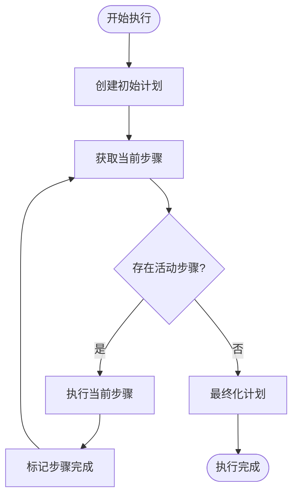

# 工作流管理系统

<cite>
**Referenced Files in This Document**   
- [run_flow.py](file://run_flow.py)
- [planning.py](file://app/flow/planning.py)
- [flow_factory.py](file://app/flow/flow_factory.py)
- [base.py](file://app/flow/base.py)
- [planning.py](file://app/tool/planning.py)
- [base.py](file://app/agent/base.py)
</cite>

## 目录
1. [简介](#简介)
2. [工作流系统架构](#工作流系统架构)
3. [核心组件分析](#核心组件分析)
4. [工作流创建与执行](#工作流创建与执行)
5. [多代理协作机制](#多代理协作机制)
6. [状态管理与进度跟踪](#状态管理与进度跟踪)
7. [入口点与执行监控](#入口点与执行监控)
8. [应用价值与实践指导](#应用价值与实践指导)

## 简介
OpenManus的工作流管理系统是一个先进的自动化框架，旨在协调多个智能代理完成复杂任务。该系统通过PlanningFlow实现任务分解、进度跟踪和结果聚合，利用工厂模式的FlowFactory创建不同类型的工作流实例。系统设计支持高级任务自动化和智能决策链，为开发者提供了构建复杂代理协作系统的理论基础和实践指导。

## 工作流系统架构

**Diagram sources**
- [run_flow.py](file://run_flow.py#L1-L53)
- [flow_factory.py](file://app/flow/flow_factory.py#L12-L29)
- [planning.py](file://app/flow/planning.py#L44-L441)
- [planning.py](file://app/tool/planning.py#L13-L362)
- [base.py](file://app/agent/base.py#L12-L195)

**Section sources**
- [run_flow.py](file://run_flow.py#L1-L53)
- [planning.py](file://app/flow/planning.py#L44-L441)

## 核心组件分析

### PlanningFlow组件
PlanningFlow是工作流管理系统的核心，负责协调多个代理完成复杂任务。它继承自BaseFlow，实现了任务分解、执行和状态管理的功能。

**Diagram sources**
- [planning.py](file://app/flow/planning.py#L44-L441)
- [base.py](file://app/flow/base.py#L8-L56)

### FlowFactory组件
FlowFactory采用工厂模式创建不同类型的工作流实例，支持系统的可扩展性和灵活性。

**Diagram sources**
- [flow_factory.py](file://app/flow/flow_factory.py#L12-L29)
- [planning.py](file://app/flow/planning.py#L44-L441)

**Section sources**
- [flow_factory.py](file://app/flow/flow_factory.py#L12-L29)

## 工作流创建与执行

### 工作流创建过程
工作流的创建始于FlowFactory的create_flow方法，该方法根据指定的FlowType创建相应的工作流实例。

**Diagram sources**
- [flow_factory.py](file://app/flow/flow_factory.py#L12-L29)
- [planning.py](file://app/flow/planning.py#L53-L74)

### 工作流执行流程
工作流的执行是一个循环过程，包括创建初始计划、获取当前步骤、执行步骤和最终化计划。

**Diagram sources**
- [planning.py](file://app/flow/planning.py#L93-L133)
- [planning.py](file://app/flow/planning.py#L212-L274)
- [planning.py](file://app/flow/planning.py#L276-L303)

**Section sources**
- [planning.py](file://app/flow/planning.py#L93-L133)

## 多代理协作机制

### 任务分解与代理选择
PlanningFlow通过get_executor方法为不同类型的步骤选择合适的执行代理，实现智能的任务分配。

**Diagram sources**
- [planning.py](file://app/flow/planning.py#L76-L91)

### 步骤执行与上下文管理
在执行步骤时，系统会为代理提供当前计划状态的完整上下文，确保代理能够基于最新信息做出决策。

**Diagram sources**
- [planning.py](file://app/flow/planning.py#L276-L303)
- [base.py](file://app/agent/base.py#L115-L153)

**Section sources**
- [planning.py](file://app/flow/planning.py#L276-L303)

## 状态管理与进度跟踪

### 计划状态管理
PlanningTool负责管理计划的整个生命周期，包括创建、更新、获取和删除计划。

**Diagram sources**
- [planning.py](file://app/tool/planning.py#L13-L362)

### 步骤状态跟踪
系统通过多种状态来跟踪每个步骤的执行进度，确保任务的有序完成。

**Diagram sources**
- [planning.py](file://app/flow/planning.py#L53-L74)
- [planning.py](file://app/tool/planning.py#L13-L362)

**Section sources**
- [planning.py](file://app/flow/planning.py#L53-L74)

## 入口点与执行监控

### run_flow.py入口点
run_flow.py作为系统的入口点，负责初始化代理、创建工作流并启动执行过程。

**Diagram sources**
- [run_flow.py](file://run_flow.py#L1-L53)

**Section sources**
- [run_flow.py](file://run_flow.py#L1-L53)

### 执行监控与错误处理
系统实现了全面的执行监控和错误处理机制，确保工作流的稳定运行。

**Diagram sources**
- [planning.py](file://app/flow/planning.py#L93-L133)
- [run_flow.py](file://run_flow.py#L1-L53)

## 应用价值与实践指导

### 高级任务自动化
工作流系统通过智能的任务分解和代理协作，实现了高级任务的自动化处理。系统能够将复杂的用户请求分解为一系列可执行的步骤，并协调多个代理按序完成这些步骤。

### 智能决策链
系统构建了一个智能决策链，每个步骤的执行都基于当前计划状态和历史执行结果。这种机制确保了决策的连贯性和一致性，提高了任务完成的质量。

### 实践指导
开发者在使用该工作流系统时，应遵循以下最佳实践：
1. 合理设计代理的职责分工，确保每个代理专注于特定类型的任务
2. 优化计划创建的提示工程，提高初始计划的质量
3. 监控代理的执行状态，及时发现和解决卡住的问题
4. 利用系统的扩展性，根据需要添加新的工作流类型和代理

该工作流管理系统为构建复杂的代理协作系统提供了坚实的基础，开发者可以在此基础上实现更高级的自动化和智能化应用。

**Section sources**
- [planning.py](file://app/flow/planning.py#L44-L441)
- [flow_factory.py](file://app/flow/flow_factory.py#L12-L29)
- [run_flow.py](file://run_flow.py#L1-L53)