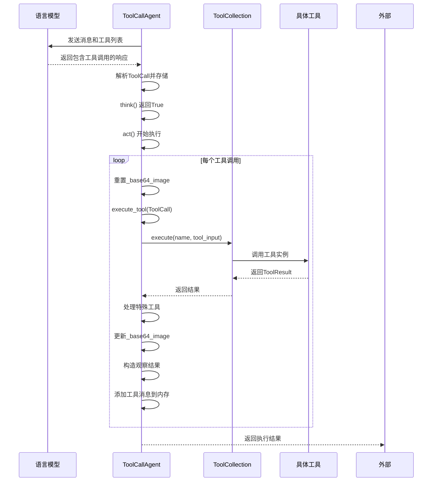
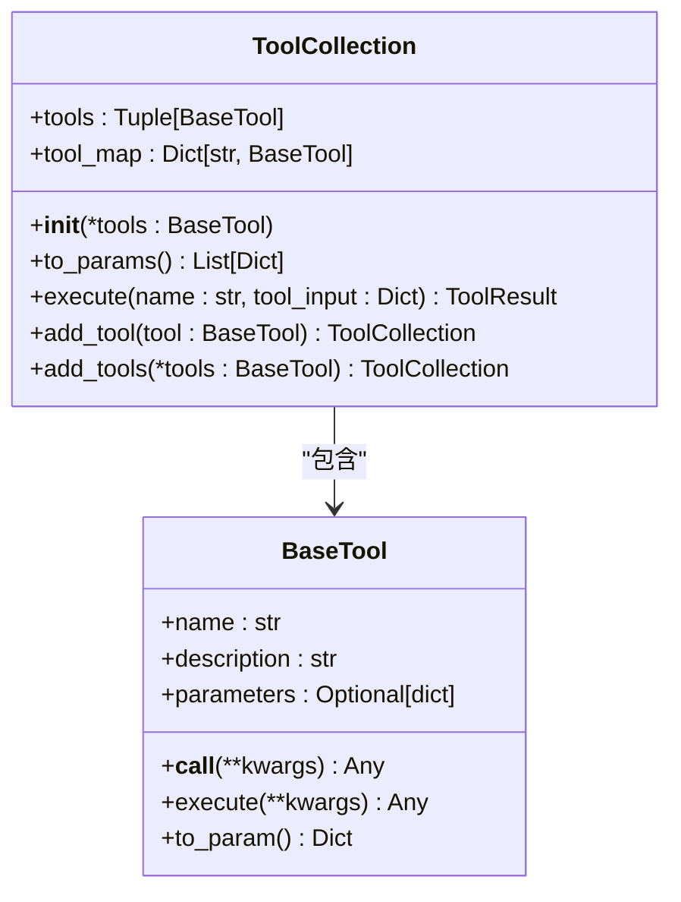
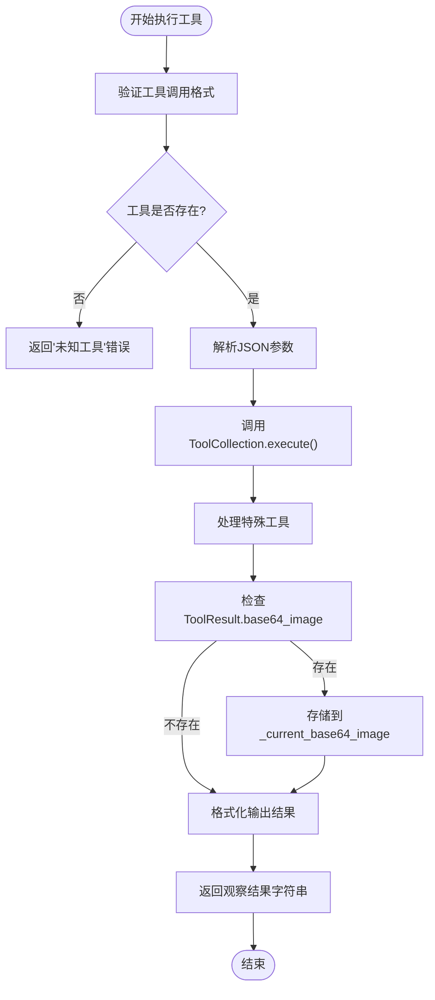
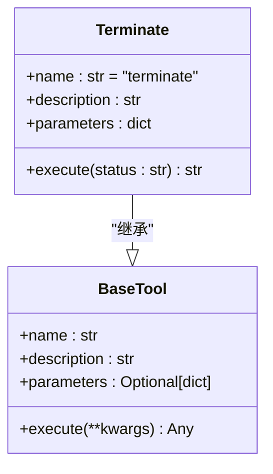

# 工具调用机制

<cite>
**Referenced Files in This Document**   
- [app/agent/toolcall.py](file://app/agent/toolcall.py)
- [app/tool/tool_collection.py](file://app/tool/tool_collection.py)
- [app/tool/base.py](file://app/tool/base.py)
- [app/schema.py](file://app/schema.py)
- [app/tool/terminate.py](file://app/tool/terminate.py)
- [app/tool/python_execute.py](file://app/tool/python_execute.py)
- [app/tool/file_operators.py](file://app/tool/file_operators.py)
- [app/tool/search/google_search.py](file://app/tool/search/google_search.py)
</cite>

## 目录
1. [引言](#引言)
2. [核心组件](#核心组件)
3. [工具调用流程](#工具调用流程)
4. [工具注册与发现](#工具注册与发现)
5. [工具执行与结果处理](#工具执行与结果处理)
6. [特殊工具处理](#特殊工具处理)
7. [安全性与性能优化](#安全性与性能优化)
8. [自定义工具开发](#自定义工具开发)
9. [结论](#结论)

## 引言
OpenManus的工具调用（Tool Call）机制是其智能代理系统的核心功能，它允许代理与外部工具进行交互，从而扩展其能力。该机制通过`ToolCallAgent`和`ToolCollection`两个核心组件协同工作，实现了从LLM输出到实际工具执行的完整流程。本文档将深入解析这一机制，为开发者提供全面的理解和最佳实践指导。

## 核心组件

`ToolCallAgent`是处理工具调用的基础代理类，它继承自`ReActAgent`，并专注于工具和函数的调用。该代理类定义了系统提示、可用工具集合、工具选择策略等核心属性。`ToolCollection`则是一个工具集合类，负责管理所有已定义的工具，提供工具的注册、发现和执行接口。这两个组件共同构成了工具调用机制的骨架。

**Section sources**
- [app/agent/toolcall.py](file://app/agent/toolcall.py#L17-L249)
- [app/tool/tool_collection.py](file://app/tool/tool_collection.py#L8-L70)

## 工具调用流程

工具调用流程始于`ToolCallAgent`的`think`方法。该方法首先向LLM发送消息，请求其根据当前状态和可用工具集决定下一步行动。LLM的响应可能包含工具调用指令，这些指令被解析为`ToolCall`对象，并存储在代理的`tool_calls`属性中。如果存在有效的工具调用，`think`方法返回`True`，触发`act`方法的执行。

**Diagram sources**
- [app/agent/toolcall.py](file://app/agent/toolcall.py#L17-L249)

**Section sources**
- [app/agent/toolcall.py](file://app/agent/toolcall.py#L17-L249)

## 工具注册与发现

工具的注册与发现由`ToolCollection`类管理。在`ToolCollection`的构造函数中，传入的工具实例被存储在`tools`元组和`tool_map`字典中，后者以工具名称为键，实现了O(1)时间复杂度的工具查找。开发者可以通过`add_tool`或`add_tools`方法动态向集合中添加新工具。`to_params`方法将集合中的所有工具转换为LLM可以理解的参数格式，以便在`think`阶段提供给LLM。

**Diagram sources**
- [app/tool/tool_collection.py](file://app/tool/tool_collection.py#L8-L70)
- [app/tool/base.py](file://app/tool/base.py#L77-L172)

**Section sources**
- [app/tool/tool_collection.py](file://app/tool/tool_collection.py#L8-L70)

## 工具执行与结果处理

工具的实际执行由`ToolCallAgent`的`execute_tool`方法负责。该方法首先验证工具调用的格式，然后从`available_tools`集合中查找对应的工具实例。工具的参数通过`json.loads`解析，并通过`ToolCollection`的`execute`方法异步调用。执行结果被封装为`ToolResult`对象，其中可能包含文本输出、错误信息和base64编码的图像数据。`execute_tool`方法会检查`ToolResult`中的`base64_image`字段，并将其存储在代理的`_current_base64_image`属性中，以便在后续创建工具消息时使用。

**Diagram sources**
- [app/agent/toolcall.py](file://app/agent/toolcall.py#L17-L249)
- [app/tool/base.py](file://app/tool/base.py#L37-L74)

**Section sources**
- [app/agent/toolcall.py](file://app/agent/toolcall.py#L17-L249)
- [app/tool/base.py](file://app/tool/base.py#L37-L74)

## 特殊工具处理

某些工具（如`Terminate`）具有特殊的行为，它们的执行可能会影响代理的整体状态。`ToolCallAgent`通过`special_tool_names`属性来识别这些特殊工具。在`execute_tool`方法的最后，会调用`_handle_special_tool`方法。如果被调用的工具是特殊工具，`_should_finish_execution`方法（默认返回`True`）将被调用，如果其返回`True`，则代理的状态将被设置为`AgentState.FINISHED`，从而终止代理的运行循环。

**Diagram sources**
- [app/tool/terminate.py](file://app/tool/terminate.py#L7-L24)
- [app/tool/base.py](file://app/tool/base.py#L77-L172)

**Section sources**
- [app/tool/terminate.py](file://app/tool/terminate.py#L7-L24)
- [app/agent/toolcall.py](file://app/agent/toolcall.py#L17-L249)

## 安全性与性能优化

工具调用机制在设计上考虑了安全性和性能。例如，`PythonExecute`工具在独立的进程中执行代码，并设置了超时限制，以防止恶意或无限循环的代码影响主程序。`FileOperator`协议定义了本地和沙箱环境下的文件操作，确保了文件操作的安全隔离。性能方面，`ToolCollection`的`tool_map`字典确保了工具查找的高效性，而异步执行模型则允许代理在等待工具执行时处理其他任务。

**Section sources**
- [app/tool/python_execute.py](file://app/tool/python_execute.py#L8-L74)
- [app/tool/file_operators.py](file://app/tool/file_operators.py#L15-L38)

## 自定义工具开发

开发者可以通过继承`BaseTool`类来创建自定义工具。新工具必须实现`execute`抽象方法，并定义`name`、`description`和`parameters`属性。`parameters`属性应遵循JSON Schema格式，以确保LLM能够正确生成调用参数。创建的工具实例可以被添加到`ToolCollection`中，并通过`ToolCallAgent`的`available_tools`属性暴露给LLM。

**Section sources**
- [app/tool/base.py](file://app/tool/base.py#L77-L172)
- [app/tool/python_execute.py](file://app/tool/python_execute.py#L8-L74)
- [app/tool/search/google_search.py](file://app/tool/search/google_search.py#L8-L33)

## 结论

OpenManus的工具调用机制提供了一个强大而灵活的框架，用于扩展智能代理的能力。通过`ToolCallAgent`和`ToolCollection`的协同工作，实现了从LLM决策到工具执行的无缝衔接。该机制不仅支持标准的工具调用，还通过`ToolResult`和`_current_base64_image`等设计，支持了包含图像数据的复杂交互。开发者可以基于此框架轻松地集成新工具，构建功能更强大的代理应用。