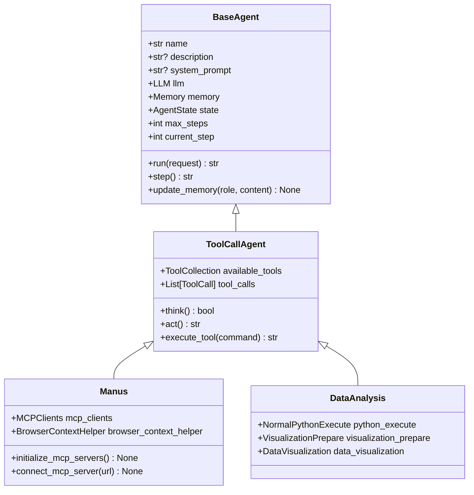
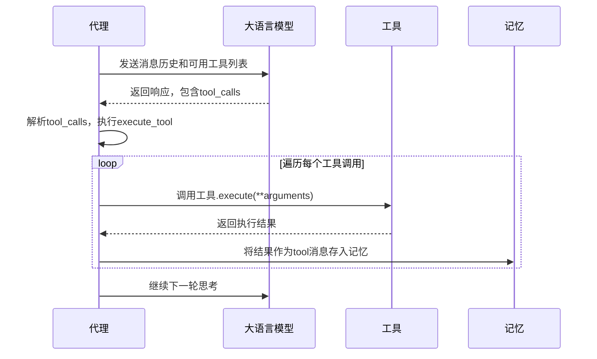
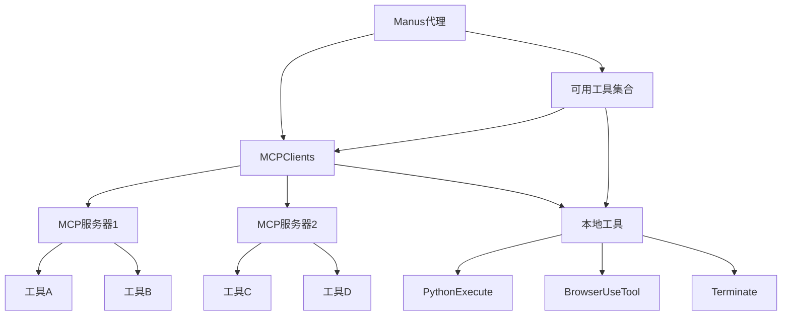
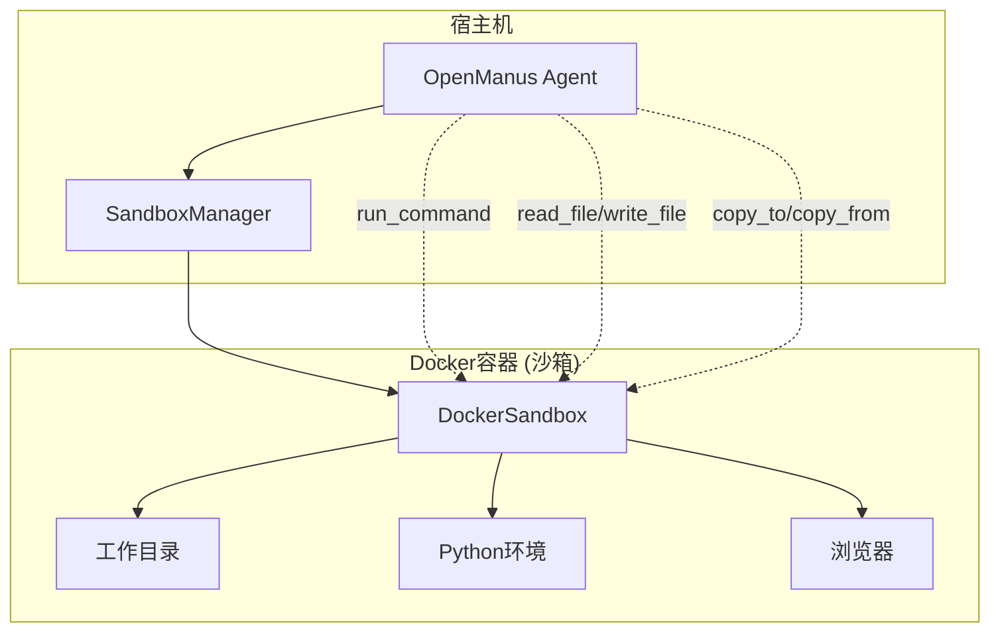
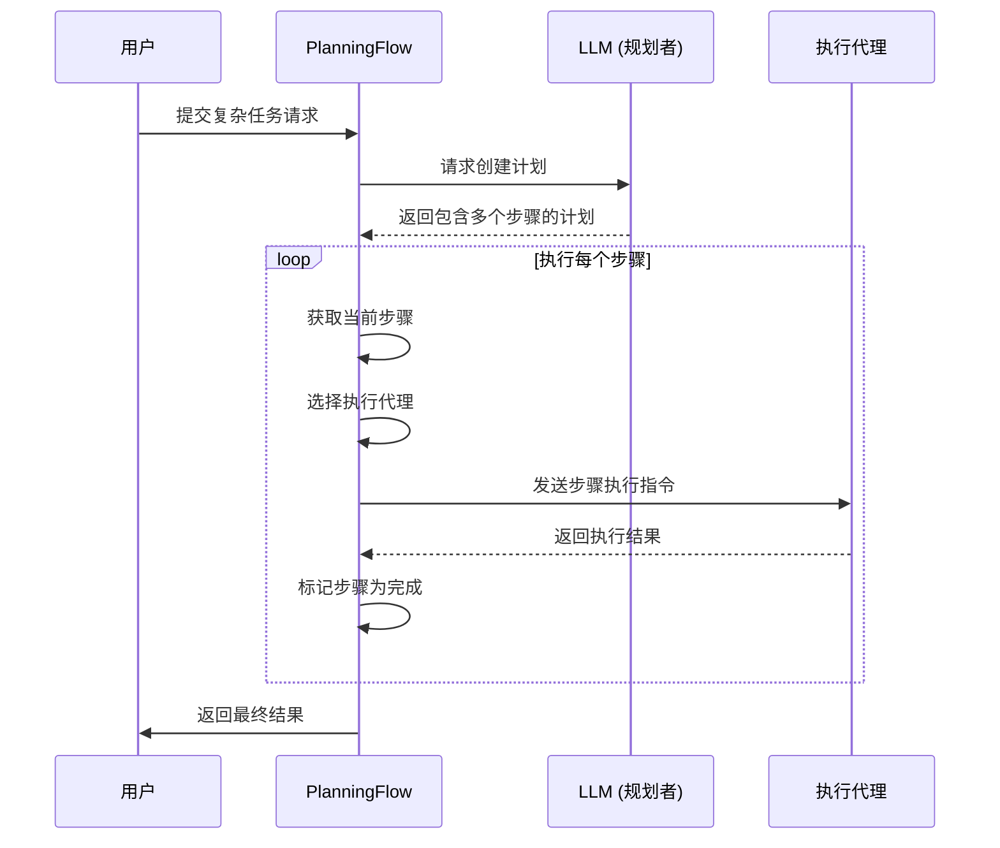

# 核心概念

<cite>
**本文档引用的文件**   
- [base.py](file://app/agent/base.py)
- [toolcall.py](file://app/agent/toolcall.py)
- [manus.py](file://app/agent/manus.py)
- [data_analysis.py](file://app/agent/data_analysis.py)
- [sandbox.py](file://app/sandbox/core/sandbox.py)
- [client.py](file://app/sandbox/client.py)
- [manager.py](file://app/sandbox/core/manager.py)
- [tool_collection.py](file://app/tool/tool_collection.py)
- [mcp.py](file://app/tool/mcp.py)
- [server.py](file://app/mcp/server.py)
- [base.py](file://app/flow/base.py)
- [planning.py](file://app/flow/planning.py)
- [schema.py](file://app/schema.py)
</cite>

## 目录
1. [代理（Agent）](#代理agent)
2. [工具调用（Tool Call）](#工具调用tool-call)
3. [MCP协议](#mcp协议)
4. [沙箱执行环境](#沙箱执行环境)
5. [工作流管理系统](#工作流管理系统)

## 代理（Agent）

代理（Agent）是OpenManus系统中的核心执行单元，它是一个具备自主决策和执行能力的智能体。代理通过与大语言模型（LLM）的交互，结合记忆（Memory）和状态管理，能够理解用户请求、规划任务步骤，并调用各种工具来完成复杂任务。

OpenManus中的代理基于`BaseAgent`抽象基类构建，该类定义了代理的核心属性和行为，包括名称、描述、系统提示词、记忆存储、执行状态和最大执行步数等。代理的核心工作流程由`run`方法驱动，它在一个异步循环中反复执行`step`方法，直到任务完成或达到最大步数限制。

**图示来源**
- [base.py](file://app/agent/base.py#L12-L195)
- [toolcall.py](file://app/agent/toolcall.py#L17-L249)
- [manus.py](file://app/agent/manus.py#L17-L164)
- [data_analysis.py](file://app/agent/data_analysis.py#L11-L36)

OpenManus提供了多种预定义的代理，以适应不同的应用场景：
- **Manus代理**：一个通用的多功能代理，集成了Python执行、浏览器自动化、文件编辑、人工协助和任务终止等核心工具。它是处理各种任务的主力代理。
- **数据分析代理**：专门用于数据处理和可视化的代理，它集成了增强版的Python执行器、数据可视化准备和图表生成工具，能够高效地完成数据分析任务。
- **SandboxManus代理**：一个运行在隔离沙箱环境中的代理，它通过Daytona等服务创建独立的容器环境，确保任务执行的安全性和资源隔离。

**代理的工作原理**：代理通过`think`和`act`两个阶段来完成一个执行步骤。在`think`阶段，代理将当前的对话历史和系统提示词发送给LLM，请求其决定下一步需要执行的动作，LLM的响应通常包含一个或多个工具调用指令。在`act`阶段，代理解析这些指令，调用相应的工具，并将工具的执行结果作为新的消息存入记忆中，从而完成一次循环。

**Section sources**
- [base.py](file://app/agent/base.py#L12-L195)
- [toolcall.py](file://app/agent/toolcall.py#L17-L249)

## 工具调用（Tool Call）

工具调用（Tool Call）是代理与外部能力进行交互的核心机制。它允许代理超越语言模型的文本生成能力，调用具体的函数或服务来执行实际操作，如执行代码、浏览网页、操作文件等。

在OpenManus中，工具调用的实现基于`ToolCall`数据结构，该结构定义了被调用工具的唯一ID、类型（固定为"function"）和函数信息（包括函数名和参数）。当代理的`think`方法调用LLM时，会将代理可用的工具列表以特定格式传递给LLM。LLM在生成响应时，如果判断需要调用工具，就会返回一个包含`tool_calls`字段的响应，其中列出了需要调用的工具及其参数。

**图示来源**
- [toolcall.py](file://app/agent/toolcall.py#L17-L249)
- [schema.py](file://app/schema.py#L45-L50)

工具的执行由`ToolCollection`类统一管理。`ToolCollection`是一个工具集合，它维护了一个从工具名称到工具实例的映射（`tool_map`），并提供了`execute`方法来根据名称查找并执行工具。代理通过`available_tools`属性持有这个工具集合。当代理需要执行一个工具调用时，它会调用`execute_tool`方法，该方法会从`tool_map`中查找对应的工具，解析JSON参数，并异步执行工具的`execute`方法。

**实际应用场景**：例如，当用户要求“查询南京旅游信息并生成攻略”时，Manus代理的LLM可能会决定调用`browser`工具。代理会生成一个`ToolCall`，其函数名为`go_to`，参数为`{"url": "https://hk.trip.com/travel-guide/guidebook/nanjing-9696/..."}`。代理执行此调用后，浏览器工具会启动一个无头浏览器并导航到指定URL，执行结果（如页面内容）将被返回并存入代理的记忆，供后续步骤使用。

**Section sources**
- [toolcall.py](file://app/agent/toolcall.py#L17-L249)
- [tool_collection.py](file://app/tool/tool_collection.py#L8-L70)
- [schema.py](file://app/schema.py#L45-L50)

## MCP协议

MCP（Model Context Protocol）协议是OpenManus实现动态工具发现和集成的关键。它允许代理连接到一个或多个MCP服务器，这些服务器可以提供额外的、动态的工具集，从而极大地扩展了代理的能力。

在OpenManus中，`MCPClients`类是MCP协议的客户端实现。它继承自`ToolCollection`，因此本身也可以被视为一个工具集合。`MCPClients`支持通过SSE（Server-Sent Events）或stdio（标准输入/输出）两种方式与MCP服务器建立连接。一旦连接成功，`MCPClients`会调用服务器的`list_tools`方法，获取服务器上所有可用工具的元数据（如名称、描述、参数）。

**图示来源**
- [mcp.py](file://app/tool/mcp.py#L36-L193)
- [manus.py](file://app/agent/manus.py#L17-L164)

对于MCP服务器上的每一个工具，`MCPClients`会创建一个`MCPClientTool`实例。`MCPClientTool`是一个代理工具，它不包含实际的执行逻辑，而是负责将调用请求转发给后端的MCP服务器。当代理调用一个MCP工具时，`MCPClientTool`的`execute`方法会通过`ClientSession`向服务器发起`call_tool`请求，并将服务器的响应结果返回给代理。

**作用与优势**：MCP协议实现了工具的“即插即用”。开发者可以独立开发和部署MCP服务器，提供特定领域的工具（如数据库查询、API调用等），而无需修改OpenManus主程序。Manus代理在启动时，会根据配置文件自动连接这些服务器，并将它们的工具无缝集成到自己的`available_tools`集合中，使得代理的能力可以轻松地横向扩展。

**Section sources**
- [mcp.py](file://app/tool/mcp.py#L36-L193)
- [manus.py](file://app/agent/manus.py#L17-L164)

## 沙箱执行环境

沙箱执行环境为代理提供了一个安全、隔离的运行空间，用于执行可能具有风险的操作，如运行未知的Python代码或浏览不受信任的网页。OpenManus的沙箱基于Docker容器技术实现，确保了强大的资源隔离和安全性。

沙箱的核心组件是`DockerSandbox`类，它封装了Docker容器的创建、管理和销毁。当创建一个沙箱时，系统会启动一个基于指定镜像的Docker容器，并对其进行配置，包括设置内存和CPU使用限制、禁用网络连接（可选）以及挂载工作目录。`DockerSandbox`提供了丰富的API，允许代理在容器内执行命令、读写文件、复制文件进出容器等。

**图示来源**
- [sandbox.py](file://app/sandbox/core/sandbox.py#L17-L461)
- [client.py](file://app/sandbox/client.py#L1-L201)
- [manager.py](file://app/sandbox/core/manager.py#L1-L313)

`SandboxManager`是沙箱的管理者，它负责管理多个沙箱实例的生命周期。它维护一个沙箱池，可以创建、获取和删除沙箱，并通过`SandboxClient`为上层应用提供统一的访问接口。`SandboxManager`还实现了自动清理机制，会定期检查并清理长时间未使用的空闲沙箱，以释放系统资源。

**安全模型**：沙箱的安全性体现在多个层面。首先，进程隔离：沙箱内的所有操作都在独立的容器内进行，与宿主机完全隔离。其次，资源限制：通过Docker的cgroups机制，可以严格限制沙箱的CPU和内存使用，防止资源耗尽。最后，网络隔离：默认情况下，沙箱的网络被禁用，无法访问外部网络，从而杜绝了数据外泄和恶意网络活动的风险。

**Section sources**
- [sandbox.py](file://app/sandbox/core/sandbox.py#L17-L461)
- [client.py](file://app/sandbox/client.py#L1-L201)
- [manager.py](file://app/sandbox/core/manager.py#L1-L313)

## 工作流管理系统

工作流管理系统负责协调多个代理或任务步骤，以完成复杂的、多阶段的用户请求。OpenManus通过`BaseFlow`和`PlanningFlow`类实现了这一功能，它将任务执行从单一代理的线性步骤，提升为可规划、可协调的流程。

`BaseFlow`是所有工作流的基类，它管理一个或多个代理的集合，并定义了`execute`这一抽象方法。`PlanningFlow`是`BaseFlow`的一个具体实现，它引入了“计划（Plan）”的概念。当用户提交一个复杂请求时，`PlanningFlow`首先会调用LLM生成一个初始计划，该计划将整个任务分解为一系列有序的步骤。

**图示来源**
- [base.py](file://app/flow/base.py#L8-L56)
- [planning.py](file://app/flow/planning.py#L44-L441)

在执行阶段，`PlanningFlow`会按顺序处理计划中的每一个步骤。它通过`get_executor`方法为每个步骤选择合适的执行代理（例如，数据处理步骤选择`DataAnalysis`代理，网页浏览步骤选择`Manus`代理）。然后，它调用所选代理的`run`方法来执行该步骤，并在执行成功后将该步骤标记为“已完成”。整个流程持续进行，直到所有步骤都完成。

**协调机制**：工作流系统通过共享的“计划”状态来协调各个步骤。每个步骤的执行都基于当前的计划状态，这确保了所有代理对任务的整体进度有统一的认知。此外，工作流还负责在代理执行完毕后进行资源清理，保证了系统的健壮性。

**实际应用场景**：例如，一个“分析某公司财报并生成可视化报告”的任务，可以被分解为：1. 从网站下载财报PDF；2. 使用OCR工具提取文本；3. 用Python脚本解析财务数据；4. 调用数据可视化工具生成图表；5. 将所有内容整合成一份HTML报告。`PlanningFlow`可以协调`Manus`代理完成第1步，`DataAnalysis`代理完成第3和第4步，最终生成完整的报告。

**Section sources**
- [base.py](file://app/flow/base.py#L8-L56)
- [planning.py](file://app/flow/planning.py#L44-L441)