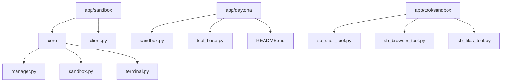
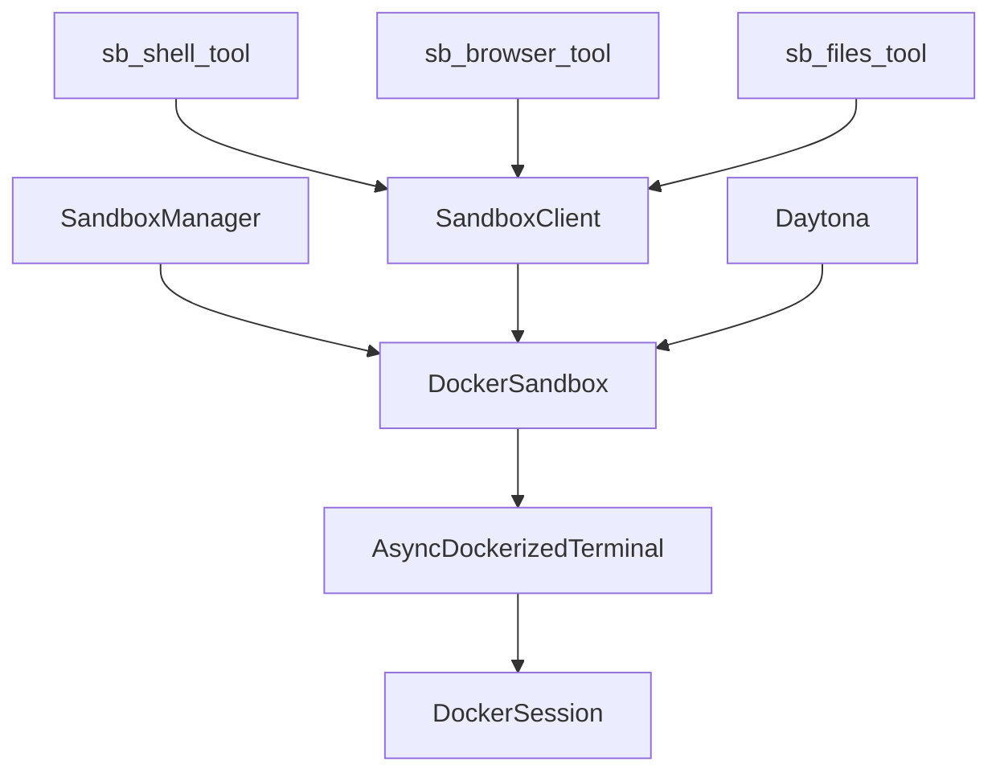
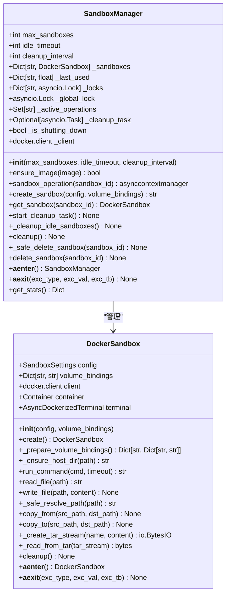
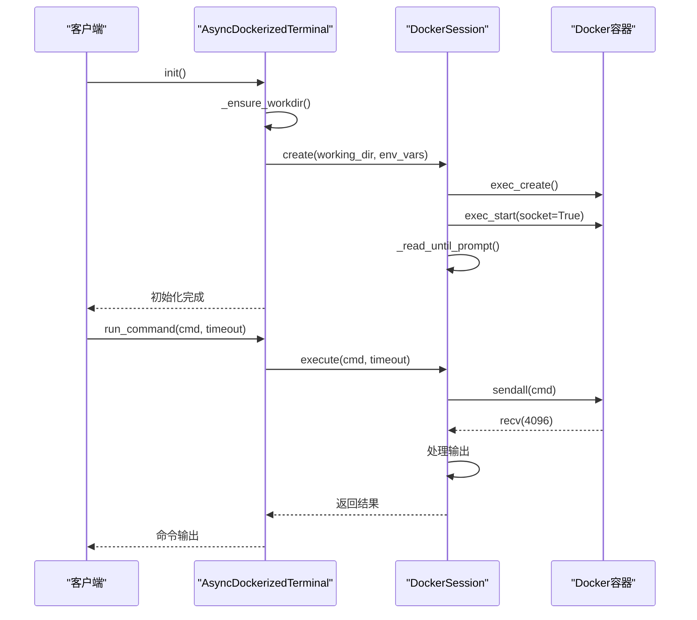
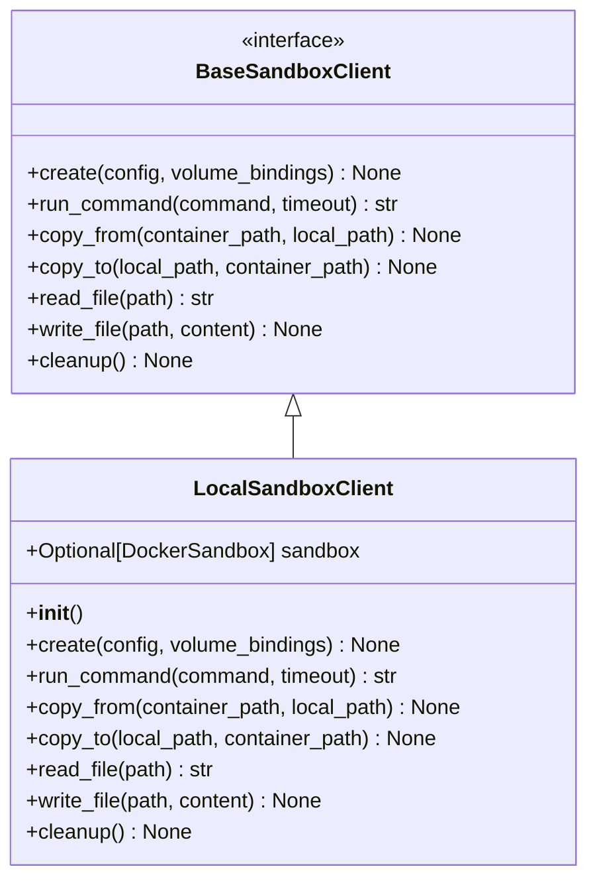
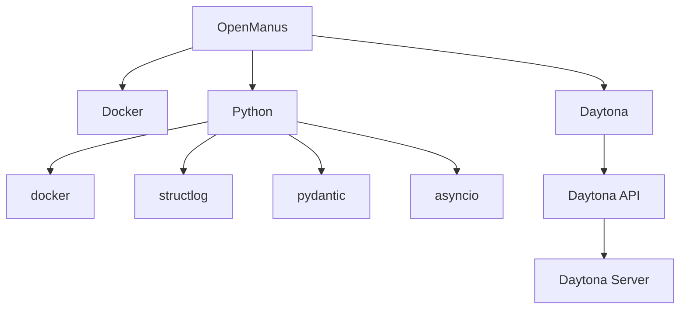

# 沙箱执行环境

<cite>
**本文档引用的文件**  
- [manager.py](file://app/sandbox/core/manager.py)
- [sandbox.py](file://app/sandbox/core/sandbox.py)
- [terminal.py](file://app/sandbox/core/terminal.py)
- [client.py](file://app/sandbox/client.py)
- [sb_shell_tool.py](file://app/tool/sandbox/sb_shell_tool.py)
- [sb_browser_tool.py](file://app/tool/sandbox/sb_browser_tool.py)
- [sb_files_tool.py](file://app/tool/sandbox/sb_files_tool.py)
- [sandbox.py](file://app/daytona/sandbox.py)
- [tool_base.py](file://app/daytona/tool_base.py)
- [README.md](file://app/daytona/README.md)
- [config.example-daytona.toml](file://config/config.example-daytona.toml)
</cite>

## 目录
1. [简介](#简介)
2. [项目结构](#项目结构)
3. [核心组件](#核心组件)
4. [架构概述](#架构概述)
5. [详细组件分析](#详细组件分析)
6. [依赖分析](#依赖分析)
7. [性能考虑](#性能考虑)
8. [故障排除指南](#故障排除指南)
9. [结论](#结论)

## 简介
OpenManus的沙箱执行环境是一个基于Docker和Daytona平台的安全隔离系统，旨在为代码执行、文件操作、Shell命令执行和浏览器自动化提供一个安全可靠的环境。该系统通过SandboxManager、Terminal和SandboxClient等核心组件协同工作，确保执行过程中的资源隔离和安全性。结合Daytona平台的强大功能，沙箱环境能够支持远程服务的配置与使用，同时提供详细的网络访问控制和资源管理策略。

## 项目结构
OpenManus项目的沙箱相关代码主要分布在`app/sandbox`目录下，包括核心的管理、终端和客户端实现。此外，`app/daytona`目录包含了与Daytona平台集成的具体实现，而`app/tool/sandbox`则定义了各种沙箱工具，如文件操作、Shell命令执行和浏览器自动化等。

**图示来源**
- [manager.py](file://app/sandbox/core/manager.py#L1-L312)
- [sandbox.py](file://app/sandbox/core/sandbox.py#L1-L461)
- [terminal.py](file://app/sandbox/core/terminal.py#L1-L345)
- [client.py](file://app/sandbox/client.py#L1-L201)
- [sb_shell_tool.py](file://app/tool/sandbox/sb_shell_tool.py#L1-L419)
- [sb_browser_tool.py](file://app/tool/sandbox/sb_browser_tool.py#L1-L450)
- [sb_files_tool.py](file://app/tool/sandbox/sb_files_tool.py#L1-L361)

**章节来源**
- [manager.py](file://app/sandbox/core/manager.py#L1-L312)
- [sandbox.py](file://app/sandbox/core/sandbox.py#L1-L461)
- [terminal.py](file://app/sandbox/core/terminal.py#L1-L345)
- [client.py](file://app/sandbox/client.py#L1-L201)

## 核心组件
OpenManus的沙箱执行环境由多个核心组件构成，这些组件共同协作以提供一个安全且高效的执行环境。主要包括SandboxManager、Terminal和SandboxClient，它们分别负责沙箱的生命周期管理、命令执行和文件操作。

**章节来源**
- [manager.py](file://app/sandbox/core/manager.py#L1-L312)
- [sandbox.py](file://app/sandbox/core/sandbox.py#L1-L461)
- [terminal.py](file://app/sandbox/core/terminal.py#L1-L345)
- [client.py](file://app/sandbox/client.py#L1-L201)

## 架构概述
OpenManus的沙箱执行环境采用分层架构设计，从底层的Docker容器到上层的Daytona平台集成，每一层都承担着特定的功能。SandboxManager负责管理多个DockerSandbox实例的生命周期，包括创建、监控和清理。Terminal组件提供了异步的Docker终端功能，允许在容器内执行交互式命令。SandboxClient作为客户端接口，封装了对沙箱的各种操作，使得上层应用可以方便地调用沙箱功能。

**图示来源**
- [manager.py](file://app/sandbox/core/manager.py#L1-L312)
- [sandbox.py](file://app/sandbox/core/sandbox.py#L1-L461)
- [terminal.py](file://app/sandbox/core/terminal.py#L1-L345)
- [client.py](file://app/sandbox/client.py#L1-L201)
- [sb_shell_tool.py](file://app/tool/sandbox/sb_shell_tool.py#L1-L419)
- [sb_browser_tool.py](file://app/tool/sandbox/sb_browser_tool.py#L1-L450)
- [sb_files_tool.py](file://app/tool/sandbox/sb_files_tool.py#L1-L361)

## 详细组件分析
### SandboxManager 分析
SandboxManager是沙箱执行环境的核心管理者，负责管理多个DockerSandbox实例的生命周期。它通过并发控制和自动清理机制确保资源的有效利用。

#### 类图

**图示来源**
- [manager.py](file://app/sandbox/core/manager.py#L1-L312)
- [sandbox.py](file://app/sandbox/core/sandbox.py#L1-L461)

### Terminal 分析
Terminal组件提供了异步的Docker终端功能，允许在容器内执行交互式命令，并具有超时控制。

#### 序列图

**图示来源**
- [terminal.py](file://app/sandbox/core/terminal.py#L1-L345)

### SandboxClient 分析
SandboxClient作为客户端接口，封装了对沙箱的各种操作，使得上层应用可以方便地调用沙箱功能。

#### 类图

**图示来源**
- [client.py](file://app/sandbox/client.py#L1-L201)

## 依赖分析
OpenManus的沙箱执行环境依赖于多个外部库和平台，包括Docker、Daytona以及各种Python库。这些依赖关系确保了沙箱环境的稳定性和功能性。

**图示来源**
- [manager.py](file://app/sandbox/core/manager.py#L1-L312)
- [sandbox.py](file://app/sandbox/core/sandbox.py#L1-L461)
- [terminal.py](file://app/sandbox/core/terminal.py#L1-L345)
- [client.py](file://app/sandbox/client.py#L1-L201)
- [sb_shell_tool.py](file://app/tool/sandbox/sb_shell_tool.py#L1-L419)
- [sb_browser_tool.py](file://app/tool/sandbox/sb_browser_tool.py#L1-L450)
- [sb_files_tool.py](file://app/tool/sandbox/sb_files_tool.py#L1-L361)

**章节来源**
- [manager.py](file://app/sandbox/core/manager.py#L1-L312)
- [sandbox.py](file://app/sandbox/core/sandbox.py#L1-L461)
- [terminal.py](file://app/sandbox/core/terminal.py#L1-L345)
- [client.py](file://app/sandbox/client.py#L1-L201)
- [sb_shell_tool.py](file://app/tool/sandbox/sb_shell_tool.py#L1-L419)
- [sb_browser_tool.py](file://app/tool/sandbox/sb_browser_tool.py#L1-L450)
- [sb_files_tool.py](file://app/tool/sandbox/sb_files_tool.py#L1-L361)

## 性能考虑
为了确保沙箱执行环境的高效运行，需要考虑以下几个方面的性能优化：
- **资源限制**：通过配置内存和CPU限制，防止单个沙箱占用过多资源。
- **超时控制**：设置合理的命令执行超时时间，避免长时间运行的命令影响整体性能。
- **并发控制**：使用锁机制和全局锁来管理并发操作，确保资源的安全访问。
- **自动清理**：定期清理闲置的沙箱实例，释放系统资源。

**章节来源**
- [manager.py](file://app/sandbox/core/manager.py#L1-L312)
- [sandbox.py](file://app/sandbox/core/sandbox.py#L1-L461)
- [terminal.py](file://app/sandbox/core/terminal.py#L1-L345)

## 故障排除指南
在使用OpenManus的沙箱执行环境时，可能会遇到一些常见问题。以下是一些故障排除建议：
- **沙箱创建失败**：检查Docker服务是否正常运行，确保所需的镜像已下载。
- **命令执行超时**：增加超时时间或优化命令逻辑，减少执行时间。
- **文件操作失败**：确认文件路径正确，检查权限设置。
- **网络连接问题**：确保网络配置正确，特别是当使用远程沙箱服务时。

**章节来源**
- [manager.py](file://app/sandbox/core/manager.py#L1-L312)
- [sandbox.py](file://app/sandbox/core/sandbox.py#L1-L461)
- [terminal.py](file://app/sandbox/core/terminal.py#L1-L345)
- [client.py](file://app/sandbox/client.py#L1-L201)

## 结论
OpenManus的沙箱执行环境通过SandboxManager、Terminal和SandboxClient等核心组件的协同工作，提供了一个安全可靠的代码执行环境。结合Daytona平台的强大功能，该环境不仅支持本地执行，还能轻松配置和使用远程沙箱服务。通过对资源隔离、网络访问控制和性能优化的综合考虑，OpenManus为开发者提供了一个高效且安全的开发和测试平台。