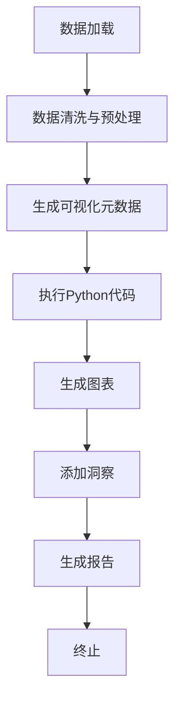

# 数据分析基准测试示例

<cite>
**本文档中引用的文件**  
- [__init__.py](file://examples/benchmarks/__init__.py)
- [data_analysis.py](file://app/agent/data_analysis.py)
- [visualization.py](file://app/prompt/visualization.py)
- [python_execute.py](file://app/tool/chart_visualization/python_execute.py)
- [chart_prepare.py](file://app/tool/chart_visualization/chart_prepare.py)
- [data_visualization.py](file://app/tool/chart_visualization/data_visualization.py)
- [chartVisualize.ts](file://app/tool/chart_visualization/src/chartVisualize.ts)
</cite>

## 目录
1. [简介](#简介)
2. [测试结构与组织方式](#测试结构与组织方式)
3. [数据分析代理核心组件](#数据分析代理核心组件)
4. [数据分析工作流详解](#数据分析工作流详解)
5. [工具调用机制](#工具调用机制)
6. [执行流程与评估指标](#执行流程与评估指标)
7. [典型数据分析工作流示例](#典型数据分析工作流示例)
8. [扩展自定义基准测试](#扩展自定义基准测试)
9. [结论](#结论)

## 简介
OpenManus 提供了一套标准化的基准测试系统，用于评估智能代理在数据处理与分析任务中的能力。本文档基于 `examples/benchmarks` 模块，详细说明如何利用数据分析代理（`data_analysis.py`）结合 Python 执行工具和可视化工具完成从数据清洗、统计分析到图表生成的完整流程。通过分析测试结构和工具链，指导用户理解并扩展该基准测试框架以适应自定义数据集和分析需求。

## 测试结构与组织方式
`examples/benchmarks/__init__.py` 文件作为基准测试系统的入口点，定义了标准化的代理评估体系结构。该模块通过组织一系列可复用的测试用例，支持对代理在不同数据场景下的表现进行系统性评估。测试套件采用模块化设计，便于添加新的测试案例和评估维度。

**Section sources**
- [__init__.py](file://examples/benchmarks/__init__.py#L1-L3)

## 数据分析代理核心组件
`DataAnalysis` 代理继承自 `ToolCallAgent`，具备规划能力以解决各类数据分析任务。其核心特性包括：

- **名称与描述**：代理名称为 "Data_Analysis"，专注于利用 Python 和数据可视化工具解决多样化分析任务。
- **系统提示词**：使用 `SYSTEM_PROMPT` 指导代理行为，明确工作空间目录及报告生成要求。
- **步骤控制**：最大观察长度为 15000 字符，最多执行 20 步操作。
- **可用工具集**：集成 `NormalPythonExecute`、`VisualizationPrepare`、`DataVisualization` 和 `Terminate` 四个关键工具。

**Section sources**
- [data_analysis.py](file://app/agent/data_analysis.py#L11-L36)

## 数据分析工作流详解
完整的数据分析工作流由多个协同工作的组件构成，形成一个闭环处理流程：

**Diagram sources**
- [data_analysis.py](file://app/agent/data_analysis.py#L29-L36)
- [chart_prepare.py](file://app/tool/chart_visualization/chart_prepare.py#L3-L37)
- [data_visualization.py](file://app/tool/chart_visualization/data_visualization.py#L14-L262)

## 工具调用机制
数据分析代理通过一系列专用工具实现复杂任务的分解与执行：

### Python代码执行工具
`NormalPythonExecute` 工具允许执行带有超时和安全限制的 Python 代码，适用于深度数据分析、报告生成等非直接可视化任务。代码输出需使用 `print()` 确保可见性，并将结果保存至工作空间目录。

**Section sources**
- [python_execute.py](file://app/tool/chart_visualization/python_execute.py#L4-L35)

### 可视化准备工具
`VisualizationPrepare` 工具负责生成 `data_visualization` 工具所需的元数据信息。其主要功能包括：
- 数据加载与清洗逻辑
- 生成 CSV 数据文件及其图表描述
- 将信息以 JSON 格式保存，格式为 `[{"csvFilePath": string, "chartTitle": string}]`

**Section sources**
- [chart_prepare.py](file://app/tool/chart_visualization/chart_prepare.py#L3-L37)

### 数据可视化工具
`DataVisualization` 工具根据 `visualization_preparation` 工具生成的 JSON 信息进行统计图表可视化或向图表添加洞察。支持 PNG 和 HTML 两种输出格式，并可通过语言参数选择英文或中文输出。

**Section sources**
- [data_visualization.py](file://app/tool/chart_visualization/data_visualization.py#L14-L262)

## 执行流程与评估指标
代理的执行流程遵循以下步骤：
1. 接收用户请求并解析任务目标
2. 使用 `visualization_preparation` 工具准备数据和元信息
3. 调用 `data_visualization` 工具生成图表
4. 可选地使用 `add_insighs` 方法为图表添加深入洞察
5. 使用 `python_execute` 进行补充分析
6. 最终调用 `Terminate` 工具结束任务

评估指标包括：
- 任务完成率
- 代码执行成功率
- 图表生成质量
- 分析深度与洞察价值
- 资源使用效率（时间、内存）

**Section sources**
- [data_analysis.py](file://app/agent/data_analysis.py#L22-L23)
- [visualization.py](file://app/prompt/visualization.py#L1-L10)

## 典型数据分析工作流示例
一个典型的数据分析工作流包含以下阶段：

### 数据加载与清洗
使用 `python_execute` 工具执行数据加载和预处理代码，确保数据质量。

### 统计分析
执行描述性统计、相关性分析、趋势检测等操作，提取关键指标。

### 可视化展示
通过 `VisualizationPrepare` 生成可视化元数据，再由 `DataVisualization` 生成交互式图表。

### 报告输出
整合分析结果、图表和洞察，生成综合性文本报告，保存至工作空间。

**Section sources**
- [data_analysis.py](file://app/agent/data_analysis.py#L29-L36)
- [python_execute.py](file://app/tool/chart_visualization/python_execute.py#L4-L35)

## 扩展自定义基准测试
用户可通过以下方式扩展基准测试功能：

1. **新增数据集**：将自定义数据文件放入工作空间目录，修改数据加载路径。
2. **定制分析逻辑**：在 `python_execute` 中编写特定领域的分析算法。
3. **创建新可视化模板**：调整 `chartVisualize.ts` 中的图表生成逻辑。
4. **集成外部工具**：通过继承 `BaseTool` 类开发新的功能组件。
5. **修改评估标准**：在 `__init__.py` 中定义新的测试用例和评分规则。

**Section sources**
- [__init__.py](file://examples/benchmarks/__init__.py#L1-L3)
- [chartVisualize.ts](file://app/tool/chart_visualization/src/chartVisualize.ts#L1-L372)

## 结论
OpenManus 的数据分析基准测试框架提供了一个强大而灵活的平台，用于评估和提升智能代理在数据处理任务中的表现。通过模块化的工具设计和清晰的工作流定义，用户可以轻松实现复杂的数据分析任务，并可根据具体需求进行定制和扩展。此系统不仅支持标准化评估，也为实际应用场景中的数据分析自动化提供了可靠的基础架构。