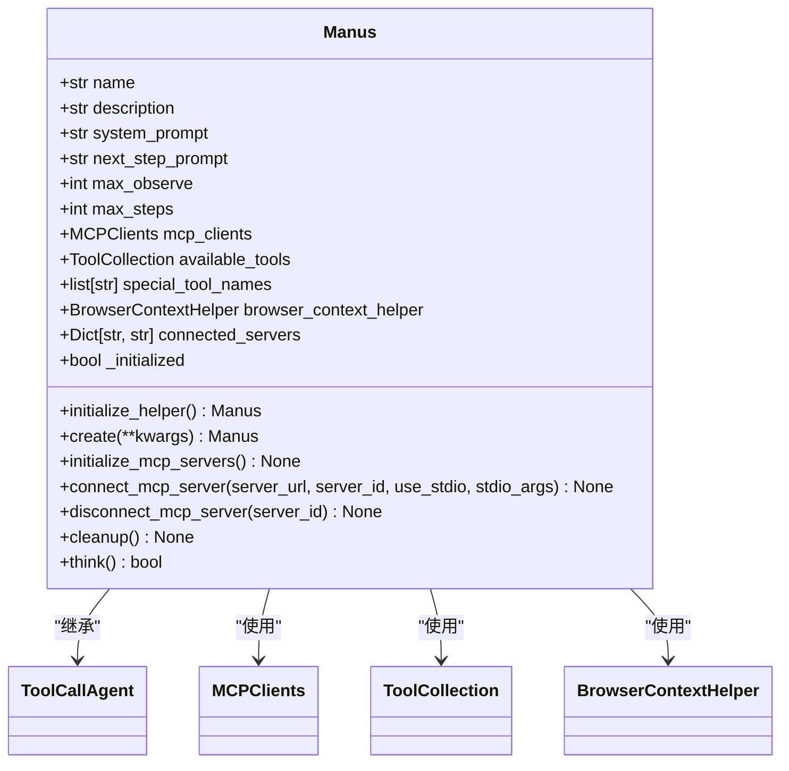
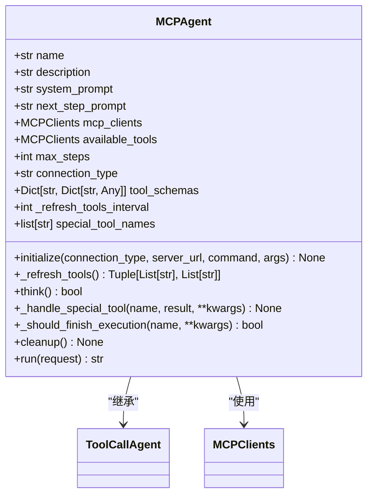
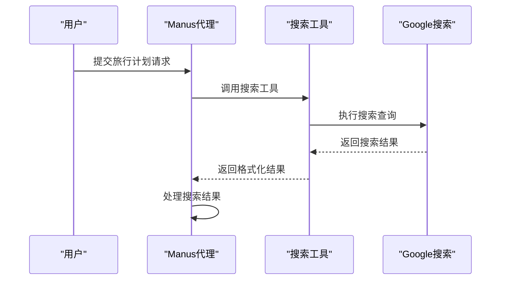
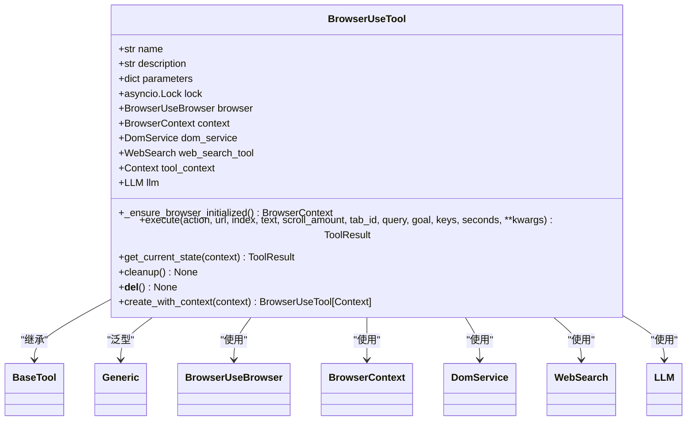
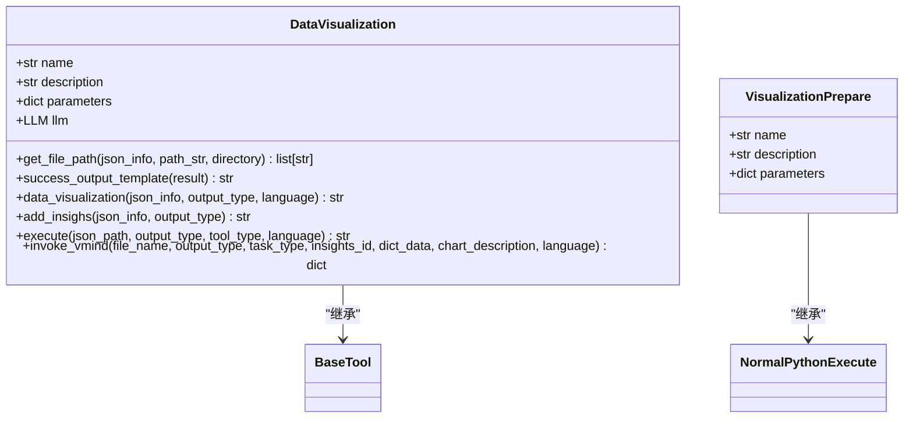
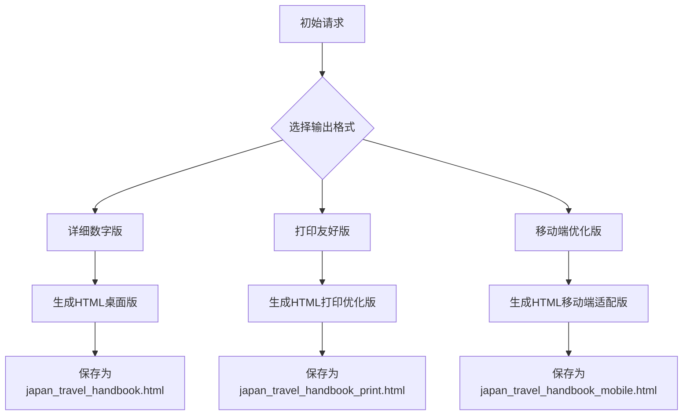
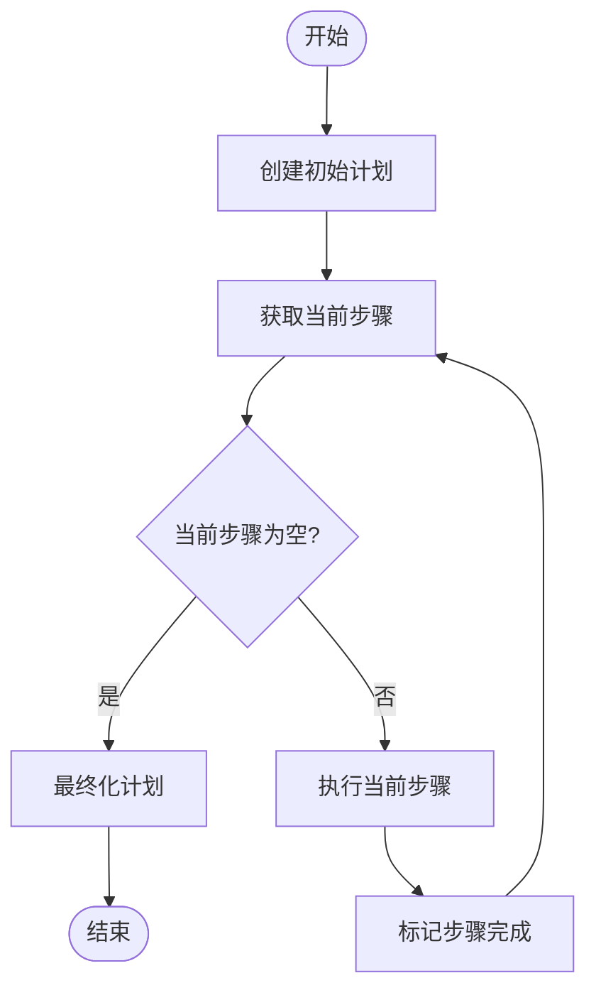

# 日本旅行计划示例

<cite>
**本文档中引用的文件**  
- [japan_travel_guide_instructions.txt](file://examples/use_case/japan-travel-plan/japan_travel_guide_instructions.txt)
- [manus.py](file://app/agent/manus.py)
- [mcp.py](file://app/agent/mcp.py)
- [browser_use_tool.py](file://app/tool/browser_use_tool.py)
- [google_search.py](file://app/tool/search/google_search.py)
- [data_visualization.py](file://app/tool/chart_visualization/data_visualization.py)
- [chart_prepare.py](file://app/tool/chart_visualization/chart_prepare.py)
- [planning.py](file://app/flow/planning.py)
- [config.example.toml](file://config/config.example.toml)
- [japan_travel_handbook.html](file://examples/use_case/japan-travel-plan/japan_travel_handbook.html)
- [japan_travel_handbook_mobile.html](file://examples/use_case/japan-travel-plan/japan_travel_handbook_mobile.html)
- [japan_travel_handbook_print.html](file://examples/use_case/japan-travel-plan/japan_travel_handbook_print.html)
</cite>

## 目录
1. [引言](#引言)
2. [用户需求解析](#用户需求解析)
3. [代理选择与配置](#代理选择与配置)
4. [工具调用序列分析](#工具调用序列分析)
5. [多格式输出生成逻辑](#多格式输出生成逻辑)
6. [数据流与执行流程](#数据流与执行流程)
7. [可复现配置与执行命令](#可复现配置与执行命令)
8. [结论](#结论)

## 引言
本文档详细说明了如何使用OpenManus代理系统规划一次完整的日本旅行。通过分析系统架构、代理选择、工具调用序列和多格式输出生成机制，展示了系统如何整合多源信息并生成适用于不同场景的旅行手册。文档基于`japan_travel_guide_instructions.txt`中的具体需求，结合代码实现，提供了完整的执行流程和配置参数。

## 用户需求解析
根据`japan_travel_guide_instructions.txt`文件，用户需求主要包括三个版本的旅行手册：
- **详细数字版**：包含完整的行程、酒店推荐和预算分析，适用于桌面或笔记本电脑查看。
- **打印友好版**：优化了纸张打印格式，包含关键信息和快速参考表格。
- **移动端优化版**：具有触摸友好的界面、可折叠的章节和紧急按钮，支持暗色模式。

此外，文件还明确了重要日期和预订截止时间，包括航班（2024年1月前）、酒店（2024年2月前）、餐厅（2024年1月前）和JR通票（2024年3月前）的预订。

**Section sources**
- [japan_travel_guide_instructions.txt](file://examples/use_case/japan-travel-plan/japan_travel_guide_instructions.txt)

## 代理选择与配置
系统提供了两种主要代理：Manus和MCP代理。Manus代理是一个多功能通用代理，支持本地和MCP工具，而MCP代理专门用于与MCP服务器交互。

### Manus代理
Manus代理在`manus.py`中定义，具有以下特点：
- 支持多种工具，包括Python执行、浏览器使用、字符串替换编辑和人类询问。
- 可以连接到配置的MCP服务器，动态添加远程工具。
- 具有异步初始化和清理方法，确保资源的正确管理。



**Diagram sources**
- [manus.py](file://app/agent/manus.py#L17-L164)

### MCP代理
MCP代理在`mcp.py`中定义，专门用于与MCP服务器交互。它支持通过SSE或stdio传输连接到MCP服务器，并将服务器的工具添加到代理的工具接口中。



**Diagram sources**
- [mcp.py](file://app/agent/mcp.py#L14-L185)

## 工具调用序列分析
系统通过一系列工具调用序列来获取和处理信息，主要包括搜索工具、浏览器工具和可视化工具。

### 搜索工具
搜索工具在`google_search.py`中实现，使用`googlesearch`库执行搜索并返回结果。搜索结果格式化为`SearchItem`模型，包含标题、URL和描述。



**Diagram sources**
- [google_search.py](file://app/tool/search/google_search.py#L7-L32)

### 浏览器工具
浏览器工具在`browser_use_tool.py`中实现，提供了控制浏览器会话、导航网页和提取信息的功能。它支持多种操作，包括导航、交互、滚动、内容提取和标签管理。



**Diagram sources**
- [browser_use_tool.py](file://app/tool/browser_use_tool.py#L38-L566)

### 可视化工具
可视化工具在`data_visualization.py`和`chart_prepare.py`中实现，用于生成统计图表和添加洞察。`VisualizationPrepare`工具准备数据，`DataVisualization`工具生成图表。



**Diagram sources**
- [data_visualization.py](file://app/tool/chart_visualization/data_visualization.py#L14-L262)
- [chart_prepare.py](file://app/tool/chart_visualization/chart_prepare.py#L1-L38)

## 多格式输出生成逻辑
系统生成三种格式的旅行手册，每种格式针对不同的使用场景进行了优化。

### 详细数字版
详细数字版包含完整的行程、详细的提案规划部分、所有酒店推荐和全面的预算分析。它适用于在桌面或笔记本电脑上查看，适合旅行前的详细规划。

### 打印友好版
打印友好版优化了纸张打印格式，包含关键信息和快速参考表格。它适用于在旅行期间作为物理参考，建议打印并保存在旅行文件夹中。

### 移动端优化版
移动端优化版具有触摸友好的界面、可折叠的章节和紧急按钮，支持暗色模式。它适用于在旅途中作为日常参考，建议保存到手机浏览器的书签中。



**Diagram sources**
- [japan_travel_handbook.html](file://examples/use_case/japan-travel-plan/japan_travel_handbook.html)
- [japan_travel_handbook_mobile.html](file://examples/use_case/japan-travel-plan/japan_travel_handbook_mobile.html)
- [japan_travel_handbook_print.html](file://examples/use_case/japan-travel-plan/japan_travel_handbook_print.html)

## 数据流与执行流程
系统的数据流从初始请求开始，经过代理处理、工具调用和信息整合，最终生成多格式输出。

### 数据流
1. 用户提交旅行计划请求。
2. Manus代理解析请求并选择适当的工具。
3. 搜索工具获取景点信息。
4. 浏览器工具获取实时数据。
5. 可视化工具生成行程表。
6. 系统整合多源信息并生成多格式输出。

### 执行流程
执行流程在`planning.py`中定义，使用`PlanningFlow`类管理任务的规划和执行。流程包括创建初始计划、执行步骤、更新计划状态和最终化计划。



**Diagram sources**
- [planning.py](file://app/flow/planning.py#L1-L442)

## 可复现配置与执行命令
为了确保可复现性，系统提供了详细的配置参数和执行命令。

### 配置参数
配置参数在`config.example.toml`中定义，包括LLM配置、浏览器配置、搜索配置和MCP配置。用户可以根据需要修改这些参数。

```toml
# Global LLM configuration
[llm]
model = "claude-3-7-sonnet-20250219"
base_url = "https://api.anthropic.com/v1/"
api_key = "YOUR_API_KEY"
max_tokens = 8192
temperature = 0.0

# MCP (Model Context Protocol) configuration
[mcp]
server_reference = "app.mcp.server"
```

### 执行命令
执行命令包括运行主程序和MCP服务器。用户可以通过以下命令启动系统：

```bash
python run_flow.py
python run_mcp_server.py
```

**Section sources**
- [config.example.toml](file://config/config.example.toml#L1-L105)

## 结论
本文档详细说明了如何使用OpenManus代理系统规划一次完整的日本旅行。通过分析用户需求、代理选择、工具调用序列和多格式输出生成机制，展示了系统如何整合多源信息并生成适用于不同场景的旅行手册。文档提供了完整的执行流程和配置参数，确保了可复现性。未来的工作可以进一步优化代理的性能和扩展支持的工具类型。