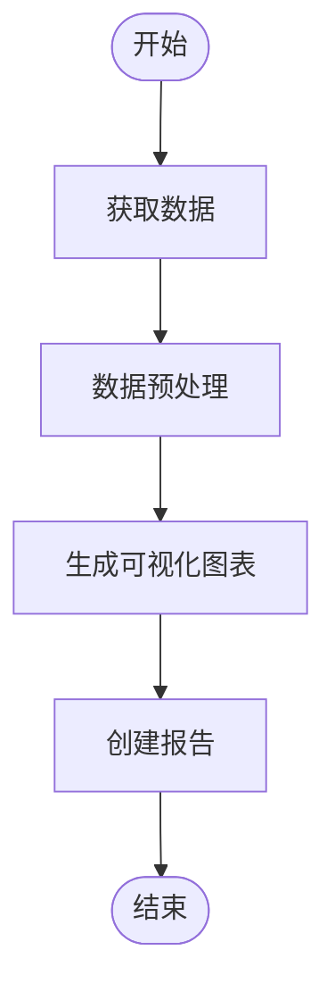
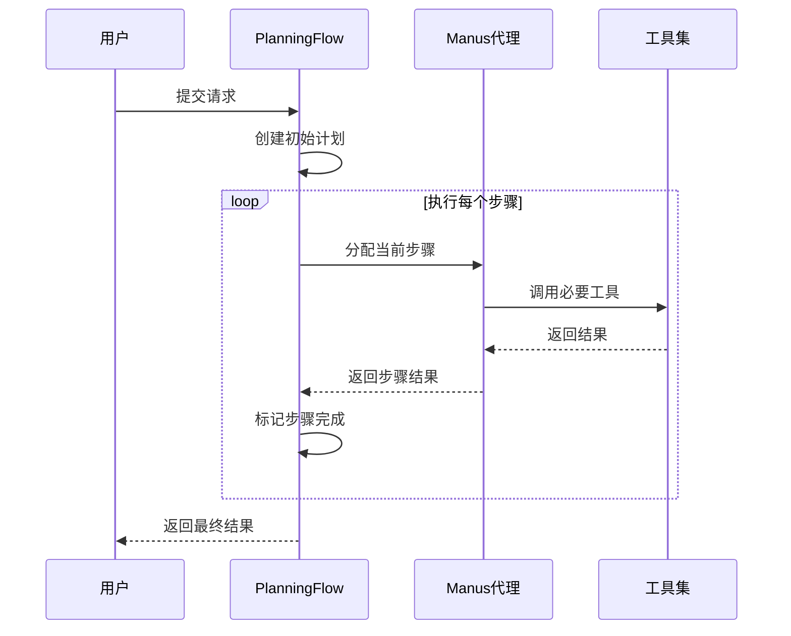

# 示例用例

<cite>
**本文档引用的文件**  
- [japan_travel_guide_instructions.txt](file://examples/use_case/japan-travel-plan/japan_travel_guide_instructions.txt)
- [japan_travel_handbook.html](file://examples/use_case/japan-travel-plan/japan_travel_handbook.html)
- [japan_travel_handbook_mobile.html](file://examples/use_case/japan-travel-plan/japan_travel_handbook_mobile.html)
- [japan_travel_handbook_print.html](file://examples/use_case/japan-travel-plan/japan_travel_handbook_print.html)
- [readme.md](file://examples/use_case/readme.md)
- [manus.py](file://app/agent/manus.py)
- [data_analysis.py](file://app/agent/data_analysis.py)
- [web_search.py](file://app/tool/web_search.py)
- [python_execute.py](file://app/tool/python_execute.py)
- [data_visualization.py](file://app/tool/chart_visualization/data_visualization.py)
- [file_operators.py](file://app/tool/file_operators.py)
- [planning.py](file://app/flow/planning.py)
- [flow_factory.py](file://app/flow/flow_factory.py)
- [run_flow.py](file://run_flow.py)
- [config.py](file://app/config.py)
</cite>

## 目录
1. [日本旅行计划案例](#日本旅行计划案例)
2. [数据分析任务示例](#数据分析任务示例)
3. [复杂任务分解与多代理协作](#复杂任务分解与多代理协作)
4. [高级用例与最佳实践](#高级用例与最佳实践)

## 日本旅行计划案例

本案例展示了OpenManus如何为用户提供完整的日本旅行计划解决方案。系统接收用户需求后，自动生成详细的7天行程安排，并创建多版本旅行手册。

### 需求分析

用户需求包括：从西雅图出发的7天日本行程（4月15-23日），预算2500-5000美元，包含历史景点、文化体验（剑道、茶道、禅修）、奈良鹿园游览和城市徒步探索。特别要求在旅途中求婚，并需要推荐特殊地点。

系统通过`manus`代理处理此请求，该代理配置了多种工具来满足复杂需求。核心功能包括网络搜索、浏览器交互、文件操作和任务规划。

**代理选择**
- 主要代理：`Manus`代理，负责整体任务协调
- 工具集成：`WebSearch`用于获取实时信息，`BrowserUseTool`用于网页交互，`FileOperators`用于生成和保存文件

**工具调用序列**
1. 使用`web_search`工具查询日本旅游相关信息
2. 通过`python_execute`进行预算计算和行程优化
3. 使用`file_operators`创建HTML格式的旅行手册
4. 调用`planning`工具管理任务进度

**输出结果**
系统生成了三个版本的旅行手册：
- **数字版**：`japan_travel_handbook.html`，包含完整行程、酒店推荐和预算明细
- **打印版**：`japan_travel_handbook_print.html`，优化了打印格式
- **移动版**：`japan_travel_handbook_mobile.html`，支持触控操作和暗色模式

特别地，系统为求婚时刻提供了详细规划，推荐在4月19日下午5:30于圆山公园的垂枝樱树下进行，并提供了备用方案和庆祝晚餐选择。

**Section sources**
- [readme.md](file://examples/use_case/readme.md#L1-L16)
- [japan_travel_guide_instructions.txt](file://examples/use_case/japan-travel-plan/japan_travel_guide_instructions.txt#L1-L62)
- [japan_travel_handbook.html](file://examples/use_case/japan-travel-plan/japan_travel_handbook.html#L1-L124)
- [manus.py](file://app/agent/manus.py#L17-L164)

## 数据分析任务示例

本示例展示OpenManus从数据获取到可视化报告生成的完整流程。

### 数据获取与处理

使用`DataAnalysis`代理处理数据分析任务。该代理专门配置了数据处理工具集，包括`NormalPythonExecute`、`VisualizationPrepare`和`DataVisualization`。

**Diagram sources**
- [data_analysis.py](file://app/agent/data_analysis.py#L11-L36)
- [data_visualization.py](file://app/tool/chart_visualization/data_visualization.py#L1-L263)

### 可视化流程

1. **数据准备**：使用`VisualizationPrepare`工具准备数据
2. **图表生成**：调用`data_visualization`工具生成PNG或HTML格式图表
3. **洞察添加**：可选地为图表添加分析洞察
4. **报告输出**：生成包含图表和分析的Markdown报告

系统支持多种输出格式，包括交互式HTML图表和静态PNG图像，满足不同使用场景需求。

**Section sources**
- [data_analysis.py](file://app/agent/data_analysis.py#L11-L36)
- [data_visualization.py](file://app/tool/chart_visualization/data_visualization.py#L1-L263)
- [python_execute.py](file://app/tool/python_execute.py#L1-L75)

## 复杂任务分解与多代理协作

本部分展示OpenManus如何处理复杂任务的分解和多代理协作。

### 任务规划流程

系统使用`PlanningFlow`实现复杂任务的分解和执行。`FlowFactory`根据配置创建相应的流程实例。

**Diagram sources**
- [planning.py](file://app/flow/planning.py#L93-L133)
- [flow_factory.py](file://app/flow/flow_factory.py#L1-L30)
- [manus.py](file://app/agent/manus.py#L17-L164)

### 多代理协作机制

当配置启用时，系统可以同时使用多个代理：
- `manus`代理：处理通用任务
- `data_analysis`代理：处理数据分析任务

通过`run_flow`脚本中的配置，系统可以根据任务类型自动选择合适的代理或组合使用多个代理。

**Section sources**
- [planning.py](file://app/flow/planning.py#L93-L133)
- [flow_factory.py](file://app/flow/flow_factory.py#L1-L30)
- [run_flow.py](file://run_flow.py#L1-L52)

## 高级用例与最佳实践

### 配置管理

系统通过`config.py`实现灵活的配置管理，支持多种LLM模型、搜索引擎和沙箱环境的配置。用户可以通过修改配置文件来定制系统行为。

### 错误处理与重试机制

`WebSearch`工具实现了完善的错误处理和重试机制：
- 支持多个搜索引擎的故障转移
- 可配置的重试次数和延迟
- 自动切换备用搜索引擎

### 安全执行环境

`python_execute`工具在独立的进程中执行代码，设置了5秒的超时限制，确保系统安全。代码在受限的命名空间中执行，防止访问系统资源。

**Section sources**
- [config.py](file://app/config.py#L1-L372)
- [web_search.py](file://app/tool/web_search.py#L200-L287)
- [python_execute.py](file://app/tool/python_execute.py#L1-L75)
- [file_operators.py](file://app/tool/file_operators.py#L1-L158)