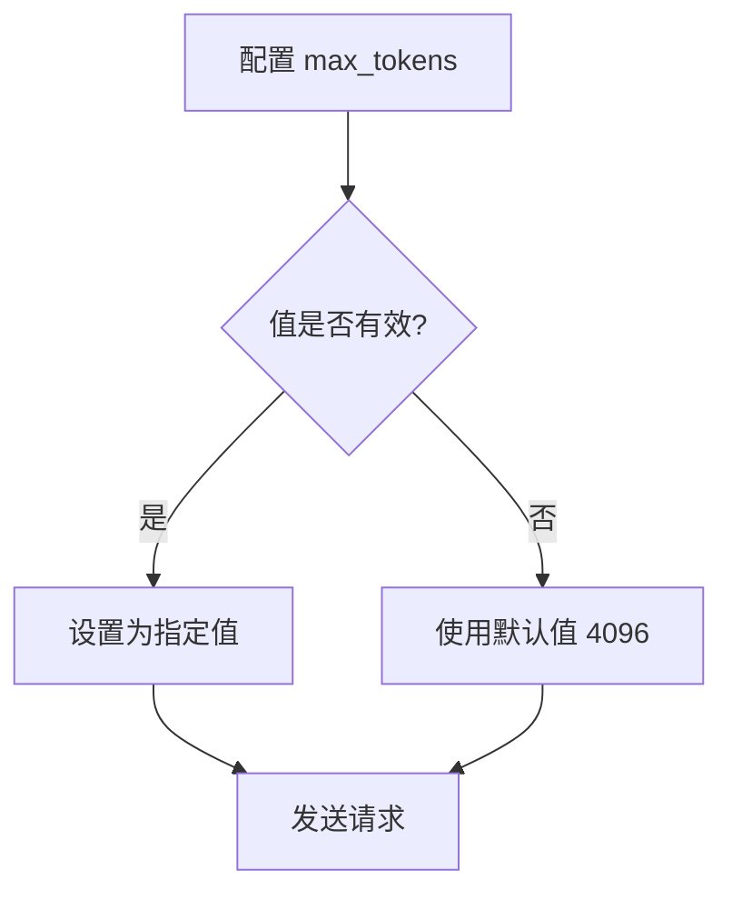
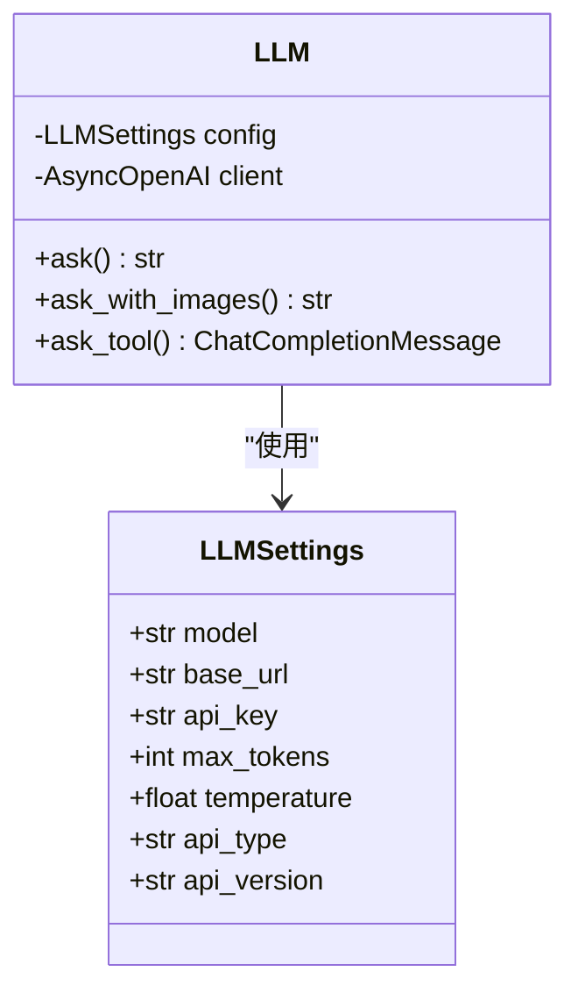
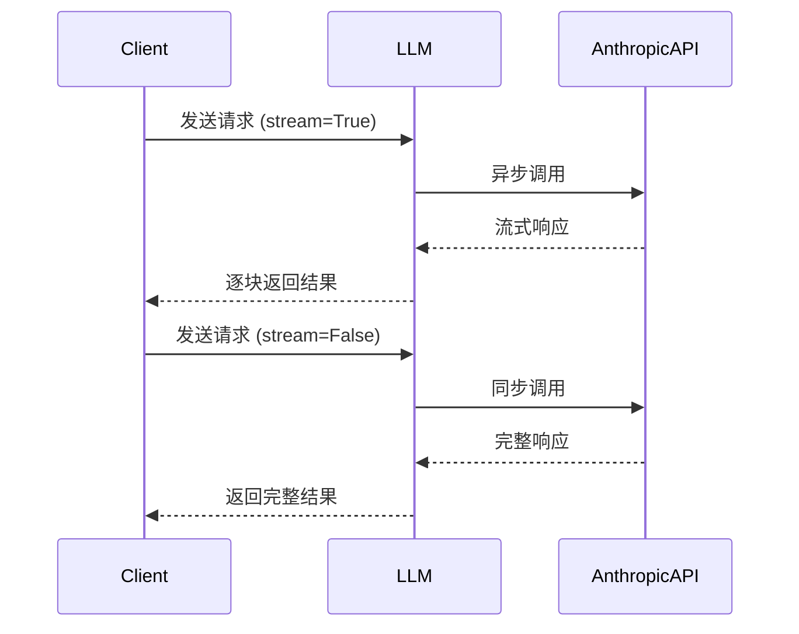

# Anthropic 配置

<cite>
**本文档中引用的文件**
- [config.example-model-anthropic.toml](file://config/config.example-model-anthropic.toml)
- [config.py](file://app/config.py)
- [llm.py](file://app/llm.py)
</cite>

## 目录
1. [简介](#简介)
2. [核心配置参数详解](#核心配置参数详解)
3. [Anthropic API 特定配置](#anthropic-api-特定配置)
4. [同步与异步调用配置差异](#同步与异步调用配置差异)
5. [API密钥安全实践](#api密钥安全实践)

## 简介
本文档详细说明了如何基于 `config.example-model-anthropic.toml` 示例文件和 `LLMSettings` 数据模型配置 Anthropic LLM 提供商。文档涵盖了模型选择、API端点设置、API密钥管理、令牌限制以及温度参数等关键配置项。

**Section sources**
- [config.example-model-anthropic.toml](file://config/config.example-model-anthropic.toml)

## 核心配置参数详解

### model 参数配置
`model` 参数用于指定要使用的 Claude 系列模型。在配置文件中，可以指定如 `claude-3-opus-20240229` 这样的具体模型版本，也可以使用 `claude-3-7-sonnet-latest` 这样的别名来使用最新版本的模型。

**Section sources**
- [config.example-model-anthropic.toml](file://config/config.example-model-anthropic.toml#L2)
- [config.py](file://app/config.py#L19)

### base_url 参数配置
`base_url` 参数应设置为 Anthropic API 的端点 URL。对于 Anthropic 服务，标准的 API 端点为 `https://api.anthropic.com/v1/`。此配置确保了与 Anthropic 服务的正确通信。

**Section sources**
- [config.example-model-anthropic.toml](file://config/config.example-model-anthropic.toml#L3)
- [config.py](file://app/config.py#L20)

### max_tokens 参数限制
`max_tokens` 参数定义了每次请求中响应的最大令牌数。在 Anthropic API 中，该值有特殊限制，最大可设置为 8192 个令牌。在代码实现中，`LLMSettings` 模型的默认值为 4096，但可以在配置文件中根据需要进行调整。

**Diagram sources**
- [config.example-model-anthropic.toml](file://config/config.example-model-anthropic.toml#L5)
- [config.py](file://app/config.py#L22)

**Section sources**
- [config.example-model-anthropic.toml](file://config/config.example-model-anthropic.toml#L5)
- [config.py](file://app/config.py#L22)

### temperature 参数影响
`temperature` 参数控制输出的创造性。较低的温度值（如 0.0）会产生更确定性和保守的输出，而较高的温度值（如 1.0）会增加输出的随机性和创造性。在 Anthropic 配置中，可以根据需要调整此参数以获得期望的响应风格。

**Section sources**
- [config.example-model-anthropic.toml](file://config/config.example-model-anthropic.toml#L6)
- [config.py](file://app/config.py#L27)

## Anthropic API 特定配置

### api_type 参数设置
`api_type` 参数必须配置为 'anthropic' 以标识使用的是 Anthropic 服务提供商。这是区分不同 LLM 服务提供商的关键配置，确保了正确的客户端初始化和 API 调用方式。

**Diagram sources**
- [config.py](file://app/config.py#L18-L29)
- [llm.py](file://app/llm.py#L173-L765)

**Section sources**
- [config.py](file://app/config.py#L28)

## 同步与异步调用配置差异
系统支持同步和异步两种调用模式。异步调用通过 `AsyncOpenAI` 客户端实现，允许非阻塞的 API 调用，提高整体性能。同步调用则在需要立即获取结果的场景下使用。配置本身不区分同步或异步，调用模式由代码实现决定。

**Diagram sources**
- [llm.py](file://app/llm.py#L500-L550)

**Section sources**
- [llm.py](file://app/llm.py#L173-L765)

## API密钥安全实践

### API密钥获取与存储
`api_key` 参数用于存储 Anthropic API 密钥。最佳实践是通过环境变量注入 API 密钥，而不是直接在配置文件中硬编码。这可以通过在运行时从环境变量读取密钥来实现，确保密钥不会意外暴露在版本控制系统中。

### 环境变量注入最佳实践
推荐使用环境变量来管理 API 密钥。可以在系统环境变量中设置 `ANTHROPIC_API_KEY`，然后在应用程序启动时读取该变量并注入到配置中。这种方法既安全又灵活，便于在不同环境（开发、测试、生产）之间切换。

**Section sources**
- [config.example-model-anthropic.toml](file://config/config.example-model-anthropic.toml#L4)
- [config.py](file://app/config.py#L21)