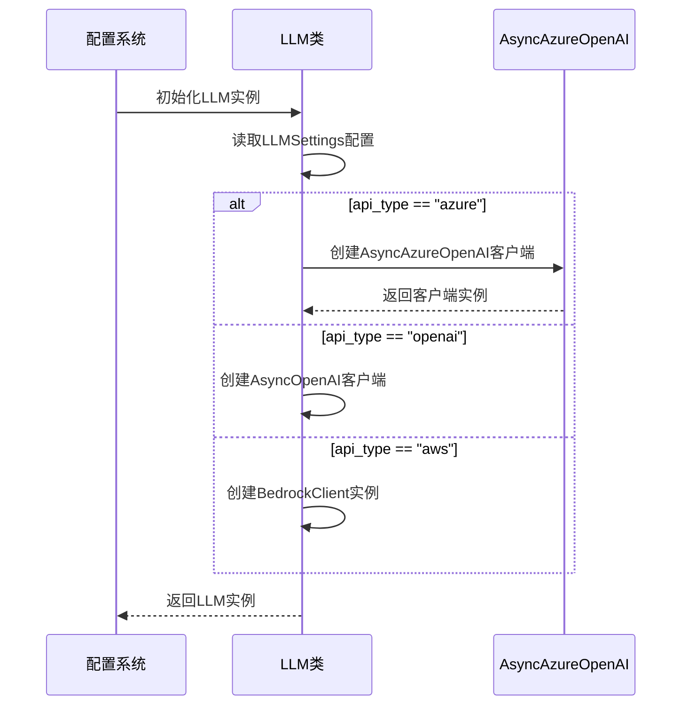

# Azure 配置

<cite>
**Referenced Files in This Document**   
- [config.example-model-azure.toml](file://config/config.example-model-azure.toml)
- [config.py](file://app/config.py)
- [llm.py](file://app/llm.py)
</cite>

## 目录
1. [简介](#简介)
2. [核心配置参数详解](#核心配置参数详解)
3. [Azure OpenAI客户端初始化](#azure-openai客户端初始化)
4. [多区域部署配置策略](#多区域部署配置策略)
5. [认证与安全最佳实践](#认证与安全最佳实践)
6. [资源组与命名规范](#资源组与命名规范)
7. [配置文件组织建议](#配置文件组织建议)

## 简介
本文档深入解析OpenManus项目中Azure OpenAI服务的集成配置，基于`config.example-model-azure.toml`文件。重点阐述了如何正确配置Azure特定参数，包括API类型、版本、基础URL以及模型映射等关键设置。文档还涵盖了多区域部署策略、认证机制以及配置管理的最佳实践，为开发者提供全面的Azure OpenAI集成指南。

**Section sources**
- [config.example-model-azure.toml](file://config/config.example-model-azure.toml#L1-L19)

## 核心配置参数详解

### api_type 必须设置为 'Azure'
在配置文件中，`api_type` 参数必须明确设置为 `'azure'`，这是区分不同LLM服务提供商的关键标识。该设置直接影响底层客户端的初始化逻辑，确保使用`AsyncAzureOpenAI`而非标准的`AsyncOpenAI`客户端。

```toml
api_type= 'azure'
```

当`api_type`被设置为'azure'时，系统会根据此值选择正确的客户端类型进行初始化，这是Azure OpenAI服务调用的前提条件。

### api_version 匹配部署版本
`api_version` 参数必须与Azure门户中部署的API版本完全匹配。示例配置中使用了占位符 `"AZURE API VERSION"`，实际使用时应替换为具体的版本号，如 `"2023-05-15"` 或 `"2024-08-01-preview"`。

```toml
api_version="AZURE API VERSION"
```

此版本号决定了可用的API功能集和请求/响应格式，必须与Azure资源的实际配置保持一致。

### base_url 区域端点配置
`base_url` 参数需要指向特定区域的Azure OpenAI端点，采用以下格式：

```toml
base_url = "{YOUR_AZURE_ENDPOINT.rstrip('/')}/openai/deployments/{AZURE_DEPLOYMENT_ID}"
```

其中：
- `YOUR_AZURE_ENDPOINT` 是Azure门户提供的基础端点URL
- `AZURE_DEPLOYMENT_ID` 是在Azure中创建的具体部署名称
- 必须包含 `.azure.com` 域名
- URL结构遵循 `/openai/deployments/{deployment_id}` 的路径模式

### model 参数映射规则
在Azure OpenAI中，`model` 参数不是使用原始模型ID（如gpt-4），而是使用在Azure门户中创建的**部署名称**。例如：

```toml
model = "gpt-4o-mini"
```

这里的 `gpt-4o-mini` 是用户在Azure资源中为某个具体模型（可能是gpt-4o-mini-2024-07-18）创建的部署实例名称。这种设计允许在同一模型基础上创建多个具有不同配置的部署实例。

**Section sources**
- [config.example-model-azure.toml](file://config/config.example-model-azure.toml#L2-L10)
- [config.py](file://app/config.py#L28-L29)
- [llm.py](file://app/llm.py#L147-L159)

## Azure OpenAI客户端初始化

### 配置数据模型
系统通过`LLMSettings` Pydantic模型定义了Azure OpenAI的配置结构，其中包含所有必要的字段：

```python
class LLMSettings(BaseModel):
    model: str
    base_url: str
    api_key: str
    max_tokens: int
    temperature: float
    api_type: str  # "azure", "openai", or "ollama"
    api_version: str
```

该模型确保了配置数据的类型安全和完整性验证。

### 客户端实例化逻辑
在`LLM`类的初始化过程中，系统根据`api_type`的值动态选择客户端类型：

```python
if self.api_type == "azure":
    self.client = AsyncAzureOpenAI(
        base_url=self.base_url,
        api_key=self.api_key,
        api_version=self.api_version,
    )
elif self.api_type == "aws":
    self.client = BedrockClient()
else:
    self.client = AsyncOpenAI(api_key=self.api_key, base_url=self.base_url)
```

这种条件初始化模式实现了多云LLM服务的统一接口抽象。

### 配置加载流程
配置系统首先尝试加载`config.toml`，若不存在则回退到`config.example.toml`。对于Azure配置，用户需要将`config.example-model-azure.toml`复制并重命名为`config.toml`，然后填充实际的Azure凭据和端点信息。

**Diagram sources**
- [llm.py](file://app/llm.py#L147-L165)



**Section sources**
- [config.py](file://app/config.py#L18-L29)
- [llm.py](file://app/llm.py#L147-L165)

## 多区域部署配置策略

### 区域感知配置
Azure OpenAI服务支持全球多个区域部署（如East US、West Europe、Southeast Asia等）。每个区域都有独立的端点URL，配置时必须确保`base_url`指向正确的区域端点。

### 故障转移策略
建议为关键应用配置多区域部署策略，通过以下方式实现高可用性：

1. **主备模式**：配置主区域和备用区域，在主区域不可用时自动切换
2. **负载均衡**：根据用户地理位置路由到最近的区域端点
3. **健康检查**：定期检测各区域端点的可用性

### 区域选择考量
选择部署区域时应考虑：
- **数据主权**：遵守当地数据驻留法规
- **延迟要求**：选择离用户最近的区域以降低延迟
- **服务可用性**：确认目标区域已提供所需模型
- **成本差异**：不同区域的定价可能有所不同

**Section sources**
- [config.example-model-azure.toml](file://config/config.example-model-azure.toml#L2-L10)

## 认证与安全最佳实践

### API密钥管理
虽然示例配置直接使用`api_key`，但在生产环境中应采用更安全的认证方式：

```toml
api_key = "YOUR_API_KEY"  # 仅用于示例
```

### Azure Active Directory认证
推荐使用Azure AD进行身份验证，替代静态API密钥：

1. **服务主体认证**：为应用程序创建服务主体并分配适当角色
2. **托管身份**：在Azure资源（如App Service、VM）中使用系统分配的托管身份
3. **令牌认证**：通过Azure SDK获取访问令牌并用于API调用

### 安全配置建议
- **环境变量**：将敏感信息存储在环境变量而非配置文件中
- **密钥轮换**：定期轮换API密钥
- **最小权限原则**：为服务主体分配最小必要权限
- **网络限制**：配置IP白名单或虚拟网络服务终结点

**Section sources**
- [config.example-model-azure.toml](file://config/config.example-model-azure.toml#L5-L6)

## 资源组与命名规范

### 资源组组织
建议按以下方式组织Azure资源：

```
Resource Group: rg-openmanus-prod
├── Azure OpenAI Service: aoai-openmanus-prod
│   ├── Deployment: gpt-4o-mini
│   ├── Deployment: gpt-4o
│   └── Deployment: text-embedding-ada-002
├── Storage Account: stgopenmanusprod
└── Key Vault: kv-openmanus-prod
```

### 部署命名规范
采用一致的命名约定提高可维护性：

| 部署类型 | 命名模式 | 示例 |
|---------|---------|------|
| GPT模型 | `{model}-{size}` | gpt-4o-mini, gpt-4o |
| 嵌入模型 | `embedding-{model}` | embedding-ada-002 |
| 自定义模型 | `{project}-{model}` | openmanus-gpt-4o |

### 版本控制
对于需要版本控制的部署，可采用：

- `gpt-4o-v1`, `gpt-4o-v2`
- `gpt-4o-2024q3`, `gpt-4o-2024q4`

这便于在不中断服务的情况下进行模型更新。

**Section sources**
- [config.example-model-azure.toml](file://config/config.example-model-azure.toml#L3-L4)

## 配置文件组织建议

### 配置文件分离
项目提供了多种配置模板，建议采用以下策略：

1. **环境分离**：为开发、测试、生产环境创建独立的配置文件
2. **服务分离**：为不同LLM服务提供商使用专用配置模板
3. **版本控制**：将`config.example-*.toml`纳入版本控制，而`config.toml`应被.gitignore忽略

### 配置继承机制
系统支持配置继承，允许在基础配置上进行覆盖：

```toml
[llm]
# 基础配置
model = "gpt-4o-mini"
api_type = "azure"

[llm.vision]
# 覆盖基础配置的特定字段
model = "gpt-4o"
```

### 敏感信息保护
- 使用`.env`文件存储API密钥等敏感信息
- 在CI/CD管道中通过秘密管理服务注入凭据
- 避免在代码仓库中提交包含实际凭据的配置文件

**Section sources**
- [config.example-model-azure.toml](file://config/config.example-model-azure.toml#L1-L19)
- [config.py](file://app/config.py#L331-L372)