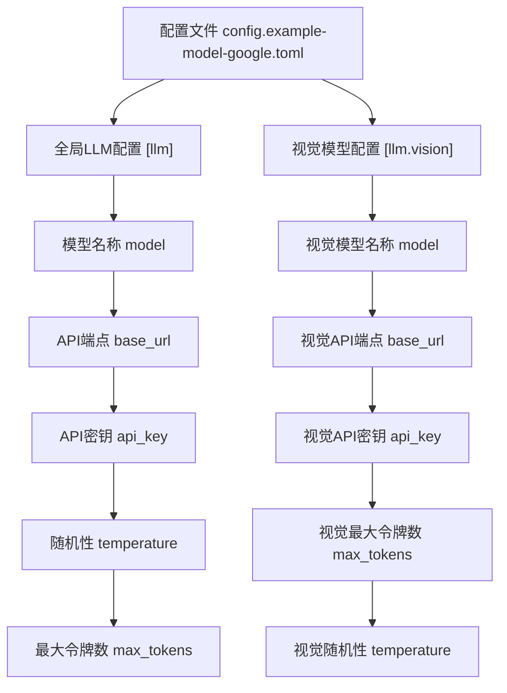
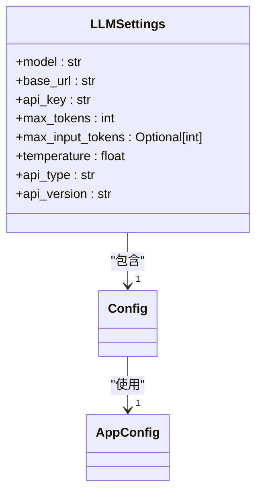
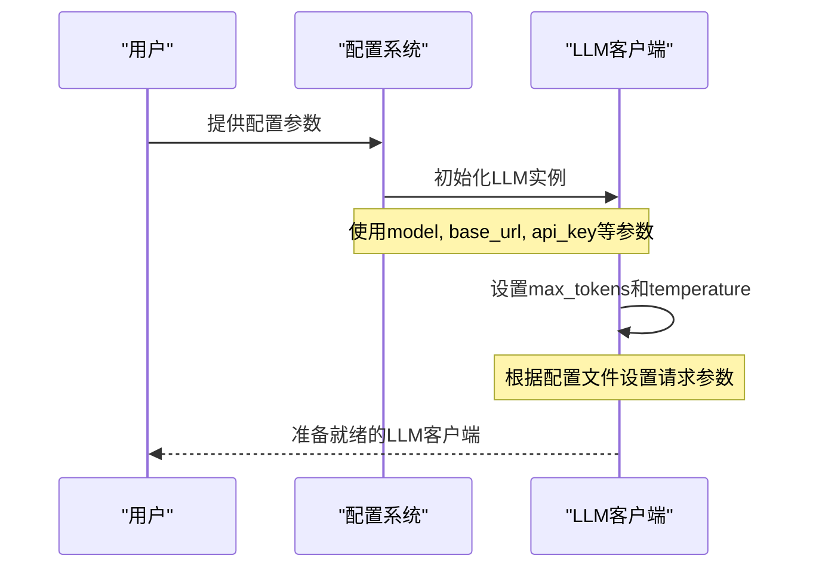

# Google 配置

<cite>
**Referenced Files in This Document**   
- [config.example-model-google.toml](file://config/config.example-model-google.toml)
- [config.py](file://app/config.py)
- [llm.py](file://app/llm.py)
</cite>

## 目录
1. [简介](#简介)
2. [配置文件结构](#配置文件结构)
3. [核心配置参数](#核心配置参数)
4. [API密钥与IAM权限](#api密钥与iam权限)
5. [请求参数配置](#请求参数配置)
6. [VPC Service Controls配置](#vpc-service-controls配置)

## 简介
本文档详细阐述了如何在OpenManus项目中配置Google Vertex AI或Gemini API。文档基于`config.example-model-google.toml`配置文件，全面说明了Google模型的配置流程、API端点设置、认证机制以及特殊环境下的配置注意事项。

**Section sources**
- [config.example-model-google.toml](file://config/config.example-model-google.toml#L0-L15)

## 配置文件结构
Google模型的配置采用TOML格式，包含全局LLM配置和可选的特定模型配置。配置文件支持为不同类型的Google模型（如文本和视觉模型）设置独立的参数。

**Diagram sources**
- [config.example-model-google.toml](file://config/config.example-model-google.toml#L0-L15)

**Section sources**
- [config.example-model-google.toml](file://config/config.example-model-google.toml#L0-L15)

## 核心配置参数

### base_url配置
`base_url`参数必须指向Google Cloud的特定区域API端点。在示例配置中，使用的是`https://generativelanguage.googleapis.com/v1beta/openai/`，这是Google Generative Language API的端点。对于Vertex AI，可能需要使用类似`https://us-central1-aiplatform.googleapis.com/`的区域特定端点。

### model参数配置
`model`参数应匹配可用的PaLM 2或Gemini模型名称。在配置文件中，主模型设置为`gemini-2.0-flash`，视觉模型设置为`gemini-2.0-flash-exp`。这些名称必须与Google Cloud中实际可用的模型名称完全匹配。

**Diagram sources**
- [config.py](file://app/config.py#L18-L29)
- [config.py](file://app/config.py#L339-L371)

**Section sources**
- [config.example-model-google.toml](file://config/config.example-model-google.toml#L2-L5)
- [config.py](file://app/config.py#L18-L29)

## API密钥与IAM权限

### API密钥生成
API密钥需要在Google Cloud Console中生成。用户需要导航到"API和服务" > "凭据"部分，创建新的API密钥。生成的密钥应替换配置文件中的`YOUR_API_KEY`占位符。

### IAM权限要求
为了确保API调用的正常工作，服务账户需要适当的IAM角色。虽然配置文件主要使用API密钥进行认证，但在某些情况下（如使用服务账户令牌），`serviceAccountTokenCreator`角色可能是必要的，因为它允许创建服务账户的访问令牌。

**Section sources**
- [config.example-model-google.toml](file://config/config.example-model-google.toml#L4)
- [config.py](file://app/config.py#L21)

## 请求参数配置

### max_tokens配置
`max_tokens`参数控制响应的最大令牌数量。在Google API中，这个值直接影响生成内容的长度限制。在配置文件中，主模型设置为8096，视觉模型设置为8192。这些值需要根据具体模型的限制进行调整。

### temperature参数
`temperature`参数调节响应的随机性。较低的值（如配置中的0.0）会产生更确定性和一致的输出，而较高的值会产生更多样化和创造性的响应。这个参数在生成需要精确性和一致性的内容时特别有用。

**Diagram sources**
- [config.example-model-google.toml](file://config/config.example-model-google.toml#L5-L6)
- [llm.py](file://app/llm.py#L185-L200)

**Section sources**
- [config.example-model-google.toml](file://config/config.example-model-google.toml#L5-L6)
- [llm.py](file://app/llm.py#L185-L200)

## VPC Service Controls配置
在VPC Service Controls环境下，需要额外的配置来确保API调用的安全性和可达性。这可能包括配置服务边界、设置适当的防火墙规则以及确保API端点在受保护的服务范围内。虽然当前配置文件没有直接体现这些设置，但在生产环境中部署时必须考虑这些安全控制。

**Section sources**
- [config.example-model-google.toml](file://config/config.example-model-google.toml#L0-L15)
- [config.py](file://app/config.py#L18-L29)