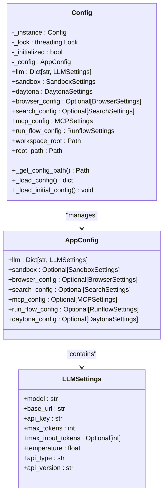
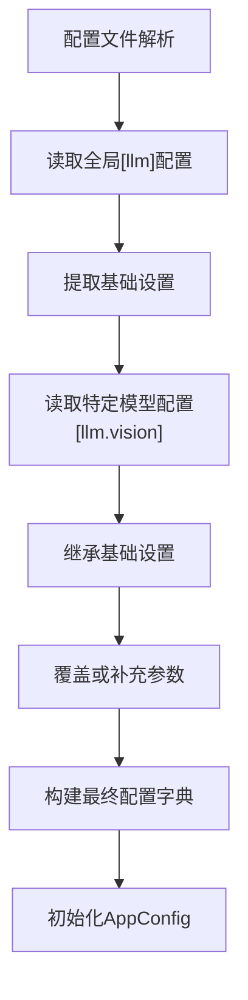

# LLM配置

<cite>
**Referenced Files in This Document**   
- [config.py](file://app/config.py)
- [config.example.toml](file://config/config.example.toml)
- [config.example-model-anthropic.toml](file://config/config.example-model-anthropic.toml)
- [config.example-model-azure.toml](file://config/config.example-model-azure.toml)
- [config.example-model-google.toml](file://config/config.example-model-google.toml)
- [config.example-model-ollama.toml](file://config/config.example-model-ollama.toml)
- [config.example-model-ppio.toml](file://config/config.example-model-ppio.toml)
</cite>

## 目录
1. [引言](#引言)
2. [核心配置模型](#核心配置模型)
3. [LLM核心参数详解](#llm核心参数详解)
4. [多提供商配置详解](#多提供商配置详解)
5. [多模型配置结构](#多模型配置结构)
6. [高级配置技巧](#高级配置技巧)
7. [开发与生产环境配置](#开发与生产环境配置)
8. [配置继承与覆盖机制](#配置继承与覆盖机制)
9. [结论](#结论)

## 引言
本文档深入解析OpenManus项目中的LLM配置系统实现机制。该系统基于`config.py`中的`LLMSettings`模型和多种LLM提供商的示例配置文件，为用户提供灵活、可扩展的大型语言模型配置方案。文档将详细说明核心参数的作用与配置方法，涵盖Anthropic、Azure、Google、Ollama、PP.io等多种LLM提供商的具体配置差异与连接方式，并提供多模型配置、高级配置技巧以及开发与生产环境的不同配置模式。

**Section sources**
- [config.py](file://app/config.py#L18-L29)
- [config.example.toml](file://config/config.example.toml#L1-L106)

## 核心配置模型
OpenManus的LLM配置系统基于Pydantic模型构建，核心是`LLMSettings`类，定义了所有LLM相关的配置参数。该系统采用单例模式的`Config`类来管理全局配置，确保配置在整个应用生命周期中的一致性和可访问性。



**Diagram sources**
- [config.py](file://app/config.py#L18-L29)
- [config.py](file://app/config.py#L300-L372)

**Section sources**
- [config.py](file://app/config.py#L18-L372)

## LLM核心参数详解
LLM配置系统定义了多个核心参数，这些参数共同决定了LLM的行为和性能特征。

### 模型与连接参数
- **model**: 指定要使用的具体LLM模型名称，如`claude-3-7-sonnet-latest`或`gpt-4o-mini`。该参数是必需的，决定了LLM的具体实现和能力。
- **base_url**: LLM服务的API基础URL，用于建立与LLM提供商的连接。不同的提供商有不同的API端点。
- **api_key**: 访问LLM服务所需的API密钥，是身份验证的关键凭证。

### 性能与行为参数
- **max_tokens**: 限制每个请求的最大token数量，控制响应长度和计算成本。默认值为4096，但不同提供商可能支持更高的值。
- **max_input_tokens**: 可选参数，限制输入token的总数（`None`表示无限制），有助于管理长上下文场景的资源消耗。
- **temperature**: 控制生成文本的随机性或创造性，值越低输出越确定和保守，值越高输出越多样和创造性。默认值为1.0。

### 服务类型参数
- **api_type**: 指定LLM服务的类型，如`azure`、`openai`或`ollama`，用于路由请求到正确的服务适配器。
- **api_version**: 对于Azure OpenAI等服务，指定API的版本号，确保与特定API功能的兼容性。

**Section sources**
- [config.py](file://app/config.py#L18-L29)

## 多提供商配置详解
OpenManus支持多种LLM提供商，每种提供商都有其独特的配置要求和连接方式。

### Anthropic配置
Anthropic配置相对直接，主要需要模型名称、API基础URL和API密钥。其配置示例如下：
```toml
[llm]
model = "claude-3-7-sonnet-latest"
base_url = "https://api.anthropic.com/v1/"
api_key = "YOUR_API_KEY"
max_tokens = 8192
temperature = 0.0
```

### Azure OpenAI配置
Azure OpenAI配置较为复杂，需要指定`api_type`为`azure`，并且`base_url`需要包含Azure端点和部署ID的模板。此外，还需要指定`api_version`。
```toml
[llm]
api_type= 'azure'
model = "gpt-4o-mini"
base_url = "{YOUR_AZURE_ENDPOINT.rstrip('/')}/openai/deployments/{AZURE_DEPLOYMENT_ID}"
api_key = "YOUR_API_KEY"
max_tokens = 8096
temperature = 0.0
api_version="2024-08-01-preview"
```

### Google Gemini配置
Google Gemini配置使用特定的API基础URL，并且模型名称遵循Gemini的命名约定。
```toml
[llm]
model = "gemini-2.0-flash"
base_url = "https://generativelanguage.googleapis.com/v1beta/openai/"
api_key = "YOUR_API_KEY"
temperature = 0.0
max_tokens = 8096
```

### Ollama配置
Ollama配置用于本地运行的LLM服务，`base_url`指向本地Ollama服务器，`api_key`通常设置为`"ollama"`。
```toml
[llm]
api_type = 'ollama'
model = "llama3.2"
base_url = "http://localhost:11434/v1"
api_key = "ollama"
max_tokens = 4096
temperature = 0.0
```

### PP.io配置
PP.io配置类似于标准OpenAI配置，但使用PP.io特定的API端点。
```toml
[llm]
api_type = 'ppio'
model = "deepseek/deepseek-v3-0324"
base_url = "https://api.ppinfra.com/v3/openai"
api_key = "your ppio api key"
max_tokens = 16000
temperature = 0.0
```

**Section sources**
- [config.example-model-anthropic.toml](file://config/config.example-model-anthropic.toml#L1-L17)
- [config.example-model-azure.toml](file://config/config.example-model-azure.toml#L1-L19)
- [config.example-model-google.toml](file://config/config.example-model-google.toml#L1-L17)
- [config.example-model-ollama.toml](file://config/config.example-model-ollama.toml#L1-L18)
- [config.example-model-ppio.toml](file://config/config.example-model-ppio.toml#L1-L18)

## 多模型配置结构
系统支持通过TOML配置文件的层级结构来组织多个模型配置，实现灵活的模型管理。

### 默认模型与特定模型
配置文件使用`[llm]`部分定义默认模型，同时可以使用`[llm.vision]`等子部分定义特定用途的模型。这种结构允许为不同任务（如视觉处理）配置专门的模型。

### 配置继承机制
特定模型配置会继承默认模型的配置参数，然后进行覆盖或补充。例如，`llm.vision`配置会继承`llm`中的`base_url`和`api_key`，但可以指定不同的`model`和`max_tokens`。



**Diagram sources**
- [config.py](file://app/config.py#L300-L372)
- [config.example.toml](file://config/config.example.toml#L1-L106)

**Section sources**
- [config.py](file://app/config.py#L300-L372)
- [config.example.toml](file://config/config.example.toml#L1-L106)

## 高级配置技巧
### API密钥管理
API密钥应始终通过配置文件管理，避免硬编码在源代码中。建议使用环境变量或安全的密钥管理服务来存储敏感信息，并在配置文件中引用。

### 请求限制设置
合理设置`max_tokens`和`max_input_tokens`可以有效控制API调用的成本和性能。对于长文档处理任务，可以适当提高这些值；对于简单查询，则可以降低以节省资源。

### 采样温度调节
`temperature`参数的调节是控制LLM输出质量的关键。对于需要精确答案的任务（如数学计算），建议使用较低的温度（如0.0-0.3）；对于需要创意的任务（如故事生成），可以使用较高的温度（如0.7-1.0）。

**Section sources**
- [config.py](file://app/config.py#L27-L27)
- [config.py](file://app/config.py#L22-L22)
- [config.py](file://app/config.py#L23-L26)

## 开发与生产环境配置
系统通过配置文件的继承和覆盖机制支持不同的环境配置。

### 开发环境配置
开发环境通常使用`config.example.toml`作为模板，配置为易于调试的设置，如使用本地Ollama服务或测试API密钥。

### 生产环境配置
生产环境应创建`config.toml`文件，配置为高性能、高安全性的设置，如使用生产级API密钥和优化的模型参数。

### 环境切换机制
系统自动优先加载`config.toml`，如果不存在则回退到`config.example.toml`，这种机制简化了环境切换和部署流程。

**Section sources**
- [config.py](file://app/config.py#L330-L340)
- [config.example.toml](file://config/config.example.toml#L1-L106)

## 配置继承与覆盖机制
配置系统实现了复杂的继承与覆盖逻辑，确保配置的灵活性和一致性。

### 配置加载流程
1. 系统首先尝试加载`config.toml`
2. 如果不存在，则加载`config.example.toml`
3. 解析TOML文件为字典
4. 提取全局LLM配置作为默认设置
5. 识别并处理特定模型配置（如`llm.vision`）
6. 为每个特定配置继承默认设置并应用覆盖
7. 构建最终的配置字典并初始化`AppConfig`

### 覆盖优先级
特定模型配置的参数优先级高于全局配置，这意味着可以在不修改全局设置的情况下为特定任务定制模型行为。

**Section sources**
- [config.py](file://app/config.py#L340-L372)

## 结论
OpenManus的LLM配置系统通过`LLMSettings`模型和灵活的TOML配置文件，为用户提供了强大而易用的LLM管理能力。系统支持多种LLM提供商，通过清晰的参数定义和继承机制，实现了配置的灵活性和可维护性。开发者可以根据具体需求，轻松配置和切换不同的LLM服务，同时通过高级配置技巧优化模型性能和成本。这种设计模式为构建可扩展的AI应用提供了坚实的基础。