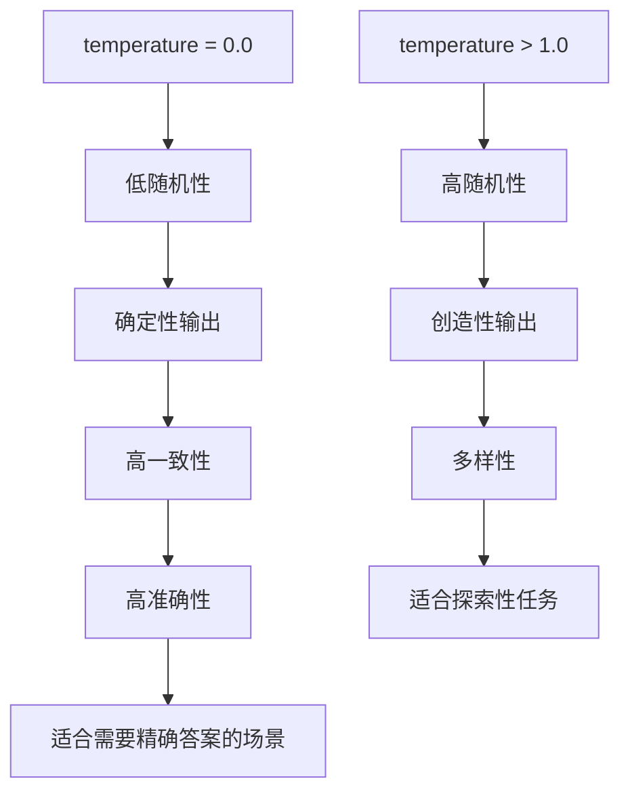

# Ollama 配置

<cite>
**Referenced Files in This Document**  
- [config.example-model-ollama.toml](file://config/config.example-model-ollama.toml)
- [llm.py](file://app/llm.py)
- [config.py](file://app/config.py)
</cite>

## 目录
1. [简介](#简介)
2. [Ollama 服务配置详解](#ollama-服务配置详解)
3. [参数对性能与响应质量的影响](#参数对性能与响应质量的影响)
4. [Docker 容器化部署方案](#docker-容器化部署方案)
5. [GPU 加速环境资源配置](#gpu-加速环境资源配置)

## 简介
本文档系统性地介绍了如何在 OpenManus 项目中配置本地 Ollama 模型服务。基于 `config.example-model-ollama.toml` 文件，详细说明了关键配置项的设置方法，包括服务地址、模型名称、认证方式等。同时分析了核心参数对模型性能的影响，并提供了 Docker 容器化部署和 GPU 加速环境下的资源配置建议。

## Ollama 服务配置详解

在 OpenManus 项目中，Ollama 服务的配置主要通过 `config.example-model-ollama.toml` 文件进行。该文件定义了全局 LLM 配置和视觉模型配置，为本地大语言模型服务提供必要的连接信息。

### 基础配置
Ollama 服务的基础配置包含以下关键参数：

- **api_type**: 必须设置为 'ollama'，标识使用 Ollama 作为 LLM 服务类型
- **base_url**: 指向本地或内网 Ollama 服务的地址，通常为 `http://localhost:11434/v1`
- **model**: 必须与 Ollama 中 pull 的模型名称完全一致，如 `llama3.2` 或 `llama3.2-vision`
- **api_key**: 在 Ollama 中通常留空或使用基础认证令牌

这些配置项共同构成了与 Ollama 服务通信的基础，确保应用程序能够正确识别和连接到本地模型服务。

### 视觉模型配置
对于支持视觉功能的模型，配置文件中还包含了专门的视觉模型配置部分：

- **[llm.vision]**: 专门用于配置视觉模型的独立配置块
- 使用与基础模型相同的配置结构，但针对视觉模型进行了优化
- model 参数应设置为支持视觉功能的模型名称，如 `llama3.2-vision`

这种分离的配置方式允许应用程序同时管理文本模型和视觉模型，为多模态应用提供了灵活的配置选项。

**Section sources**
- [config.example-model-ollama.toml](file://config/config.example-model-ollama.toml#L1-L17)

## 参数对性能与响应质量的影响

Ollama 服务的性能和响应质量受到多个关键参数的影响，其中 `max_tokens` 和 `temperature` 是最重要的两个调节参数。

### max_tokens 参数分析
`max_tokens` 参数定义了模型响应的最大 token 数量，直接影响：

- **响应长度**: 更高的值允许生成更长的响应内容
- **内存占用**: 值越大，内存消耗越高，可能影响系统稳定性
- **响应时间**: 生成更长的响应需要更多计算时间
- **上下文保留**: 在长对话中，适当的 max_tokens 值有助于保持上下文连贯性

在实际应用中，需要根据具体场景平衡响应长度和系统性能。对于需要详细回答的场景，可以适当提高该值；对于实时性要求高的场景，则应适当降低。

### temperature 参数分析
`temperature` 参数控制生成文本的随机性和创造性，其影响曲线如下：

- **低值 (接近 0)**: 产生更确定、更保守的输出，适合需要准确性和一致性的任务
- **中等值 (0.5-0.8)**: 在创造性和准确性之间取得平衡，适合大多数通用场景
- **高值 (大于 1.0)**: 产生更多样化、更具创造性的输出，但可能牺牲准确性

在 `config.example-model-ollama.toml` 文件中，temperature 被设置为 0.0，这表明系统倾向于生成最确定和最保守的响应，适合需要高准确性的应用场景。



**Diagram sources**
- [config.example-model-ollama.toml](file://config/config.example-model-ollama.toml#L8-L9)
- [config.example-model-ollama.toml](file://config/config.example-model-ollama.toml#L16-L17)

**Section sources**
- [config.example-model-ollama.toml](file://config/config.example-model-ollama.toml#L8-L9)
- [config.example-model-ollama.toml](file://config/config.example-model-ollama.toml#L16-L17)

## Docker 容器化部署方案

在 Docker 环境中部署 Ollama 服务需要特别注意网络配置，以确保容器内外的服务能够正确通信。

### 网络配置策略
Docker 容器化部署时的网络配置建议如下：

- **端口映射**: 将容器内的 11434 端口映射到主机的相应端口
- **网络模式**: 使用 host 网络模式或创建自定义桥接网络
- **服务发现**: 确保容器能够通过正确的主机名或 IP 地址访问 Ollama 服务

在 `llm.py` 文件中，LLM 类的初始化过程会根据配置中的 `base_url` 创建相应的客户端实例，这要求 Docker 网络配置必须确保该 URL 可访问。

### 配置文件集成
在容器化环境中，建议将 `config.example-model-ollama.toml` 文件作为配置模板，通过环境变量或卷挂载的方式注入到容器中。这样可以实现配置的动态化管理，避免硬编码服务地址。

```mermaid
graph TB
subgraph "Docker Host"
OllamaService[Ollama 服务]
HostNetwork[主机网络]
end
subgraph "Docker Container"
App[OpenManus 应用]
ContainerNetwork[容器网络]
end
HostNetwork < --> |端口映射 11434| ContainerNetwork
App --> |HTTP 请求| OllamaService
OllamaService --> |API 响应| App
```

**Diagram sources**
- [llm.py](file://app/llm.py#L173-L200)
- [config.example-model-ollama.toml](file://config/config.example-model-ollama.toml#L5)

**Section sources**
- [llm.py](file://app/llm.py#L173-L200)
- [config.example-model-ollama.toml](file://config/config.example-model-ollama.toml#L5)

## GPU 加速环境资源配置

在 GPU 加速环境下，Ollama 服务的资源配置需要特别优化，以充分发挥硬件性能。

### 资源分配策略
GPU 环境下的资源配置建议包括：

- **显存分配**: 根据模型大小合理分配显存，避免显存溢出
- **批处理大小**: 优化批处理大小以平衡吞吐量和延迟
- **并发请求**: 控制并发请求数量，防止 GPU 过载

在 `config.py` 文件中，LLMSettings 类定义了模型配置的结构，包括 `max_tokens` 和 `temperature` 等参数，这些参数的设置需要与 GPU 资源相匹配。

### 性能优化建议
为了在 GPU 环境下获得最佳性能，建议：

- 监控 GPU 利用率和显存使用情况
- 根据实际负载动态调整 `max_tokens` 值
- 在高负载场景下适当降低 `temperature` 值以减少计算复杂度
- 使用批处理技术提高 GPU 利用率

这些优化措施可以帮助在保持响应质量的同时，最大化 GPU 资源的利用效率。

**Section sources**
- [config.py](file://app/config.py#L174-L174)
- [llm.py](file://app/llm.py#L173-L200)