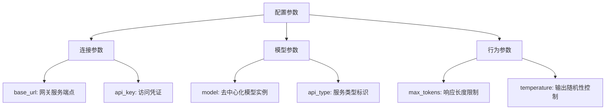
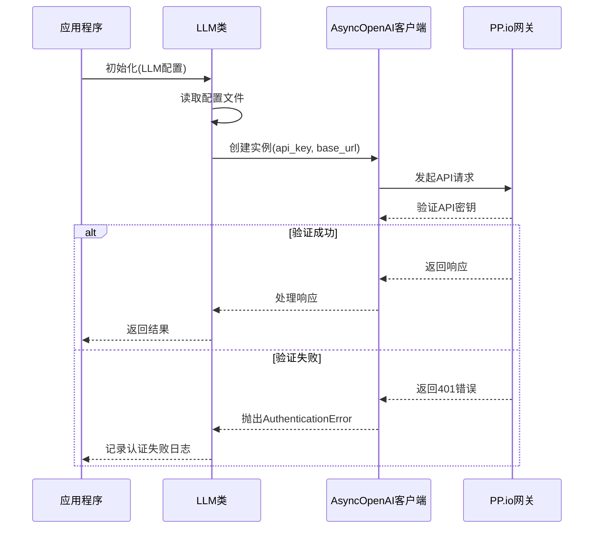
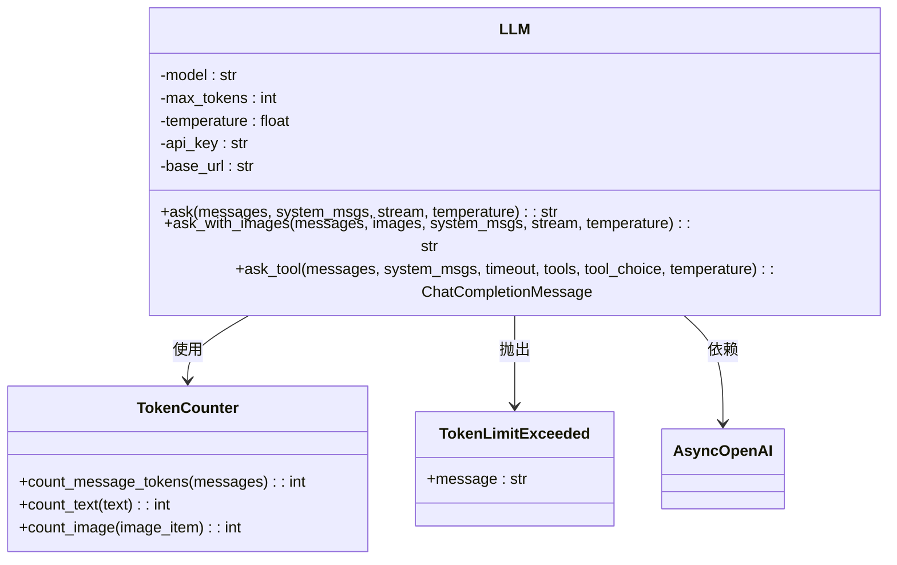
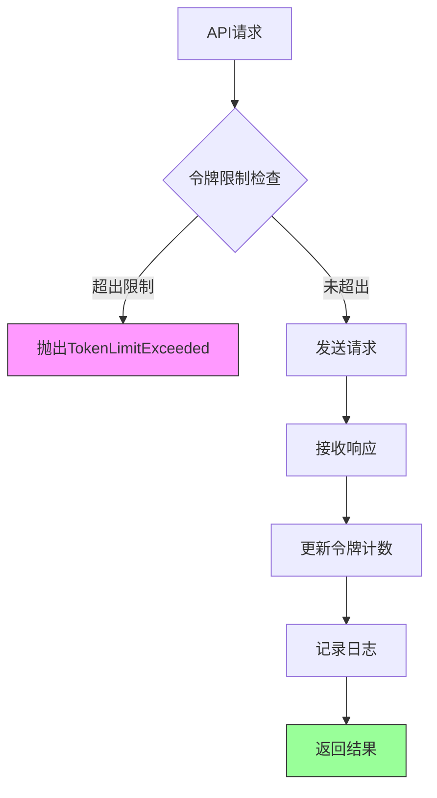

# PP.io 配置

<cite>
**Referenced Files in This Document**   
- [config.example-model-ppio.toml](file://config/config.example-model-ppio.toml)
- [llm.py](file://app/llm.py)
- [exceptions.py](file://app/exceptions.py)
</cite>

## 目录
1. [PP.io 配置概述](#ppio-配置概述)
2. [核心配置参数详解](#核心配置参数详解)
3. [LLM 服务接入与认证](#llm-服务接入与认证)
4. [去中心化模型参数实现](#去中心化模型参数实现)
5. [多节点负载均衡策略](#多节点负载均衡策略)
6. [服务质量监控集成](#服务质量监控集成)

## PP.io 配置概述

PP.io 分布式计算网络的 LLM 服务配置通过 `config.example-model-ppio.toml` 文件实现，该文件定义了与 PP.io 网关服务的连接参数和模型行为。配置文件采用 TOML 格式，包含全局 LLM 配置和视觉模型配置两个主要部分，分别对应文本生成和图像理解任务。

**Section sources**
- [config.example-model-ppio.toml](file://config/config.example-model-ppio.toml#L0-L17)

## 核心配置参数详解

PP.io 配置文件中的核心参数定义了与去中心化网络的交互方式和模型行为。这些参数在运行时被 `LLM` 类实例化时读取并应用于 API 请求。

**Diagram sources**
- [config.example-model-ppio.toml](file://config/config.example-model-ppio.toml#L0-L17)
- [llm.py](file://app/llm.py#L173-L765)

**Section sources**
- [config.example-model-ppio.toml](file://config/config.example-model-ppio.toml#L0-L17)
- [llm.py](file://app/llm.py#L173-L765)

## LLM 服务接入与认证

### 网关服务连接

通过 `base_url` 参数连接到 PP.io 网关服务，该参数指定了 API 的端点 URL。在配置文件中，`base_url = "https://api.ppinfra.com/v3/openai"` 定义了服务的入口点。当 `LLM` 类初始化时，此 URL 与 `api_key` 一起用于创建 `AsyncOpenAI` 客户端实例，实现与去中心化网络的通信。

### API 密钥注册与验证

`api_key` 参数作为访问 PP.io 网络的凭证，其验证流程在 API 请求层面自动执行。在代码实现中，`LLM` 类的 `__init__` 方法将 `api_key` 传递给 `AsyncOpenAI` 客户端。当发起请求时，如果凭证无效，`OpenAIError` 异常会被捕获，并在日志中记录 "Authentication failed. Check API key." 错误信息。

**Diagram sources**
- [config.example-model-ppio.toml](file://config/config.example-model-ppio.toml#L0-L17)
- [llm.py](file://app/llm.py#L173-L765)

**Section sources**
- [config.example-model-ppio.toml](file://config/config.example-model-ppio.toml#L0-L17)
- [llm.py](file://app/llm.py#L173-L765)

## 去中心化模型参数实现

### 模型实例指定

`model` 参数用于指定可用的去中心化模型实例。在配置文件中，`model = "deepseek/deepseek-v3-0324"` 指定了文本生成模型，而 `model = "qwen/qwen2.5-vl-72b-instruct"` 指定了视觉模型。这些模型标识符在 `LLM` 类的 `ask`、`ask_with_images` 和 `ask_tool` 方法中作为请求参数传递，确保请求被路由到正确的去中心化节点。

### 参数差异与网络影响

在去中心化环境下，`max_tokens` 和 `temperature` 参数的实现具有特定差异：

- **max_tokens**: 对于 `REASONING_MODELS`（如 "o1", "o3-mini"），参数以 `max_completion_tokens` 形式传递；对于其他模型，则使用标准的 `max_tokens`。这反映了不同模型提供商的 API 差异。
- **temperature**: 该参数直接控制输出的随机性，值越低输出越确定。在 `ask` 方法中，如果未指定 `temperature`，则使用配置文件中的默认值。

网络延迟对响应时间有显著影响。由于请求需要通过网关路由到去中心化的节点，处理时间包括网络传输延迟、节点计算延迟和结果返回延迟。`LLM` 类通过 `retry` 装饰器实现了指数退避重试机制，以应对网络不稳定情况。

**Diagram sources**
- [llm.py](file://app/llm.py#L173-L765)
- [exceptions.py](file://app/exceptions.py#L11-L12)

**Section sources**
- [config.example-model-ppio.toml](file://config/config.example-model-ppio.toml#L0-L17)
- [llm.py](file://app/llm.py#L173-L765)
- [exceptions.py](file://app/exceptions.py#L11-L12)

## 多节点负载均衡策略

PP.io 网络的负载均衡由网关服务在内部处理。客户端配置不直接指定负载均衡策略，而是通过 `base_url` 连接到网关，由网关负责将请求分发到可用的去中心化节点。这种设计简化了客户端配置，将复杂的节点管理和负载均衡逻辑封装在基础设施层。

当某个节点不可用时，`LLM` 类的 `retry` 机制会自动处理故障转移。`wait_random_exponential(min=1, max=60)` 和 `stop_after_attempt(6)` 配置确保了在遇到 `OpenAIError` 或网络异常时，请求会以指数退避的方式重试最多6次，提高了在去中心化网络中通信的鲁棒性。

**Section sources**
- [llm.py](file://app/llm.py#L173-L765)

## 服务质量监控集成

服务质量（QoS）监控通过内置的令牌计数和日志记录机制实现。`LLM` 类维护了 `total_input_tokens` 和 `total_completion_tokens` 计数器，跟踪累积的令牌使用量。每次 API 调用后，`update_token_count` 方法会记录详细的令牌使用信息，包括输入、输出和累计令牌数。

此外，系统实现了基于 `max_input_tokens` 的令牌限制检查。当请求可能超出限制时，`TokenLimitExceeded` 异常会被抛出，防止因过长的上下文导致的服务降级。这些监控机制为评估服务性能、成本和稳定性提供了关键数据。

**Diagram sources**
- [llm.py](file://app/llm.py#L173-L765)
- [exceptions.py](file://app/exceptions.py#L11-L12)

**Section sources**
- [llm.py](file://app/llm.py#L173-L765)
- [exceptions.py](file://app/exceptions.py#L11-L12)