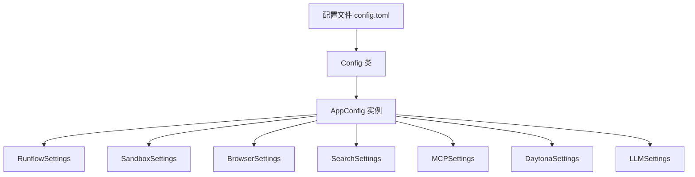
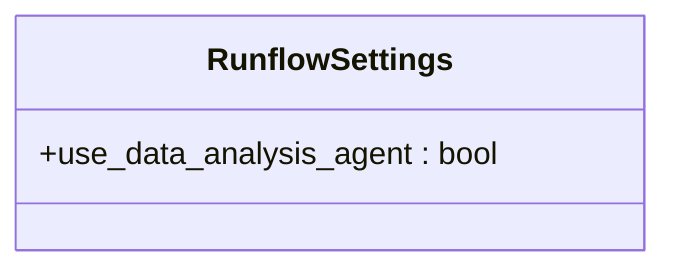
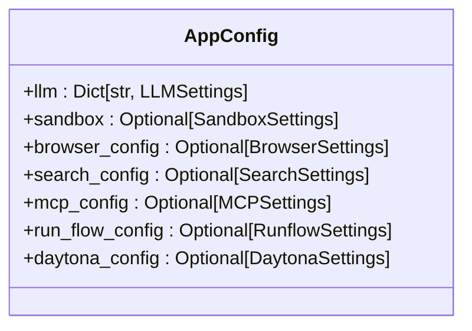
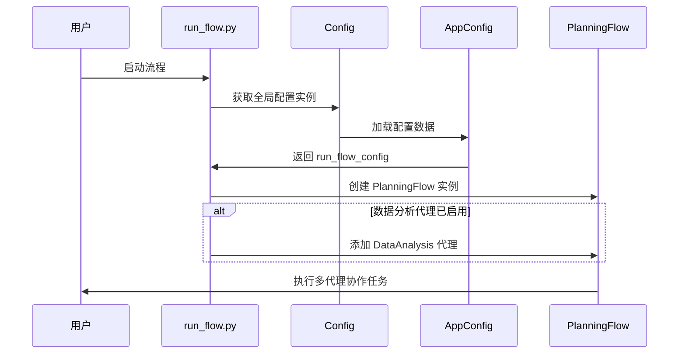

# 工作流配置

<cite>
**本文档中引用的文件**  
- [config.py](file://app/config.py)
- [run_flow.py](file://run_flow.py)
- [data_analysis.py](file://app/agent/data_analysis.py)
- [config.example.toml](file://config/config.example.toml)
- [planning.py](file://app/flow/planning.py)
- [flow_factory.py](file://app/flow/flow_factory.py)
</cite>

## 目录
1. [简介](#简介)
2. [核心配置结构](#核心配置结构)
3. [RunflowSettings 类详解](#runflowsettings-类详解)
4. [AppConfig 中的集成机制](#appconfig-中的集成机制)
5. [use_data_analysis_agent 配置项解析](#use_data_analysis_agent-配置项解析)
6. [多代理协作流程的行为模式调整](#多代理协作流程的行为模式调整)
7. [启用/禁用特定代理类型的配置示例](#启用禁用特定代理类型的配置示例)
8. [配置变更对任务执行流程的影响](#配置变更对任务执行流程的影响)
9. [配置验证方法](#配置验证方法)
10. [常见配置错误排查指南](#常见配置错误排查指南)

## 简介
本文件详细说明 OpenManus 工作流系统的配置机制，重点解析 `RunflowSettings` 类及其在 `AppConfig` 中的集成方式。文档将解释 `use_data_analysis_agent` 配置项如何控制数据分析代理在工作流中的启用状态，并展示如何通过配置文件调整多代理协作流程的行为模式。同时提供配置验证方法和常见配置错误的排查指南。

## 核心配置结构



**Diagram sources**
- [config.py](file://app/config.py#L173-L193)
- [config.py](file://app/config.py#L62-L65)

**Section sources**
- [config.py](file://app/config.py#L173-L193)
- [config.py](file://app/config.py#L62-L65)

## RunflowSettings 类详解

`RunflowSettings` 类定义了工作流执行过程中的特定行为配置，目前主要包含一个关键配置项 `use_data_analysis_agent`。



**Diagram sources**
- [config.py](file://app/config.py#L62-L65)

**Section sources**
- [config.py](file://app/config.py#L62-L65)

## AppConfig 中的集成机制

`RunflowSettings` 作为可选字段被集成到 `AppConfig` 类中，与其他配置模块（如沙箱、浏览器、搜索等）并列管理。



**Diagram sources**
- [config.py](file://app/config.py#L173-L193)

**Section sources**
- [config.py](file://app/config.py#L173-L193)

## use_data_analysis_agent 配置项解析

`use_data_analysis_agent` 是一个布尔类型的配置项，用于控制数据分析代理是否在工作流中启用。

- **默认值**: `False`
- **功能**: 当设置为 `True` 时，系统将在工作流中注册并启用 `DataAnalysis` 代理，使其能够参与任务执行。

该配置项在 `run_flow.py` 中被直接读取并用于条件性地向代理集合中添加数据分析代理。

**Section sources**
- [config.py](file://app/config.py#L63-L65)
- [run_flow.py](file://run_flow.py#L14)

## 多代理协作流程的行为模式调整

通过修改配置文件中的 `runflow` 部分，可以灵活调整多代理协作流程的行为模式。系统支持动态加载不同类型的代理，从而实现针对不同类型任务的定制化处理流程。



**Diagram sources**
- [run_flow.py](file://run_flow.py#L14)
- [planning.py](file://app/flow/planning.py#L93-L133)
- [flow_factory.py](file://app/flow/flow_factory.py#L16-L29)

**Section sources**
- [run_flow.py](file://run_flow.py#L14)
- [planning.py](file://app/flow/planning.py#L93-L133)

## 启用/禁用特定代理类型的配置示例

### 启用数据分析代理
在 `config.toml` 文件中添加或修改 `runflow` 部分：

```toml
[runflow]
use_data_analysis_agent = true
```

### 禁用数据分析代理
在 `config.toml` 文件中设置：

```toml
[runflow]
use_data_analysis_agent = false
```

或者完全移除 `runflow` 配置段，系统将使用默认值（禁用）。

**Section sources**
- [config.example.toml](file://config/config.example.toml#L104-L106)

## 配置变更对任务执行流程的影响

| 配置状态 | 代理集合 | 任务处理能力 | 性能影响 |
|--------|--------|------------|--------|
| `use_data_analysis_agent = true` | 包含 `manus` 和 `data_analysis` | 支持复杂数据分析任务 | 内存占用增加，初始化时间略长 |
| `use_data_analysis_agent = false` | 仅包含 `manus` | 仅支持通用任务处理 | 资源消耗较低，启动速度快 |

当启用数据分析代理时，系统能够自动识别需要数据处理的任务，并调用相应的工具集（如 Python 执行、图表可视化等）进行处理。

**Section sources**
- [run_flow.py](file://run_flow.py#L14)
- [data_analysis.py](file://app/agent/data_analysis.py#L11-L36)

## 配置验证方法

1. **检查配置文件语法**:
   - 确保 `.toml` 文件格式正确
   - 使用在线 TOML 验证器进行校验

2. **验证配置项是否存在**:
   ```python
   from app.config import config
   print(config.run_flow_config.use_data_analysis_agent)
   ```

3. **运行时日志验证**:
   - 查看启动日志中是否正确加载了配置
   - 检查代理注册过程的日志输出

4. **功能测试**:
   - 提交需要数据分析的任务，观察系统行为
   - 对比启用和禁用配置项时的处理结果差异

**Section sources**
- [config.py](file://app/config.py#L232-L328)
- [run_flow.py](file://run_flow.py#L14)

## 常见配置错误排查指南

| 问题现象 | 可能原因 | 解决方案 |
|--------|--------|--------|
| 数据分析功能未生效 | `use_data_analysis_agent` 设置为 `false` 或缺失 | 检查配置文件并正确设置该选项 |
| 配置文件无法加载 | 文件路径错误或格式不正确 | 确认 `config.toml` 存在于 `config/` 目录下且语法正确 |
| 代理无法初始化 | 依赖的 LLM 或工具配置缺失 | 检查相关代理所需的前置配置是否完整 |
| 系统启动失败 | 配置项类型错误 | 确保布尔值使用 `true/false` 而非 `True/False` 或 `"true"` |

建议始终以 `config.example.toml` 为模板创建实际配置文件，避免遗漏必要字段。

**Section sources**
- [config.example.toml](file://config/config.example.toml)
- [config.py](file://app/config.py#L232-L328)