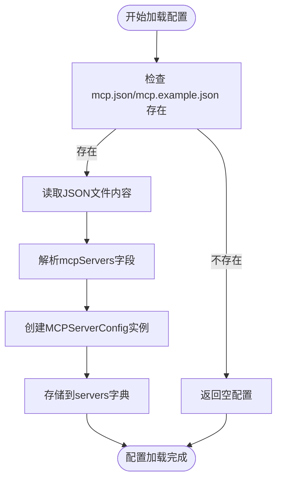
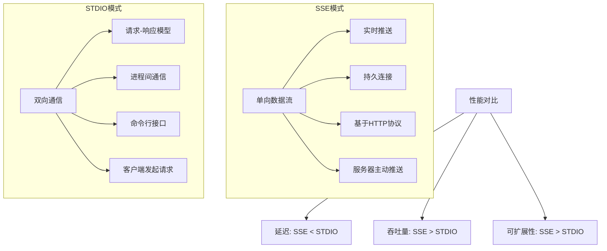

# SSE扩展配置

<cite>
**Referenced Files in This Document**   
- [mcp.example.json](file://config/mcp.example.json)
- [config.py](file://app/config.py)
- [server.py](file://app/mcp/server.py)
</cite>

## 目录
1. [引言](#引言)
2. [SSE配置机制](#sse配置机制)
3. [配置流程指导](#配置流程指导)
4. [SSE与STDIO模式对比](#sse与stdio模式对比)
5. [应用场景](#应用场景)
6. [结论](#结论)

## 引言
OpenManus系统通过MCP（Model Context Protocol）协议实现与外部服务的集成。其中，基于SSE（Server-Sent Events）的扩展点配置机制为系统提供了实时、单向的数据推送能力。本文档详细阐述了MCPSettings.servers中type为'sse'的配置项，解释了url参数如何指定MCP服务器的SSE端点地址，并说明其在流式数据传输中的作用。

## SSE配置机制

### 配置结构解析
在OpenManus中，SSE类型的MCP服务器配置通过`MCPServerConfig`类定义，该类位于`app/config.py`文件中。核心配置项包括：

- **type**: 指定服务器连接类型，对于SSE连接必须设置为'sse'
- **url**: 可选字段，用于指定SSE连接的服务器URL地址
- **command** 和 **args**: 仅适用于stdio模式，SSE模式下不使用

**Section sources**
- [config.py](file://app/config.py#L126-L134)

### 配置加载流程
系统通过`MCPSettings.load_server_config()`方法从JSON配置文件中加载服务器配置。该方法会读取`mcp.json`或`mcp.example.json`文件中的`mcpServers`字段，将每个服务器配置实例化为`MCPServerConfig`对象。



**Diagram sources**
- [config.py](file://app/config.py#L148-L170)

## 配置流程指导

### 示例配置文件分析
`mcp.example.json`文件提供了SSE服务器配置的示例：

```json
{
    "mcpServers": {
      "server1": {
        "type": "sse",
        "url": "http://localhost:8000/sse"
      }
    }
}
```

此配置定义了一个名为"server1"的SSE服务器实例，其端点地址为`http://localhost:8000/sse`。

**Section sources**
- [mcp.example.json](file://config/mcp.example.json#L0-L7)

### 服务启动与连接
当系统启动时，配置管理器会自动加载SSE服务器配置。对于每个SSE类型的服务器，系统将：

1. 验证URL格式是否符合标准HTTP/HTTPS协议
2. 建立到指定端点的持久连接
3. 监听来自服务器的事件流

### URL格式要求
SSE连接的URL必须满足以下要求：
- 必须以`http://`或`https://`开头
- 必须包含有效的主机名和端口号
- 路径部分应指向SSE事件端点

### 连接超时处理
系统在建立SSE连接时会设置合理的超时阈值。如果在指定时间内无法建立连接，系统将记录错误日志并尝试重试。

### 错误重试策略
对于SSE连接中断或失败的情况，系统采用指数退避算法进行重试：
- 初始重试间隔为1秒
- 每次重试后间隔时间加倍
- 最大重试间隔不超过30秒
- 持续尝试直到连接恢复

## SSE与STDIO模式对比



**Diagram sources**
- [config.py](file://app/config.py#L126-L134)
- [server.py](file://app/mcp/server.py#L1-L20)

## 应用场景
SSE模式特别适用于需要实时、单向数据推送的场景，包括但不限于：

- **日志流**: 实时监控和传输应用日志
- **状态更新**: 系统状态、任务进度的实时通知
- **消息推送**: 事件通知、警报系统的实时消息传递
- **数据监控**: 实时数据指标的持续更新

这些场景的共同特点是数据流向单一（服务器到客户端），且对实时性要求较高，SSE模式能够提供低延迟、高效率的数据传输。

## 结论
OpenManus的SSE扩展点配置机制为系统提供了强大的实时数据流处理能力。通过简单的JSON配置即可注册SSE类型的MCP服务器实例，系统自动处理连接管理、错误重试等复杂细节。相比传统的STDIO模式，SSE模式在实时性、吞吐量和可扩展性方面具有明显优势，是构建实时数据流应用的理想选择。