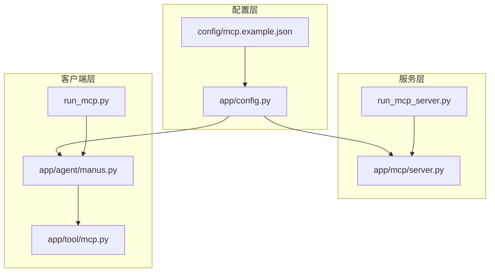
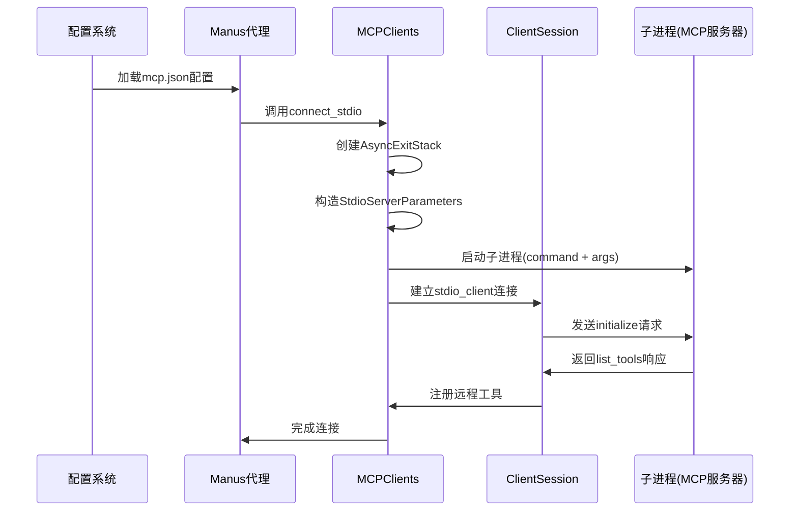
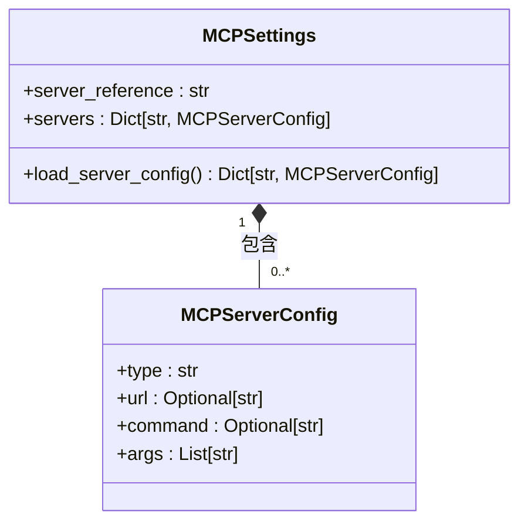
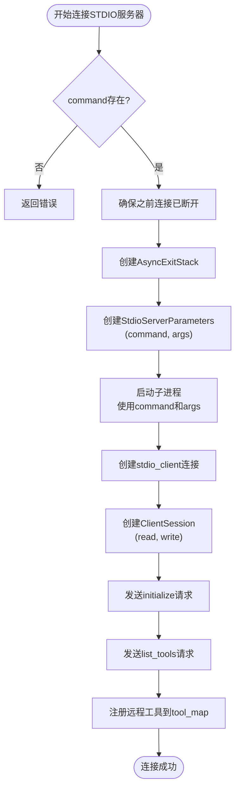
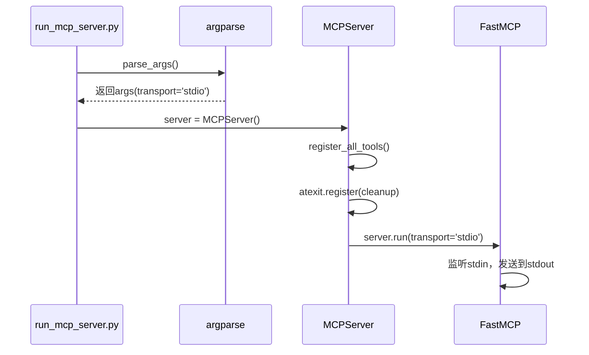
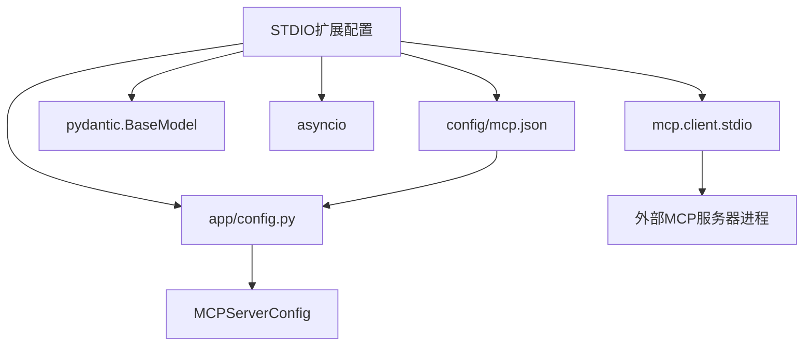

# STDIO扩展配置

<cite>
**本文档中引用的文件**  
- [MCPServerConfig](file://app/config.py#L126-L134)
- [mcp.example.json](file://config/mcp.example.json#L0-L7)
- [server.py](file://app/mcp/server.py#L0-L180)
- [manus.py](file://app/agent/manus.py#L66-L88)
- [mcp.py](file://app/tool/mcp.py#L68-L103)
- [run_mcp.py](file://run_mcp.py#L0-L35)
</cite>

## 目录
1. [引言](#引言)
2. [项目结构](#项目结构)
3. [核心组件](#核心组件)
4. [架构概述](#架构概述)
5. [详细组件分析](#详细组件分析)
6. [依赖分析](#依赖分析)
7. [性能考虑](#性能考虑)
8. [故障排除指南](#故障排除指南)
9. [结论](#结论)

## 引言
本文档系统性地描述了OpenManus中基于标准输入输出（STDIO）的扩展点配置方法，重点解析`MCPServerConfig`中`type`为'stdio'时`command`和`args`参数的配置逻辑。说明`command`字段如何指定可执行程序路径或命令，`args`数组如何传递启动参数，以及这些配置如何被用于创建子进程并与之通信。提供实际配置示例，展示如何集成外部工具或脚本作为MCP服务器。阐述STDIO模式在本地进程通信中的优势，包括低延迟、高吞吐量等特点，并说明其适用场景如本地AI模型服务、CLI工具集成等。同时指出其局限性，如跨平台兼容性问题和进程管理复杂性。

## 项目结构
OpenManus项目采用模块化设计，主要功能分布在`app`目录下的多个子模块中。MCP（Model Context Protocol）相关功能集中在`app/mcp`和`app/tool/mcp.py`中，配置系统位于`app/config.py`，而主程序入口包括`main.py`、`run_mcp.py`和`run_mcp_server.py`。STDIO扩展配置的核心逻辑涉及配置定义、服务器启动和客户端连接三个层面。

**Diagram sources**
- [app/config.py](file://app/config.py#L126-L134)
- [app/mcp/server.py](file://app/mcp/server.py#L0-L180)
- [app/agent/manus.py](file://app/agent/manus.py#L66-L88)
- [app/tool/mcp.py](file://app/tool/mcp.py#L68-L103)
- [run_mcp.py](file://run_mcp.py#L0-L35)

**Section sources**
- [app/config.py](file://app/config.py#L126-L134)
- [config/mcp.example.json](file://config/mcp.example.json#L0-L7)

## 核心组件
`MCPServerConfig`类定义了MCP服务器的配置结构，其中`type`字段决定连接类型，当值为'stdio'时，系统将使用标准输入输出与服务器进程通信。`command`字段指定要执行的可执行文件或命令，`args`字段提供传递给该命令的参数列表。该配置由`MCPSettings`类加载并管理，最终被`manus`代理和`MCPClients`工具用于建立连接。

**Section sources**
- [app/config.py](file://app/config.py#L126-L134)
- [app/agent/manus.py](file://app/agent/manus.py#L66-L88)

## 架构概述
STDIO扩展配置的架构涉及配置加载、进程创建和双向通信三个核心环节。系统首先从配置文件加载`MCPServerConfig`，当`type`为'stdio'时，使用`command`和`args`启动子进程。通过`stdio_client`建立异步读写通道，实现与子进程的JSON-RPC通信。整个流程由`MCPClients.connect_stdio`方法协调，确保资源的正确管理和清理。

**Diagram sources**
- [app/config.py](file://app/config.py#L126-L134)
- [app/agent/manus.py](file://app/agent/manus.py#L66-L88)
- [app/tool/mcp.py](file://app/tool/mcp.py#L70-L94)

## 详细组件分析

### MCPServerConfig配置分析
`MCPServerConfig`是Pydantic模型，定义了MCP服务器的连接配置。对于STDIO模式，`type`必须设置为'stdio'，`command`指定可执行程序的路径或命令名称，`args`是一个字符串列表，包含传递给程序的所有参数。

**Diagram sources**
- [app/config.py](file://app/config.py#L126-L134)

**Section sources**
- [app/config.py](file://app/config.py#L126-L134)

### STDIO连接建立流程
当`manus`代理初始化时，会遍历所有配置的MCP服务器。对于`type`为'stdio'的服务器，调用`connect_mcp_server`方法并设置`use_stdio=True`，将`command`和`args`传递给`MCPClients.connect_stdio`方法。

**Diagram sources**
- [app/agent/manus.py](file://app/agent/manus.py#L66-L88)
- [app/tool/mcp.py](file://app/tool/mcp.py#L70-L94)

**Section sources**
- [app/agent/manus.py](file://app/agent/manus.py#L66-L88)
- [app/tool/mcp.py](file://app/tool/mcp.py#L68-L103)

### MCP服务器启动机制
`run_mcp_server.py`脚本是MCP服务器的入口点，它解析命令行参数，其中`--transport`默认为'stdio'。`MCPServer`类的`run`方法使用此参数调用`FastMCP`服务器的`run`方法，建立相应的通信通道。

**Diagram sources**
- [run_mcp_server.py](file://run_mcp_server.py#L0-L10)
- [app/mcp/server.py](file://app/mcp/server.py#L144-L179)

**Section sources**
- [run_mcp_server.py](file://run_mcp_server.py#L0-L10)
- [app/mcp/server.py](file://app/mcp/server.py#L144-L179)

## 依赖分析
STDIO扩展配置依赖于多个关键组件和外部库。核心依赖包括`mcp`库用于STDIO客户端/服务器通信，`pydantic`用于配置模型验证，`asyncio`用于异步I/O操作。配置文件`mcp.json`是运行时依赖，决定了要启动哪些外部进程。

**Diagram sources**
- [app/config.py](file://app/config.py#L126-L134)
- [app/tool/mcp.py](file://app/tool/mcp.py#L70-L94)

**Section sources**
- [app/config.py](file://app/config.py#L126-L134)
- [config/mcp.example.json](file://config/mcp.example.json#L0-L7)

## 性能考虑
STDIO模式在本地进程通信中具有显著优势。由于避免了网络协议栈的开销，通信延迟极低，通常在微秒级别。数据通过管道直接传输，吞吐量高，适合频繁的小消息交换。然而，进程创建和管理本身有开销，频繁启停服务器会影响性能。建议对长时间运行的服务使用持久化STDIO连接。

## 故障排除指南
常见问题包括`command`指定的程序无法找到、`args`格式错误导致程序启动失败、子进程崩溃或无法响应initialize请求。检查日志中的`Starting OpenManus server (stdio mode)`和`Connected to MCP server`信息可帮助诊断连接状态。确保`mcp.json`配置正确，并且指定的可执行文件在系统PATH中或提供完整路径。

**Section sources**
- [app/mcp/server.py](file://app/mcp/server.py#L155-L159)
- [app/agent/manus.py](file://app/agent/manus.py#L70-L88)

## 结论
OpenManus的STDIO扩展配置提供了一种强大而灵活的机制，用于集成外部工具和服务。通过`MCPServerConfig`中的`command`和`args`参数，可以轻松地将任何支持MCP协议的CLI工具或脚本作为功能服务器集成。这种模式特别适用于本地AI模型服务、自定义数据处理脚本和系统工具的集成。尽管存在跨平台路径差异和进程管理的复杂性，但其低延迟和高吞吐量的优势使其成为本地扩展的首选方案。