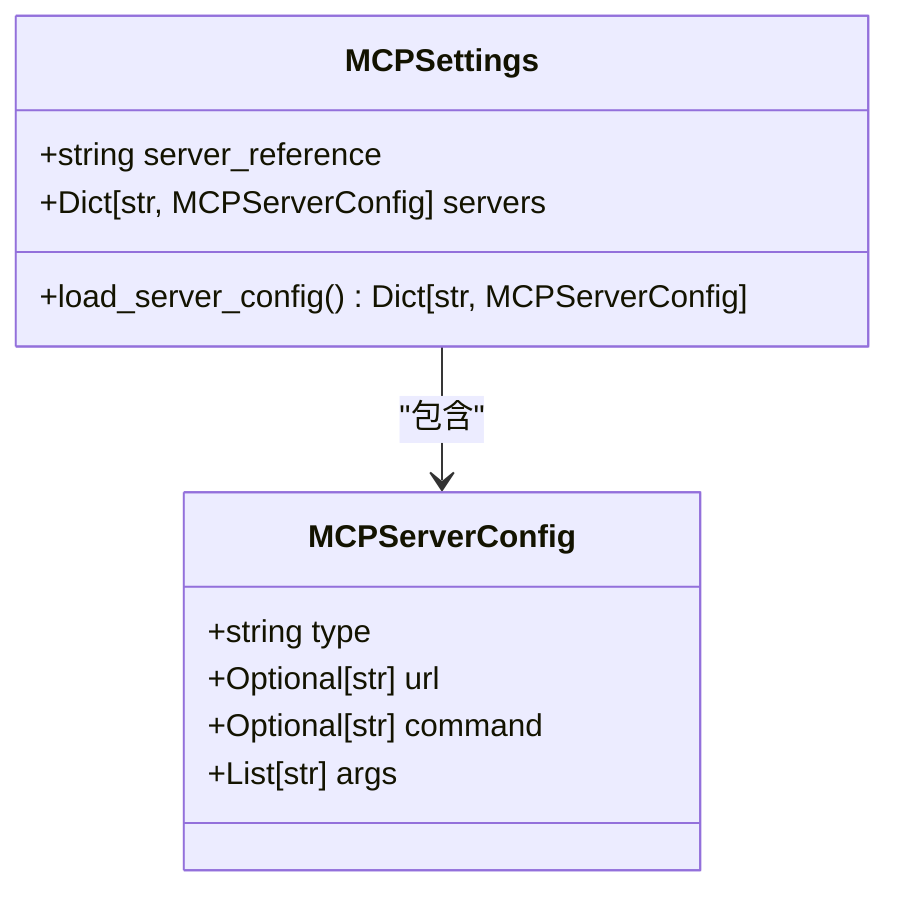
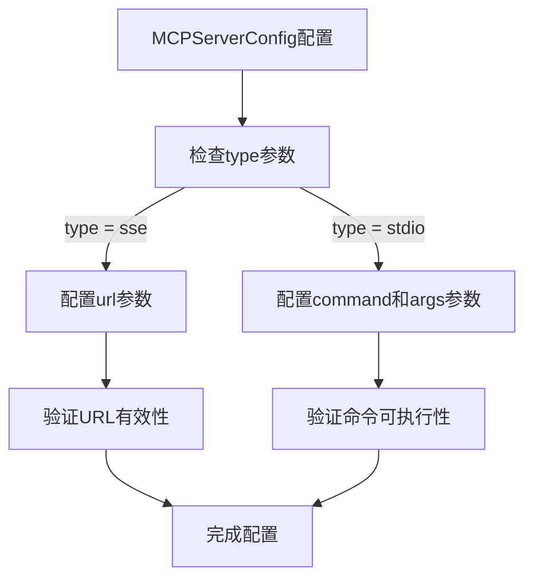
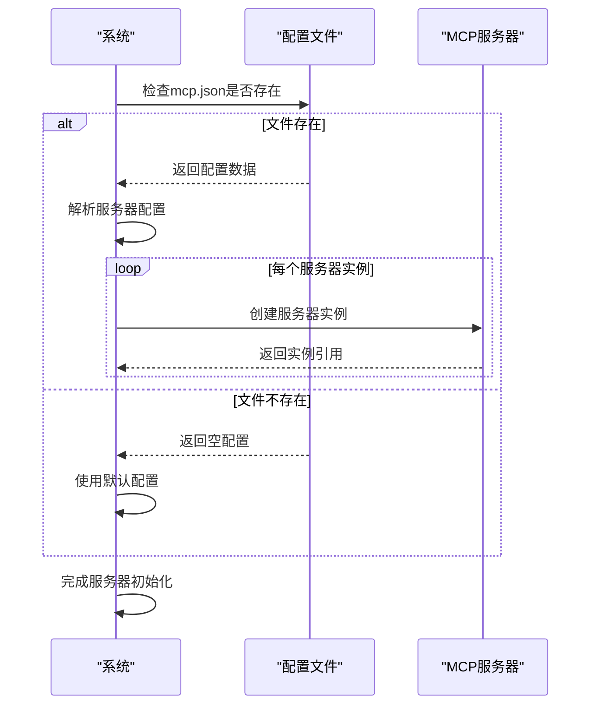

# 扩展点配置

<cite>
**Referenced Files in This Document**  
- [app/config.py](file://app/config.py)
- [config/mcp.example.json](file://config/mcp.example.json)
- [app/mcp/server.py](file://app/mcp/server.py)
</cite>

## 目录
1. [MCP扩展点配置机制概述](#mcp扩展点配置机制概述)
2. [MCPSettings类详解](#mcpsettings类详解)
3. [MCPServerConfig参数配置](#mcpserverconfig参数配置)
4. [动态服务器注册与发现](#动态服务器注册与发现)
5. [自定义MCP服务器集成流程](#自定义mcp服务器集成流程)
6. [通信模式配置差异](#通信模式配置差异)

## MCP扩展点配置机制概述

OpenManus系统通过MCP（Model Context Protocol）扩展点机制实现模块化和可扩展性。该机制允许系统动态加载和管理多个MCP服务器实例，支持灵活的工具集成和功能扩展。核心配置通过`MCPSettings`类实现，该类定义了服务器模块引用路径和服务器实例管理方式，为系统提供了强大的扩展能力。

**Section sources**
- [app/config.py](file://app/config.py#L137-L170)

## MCPSettings类详解

`MCPSettings`类是MCP扩展点配置的核心，继承自Pydantic的`BaseModel`，提供类型安全的配置管理。该类包含两个主要配置项：`server_reference`和`servers`。

`server_reference`配置项指定MCP服务器模块的引用路径，其默认值为"app.mcp.server"，指向系统内置的MCP服务器实现。此配置允许用户自定义服务器实现，通过修改模块路径即可替换默认服务器。

`servers`字典用于管理多个MCP服务器实例，每个实例通过唯一ID进行标识。该字典的值为`MCPServerConfig`对象，包含服务器连接类型、URL、命令行参数等详细配置。系统在启动时会加载这些配置，并根据配置创建相应的服务器实例。

**Diagram sources**
- [app/config.py](file://app/config.py#L126-L134)
- [app/config.py](file://app/config.py#L137-L170)

**Section sources**
- [app/config.py](file://app/config.py#L137-L170)

## MCPServerConfig参数配置

`MCPServerConfig`类定义了单个MCP服务器的配置参数，支持多种连接模式和部署方式。

`type`参数指定服务器连接类型，支持"sse"（Server-Sent Events）和"stdio"（标准输入输出）两种模式。SSE模式适用于HTTP长连接场景，而stdio模式适用于进程间通信。

`url`参数用于SSE连接模式，指定服务器的HTTP端点地址。当`type`设置为"sse"时，必须提供有效的URL地址。

`command`参数用于stdio连接模式，指定启动服务器进程的命令。当`type`设置为"stdio"时，需要提供可执行命令。

`args`参数为命令行参数列表，用于传递额外的启动参数。该参数在stdio模式下特别有用，可以灵活配置服务器的运行时行为。

**Diagram sources**
- [app/config.py](file://app/config.py#L126-L134)

**Section sources**
- [app/config.py](file://app/config.py#L126-L134)

## 动态服务器注册与发现

系统通过`mcp.example.json`文件实现动态工具服务器的注册与发现。该文件采用JSON格式，定义了`mcpServers`对象，其中包含多个服务器实例的配置。

每个服务器实例通过唯一ID进行标识，配置包含`type`、`url`等必要参数。系统在启动时会自动加载`mcp.json`文件（若存在），并根据配置创建相应的服务器实例。如果配置文件不存在，则使用`mcp.example.json`作为参考模板。

服务器发现机制通过`MCPSettings.load_server_config()`类方法实现。该方法首先检查`config/mcp.json`文件是否存在，如果存在则加载其内容；如果不存在，则返回空配置。这种设计允许用户在不修改代码的情况下，通过配置文件动态添加或移除服务器实例。

**Diagram sources**
- [config/mcp.example.json](file://config/mcp.example.json#L1-L8)
- [app/config.py](file://app/config.py#L155-L170)

**Section sources**
- [config/mcp.example.json](file://config/mcp.example.json#L1-L8)
- [app/config.py](file://app/config.py#L155-L170)

## 自定义MCP服务器集成流程

集成自定义MCP服务器需要遵循以下完整流程：

1. 创建服务器实现类，继承或实现`MCPServer`接口
2. 在`config/mcp.json`文件中添加服务器配置
3. 配置`server_reference`指向自定义服务器模块
4. 根据通信模式配置相应参数
5. 启动系统并验证服务器注册

对于SSE模式，需要确保服务器提供HTTP端点，并在配置中正确设置`url`参数。对于stdio模式，需要提供可执行命令和必要的启动参数。

**Diagram sources**
- [app/mcp/server.py](file://app/mcp/server.py#L23-L159)
- [app/config.py](file://app/config.py#L137-L170)

**Section sources**
- [app/mcp/server.py](file://app/mcp/server.py#L23-L159)
- [app/config.py](file://app/config.py#L137-L170)

## 通信模式配置差异

SSE流式连接与标准IO进程通信两种模式在配置上存在显著差异：

SSE模式适用于分布式部署场景，服务器作为独立服务运行。配置重点在于`url`参数，需要提供完整的HTTP端点地址。此模式支持跨网络通信，适合微服务架构。

stdio模式适用于本地进程通信，服务器作为子进程运行。配置重点在于`command`和`args`参数，需要提供可执行命令和启动参数。此模式性能更高，适合单机部署。

两种模式的选择应基于部署架构和性能需求。SSE模式提供更好的可扩展性，而stdio模式提供更低的通信延迟。

**Diagram sources**
- [app/mcp/server.py](file://app/mcp/server.py#L23-L159)
- [app/config.py](file://app/config.py#L126-L134)

**Section sources**
- [app/mcp/server.py](file://app/mcp/server.py#L23-L159)
- [app/config.py](file://app/config.py#L126-L134)