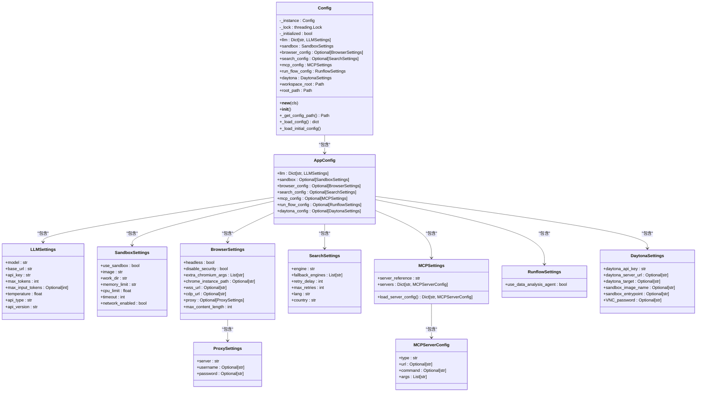

# 配置与定制

<cite>
**本文档中引用的文件**   
- [config.py](file://app/config.py)
- [config.example.toml](file://config/config.example.toml)
- [config.example-model-anthropic.toml](file://config/config.example-model-anthropic.toml)
- [config.example-model-azure.toml](file://config/config.example-model-azure.toml)
- [config.example-model-google.toml](file://config/config.example-model-google.toml)
- [config.example-model-ollama.toml](file://config/config.example-model-ollama.toml)
- [config.example-model-ppio.toml](file://config/config.example-model-ppio.toml)
- [config.example-daytona.toml](file://config/config.example-daytona.toml)
- [mcp.example.json](file://config/mcp.example.json)
- [llm.py](file://app/llm.py)
</cite>

## 目录
1. [简介](#简介)
2. [配置系统架构](#配置系统架构)
3. [LLM提供商配置](#llm提供商配置)
4. [工作流参数调整](#工作流参数调整)
5. [浏览器与搜索配置](#浏览器与搜索配置)
6. [沙箱与Daytona配置](#沙箱与daytona配置)
7. [MCP协议配置](#mcp协议配置)
8. [环境特定配置示例](#环境特定配置示例)
9. [配置验证与调试](#配置验证与调试)
10. [系统行为定制](#系统行为定制)

## 简介

OpenManus的配置系统提供了一个灵活且强大的机制来定制系统行为。通过配置文件，用户可以调整LLM提供商、工作流参数、浏览器设置、搜索引擎、沙箱环境等多个方面的行为。配置系统基于Pydantic模型构建，确保了类型安全和配置验证。

配置系统的核心是`Config`类，它实现了单例模式，确保在整个应用程序生命周期中只有一个配置实例。配置文件采用TOML格式，支持多种LLM提供商的配置，并提供了详细的配置选项来满足不同场景的需求。

**Section sources**
- [config.py](file://app/config.py#L1-L372)

## 配置系统架构

OpenManus的配置系统采用分层架构设计，核心组件包括：

- **Config类**：单例模式实现，管理全局配置
- **AppConfig类**：包含所有配置项的容器
- **各配置设置类**：如LLMSettings、SandboxSettings等，定义具体配置项
- **配置文件加载机制**：支持从config.toml或config.example.toml加载配置

配置系统首先尝试加载`config.toml`文件，如果不存在则使用`config.example.toml`作为默认配置。这种设计使得用户可以轻松地从示例配置开始，然后根据需要进行定制。



**Diagram sources **
- [config.py](file://app/config.py#L18-L190)

**Section sources**
- [config.py](file://app/config.py#L1-L372)

## LLM提供商配置

### 基础LLM配置

LLM配置是系统的核心，定义了与大型语言模型交互的基本参数。主要配置项包括：

- **model**: 模型名称，如"claude-3-7-sonnet-20250219"
- **base_url**: API基础URL，如"https://api.anthropic.com/v1/"
- **api_key**: API密钥，用于身份验证
- **max_tokens**: 每次请求的最大token数
- **temperature**: 采样温度，控制输出的随机性
- **api_type**: API类型，支持"aws"、"azure"、"ollama"等
- **api_version**: Azure OpenAI版本号

```toml
[llm]
model = "claude-3-7-sonnet-20250219"
base_url = "https://api.anthropic.com/v1/"
api_key = "YOUR_API_KEY"
max_tokens = 8192
temperature = 0.0
```

### 特定提供商配置

#### Anthropic配置

Anthropic配置使用标准的API端点和模型名称：

```toml
[llm]
model = "claude-3-7-sonnet-latest"
base_url = "https://api.anthropic.com/v1/"
api_key = "YOUR_API_KEY"
max_tokens = 8192
temperature = 0.0
```

#### Azure OpenAI配置

Azure OpenAI需要指定API类型和版本：

```toml
[llm]
api_type = 'azure'
model = "gpt-4o-mini"
base_url = "{YOUR_AZURE_ENDPOINT.rstrip('/')}/openai/deployments/{AZURE_DEPLOYMENT_ID}"
api_key = "YOUR_API_KEY"
max_tokens = 8096
temperature = 0.0
api_version = "AZURE API VERSION"
```

#### Google Gemini配置

Google Gemini使用特定的API端点：

```toml
[llm]
model = "gemini-2.0-flash"
base_url = "https://generativelanguage.googleapis.com/v1beta/openai/"
api_key = "YOUR_API_KEY"
temperature = 0.0
max_tokens = 8096
```

#### Ollama配置

Ollama配置需要指定本地运行的API端点：

```toml
[llm]
api_type = 'ollama'
model = "llama3.2"
base_url = "http://localhost:11434/v1"
api_key = "ollama"
max_tokens = 4096
temperature = 0.0
```

#### PPIO配置

PPIO配置使用其特定的API基础设施：

```toml
[llm]
api_type = 'ppio'
model = "deepseek/deepseek-v3-0324"
base_url = "https://api.ppinfra.com/v3/openai"
api_key = "your ppio api key"
max_tokens = 16000
temperature = 0.0
```

### 视觉模型配置

系统支持为视觉任务配置专门的模型，通过`llm.vision`部分定义：

```toml
[llm.vision]
model = "claude-3-7-sonnet-20250219"
base_url = "https://api.anthropic.com/v1/"
api_key = "YOUR_API_KEY"
max_tokens = 8192
temperature = 0.0
```

这种分离配置允许系统在处理文本和视觉任务时使用最适合的模型。

**Section sources**
- [config.py](file://app/config.py#L21-L29)
- [config.example.toml](file://config/config.example.toml#L1-L106)
- [config.example-model-anthropic.toml](file://config/config.example-model-anthropic.toml#L1-L17)
- [config.example-model-azure.toml](file://config/config.example-model-azure.toml#L1-L19)
- [config.example-model-google.toml](file://config/config.example-model-google.toml#L1-L17)
- [config.example-model-ollama.toml](file://config/config.example-model-ollama.toml#L1-L18)
- [config.example-model-ppio.toml](file://config/config.example-model-ppio.toml#L1-L18)

## 工作流参数调整

### 数据分析代理配置

工作流配置允许启用或禁用特定的代理功能。目前支持的主要配置是数据分析代理：

```toml
[runflow]
use_data_analysis_agent = false
```

当`use_data_analysis_agent`设置为`true`时，系统将在工作流中启用数据分析代理，使其能够处理各种数据分析任务。这个代理可以执行数据处理、统计分析和可视化等操作。

### 令牌限制配置

LLM配置中包含`max_input_tokens`参数，用于限制跨所有请求的最大输入令牌数：

```toml
[llm]
max_input_tokens = 10000
```

这个配置项对于控制成本和防止过长的对话历史非常重要。如果设置为`None`，则没有限制。

### 温度参数调整

`temperature`参数控制模型输出的随机性：

- **低温度(0.0-0.5)**：产生更确定性和保守的输出
- **中等温度(0.5-0.8)**：平衡创造性和一致性
- **高温度(0.8-1.0)**：产生更多样化和创造性的输出

根据应用场景选择合适的温度值，例如在需要精确答案的场景使用低温度，在需要创意生成的场景使用高温度。

**Section sources**
- [config.py](file://app/config.py#L62-L65)
- [config.example.toml](file://config/config.example.toml#L102-L106)

## 浏览器与搜索配置

### 浏览器配置

浏览器配置允许定制浏览器行为，支持多种连接模式和代理设置：

```toml
[browser]
headless = false
disable_security = true
extra_chromium_args = []
chrome_instance_path = ""
wss_url = ""
cdp_url = ""
max_content_length = 2000

[browser.proxy]
server = "http://proxy-server:port"
username = "proxy-username"
password = "proxy-password"
```

主要配置项包括：

- **headless**: 是否以无头模式运行浏览器
- **disable_security**: 是否禁用浏览器安全特性
- **extra_chromium_args**: 传递给浏览器的额外参数
- **chrome_instance_path**: 连接到现有Chrome实例的路径
- **wss_url**: 通过WebSocket连接到浏览器实例
- **cdp_url**: 通过CDP连接到浏览器实例
- **max_content_length**: 内容检索操作的最大长度

### 搜索配置

搜索配置定义了搜索引擎的使用策略和故障转移机制：

```toml
[search]
engine = "Google"
fallback_engines = ["DuckDuckGo", "Baidu", "Bing"]
retry_delay = 60
max_retries = 3
lang = "en"
country = "us"
```

主要配置项包括：

- **engine**: 主要使用的搜索引擎
- **fallback_engines**: 主引擎失败时尝试的备用引擎列表
- **retry_delay**: 所有引擎都失败后等待重试的秒数
- **max_retries**: 所有引擎都失败时的最大重试次数
- **lang**: 搜索结果的语言代码
- **country**: 搜索结果的国家代码

这种配置确保了即使主要搜索引擎不可用，系统也能通过备用引擎继续工作。

**Section sources**
- [config.py](file://app/config.py#L68-L90)
- [config.py](file://app/config.py#L33-L59)
- [config.example.toml](file://config/config.example.toml#L73-L92)

## 沙箱与Daytona配置

### 沙箱配置

沙箱配置定义了执行环境的安全性和资源限制：

```toml
[sandbox]
use_sandbox = false
image = "python:3.12-slim"
work_dir = "/workspace"
memory_limit = "1g"
cpu_limit = 2.0
timeout = 300
network_enabled = true
```

主要配置项包括：

- **use_sandbox**: 是否使用沙箱环境
- **image**: 基础镜像
- **work_dir**: 容器工作目录
- **memory_limit**: 内存限制
- **cpu_limit**: CPU限制
- **timeout**: 命令默认超时时间（秒）
- **network_enabled**: 是否允许网络访问

### Daytona配置

Daytona配置用于集成远程开发环境：

```toml
[daytona]
daytona_api_key = ""
daytona_server_url = "https://app.daytona.io/api"
daytona_target = "us"
sandbox_image_name = "whitezxj/sandbox:0.1.0"
sandbox_entrypoint = "/usr/bin/supervisord -n -c /etc/supervisor/conf.d/supervisord.conf"
VNC_password = "123456"
```

主要配置项包括：

- **daytona_api_key**: Daytona API密钥
- **daytona_server_url**: Daytona服务器URL
- **daytona_target**: 目标区域（us或eu）
- **sandbox_image_name**: 沙箱镜像名称
- **sandbox_entrypoint**: 沙箱入口点
- **VNC_password**: VNC服务密码

这些配置允许系统与Daytona平台集成，提供远程开发和调试能力。

**Section sources**
- [config.py](file://app/config.py#L93-L104)
- [config.py](file://app/config.py#L107-L123)
- [config.example-daytona.toml](file://config/config.example-daytona.toml#L99-L114)

## MCP协议配置

### MCP服务器配置

MCP（Model Context Protocol）配置允许集成外部服务：

```toml
[mcp]
server_reference = "app.mcp.server"
```

MCP服务器的具体配置通过JSON文件定义：

```json
{
    "mcpServers": {
        "server1": {
            "type": "sse",
            "url": "http://localhost:8000/sse"
        }
    }
}
```

主要配置项包括：

- **server_reference**: MCP服务器的模块引用
- **type**: 服务器连接类型（sse或stdio）
- **url**: SSE连接的服务器URL
- **command**: stdio连接的命令
- **args**: stdio命令的参数

系统会从`config/mcp.json`文件加载服务器配置，如果没有找到则使用空配置。这种设计允许灵活地添加和管理多个MCP服务器。

### MCP配置加载机制

MCP配置的加载机制在`MCPSettings.load_server_config()`方法中实现：

```python
@classmethod
def load_server_config(cls) -> Dict[str, MCPServerConfig]:
    """从JSON文件加载MCP服务器配置"""
    config_path = PROJECT_ROOT / "config" / "mcp.json"
    
    try:
        config_file = config_path if config_path.exists() else None
        if not config_file:
            return {}
            
        with config_file.open() as f:
            data = json.load(f)
            servers = {}
            
            for server_id, server_config in data.get("mcpServers", {}).items():
                servers[server_id] = MCPServerConfig(
                    type=server_config["type"],
                    url=server_config.get("url"),
                    command=server_config.get("command"),
                    args=server_config.get("args", []),
                )
            return servers
    except Exception as e:
        raise ValueError(f"Failed to load MCP server config: {e}")
```

这个机制确保了MCP配置的灵活性和可扩展性。

**Section sources**
- [config.py](file://app/config.py#L137-L170)
- [mcp.example.json](file://config/mcp.example.json#L1-L9)

## 环境特定配置示例

### 开发环境配置

开发环境配置通常使用本地模型和宽松的限制：

```toml
# config.development.toml
[llm]
api_type = 'ollama'
model = "llama3.2"
base_url = "http://localhost:11434/v1"
api_key = "ollama"
max_tokens = 4096
temperature = 0.7

[browser]
headless = false
disable_security = true

[runflow]
use_data_analysis_agent = true
```

### 测试环境配置

测试环境配置使用稳定的模型和严格的限制：

```toml
# config.testing.toml
[llm]
model = "claude-3-7-sonnet-20250219"
base_url = "https://api.anthropic.com/v1/"
api_key = "TEST_API_KEY"
max_tokens = 8192
temperature = 0.0
max_input_tokens = 20000

[sandbox]
use_sandbox = true
network_enabled = false
timeout = 120

[search]
engine = "Google"
max_retries = 2
```

### 生产环境配置

生产环境配置使用高可用的模型和安全的设置：

```toml
# config.production.toml
[llm]
model = "claude-3-7-sonnet-20250219"
base_url = "https://api.anthropic.com/v1/"
api_key = "${ANTHROPIC_API_KEY}"
max_tokens = 8192
temperature = 0.0

[llm.vision]
model = "claude-3-7-sonnet-20250219"
base_url = "https://api.anthropic.com/v1/"
api_key = "${ANTHROPIC_API_KEY}"
max_tokens = 8192
temperature = 0.0

[sandbox]
use_sandbox = true
image = "python:3.12-slim"
memory_limit = "2g"
cpu_limit = 4.0
timeout = 600
network_enabled = true

[daytona]
daytona_api_key = "${DAYTONA_API_KEY}"
daytona_target = "us"
VNC_password = "${VNC_PASSWORD}"

[runflow]
use_data_analysis_agent = true
```

注意：生产环境配置使用环境变量（如`${ANTHROPIC_API_KEY}`）来引用敏感信息，避免将密钥硬编码在配置文件中。

**Section sources**
- [config.example.toml](file://config/config.example.toml#L1-L106)
- [config.example-daytona.toml](file://config/config.example-daytona.toml#L1-L115)

## 配置验证与调试

### 配置验证机制

系统通过Pydantic模型提供内置的配置验证。当配置文件被加载时，Pydantic会自动验证数据类型和必需字段。如果配置无效，系统会抛出详细的错误信息。

例如，如果`llm`配置缺少必需的字段：

```python
class LLMSettings(BaseModel):
    model: str = Field(..., description="Model name")
    base_url: str = Field(..., description="API base URL")
    api_key: str = Field(..., description="API key")
    # ... 其他字段
```

`...`表示这些字段是必需的，如果配置文件中缺少这些字段，Pydantic会抛出验证错误。

### 调试技巧

#### 启用详细日志

在`llm.py`中，系统使用日志记录令牌使用情况：

```python
def update_token_count(self, input_tokens: int, completion_tokens: int = 0) -> None:
    """更新令牌计数"""
    self.total_input_tokens += input_tokens
    self.total_completion_tokens += completion_tokens
    logger.info(
        f"Token usage: Input={input_tokens}, Completion={completion_tokens}, "
        f"Cumulative Input={self.total_input_tokens}, Cumulative Completion={self.total_completion_tokens}, "
        f"Total={input_tokens + completion_tokens}, Cumulative Total={self.total_input_tokens + self.total_completion_tokens}"
    )
```

这有助于监控令牌使用情况和识别潜在的性能问题。

#### 常见配置错误

1. **API密钥错误**：确保API密钥正确且具有足够的权限
2. **URL格式错误**：检查base_url是否包含正确的协议和路径
3. **模型名称错误**：确认模型名称与提供商支持的模型匹配
4. **令牌限制过低**：如果遇到令牌限制错误，考虑增加max_tokens或max_input_tokens
5. **网络连接问题**：检查网络设置，特别是当使用代理或沙箱时

#### 配置加载调试

如果配置未按预期加载，可以检查配置文件的查找逻辑：

```python
@staticmethod
def _get_config_path() -> Path:
    root = PROJECT_ROOT
    config_path = root / "config" / "config.toml"
    if config_path.exists():
        return config_path
    example_path = root / "config" / "config.example.toml"
    if example_path.exists():
        return example_path
    raise FileNotFoundError("No configuration file found in config directory")
```

确保配置文件位于正确的路径，并且文件名正确。

**Section sources**
- [config.py](file://app/config.py#L217-L225)
- [llm.py](file://app/llm.py#L237-L246)

## 系统行为定制

### 多模型配置

系统支持为不同任务配置不同的模型。通过在配置文件中定义多个模型配置，可以实现精细化的模型选择：

```toml
[llm]
model = "claude-3-7-sonnet-20250219"
base_url = "https://api.anthropic.com/v1/"
api_key = "YOUR_API_KEY"
max_tokens = 8192
temperature = 0.0

[llm.fast]
model = "claude-3-haiku-20240307"
base_url = "https://api.anthropic.com/v1/"
api_key = "YOUR_API_KEY"
max_tokens = 4096
temperature = 0.5

[llm.creative]
model = "claude-3-opus-20240229"
base_url = "https://api.anthropic.com/v1/"
api_key = "YOUR_API_KEY"
max_tokens = 8192
temperature = 0.8
```

在代码中，可以通过指定配置名称来使用不同的模型：

```python
# 使用默认模型
default_llm = LLM()

# 使用快速响应模型
fast_llm = LLM("fast")

# 使用创意模型
creative_llm = LLM("creative")
```

### 动态配置调整

系统支持在运行时动态调整配置。通过访问全局的`config`实例，可以在运行时修改配置：

```python
from app.config import config

# 动态修改搜索引擎
config.search_config.engine = "Bing"

# 动态启用沙箱
config.sandbox.use_sandbox = True

# 动态调整LLM温度
config.llm["default"].temperature = 0.5
```

这种灵活性允许根据运行时条件动态调整系统行为。

### 扩展点配置

系统提供了多个扩展点，可以通过配置进行定制：

1. **自定义工具**：通过MCP协议集成自定义工具
2. **自定义代理**：扩展工作流以包含自定义代理
3. **自定义提示**：修改提示模板以适应特定用例
4. **自定义沙箱环境**：配置自定义的Docker镜像和环境

这些扩展点使得系统能够适应各种不同的应用场景和需求。

**Section sources**
- [config.py](file://app/config.py#L232-L328)
- [llm.py](file://app/llm.py#L173-L765)