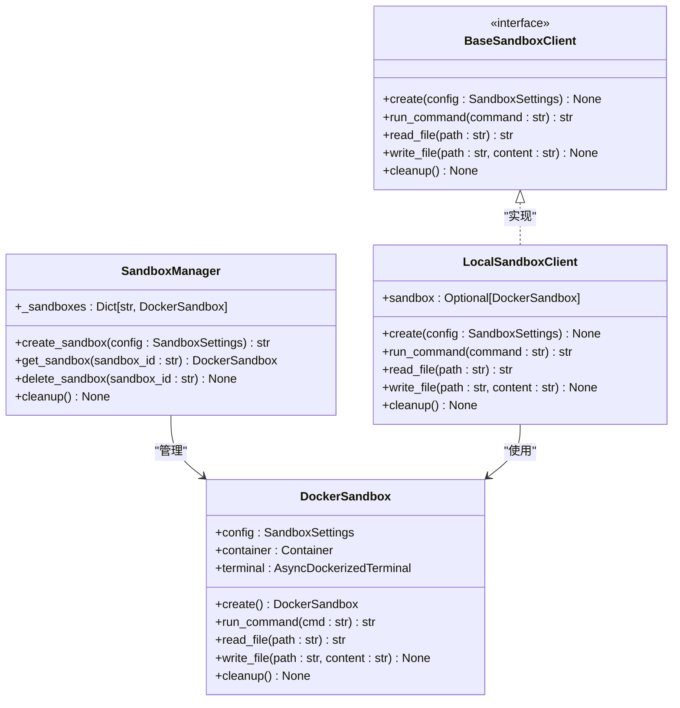

# 术语表

<cite>
**本文档中引用的文件**  
- [manus.py](file://app/agent/manus.py)
- [tool_collection.py](file://app/tool/tool_collection.py)
- [sandbox.py](file://app/sandbox/core/sandbox.py)
- [manager.py](file://app/sandbox/core/manager.py)
- [mcp.py](file://app/tool/mcp.py)
- [server.py](file://app/mcp/server.py)
- [toolcall.py](file://app/agent/toolcall.py)
- [base.py](file://app/agent/base.py)
- [llm.py](file://app/llm.py)
- [config.py](file://app/config.py)
- [schema.py](file://app/schema.py)
- [mcp.example.json](file://config/mcp.example.json)
</cite>

## 目录
1. [代理（Agent）](#代理agent)
2. [工具调用（Tool Call）](#工具调用tool-call)
3. [MCP协议](#mcp协议)
4. [沙箱执行（Sandbox Execution）](#沙箱执行sandbox-execution)
5. [LLM集成](#llm集成)
6. [工作流（Flow）](#工作流flow)
7. [多代理协作](#多代理协作)
8. [SSE连接](#sse连接)
9. [STDIO通信](#stdio通信)
10. [Manus代理与普通代理的区别](#manus代理与普通代理的区别)
11. [ToolCollection工具管理机制](#toolcollection工具管理机制)
12. [沙箱与Docker集成机制](#沙箱与docker集成机制)

## 代理（Agent）

**中文定义**：代理是系统中的核心执行单元，能够接收用户请求、调用工具、与大语言模型（LLM）交互并完成复杂任务的智能实体。

**英文原词**：Agent

**实现位置**：`app/agent/base.py` 中的 `BaseAgent` 类是所有代理的基类，`app/agent/manus.py` 中的 `Manus` 类是具体实现。

**实际应用场景示例**：当用户输入“帮我查询南京旅游信息”时，`Manus` 代理被创建，它会利用其可用的工具（如浏览器工具）来执行任务。

**Section sources**
- [base.py](file://app/agent/base.py#L0-L196)
- [manus.py](file://app/agent/manus.py#L17-L164)

## 工具调用（Tool Call）

**中文定义**：工具调用是代理与外部功能（如执行代码、浏览网页）进行交互的标准化方法。它通常由LLM生成一个包含工具名称和参数的调用请求。

**英文原词**：Tool Call

**实现位置**：`app/schema.py` 中的 `ToolCall` 类定义了调用的数据结构。`app/agent/toolcall.py` 中的 `ToolCallAgent` 类负责处理调用的执行。

**实际应用场景示例**：LLM决定需要执行Python代码，它会生成一个工具调用，指定工具名为 `python_execute`，参数为代码字符串。`ToolCallAgent` 接收到此调用后，会执行 `execute_tool` 方法来运行代码。

**Section sources**
- [schema.py](file://app/schema.py#L45-L50)
- [toolcall.py](file://app/agent/toolcall.py#L0-L250)

## MCP协议

**中文定义**：MCP（Model Context Protocol）是一种允许代理与外部工具服务器进行通信的协议。它支持通过SSE（Server-Sent Events）或STDIO（标准输入/输出）两种方式连接。

**英文原词**：MCP Protocol

**实现位置**：`app/tool/mcp.py` 中的 `MCPClients` 类负责管理与MCP服务器的连接。`app/mcp/server.py` 实现了MCP服务器端。

**实际应用场景示例**：在 `config/mcp.example.json` 中配置一个MCP服务器，`Manus` 代理在初始化时会读取此配置，并通过 `initialize_mcp_servers` 方法连接到该服务器，从而获得服务器上提供的工具。

**Section sources**
- [mcp.py](file://app/tool/mcp.py#L0-L103)
- [server.py](file://app/mcp/server.py#L0-L180)
- [mcp.example.json](file://config/mcp.example.json#L0-L7)

## 沙箱执行（Sandbox Execution）

**中文定义**：沙箱执行是一种在隔离的Docker容器环境中运行代码或命令的安全机制，以防止对宿主机造成损害。

**英文原词**：Sandbox Execution

**实现位置**：`app/sandbox/core/sandbox.py` 中的 `DockerSandbox` 类代表一个沙箱实例。`app/sandbox/core/manager.py` 中的 `SandboxManager` 负责管理多个沙箱的生命周期。

**实际应用场景示例**：当 `BrowserUseTool` 或 `Bash` 工具需要执行操作时，它们会通过 `SANDBOX_CLIENT` 在沙箱中运行命令，确保操作的安全性。

**Section sources**
- [sandbox.py](file://app/sandbox/core/sandbox.py#L17-L461)
- [manager.py](file://app/sandbox/core/manager.py#L0-L313)

## LLM集成

**中文定义**：LLM集成指的是系统与大语言模型（如GPT、Claude等）的对接，用于生成文本、进行推理和决策。

**英文原词**：LLM Integration

**实现位置**：`app/llm.py` 中的 `LLM` 类封装了与不同LLM提供商（如OpenAI、Azure、Anthropic）的API交互逻辑。

**实际应用场景示例**：`Manus` 代理在 `think` 方法中调用 `self.llm.ask_tool`，向LLM发送包含当前对话历史和可用工具列表的消息，以获取下一步行动的建议。

**Section sources**
- [llm.py](file://app/llm.py#L173-L765)

## 工作流（Flow）

**中文定义**：工作流定义了任务执行的流程和逻辑，可以协调多个代理或步骤来完成一个复杂目标。

**英文原词**：Flow

**实现位置**：`app/flow/base.py` 中的 `BaseFlow` 是工作流的基类。`app/flow/planning.py` 提供了具体的规划工作流实现。

**实际应用场景示例**：`PlanningFlow` 可以先让一个代理生成计划，再让另一个代理（如 `Manus`）去执行该计划。

**Section sources**
- [base.py](file://app/flow/base.py#L0-L57)

## 多代理协作

**中文定义**：多代理协作是指系统中存在多个具有不同专长的代理，它们可以协同工作，共同解决复杂问题。

**英文原词**：Multi-Agent Collaboration

**实现位置**：通过 `BaseFlow` 的 `agents` 字典可以管理多个代理。`PlanningFlow` 是一个典型的多代理协作示例。

**实际应用场景示例**：一个“规划代理”负责制定任务步骤，一个“执行代理”（如 `Manus`）负责调用工具完成具体操作。

**Section sources**
- [base.py](file://app/flow/base.py#L0-L57)

## SSE连接

**中文定义**：SSE（Server-Sent Events）连接是一种服务器向客户端单向推送数据的HTTP协议。在MCP中，它用于服务器向代理持续发送工具调用结果。

**英文原词**：SSE Connection

**实现位置**：`app/tool/mcp.py` 中的 `connect_sse` 方法使用 `mcp.client.sse.sse_client` 来建立SSE连接。

**实际应用场景示例**：当配置MCP服务器的 `type` 为 `"sse"` 时，`Manus` 代理会调用 `connect_sse` 方法，通过 `server_url` 连接到远程工具服务器。

**Section sources**
- [mcp.py](file://app/tool/mcp.py#L36-L68)

## STDIO通信

**中文定义**：STDIO（标准输入/输出）通信是一种通过进程的标准输入和输出流与外部程序进行交互的方式。

**英文原词**：STDIO Communication

**实现位置**：`app/tool/mcp.py` 中的 `connect_stdio` 方法使用 `mcp.client.stdio.stdio_client` 来建立STDIO连接。

**实际应用场景示例**：当配置MCP服务器的 `type` 为 `"stdio"` 时，`Manus` 代理会启动一个子进程（如 `python -m app.mcp.server`），并通过其STDIO流与之通信。

**Section sources**
- [mcp.py](file://app/tool/mcp.py#L68-L103)

## Manus代理与普通代理的区别

**中文定义**：`Manus` 代理是系统中的一个具体、功能丰富的代理实例，而普通代理（如 `BaseAgent`）是抽象的基类或概念。

**英文原词**：Manus Agent vs. General Agent

**实现位置**：`Manus` 类继承自 `ToolCallAgent`，并预置了 `PythonExecute`、`BrowserUseTool` 等常用工具。它还集成了MCP客户端，可以动态连接外部工具服务器。

**实际应用场景示例**：`Manus` 代理不仅拥有本地工具，还能通过 `mcp_clients` 连接到配置文件中定义的MCP服务器，从而扩展其能力。而一个最简单的 `BaseAgent` 子类可能只具备基本的对话能力。

**Section sources**
- [manus.py](file://app/agent/manus.py#L17-L164)
- [base.py](file://app/agent/base.py#L0-L196)

## ToolCollection工具管理机制

**中文定义**：`ToolCollection` 是一个工具集合类，用于统一管理和调用多个工具。

**英文原词**：ToolCollection

**实现位置**：`app/tool/tool_collection.py` 中的 `ToolCollection` 类。它内部使用 `tool_map` 字典（以工具名为键）和 `tools` 元组来存储工具。

**实际应用场景示例**：`Manus` 代理的 `available_tools` 字段就是一个 `ToolCollection` 实例。当需要执行一个工具时，`execute` 方法会通过 `tool_map.get(name)` 快速查找工具并执行。`add_tool` 和 `add_tools` 方法用于向集合中添加新工具。

**Section sources**
- [tool_collection.py](file://app/tool/tool_collection.py#L8-L70)

## 沙箱与Docker集成机制

**中文定义**：系统通过 `DockerSandbox` 类与Docker引擎集成，创建和管理隔离的容器环境。

**英文原词**：Sandbox and Docker Integration

**实现位置**：`app/sandbox/core/sandbox.py` 中的 `DockerSandbox` 类使用 `docker-py` 库与Docker守护进程通信。`create` 方法负责创建并启动容器，`run_command` 方法在容器内执行命令。

**实际应用场景示例**：当需要执行一个命令时，`DockerSandbox` 会创建一个容器，通过 `host_config` 设置内存、CPU等资源限制，并在容器的终端中运行命令，其输出被安全地捕获并返回。

**Diagram sources**
- [sandbox.py](file://app/sandbox/core/sandbox.py#L17-L461)
- [manager.py](file://app/sandbox/core/manager.py#L0-L313)
- [client.py](file://app/sandbox/client.py#L52-L145)