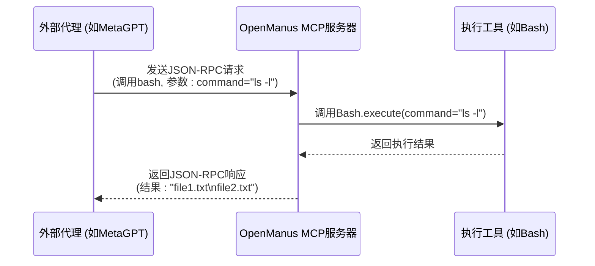
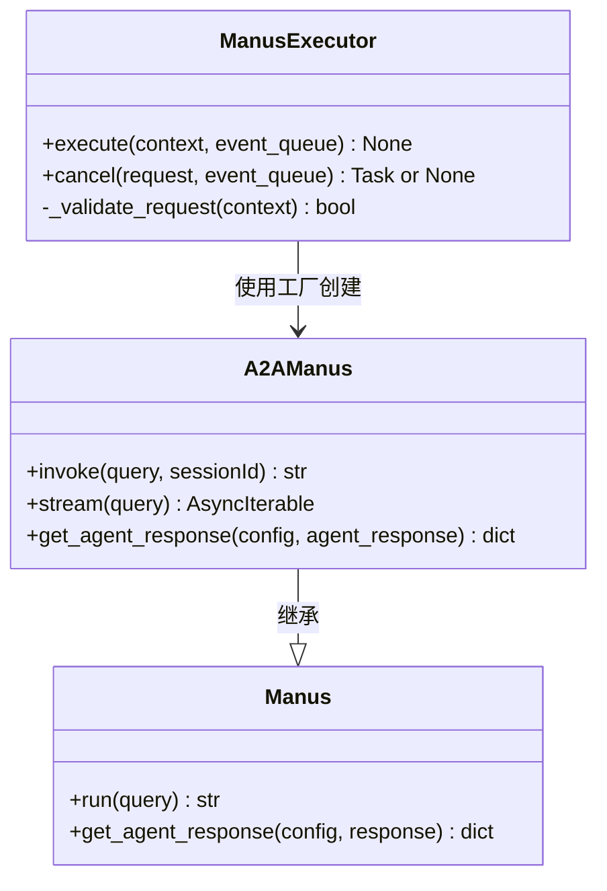
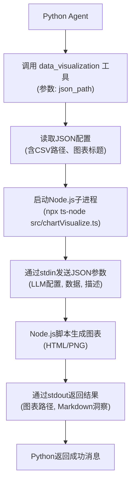

# 相关项目

<cite>
**本文档引用的文件**  
- [server.py](file://app/mcp/server.py)
- [agent.py](file://protocol/a2a/app/agent.py)
- [agent_executor.py](file://protocol/a2a/app/agent_executor.py)
- [data_visualization.py](file://app/tool/chart_visualization/data_visualization.py)
- [python_execute.py](file://app/tool/chart_visualization/python_execute.py)
- [chart_demo.py](file://app/tool/chart_visualization/test/chart_demo.py)
- [report_demo.py](file://app/tool/chart_visualization/test/report_demo.py)
- [swe.py](file://app/agent/swe.py)
</cite>

## 目录
1. [引言](#引言)
2. [OpenManus生态关联项目概览](#openmanus生态关联项目概览)
3. [MCP协议与外部代理通信机制](#mcp协议与外部代理通信机制)
4. [A2A协议实现代理间交互](#a2a协议实现代理间交互)
5. [chart_visualization工具包集成路径](#chart_visualization工具包集成路径)
6. [Hugging Face演示空间集成方案](#hugging-face演示空间集成方案)
7. [高级扩展开发指导](#高级扩展开发指导)
8. [总结](#总结)

## 引言
OpenManus作为一个开放的智能代理框架，其核心能力不仅体现在内部模块的协同工作，更在于与外部生态系统的深度集成。本文档旨在系统性地梳理与OpenManus紧密关联的外部项目及其集成方式，重点阐述OpenManus-RL、MetaGPT、OpenHands、SWE-agent等项目的功能定位与协作模式，并深入解析MCP协议、A2A协议的通信机制，以及chart_visualization工具包与Hugging Face平台的集成路径，为开发者提供清晰的扩展开发指南。

## OpenManus生态关联项目概览

OpenManus生态系统与多个前沿代理项目保持紧密协作，形成互补的技术生态。

- **OpenManus-RL**：基于强化学习的代理调优框架，专注于通过环境反馈优化代理决策策略。OpenManus可通过MCP协议与其交互，将任务执行结果作为奖励信号，驱动OpenManus-RL进行策略迭代。
- **MetaGPT**：提供代理开发的基础框架，强调多代理协作与角色分工。OpenManus可作为MetaGPT中的一个执行代理（Executor Agent），接收高层规划指令并完成具体任务，实现“规划-执行”分离的架构模式。
- **OpenHands**：开源代理平台，提供代理的可视化管理与监控界面。OpenManus可通过标准化API接入OpenHands，实现任务状态的实时展示与人工干预接口，提升系统的可操作性与透明度。
- **SWE-agent**：专注于软件工程任务的自动化代理，擅长代码生成、调试与重构。在OpenManus中，`SWEAgent`类（位于`app/agent/swe.py`）直接继承自`ToolCallAgent`，并集成了`Bash`、`StrReplaceEditor`等工具，使其能够直接与代码库交互，解决复杂的编程任务。

**Section sources**
- [swe.py](file://app/agent/swe.py#L1-L25)

## MCP协议与外部代理通信机制

MCP（Model Control Protocol）是OpenManus与外部模型或代理进行通信的核心协议，基于标准输入/输出（stdio）传输JSON-RPC格式的消息。

OpenManus通过`app/mcp/server.py`中的`MCPServer`类实现MCP服务器。该服务器初始化时会预注册一组标准工具，如`bash`（执行Shell命令）、`browser`（浏览器自动化）、`editor`（文件编辑）和`terminate`（任务终止）。当外部客户端连接时，服务器会通过`register_tool`方法将这些工具的元数据（包括名称、描述、参数类型和要求）暴露给客户端。

通信流程如下：
1. 外部代理通过stdio向OpenManus MCP服务器发送一个包含工具名称和参数的JSON-RPC请求。
2. 服务器根据注册的工具映射，调用对应的`BaseTool`子类的`execute`方法。
3. 执行结果被序列化为JSON格式并返回给外部代理。

此机制使得OpenManus能够作为一个强大的“工具执行器”，为其他不具备执行能力的轻量级代理（如仅负责规划的代理）提供服务。

**Diagram sources**
- [server.py](file://app/mcp/server.py#L23-L159)

**Section sources**
- [server.py](file://app/mcp/server.py#L1-L180)

## A2A协议实现代理间交互

A2A（Agent-to-Agent）协议是OpenManus与遵循A2A规范的其他代理进行交互的桥梁，位于`protocol/a2a/app/`目录下。

核心组件包括：
- `A2AManus`类（`agent.py`）：继承自OpenManus的主代理`Manus`，实现了A2A协议要求的`invoke`和`stream`接口。`invoke`方法接收查询和会话ID，调用内部`run`方法执行任务，并将结果包装成A2A标准格式返回。
- `ManusExecutor`类（`agent_executor.py`）：作为A2A服务器的执行器，负责接收A2A请求，验证其有效性，调用`A2AManus`实例执行任务，并将结果通过`EventQueue`返回。

通过A2A协议，OpenManus可以无缝集成到任何支持A2A的代理网络中。例如，一个A2A协调器可以将任务分发给多个A2A兼容的代理，OpenManus作为其中之一，接收任务、执行并返回结果，实现分布式、协作式的智能任务处理。

**Diagram sources**
- [agent.py](file://protocol/a2a/app/agent.py#L14-L31)
- [agent_executor.py](file://protocol/a2a/app/agent_executor.py#L1-L72)

**Section sources**
- [agent.py](file://protocol/a2a/app/agent.py#L1-L32)
- [agent_executor.py](file://protocol/a2a/app/agent_executor.py#L1-L72)

## chart_visualization工具包集成路径

`chart_visualization`工具包（位于`app/tool/chart_visualization/`）是OpenManus进行数据可视化的核心组件，它通过调用外部Node.js服务来生成图表。

其工作流程如下：
1. **数据准备**：首先，代理通过其他工具（如Python执行）生成数据并保存为CSV文件。
2. **生成JSON配置**：一个预处理步骤会生成一个包含CSV路径、图表标题等信息的JSON文件。
3. **调用可视化工具**：`DataVisualization`工具（`data_visualization.py`）被调用，传入JSON文件路径。该工具内部通过`asyncio.create_subprocess_exec`启动一个Node.js子进程，执行`src/chartVisualize.ts`脚本。
4. **跨语言通信**：Python主进程将LLM配置、数据、图表描述等信息通过标准输入（stdin）以JSON格式传递给Node.js脚本。
5. **图表生成与返回**：Node.js脚本使用Vizro等库生成HTML或PNG格式的图表，并将结果路径通过标准输出（stdout）返回给Python进程。

此设计实现了技术栈的解耦，利用Node.js在前端可视化方面的优势，同时保持了Python在数据处理和逻辑控制上的主导地位。

**Diagram sources**
- [data_visualization.py](file://app/tool/chart_visualization/data_visualization.py#L14-L262)

**Section sources**
- [data_visualization.py](file://app/tool/chart_visualization/data_visualization.py#L1-L263)
- [python_execute.py](file://app/tool/chart_visualization/python_execute.py#L1-L36)

## Hugging Face演示空间集成方案

将OpenManus集成到Hugging Face Spaces是展示其能力的理想方式。集成路径主要依赖于`chart_visualization`工具包和Gradio等Web框架。

1. **部署环境**：在Hugging Face Spaces中创建一个基于Python的Space，将OpenManus代码库作为依赖项安装。
2. **Web界面**：使用Gradio或Streamlit构建一个简单的Web界面，允许用户输入自然语言指令。
3. **代理调用**：Web应用的后端调用OpenManus的主代理（如`Manus`或`DataAnalysis`）来处理用户输入。
4. **结果展示**：对于`chart_visualization`工具生成的HTML图表，可以直接在Gradio的`HTML`组件中嵌入显示。对于PNG图表，可以使用`Image`组件。文本报告则使用`Markdown`或`Text`组件展示。
5. **演示示例**：`app/tool/chart_visualization/test/`目录下的`chart_demo.py`和`report_demo.py`提供了完美的集成示例。它们展示了如何通过编程方式调用代理来生成图表和报告，这些脚本可以很容易地被改造为Gradio的后端处理函数。

通过这种方式，用户可以在Hugging Face上直接与OpenManus交互，体验其从数据分析到可视化报告生成的完整能力。

**Section sources**
- [chart_demo.py](file://app/tool/chart_visualization/test/chart_demo.py#L1-L191)
- [report_demo.py](file://app/tool/chart_visualization/test/report_demo.py#L1-L27)

## 高级扩展开发指导

对于希望扩展OpenManus功能的高级开发者，以下几点至关重要：

1. **新工具开发**：创建新的工具类，继承自`app/tool/base.py`中的`BaseTool`。定义`name`、`description`和`parameters`（遵循JSON Schema）。在`execute`方法中实现核心逻辑。最后，在`MCPServer`中注册该工具。
2. **新代理开发**：创建新的代理类，继承自`app/agent/base.py`中的`BaseAgent`或其子类（如`ToolCallAgent`）。通过重写`system_prompt`和`available_tools`来定制其行为。
3. **协议扩展**：要支持新的通信协议，可在`protocol/`目录下创建新子目录。参考`a2a`和`mcp`的实现，定义新的消息格式和处理逻辑。
4. **集成测试**：利用`tests/`目录下的测试框架，为新功能编写单元测试和集成测试，确保系统的稳定性。

## 总结

OpenManus通过MCP和A2A等开放协议，构建了一个灵活、可扩展的代理生态系统。它不仅能与OpenManus-RL、MetaGPT等项目协同工作，还能通过`chart_visualization`等工具包实现复杂的功能，并轻松部署到Hugging Face等平台进行展示。其模块化的设计为开发者提供了清晰的扩展路径，使其成为一个强大的智能代理开发与集成平台。