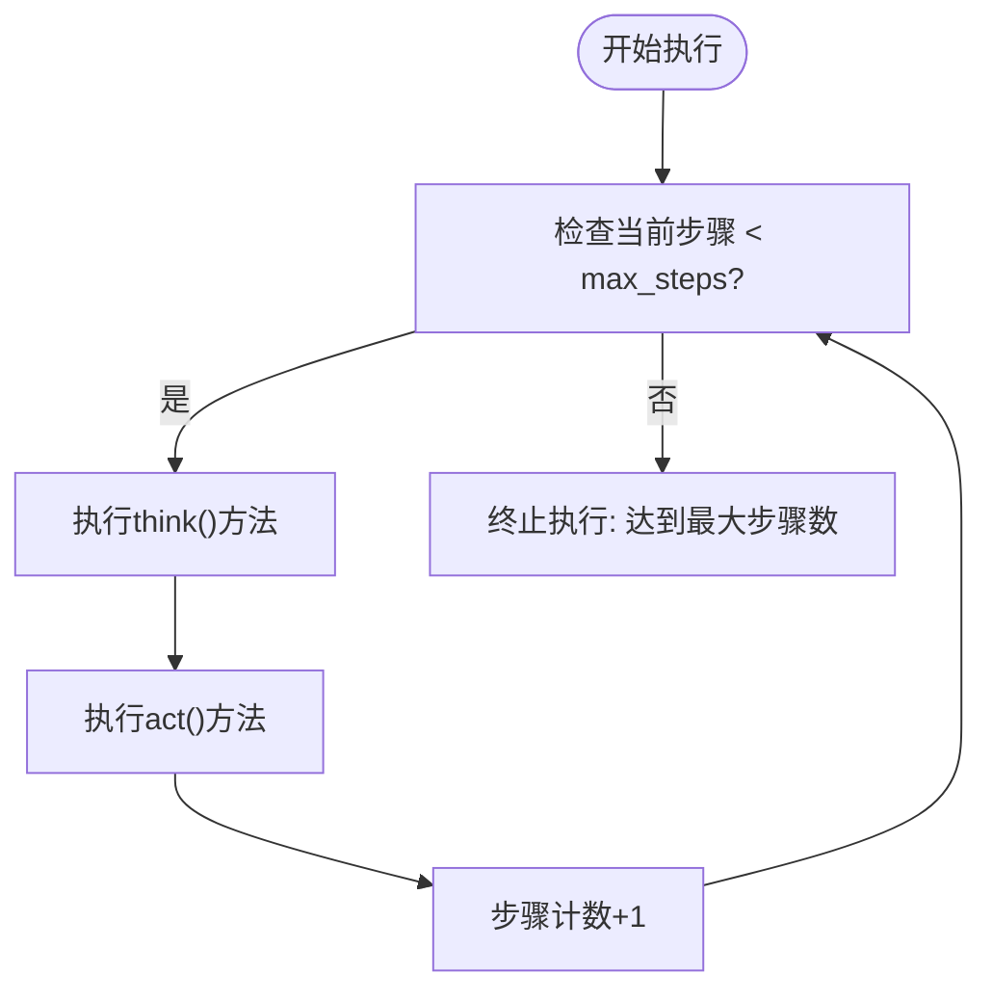
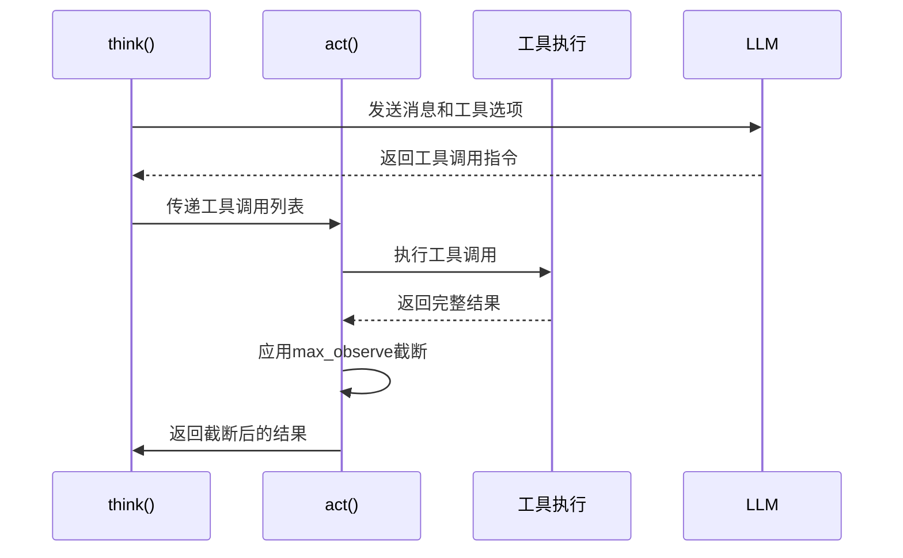
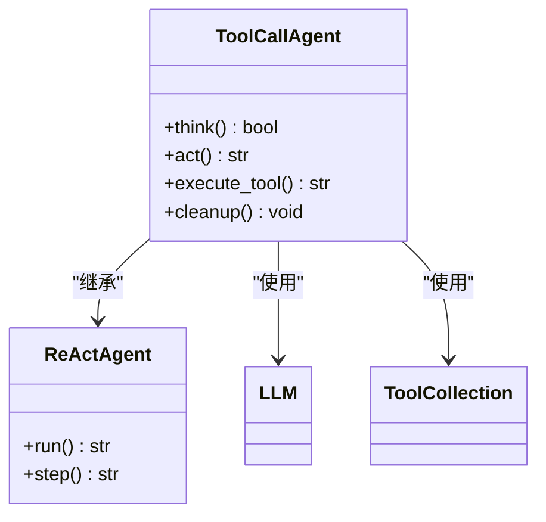
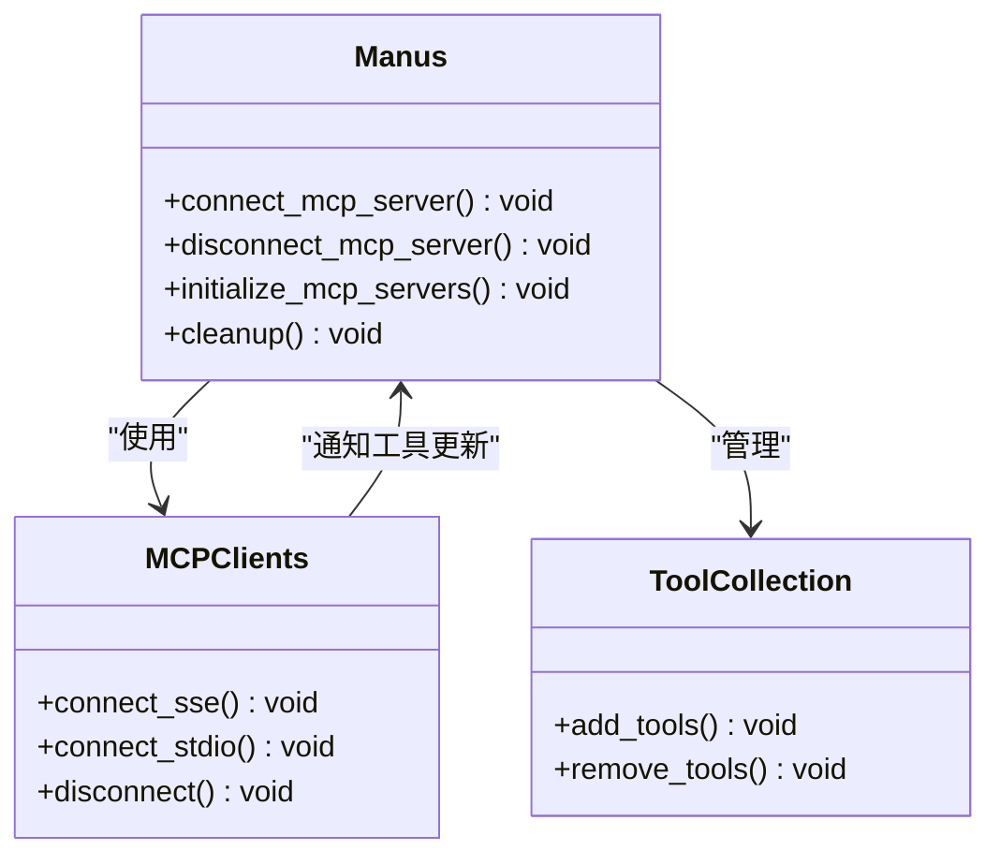

# 性能优化

<cite>
**本文档引用的文件**   
- [manus.py](file://app/agent/manus.py)
- [toolcall.py](file://app/agent/toolcall.py)
- [config.py](file://app/config.py)
- [llm.py](file://app/llm.py)
</cite>

## 目录
1. [引言](#引言)
2. [核心参数配置](#核心参数配置)
3. [异步执行机制](#异步执行机制)
4. [资源预加载策略](#资源预加载策略)
5. [最佳实践](#最佳实践)
6. [结论](#结论)

## 引言
本文档旨在为OpenManus系统提供全面的性能优化指南，重点解决LLM调用次数和工具执行效率问题。通过深入分析Manus代理的核心机制，包括max_steps和max_observe参数的配置、think()和act()方法的异步执行、以及资源预加载策略，为用户提供一套完整的性能优化方案。文档将结合代码实例和最佳实践，帮助用户在复杂任务场景下显著提升系统响应速度和资源利用效率。

## 核心参数配置

### max_steps参数分析
`max_steps`参数是控制代理执行流程的关键配置，它定义了代理在终止前可以执行的最大步骤数。在Manus代理中，该参数被设置为20，而在其基类ToolCallAgent中默认为30。



**参数影响**:
- **过低的max_steps值**：可能导致复杂任务无法完成，代理在达到目标前就被强制终止。
- **过高的max_steps值**：会增加LLM调用次数，可能导致系统响应变慢和资源浪费。

**配置建议**：
- 对于简单任务（如信息查询），建议设置为10-15。
- 对于中等复杂度任务（如数据分析），建议设置为20-25。
- 对于高度复杂任务（如多步骤规划），可设置为30或更高，但需配合其他优化措施。

**Section sources**
- [manus.py](file://app/agent/manus.py#L27)
- [toolcall.py](file://app/agent/toolcall.py#L35)
- [base.py](file://app/agent/base.py#L115-L153)

### max_observe参数分析
`max_observe`参数用于限制工具执行结果的观察长度，防止过长的输出影响后续LLM处理效率。在Manus代理中，该参数被设置为10000，确保了足够的信息量。



**参数影响**:
- **过低的max_observe值**：可能导致重要信息被截断，影响任务完成质量。
- **过高的max_observe值**：会增加LLM的处理负担，可能导致token超限错误。

**配置建议**：
- 对于文本处理任务，建议设置为5000-8000。
- 对于代码生成任务，建议设置为10000-15000。
- 对于数据分析任务，可根据数据量动态调整，但不应超过LLM的token限制。

**Section sources**
- [manus.py](file://app/agent/manus.py#L26)
- [toolcall.py](file://app/agent/toolcall.py#L36)
- [toolcall.py](file://app/agent/toolcall.py#L144-L183)

## 异步执行机制

### think()和act()方法协同
ToolCallAgent中的`think()`和`act()`方法采用异步执行机制，实现了高效的工具调用处理流程。这种设计避免了同步阻塞，提高了整体执行效率。



**执行流程**:
1. `think()`方法负责与LLM交互，获取工具调用决策。
2. `act()`方法负责执行工具调用并处理结果。
3. 两个方法通过`tool_calls`列表进行数据交换。

**性能优势**:
- **减少等待时间**：LLM推理和工具执行可以并行进行。
- **提高资源利用率**：CPU和I/O资源得到更有效的利用。
- **降低延迟**：避免了同步调用的累积延迟。

**Section sources**
- [toolcall.py](file://app/agent/toolcall.py#L38-L128)
- [toolcall.py](file://app/agent/toolcall.py#L130-L163)
- [toolcall.py](file://app/agent/toolcall.py#L165-L207)

### 批量工具调用处理
`act()`方法支持批量处理工具调用，通过循环执行`tool_calls`列表中的所有调用，实现了高效的批量处理。

```mermaid
flowchart TD
Start([开始act()]) --> CheckCalls["检查tool_calls列表"]
CheckCalls --> |非空| LoopStart["开始循环处理"]
LoopStart --> ResetImage["重置_current_base64_image"]
ResetImage --> ExecuteTool["执行execute_tool()"]
ExecuteTool --> ApplyMaxObserve["应用max_observe截断"]
ApplyMaxObserve --> LogResult["记录执行结果"]
LogResult --> AddToMemory["添加到记忆"]
AddToMemory --> CheckNext["检查下一个调用"]
CheckNext --> |有| LoopStart
CheckNext --> |无| JoinResults["合并所有结果"]
JoinResults --> ReturnResults["返回结果"]
CheckCalls --> |空| HandleNoCalls["处理无调用情况"]
HandleNoCalls --> ReturnContent["返回最后消息内容"]
```

**优化策略**:
- **连接复用**：在批量处理中保持数据库或API连接，避免重复建立连接的开销。
- **并发控制**：通过信号量或线程池限制并发工具调用数量，防止资源耗尽。
- **错误隔离**：单个工具调用失败不应影响其他调用的执行。

**Section sources**
- [toolcall.py](file://app/agent/toolcall.py#L130-L183)
- [toolcall.py](file://app/agent/toolcall.py#L244-L249)

## 资源预加载策略

### MCP服务器异步初始化
Manus代理通过`initialize_mcp_servers()`方法实现MCP服务器的异步初始化，显著提升了系统启动速度。

```mermaid
sequenceDiagram
participant Create as create()
participant Init as initialize_mcp_servers()
participant Config as config.mcp_config
participant Connect as connect_mcp_server()
Create->>Init : 调用初始化
Init->>Config : 读取服务器配置
loop 每个服务器配置
Config-->>Init : 返回配置项
Init->>Connect : 连接服务器
Connect->>Connect : 根据类型(SSE/stdio)连接
Connect-->>Init : 连接成功
Init->>Logger : 记录连接信息
end
Init-->>Create : 初始化完成
```

**实现细节**:
- 从`config.mcp_config.servers`读取服务器配置。
- 根据服务器类型（SSE或stdio）选择相应的连接方式。
- 异步连接所有配置的服务器，提高初始化效率。

**性能优势**:
- **减少启动时间**：所有服务器连接并行进行，避免了串行连接的延迟累积。
- **提高可靠性**：单个服务器连接失败不会影响其他服务器的连接。
- **资源优化**：连接建立后立即可用，避免了运行时连接的延迟。

**Section sources**
- [manus.py](file://app/agent/manus.py#L66-L88)
- [manus.py](file://app/agent/manus.py#L43-L64)
- [config.py](file://app/config.py#L126-L159)

### 工具连接管理
`connect_mcp_server()`和`disconnect_mcp_server()`方法提供了完善的工具连接管理机制，确保资源的有效利用。



**关键特性**:
- **动态工具管理**：连接服务器后自动将新工具添加到`available_tools`中。
- **资源清理**：断开连接时移除相关工具，避免内存泄漏。
- **状态跟踪**：通过`connected_servers`字典跟踪已连接的服务器。

**Section sources**
- [manus.py](file://app/agent/manus.py#L90-L119)
- [manus.py](file://app/agent/manus.py#L113-L128)
- [manus.py](file://app/agent/manus.py#L130-L137)

## 最佳实践

### 缓存机制
实现有效的缓存机制可以显著减少重复的LLM调用和工具执行。

**建议方案**:
- **结果缓存**：对频繁调用的工具结果进行缓存，设置合理的过期时间。
- **模式缓存**：缓存常见的任务处理模式，避免重复的推理过程。
- **上下文缓存**：在会话期间缓存相关上下文信息，减少信息检索开销。

### 连接复用
在工具执行过程中保持连接可以避免重复建立连接的开销。

**实施策略**:
- **数据库连接池**：使用连接池管理数据库连接，提高数据库操作效率。
- **HTTP连接复用**：使用持久连接（Keep-Alive）减少HTTP请求的建立时间。
- **WebSocket连接**：对于实时交互场景，使用WebSocket保持长连接。

### 并发控制
合理的并发控制可以平衡性能和资源消耗。

**推荐配置**:
- **信号量控制**：使用信号量限制并发工具调用数量，防止资源耗尽。
- **优先级队列**：根据任务优先级调度工具调用，确保关键任务优先执行。
- **超时机制**：为每个工具调用设置合理的超时时间，防止长时间阻塞。

**Section sources**
- [toolcall.py](file://app/agent/toolcall.py#L228-L242)
- [toolcall.py](file://app/agent/toolcall.py#L244-L249)
- [llm.py](file://app/llm.py#L700-L766)

## 结论
通过合理配置`max_steps`和`max_observe`参数、充分利用异步执行机制、实施资源预加载策略以及遵循最佳实践，可以显著提升Manus代理的性能。这些优化措施不仅减少了LLM调用次数，还提高了工具执行效率，为复杂任务处理提供了坚实的基础。建议用户根据具体应用场景灵活调整配置，并持续监控系统性能以实现最佳效果。