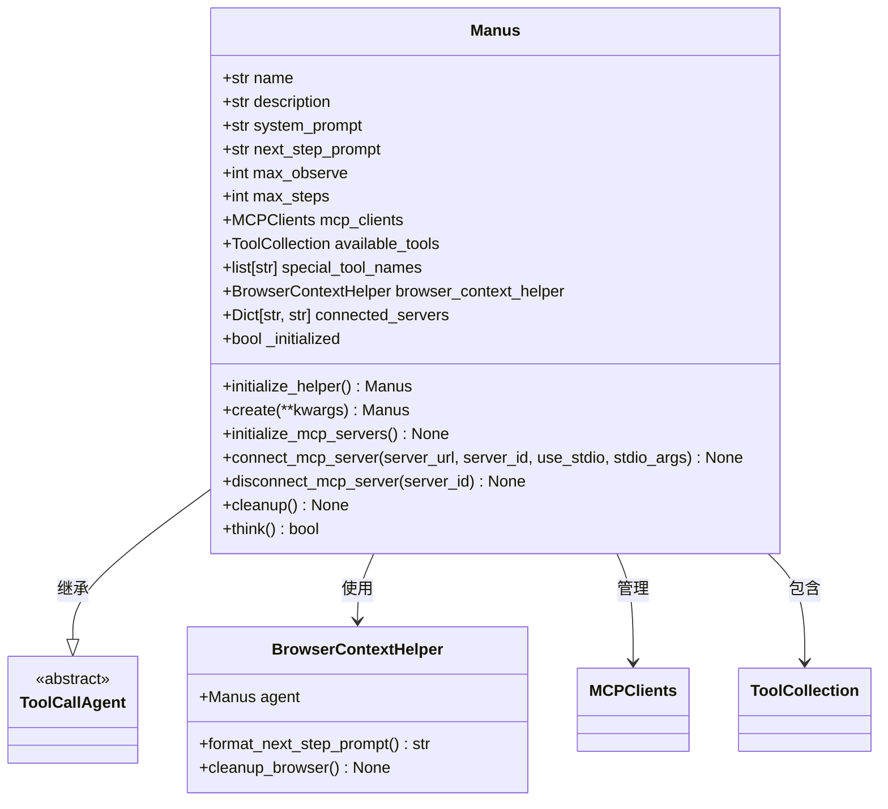
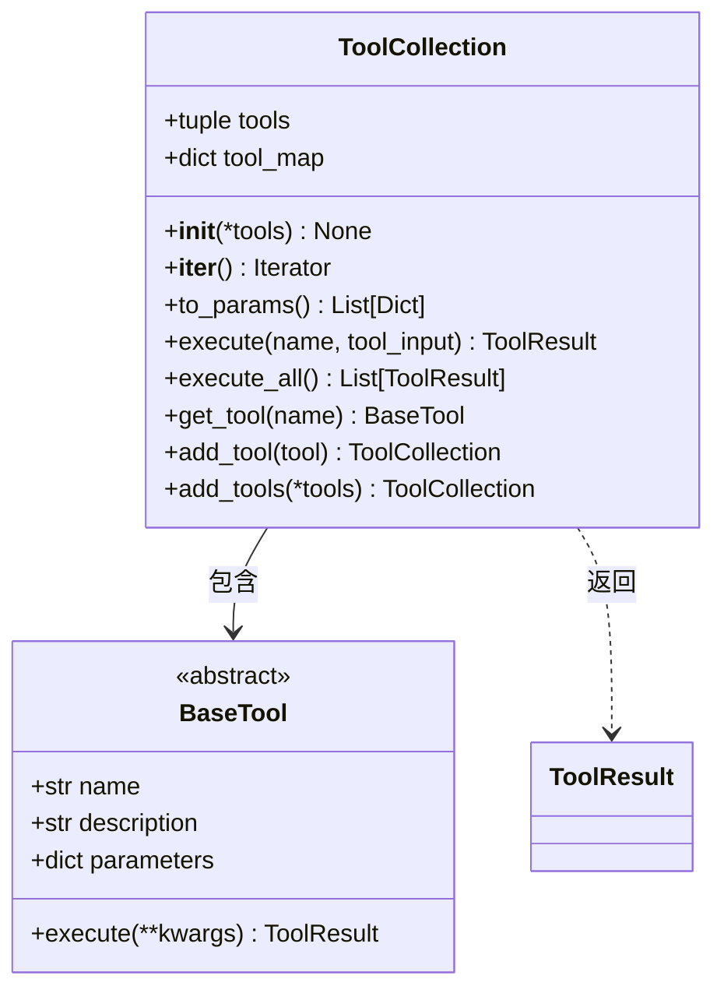
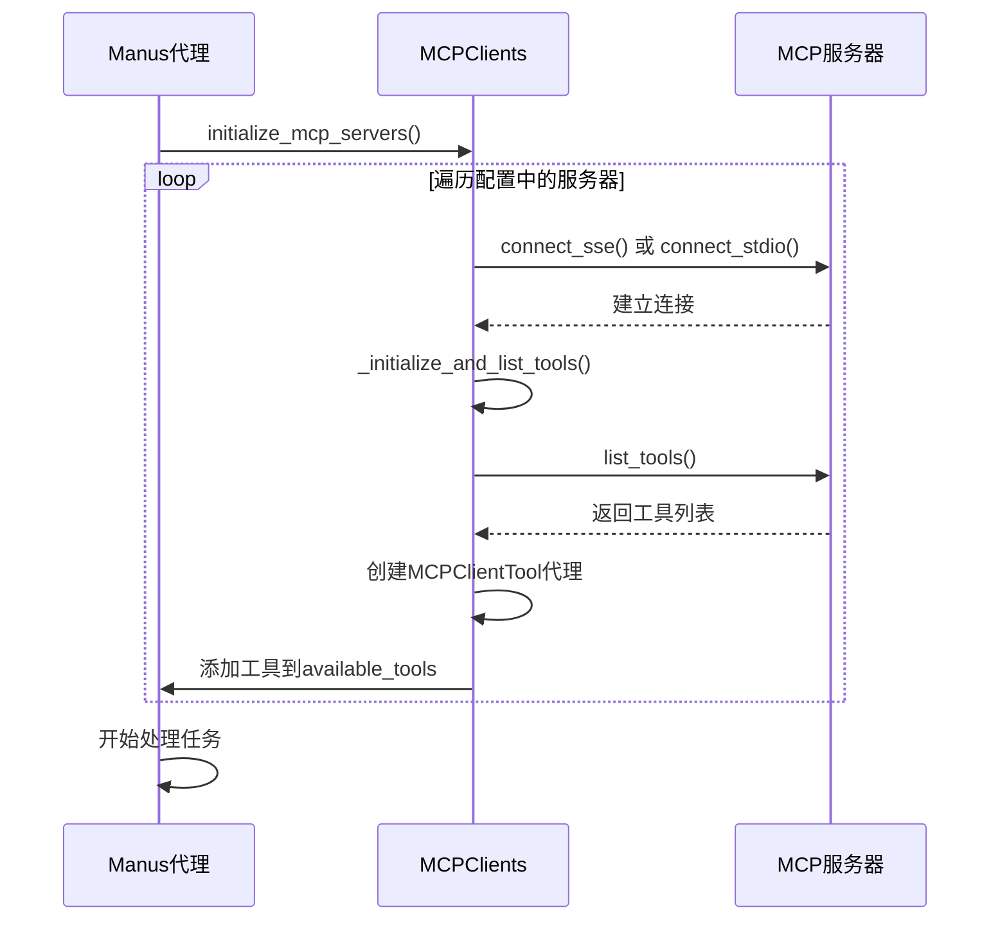
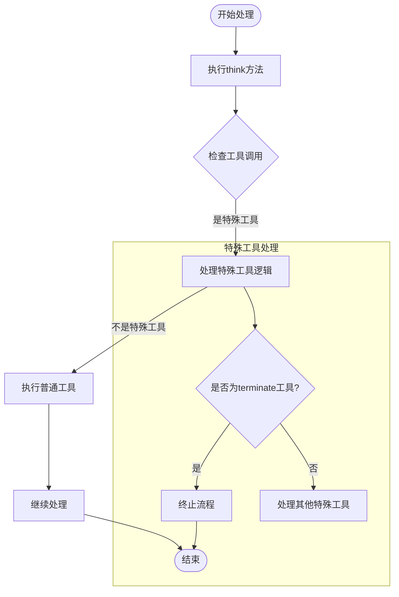
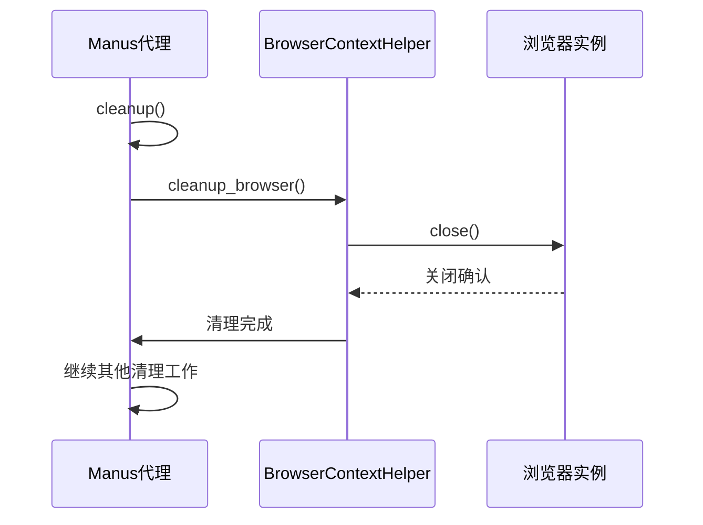
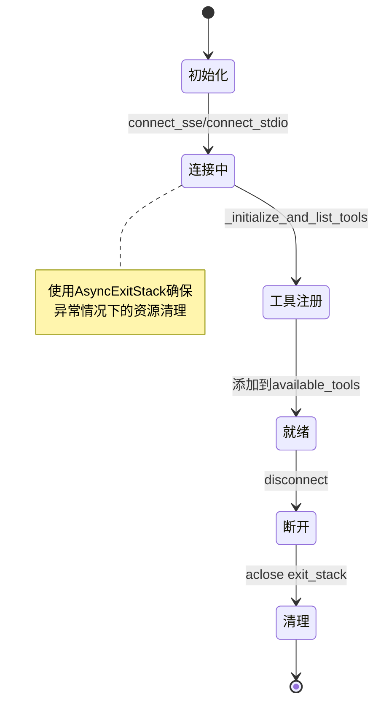
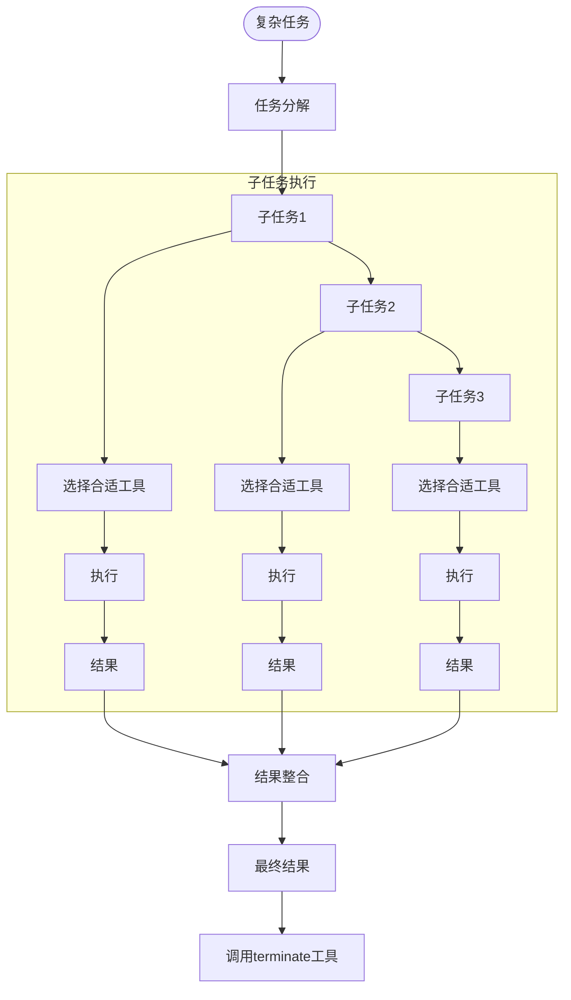
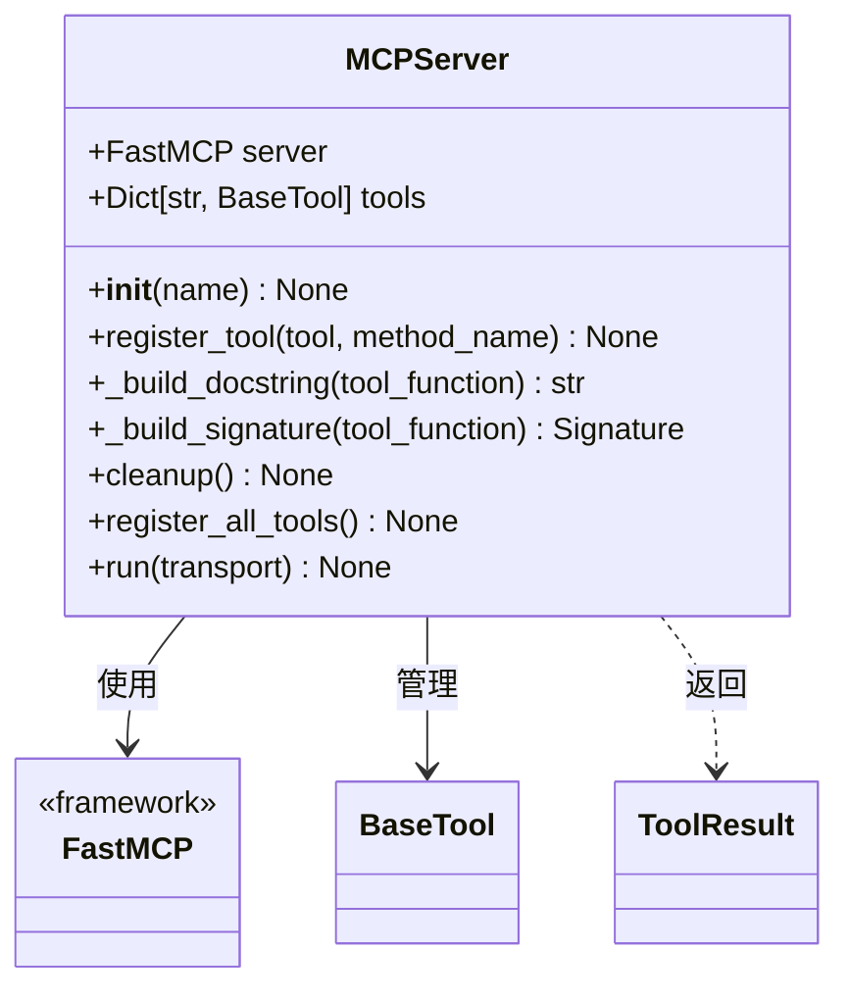
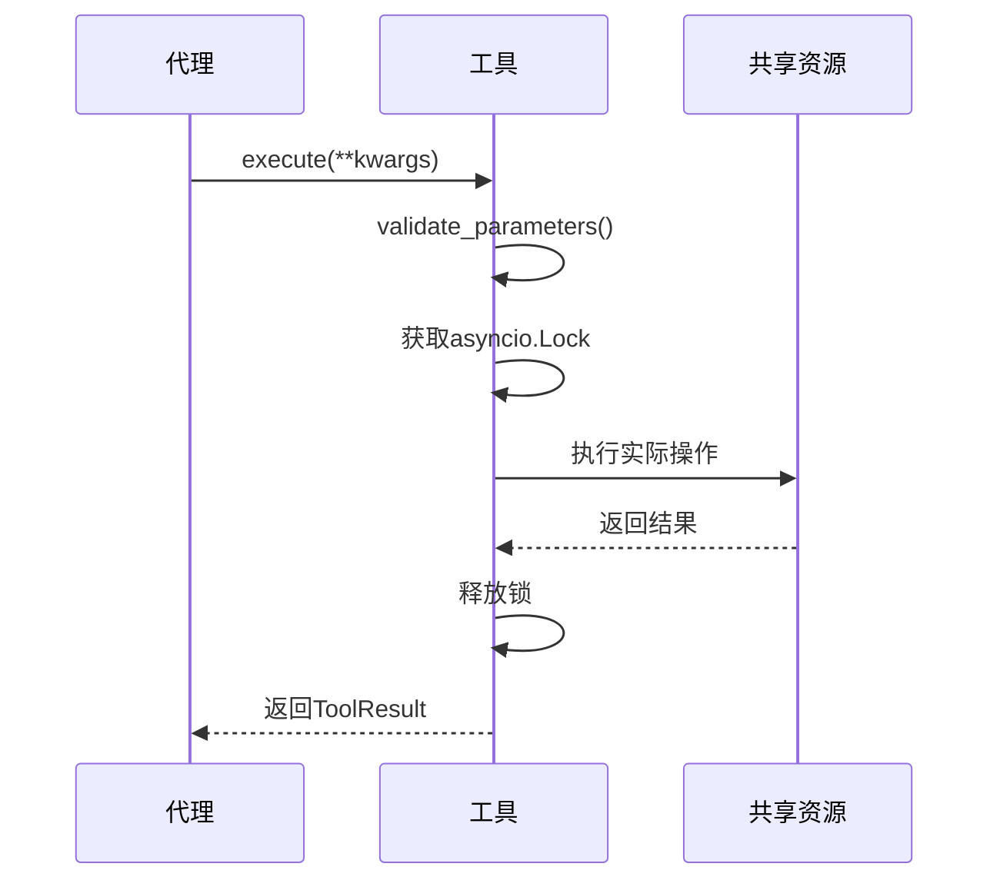

# 最佳实践

<cite>
**本文档中引用的文件**  
- [manus.py](file://app/agent/manus.py)
- [tool_collection.py](file://app/tool/tool_collection.py)
- [terminate.py](file://app/tool/terminate.py)
- [browser_use_tool.py](file://app/tool/browser_use_tool.py)
- [server.py](file://app/mcp/server.py)
- [manus.py](file://app/prompt/manus.py)
- [logger.py](file://app/utils/logger.py)
- [mcp.py](file://app/tool/mcp.py)
</cite>

## 目录
1. [引言](#引言)
2. [Manus代理设计模式](#manus代理设计模式)
3. [工具组合与MCP服务器管理](#工具组合与mcp服务器管理)
4. [流程控制与终止机制](#流程控制与终止机制)
5. [资源管理最佳实践](#资源管理最佳实践)
6. [复杂任务分解与提示工程](#复杂任务分解与提示工程)
7. [真实应用场景代码模式](#真实应用场景代码模式)
8. [总结](#总结)

## 引言
本文档旨在为高级使用场景提供全面的最佳实践指南，重点介绍Manus代理系统的设计模式、资源管理策略和复杂任务处理技巧。通过深入分析核心组件的交互机制，帮助用户构建高效、可靠的AI代理系统，实现复杂任务的自动化处理。

## Manus代理设计模式

Manus代理采用模块化设计，通过继承`ToolCallAgent`基类实现灵活的工具调用能力。代理的核心设计模式包括基于`ToolCollection`的工具组合策略、MCP服务器动态连接管理以及上下文感知的提示工程机制。



**图示来源**  
- [manus.py](file://app/agent/manus.py#L1-L165)

**本节来源**  
- [manus.py](file://app/agent/manus.py#L1-L165)

## 工具组合与MCP服务器管理

### 基于ToolCollection的工具组合策略

`ToolCollection`类提供了灵活的工具管理机制，支持动态添加和执行多种工具。通过`add_tool`和`add_tools`方法，可以将本地工具和远程MCP工具无缝集成到统一的工具集合中。



**图示来源**  
- [tool_collection.py](file://app/tool/tool_collection.py#L1-L72)

### MCP服务器动态连接管理

Manus代理通过`MCPClients`类实现对多个MCP服务器的动态连接管理。系统支持SSE和stdio两种传输方式，能够根据配置自动建立和维护与远程服务器的连接。



**图示来源**  
- [manus.py](file://app/agent/manus.py#L1-L165)
- [mcp.py](file://app/tool/mcp.py#L1-L195)

**本节来源**  
- [manus.py](file://app/agent/manus.py#L1-L165)
- [mcp.py](file://app/tool/mcp.py#L1-L195)

## 流程控制与终止机制

### special_tool_names在流程控制中的作用

`special_tool_names`字段用于标识具有特殊控制功能的工具名称。在Manus代理中，`terminate`工具被列为特殊工具，当代理调用此工具时，系统会识别并执行相应的流程终止逻辑。



**图示来源**  
- [manus.py](file://app/agent/manus.py#L1-L165)
- [terminate.py](file://app/tool/terminate.py#L1-L25)

### Terminate工具的正确使用方式

`Terminate`工具是流程控制的关键组件，用于在任务完成或无法继续时优雅地结束代理的执行。正确使用该工具需要指定适当的状态参数。

```mermaid
classDiagram
class Terminate {
+str name = "terminate"
+str description
+dict parameters
+execute(status) str
}
class BaseTool {
<<abstract>>
}
Terminate --|> BaseTool : 继承
Terminate : parameters = {
type : object,
properties : {
status : {
type : string,
enum : [success, failure]
}
},
required : [status]
}
```

**图示来源**  
- [terminate.py](file://app/tool/terminate.py#L1-L25)

**本节来源**  
- [manus.py](file://app/agent/manus.py#L1-L165)
- [terminate.py](file://app/tool/terminate.py#L1-L25)

## 资源管理最佳实践

### 浏览器上下文清理

`BrowserContextHelper`类负责管理浏览器上下文的生命周期，确保在代理清理时正确关闭浏览器实例，防止资源泄漏。



**图示来源**  
- [manus.py](file://app/agent/manus.py#L1-L165)
- [browser_use_tool.py](file://app/tool/browser_use_tool.py#L1-L567)

### MCP客户端连接生命周期管理

MCP客户端连接的生命周期管理遵循严格的初始化和清理流程，确保连接资源的正确分配和释放。



**图示来源**  
- [mcp.py](file://app/tool/mcp.py#L1-L195)

**本节来源**  
- [manus.py](file://app/agent/manus.py#L1-L165)
- [browser_use_tool.py](file://app/tool/browser_use_tool.py#L1-L567)
- [mcp.py](file://app/tool/mcp.py#L1-L195)

## 复杂任务分解与提示工程

### system_prompt和next_step_prompt微调

通过精心设计的系统提示和下一步提示，可以有效引导代理的行为，提高任务执行的准确性和效率。

```mermaid
erDiagram
PROMPT ||--o{ MANUS : 使用
PROMPT {
string prompt_type
string content_template
string variables
}
MANUS ||--o{ TOOL_COLLECTION : 包含
MANUS {
string system_prompt
string next_step_prompt
}
TOOL_COLLECTION ||--o{ TOOL : 包含
TOOL_COLLECTION {
list tools
}
TOOL {
string name
string description
dict parameters
}
PROMPT }o-- TOOL_COLLECTION : 影响
```

**图示来源**  
- [manus.py](file://app/agent/manus.py#L1-L165)
- [manus.py](file://app/prompt/manus.py#L1-L11)

### 复杂任务分解技巧

在处理复杂任务时，应采用分而治之的策略，将大任务分解为多个可管理的子任务，并通过适当的工具组合逐步解决。



**本节来源**  
- [manus.py](file://app/agent/manus.py#L1-L165)
- [manus.py](file://app/prompt/manus.py#L1-L11)

## 真实应用场景代码模式

### MCP服务器实现模式

MCP服务器的实现遵循标准模式，通过`MCPServer`类注册各种工具，并提供统一的执行接口。



**图示来源**  
- [server.py](file://app/mcp/server.py#L1-L181)

### 工具执行流程模式

工具执行流程遵循统一的模式，包括参数验证、资源锁定、实际执行和结果返回等步骤。



**图示来源**  
- [browser_use_tool.py](file://app/tool/browser_use_tool.py#L1-L567)
- [mcp.py](file://app/tool/mcp.py#L1-L195)

**本节来源**  
- [server.py](file://app/mcp/server.py#L1-L181)
- [browser_use_tool.py](file://app/tool/browser_use_tool.py#L1-L567)
- [mcp.py](file://app/tool/mcp.py#L1-L195)

## 总结
本文档详细阐述了Manus代理系统在高级使用场景下的最佳实践。通过理解基于`ToolCollection`的工具组合策略、MCP服务器动态连接管理机制以及`special_tool_names`在流程控制中的作用，用户可以构建更加高效和可靠的AI代理系统。同时，遵循资源管理最佳实践和复杂任务分解技巧，能够显著提升系统的稳定性和任务处理能力。