# 高级用法

<cite>
**本文档中引用的文件**  
- [app/logger.py](file://app/logger.py)
- [app/llm.py](file://app/llm.py)
- [app/agent/base.py](file://app/agent/base.py)
- [app/agent/toolcall.py](file://app/agent/toolcall.py)
- [app/tool/tool_collection.py](file://app/tool/tool_collection.py)
- [app/sandbox/core/manager.py](file://app/sandbox/core/manager.py)
- [app/tool/base.py](file://app/tool/base.py)
- [app/tool/python_execute.py](file://app/tool/python_execute.py)
- [app/tool/chart_visualization/data_visualization.py](file://app/tool/chart_visualization/data_visualization.py)
- [app/tool/sandbox/sb_shell_tool.py](file://app/tool/sandbox/sb_shell_tool.py)
- [app/tool/sandbox/sb_files_tool.py](file://app/tool/sandbox/sb_files_tool.py)
- [app/agent/sandbox_agent.py](file://app/agent/sandbox_agent.py)
</cite>

## 目录
1. [性能优化策略](#性能优化策略)
2. [错误处理与异常恢复](#错误处理与异常恢复)
3. [调试技巧](#调试技巧)
4. [最佳实践](#最佳实践)
5. [高级应用案例](#高级应用案例)

## 性能优化策略

### 减少LLM调用次数
通过合理配置代理的执行流程和工具调用策略，可以有效减少LLM调用次数。`ToolCallAgent`类中的`think`方法实现了智能决策机制，只有在需要工具调用时才触发LLM请求。通过设置`tool_choices`参数为`ToolChoice.AUTO`，系统会自动判断是否需要调用工具，避免不必要的LLM交互。

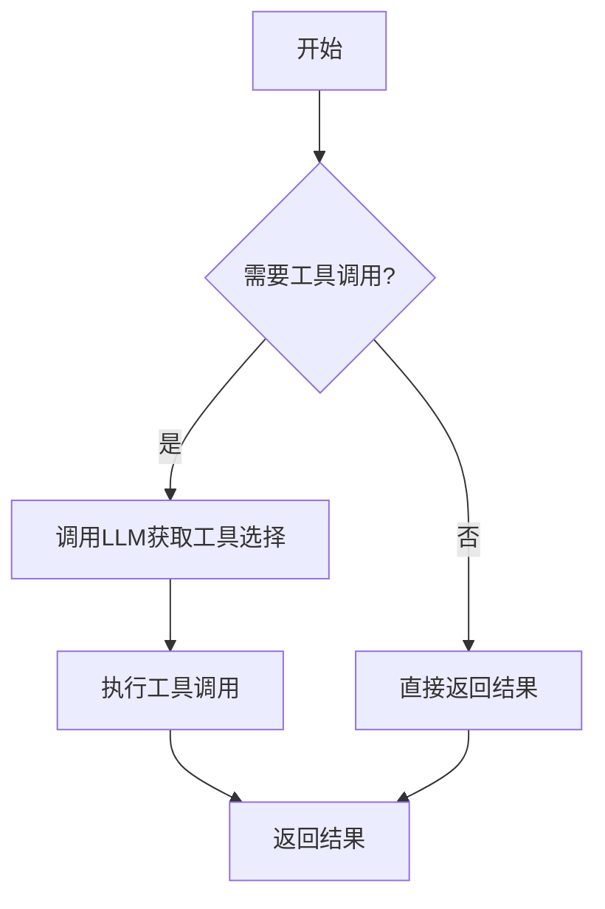

**图源**
- [app/agent/toolcall.py](file://app/agent/toolcall.py#L17-L249)

### 优化工具执行效率
使用`ToolCollection`类可以批量管理和执行工具，提高执行效率。通过`execute_all`方法可以并发执行多个工具，减少等待时间。同时，为工具设置合理的超时机制可以防止长时间阻塞。

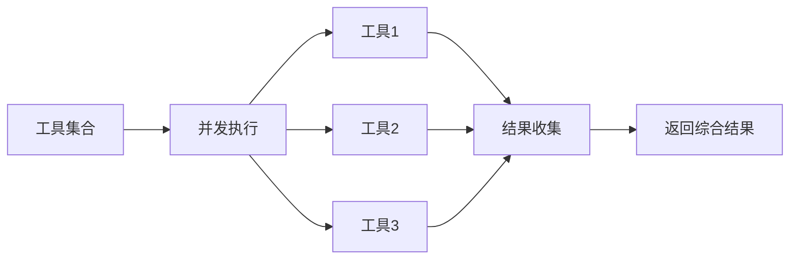

**图源**
- [app/tool/tool_collection.py](file://app/tool/tool_collection.py#L8-L70)

## 错误处理与异常恢复

### 错误处理机制
系统实现了多层次的错误处理机制。在LLM调用中，通过`retry`装饰器实现自动重试，同时对`TokenLimitExceeded`等特定异常进行特殊处理，避免不必要的重试。在工具执行中，每个工具都实现了异常捕获和错误返回机制。

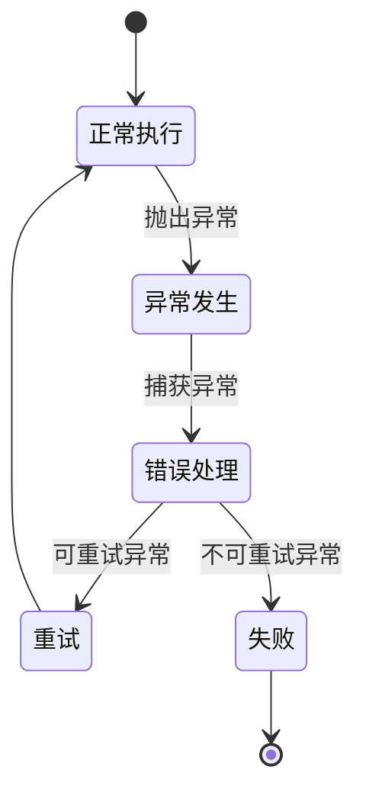

**图源**
- [app/llm.py](file://app/llm.py#L173-L765)
- [app/tool/base.py](file://app/tool/base.py#L77-L172)

### 异常恢复模式
当代理检测到陷入循环状态时，会自动触发恢复机制。`BaseAgent`类中的`is_stuck`方法通过检查最近的消息内容是否重复来判断是否陷入循环，`handle_stuck_state`方法则会添加提示信息引导LLM改变策略。

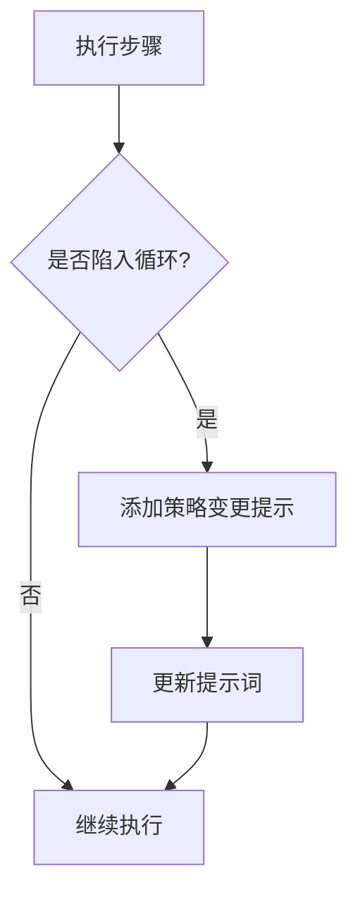

**图源**
- [app/agent/base.py](file://app/agent/base.py#L12-L195)

## 调试技巧

### 日志分析
系统使用`loguru`库实现详细的日志记录，通过`app/logger.py`文件中的`define_log_level`函数可以灵活配置日志级别。日志信息包括执行步骤、工具调用、内存状态等关键信息，便于问题排查。

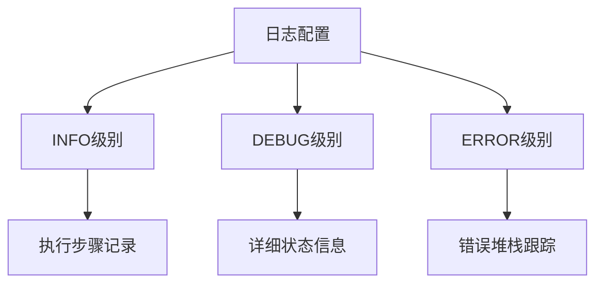

**图源**
- [app/logger.py](file://app/logger.py#L0-L42)

### 内存状态检查
通过代理的`memory`属性可以检查和调试内存状态。`BaseAgent`类提供了`messages`属性来访问完整的消息历史，便于分析代理的思考过程和决策依据。

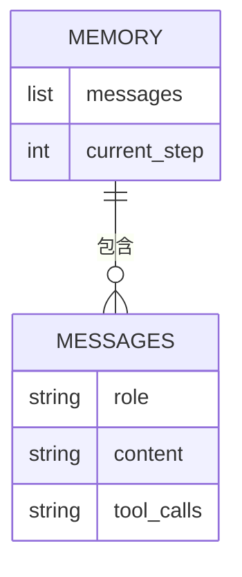

**图源**
- [app/agent/base.py](file://app/agent/base.py#L12-L195)

### 执行流程跟踪
通过分析代理的`run`方法执行流程，可以跟踪整个任务的执行过程。每个步骤都会记录详细的执行信息，包括步骤编号、执行结果等。

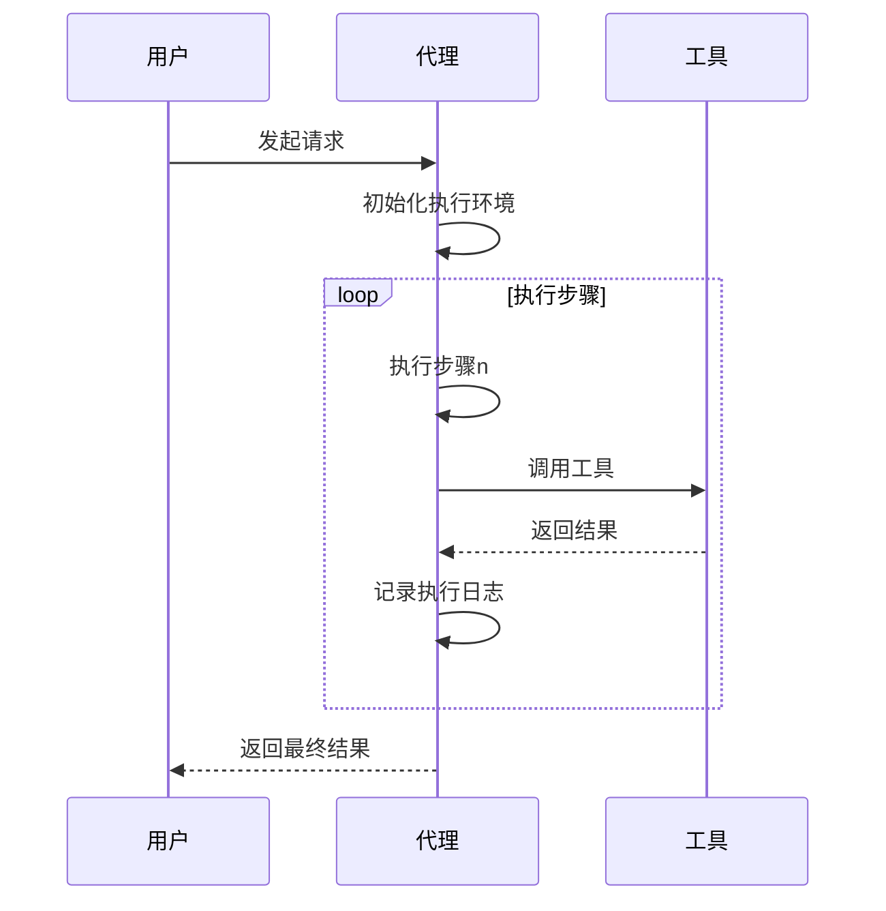

**图源**
- [app/agent/base.py](file://app/agent/base.py#L12-L195)

## 最佳实践

### 代理设计模式
采用分层的代理设计模式，`BaseAgent`作为基础类提供通用功能，`ReActAgent`实现思考-行动模式，`ToolCallAgent`在此基础上增加工具调用能力。这种设计模式提高了代码的可复用性和可扩展性。

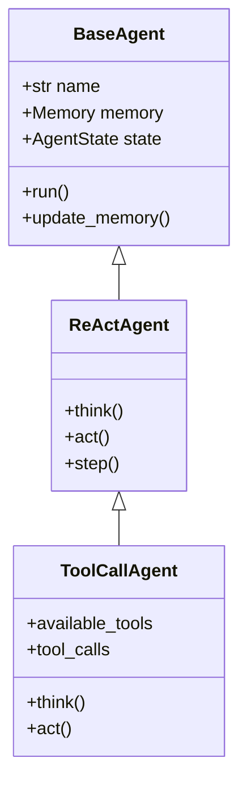

**图源**
- [app/agent/base.py](file://app/agent/base.py#L12-L195)
- [app/agent/react.py](file://app/agent/react.py#L10-L37)
- [app/agent/toolcall.py](file://app/agent/toolcall.py#L17-L249)

### 工具组合策略
通过`ToolCollection`类实现工具的灵活组合和管理。可以动态添加、移除工具，并支持批量执行。这种策略使得代理能够根据任务需求灵活调整可用工具集。

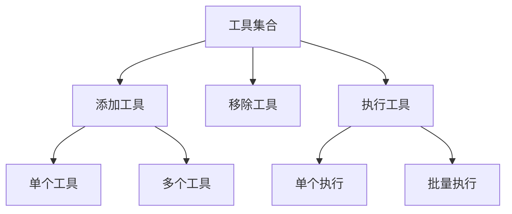

**图源**
- [app/tool/tool_collection.py](file://app/tool/tool_collection.py#L8-L70)

### 资源管理
系统实现了完善的资源管理机制，包括沙箱管理和工具资源清理。`SandboxManager`类负责沙箱的创建、监控和自动清理，确保资源的有效利用。

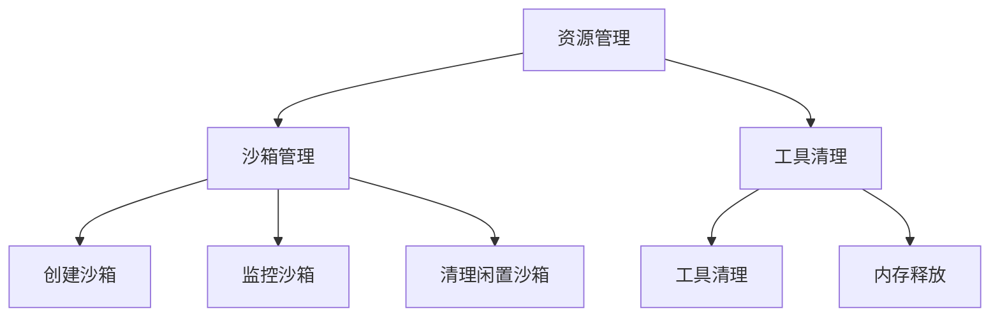

**图源**
- [app/sandbox/core/manager.py](file://app/sandbox/core/manager.py#L13-L312)
- [app/agent/toolcall.py](file://app/agent/toolcall.py#L17-L249)

## 高级应用案例

### 数据分析与可视化
结合`PythonExecute`和`DataVisualization`工具，可以实现复杂的数据分析和可视化任务。首先使用Python代码进行数据处理，然后生成可视化图表。

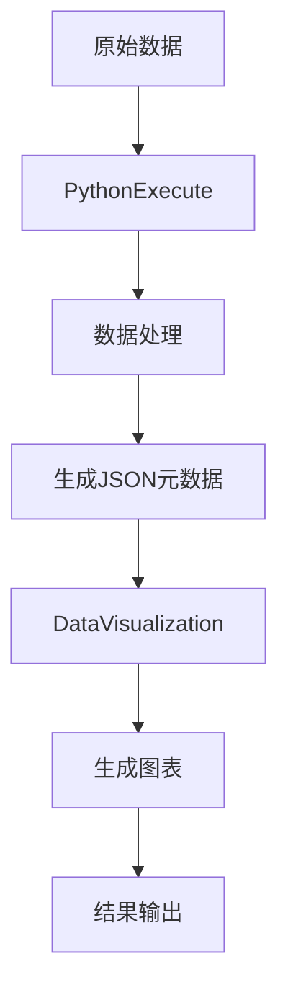

**图源**
- [app/tool/python_execute.py](file://app/tool/python_execute.py#L8-L74)
- [app/tool/chart_visualization/data_visualization.py](file://app/tool/chart_visualization/data_visualization.py#L14-L262)

### 沙箱环境操作
通过`SandboxShellTool`和`SandboxFilesTool`可以在隔离的沙箱环境中执行复杂的系统操作，包括文件管理、命令执行等。

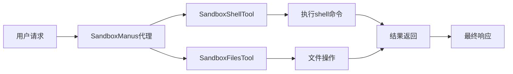

**图源**
- [app/agent/sandbox_agent.py](file://app/agent/sandbox_agent.py#L0-L223)
- [app/tool/sandbox/sb_shell_tool.py](file://app/tool/sandbox/sb_shell_tool.py#L0-L419)
- [app/tool/sandbox/sb_files_tool.py](file://app/tool/sandbox/sb_files_tool.py#L0-L361)